<a href="https://www.3dcp.fyi/">
    <picture>
      <source media="(prefers-color-scheme: dark)" srcset="dat/3dcpfyix.svg">
      
    </picture>
</a>

# 3DCP.fyi

<h5 align="center">

    

</h5>

> Relax, this isn't another review paper on 3D concrete printing (**3DCP**)! Instead, we've curated an exhaustive 
database that offers a detailed look at the state-of-the-art in 3D-printing in the construction industry, mostly, 
but not exclusively, involving cementitious materials and extrusion-based manufacturing. To guarantee the dataset's 
quality and consistency, we've taken the extra step of manually curating each entry over the years, which means

- [x] authors are identified through their **ORCiD** profiles
- [ ] universities are tagged with their respective **ROR**s (upcoming feature)
- [ ] citations have a semantic weight (upcoming feature)
- [x] open accessible papers are tagged by XXX and can be downloaded via XXX
- [x] year of publication is enhanced by the month
- [x] publications are evaluated by several of their centralities in the citation network over multiple [topological 
generations](https://en.wikipedia.org/wiki/Topological_sorting)
- [x] links to third party services are provided
- [ ] community detection is applied to identify clusters of related works (upcoming feature)

## Example

### <picture><source media="(prefers-color-scheme: dark)" srcset="dat/md/ico/dm/openaccess.svg"></picture> <a 
href="https://github.com/dan-auer/3dcp.fyi/blob/main/dat/3dcp.fyi.bib#L28903-L28921" title="Get the BibTeX 
Entry"><picture><source media="(prefers-color-scheme: dark)" srcset="dat/md/ico/dm/bibtex.svg"></picture></a> <a 
href="https://doi.org/10.1016/j.cemconres.2022.106800" title="DOI" ><picture><source media="(prefers-color-scheme: 
dark)" srcset="dat/md/ico/dm/doi.svg" ></picture></a> <a 
href="https://crossmark.crossref.org/dialog/?doi=10.1016/j.cemconres.2022.106800&domain=pdf" title="Crossmark" 
><picture><source media="(prefers-color-scheme: dark)" srcset="dat/md/ico/dm/crossmark.svg" ></picture></a> <a 
href="https://pure.tue.nl/ws/files/201597010/1_s2.0_S0008884622000916_main.pdf" title="Get the *.pdf via 
unpaywall.com" ><picture><source media="(prefers-color-scheme: dark)" srcset="dat/md/ico/dm/down.svg" ></picture></a> A Roadmap for Quality Control of Hardening and 
Hardened Printed Concrete (2022-04)
<a href="https://orcid.org/0000-0002-4685-7064"> Viktor <b>Mechtcherine</b> <picture><source media="(
prefers-color-scheme: dark)" srcset="dat/md/ico/dm/orcid.svg" ></picture></a>,
<a href="https://orcid.org/0000-0002-7718-3189"> Kim <b>Tittelboom</b> <picture><source media="(prefers-color-scheme: 
dark)" srcset="dat/md/ico/dm/orcid.svg" ></picture></a>,
<a href="https://orcid.org/0000-0002-9525-6759"> Ali <b>Kazemian</b> <picture><source media="(prefers-color-scheme: 
dark)" srcset="dat/md/ico/dm/orcid.svg" ></picture></a>,
<a href="https://orcid.org/0000-0002-6160-9448"> Eric <b>Kreiger</b> <picture><source media="(prefers-color-scheme: 
dark)" srcset="dat/md/ico/dm/orcid.svg" ></picture></a>,
<a href="https://orcid.org/0000-0003-2422-4589"> Behzad <b>Nematollahi</b> <picture><source media="(
prefers-color-scheme: dark)" srcset="dat/md/ico/dm/orcid.svg" ></picture></a>,
<a href="https://orcid.org/0000-0002-8580-5320"> Venkatesh <b>Nerella</b> <picture><source media="(
prefers-color-scheme: dark)" srcset="dat/md/ico/dm/orcid.svg" ></picture></a>,
<a href="https://orcid.org/0000-0002-2358-1261"> Manu <b>Santhanam</b> <picture><source media="(prefers-color-scheme: 
dark)" srcset="dat/md/ico/dm/orcid.svg" ></picture></a>,
<a href="https://orcid.org/0000-0001-5603-2616"> Geert <b>Schutter</b> <picture><source media="(prefers-color-scheme: 
dark)" srcset="dat/md/ico/dm/orcid.svg" ></picture></a>,
<a href="https://orcid.org/0000-0001-8066-7750"> Gideon <b>Zijl</b> <picture><source media="(prefers-color-scheme: 
dark)" srcset="dat/md/ico/dm/orcid.svg" ></picture></a>,
<a href="https://orcid.org/0000-0001-8626-918X"> Dirk <b>Lowke</b> <picture><source media="(prefers-color-scheme: 
dark)" srcset="dat/md/ico/dm/orcid.svg" ></picture></a>,
<a href="https://orcid.org/0000-0002-0905-9557"> Egor <b>Ivaniuk</b> <picture><source media="(prefers-color-scheme: 
dark)" srcset="dat/md/ico/dm/orcid.svg" ></picture></a>,
<a href="https://orcid.org/0000-0002-3999-5186"> Markus <b>Taubert</b> <picture><source media="(prefers-color-scheme: 
dark)" srcset="dat/md/ico/dm/orcid.svg" ></picture></a>,
<a href="https://orcid.org/0000-0002-6666-2395"> Freek <b>Bos</b> <picture><source media="(prefers-color-scheme: 
dark)" srcset="dat/md/ico/dm/orcid.svg" ></picture></a> Journal Article – Cement and Concrete Research, Vol. 157

<a href="https://scholar.google.com/scholar_lookup?title=A%20Roadmap%20for%20Quality%20Control%20of%20Hardening%20and
%20Hardened%20Printed%20Concrete" title="Search on Google Scholar"><picture><source media="(prefers-color-scheme: 
dark)" srcset="dat/md/ico/dm/googlescholar.svg" ></picture></a>
<a href="https://www.webofscience.com/wos/woscc/full-record/WOS:000799138600004" title="Search on Web of 
Science"><picture><source media="(prefers-color-scheme: dark)" srcset="dat/md/ico/dm/wos.svg" ></picture></a>
<a href="http://www.scopus.com/record/display.url?eid=2-s2.0-85127958344&origin=resultslist" title="Search on 
Scopus"><picture><source media="(prefers-color-scheme: dark)" srcset="dat/md/ico/dm/scopus.svg" ></picture></a>
<picture><source media="(prefers-color-scheme: dark)" srcset="dat/md/ico/dm/blank.svg"></picture><picture><source media="(prefers-color-scheme: dark)" 
srcset="dat/md/ico/dm/blank.svg"></picture><a 
href="https://plu.mx/plum/a/?doi=10.1016/j.cemconres.2022.106800" title="Search on plu.mx"><picture><source media="(
prefers-color-scheme: dark)" srcset="dat/md/ico/dm/plumx.svg" ></picture></a>
<picture><source media="(prefers-color-scheme: dark)" srcset="dat/md/ico/dm/blank.svg"></picture><a 
href="https://api.crossref.org/works/10.1016/j.cemconres.2022.106800" title="Search on Crossref"><picture><source 
media="(prefers-color-scheme: dark)" srcset="dat/md/ico/dm/crossref.svg" ></picture></a>
<a href="https://api.openalex.org/works/doi:10.1016/j.cemconres.2022.106800" title="Search on 
OpenAlex"><picture><source media="(prefers-color-scheme: dark)" srcset="dat/md/ico/dm/openalex.svg" ></picture></a>
<picture><source media="(prefers-color-scheme: dark)" srcset="dat/md/ico/dm/blank.svg"></picture><a 
href="https://api.semanticscholar.org/graph/v1/paper/10.1016/j.cemconres.2022.106800" title="Search on Semantic 
Scholar"><picture><source media="(prefers-color-scheme: dark)" srcset="dat/md/ico/dm/semanticscholar.svg" ></picture></a>
<a href="https://opencitations.net/meta/api/v1/metadata/doi:10.1016/j.cemconres.2022.106800" title="Search on Open 
Citations"><picture><source media="(prefers-color-scheme: dark)" srcset="dat/md/ico/dm/opencitations.svg" ></picture></a>
<a href="https://www.researchgate.net/search.Search.html?query=10.1016/j.cemconres.2022.106800&type=publication&type
=publication" title="Search on Researchgate"><picture><source media="(prefers-color-scheme: dark)" 
srcset="dat/md/ico/dm/researchgate.svg" ></picture></a>
<a href="https://scite.ai/reports/a-roadmap-for-quality-control-r6zmb5x4" title="Search on Scite" ><picture><source 
media="(prefers-color-scheme: dark)" srcset="dat/md/ico/dm/scite.svg"></picture></a>
<a href="https://inciteful.xyz/p/W4224055972" title="Search on Inciteful"><picture><source media="(
prefers-color-scheme: dark)" srcset="dat/md/ico/dm/connectedpapers.svg" ></picture></a>

## Publication

tba

## Overview

 

| 3dcp.fyi    | 01 | 02 | 03 | 04 | 05 | 06 | 07 | 08 | 09 | 10 |11 |12 |
|:-----------|--------: |--------: |--------: |--------: |--------: |--------: |--------: |--------: |--------: |---------: |---------: |--------: |
| 2024 | [45](dat/md/2024-01.md) | [54](dat/md/2024-02.md) | [55](dat/md/2024-03.md) | [17](dat/md/2024-04.md) |   |   |   |   |   |   |   |   |
| 2023 | [41](dat/md/2023-01.md) | [38](dat/md/2023-02.md) | [51](dat/md/2023-03.md) | [49](dat/md/2023-04.md) | [31](dat/md/2023-05.md) | [68](dat/md/2023-06.md) | [64](dat/md/2023-07.md) | [46](dat/md/2023-08.md) | [78](dat/md/2023-09.md) | [63](dat/md/2023-10.md) | [51](dat/md/2023-11.md) | [55](dat/md/2023-12.md) |
| 2022 | [32](dat/md/2022-01.md) | [34](dat/md/2022-02.md) | [50](dat/md/2022-03.md) | [55](dat/md/2022-04.md) | [34](dat/md/2022-05.md) | [110](dat/md/2022-06.md) | [47](dat/md/2022-07.md) | [25](dat/md/2022-08.md) | [66](dat/md/2022-09.md) | [35](dat/md/2022-10.md) | [46](dat/md/2022-11.md) | [44](dat/md/2022-12.md) |
| 2021 | [27](dat/md/2021-01.md) | [31](dat/md/2021-02.md) | [16](dat/md/2021-03.md) | [26](dat/md/2021-04.md) | [25](dat/md/2021-05.md) | [27](dat/md/2021-06.md) | [27](dat/md/2021-07.md) | [24](dat/md/2021-08.md) | [32](dat/md/2021-09.md) | [31](dat/md/2021-10.md) | [81](dat/md/2021-11.md) | [38](dat/md/2021-12.md) |
| 2020 | [15](dat/md/2020-01.md) | [19](dat/md/2020-02.md) | [19](dat/md/2020-03.md) | [20](dat/md/2020-04.md) | [21](dat/md/2020-05.md) | [20](dat/md/2020-06.md) | [120](dat/md/2020-07.md) | [17](dat/md/2020-08.md) | [20](dat/md/2020-09.md) | [22](dat/md/2020-10.md) | [21](dat/md/2020-11.md) | [20](dat/md/2020-12.md) |
| 2019 | [8](dat/md/2019-01.md) | [29](dat/md/2019-02.md) | [9](dat/md/2019-03.md) | [19](dat/md/2019-04.md) | [16](dat/md/2019-05.md) | [19](dat/md/2019-06.md) | [15](dat/md/2019-07.md) | [16](dat/md/2019-08.md) | [27](dat/md/2019-09.md) | [13](dat/md/2019-10.md) | [15](dat/md/2019-11.md) | [13](dat/md/2019-12.md) |
| 2018 | [6](dat/md/2018-01.md) | [10](dat/md/2018-02.md) | [10](dat/md/2018-03.md) | [14](dat/md/2018-04.md) | [26](dat/md/2018-05.md) | [11](dat/md/2018-06.md) | [10](dat/md/2018-07.md) | [9](dat/md/2018-08.md) | [50](dat/md/2018-09.md) | [10](dat/md/2018-10.md) | [16](dat/md/2018-11.md) | [5](dat/md/2018-12.md) |
| 2017 | [2](dat/md/2017-01.md) | [4](dat/md/2017-02.md) | [1](dat/md/2017-03.md) | [8](dat/md/2017-04.md) | [3](dat/md/2017-05.md) | [9](dat/md/2017-06.md) | [11](dat/md/2017-07.md) | [6](dat/md/2017-08.md) | [5](dat/md/2017-09.md) | [2](dat/md/2017-10.md) | [4](dat/md/2017-11.md) | [3](dat/md/2017-12.md) |
| 2016 |   |   | [1](dat/md/2016-03.md) | [4](dat/md/2016-04.md) | [3](dat/md/2016-05.md) | [3](dat/md/2016-06.md) | [2](dat/md/2016-07.md) | [4](dat/md/2016-08.md) | [2](dat/md/2016-09.md) | [2](dat/md/2016-10.md) | [5](dat/md/2016-11.md) | [1](dat/md/2016-12.md) |
| 2015 | [1](dat/md/2015-01.md) | [1](dat/md/2015-02.md) | [1](dat/md/2015-03.md) |   | [1](dat/md/2015-05.md) | [5](dat/md/2015-06.md) | [1](dat/md/2015-07.md) | [1](dat/md/2015-08.md) | [2](dat/md/2015-09.md) | [3](dat/md/2015-10.md) |   | [1](dat/md/2015-12.md) |
| 2014 |   |   | [6](dat/md/2014-03.md) | [1](dat/md/2014-04.md) | [2](dat/md/2014-05.md) |   |   |   | [1](dat/md/2014-09.md) | [1](dat/md/2014-10.md) | [1](dat/md/2014-11.md) | [2](dat/md/2014-12.md) |
| 2013 | [2](dat/md/2013-01.md) |   |   |   | [1](dat/md/2013-05.md) | [1](dat/md/2013-06.md) | [1](dat/md/2013-07.md) | [1](dat/md/2013-08.md) | [3](dat/md/2013-09.md) |   | [3](dat/md/2013-11.md) | [1](dat/md/2013-12.md) |
| 2012 | [2](dat/md/2012-01.md) |   |   | [1](dat/md/2012-04.md) |   | [1](dat/md/2012-06.md) |   |   | [3](dat/md/2012-09.md) | [1](dat/md/2012-10.md) |   | [1](dat/md/2012-12.md) |
| 2011 |   |   |   |   |   |   | [2](dat/md/2011-07.md) |   |   | [1](dat/md/2011-10.md) |   |   |
| 2010 |   |   |   |   |   |   |   |   |   |   |   |   |
| 2009 |   |   |   | [1](dat/md/2009-04.md) |   | [1](dat/md/2009-06.md) |   |   | [1](dat/md/2009-09.md) | [1](dat/md/2009-10.md) |   |   |
| 2008 |   |   |   |   | [1](dat/md/2008-05.md) |   |   |   |   |   |   |   |
| 2007 |   | [1](dat/md/2007-02.md) |   | [1](dat/md/2007-04.md) |   |   |   |   |   |   |   |   |
| 2006 |   |   |   |   | [1](dat/md/2006-05.md) | [1](dat/md/2006-06.md) |   |   |   |   |   |   |
| 2005 | [1](dat/md/2005-01.md) |   |   |   |   |   |   |   |   | [1](dat/md/2005-10.md) | [2](dat/md/2005-11.md) |   |
| 2004 |   |   |   |   |   |   |   |   | [1](dat/md/2004-09.md) |   |   |   |
| 2003 |   |   |   |   |   |   |   |   |   |   | [1](dat/md/2003-11.md) |   |
| 2002 |   |   |   |   |   |   |   |   | [2](dat/md/2002-09.md) |   |   |   |
| 2001 |   |   |   |   |   |   |   |   | [1](dat/md/2001-09.md) |   |   |   |
| 2000 |   |   |   |   |   |   |   |   |   |   |   |   |
| 1999 |   |   |   |   |   |   |   |   |   |   |   |   |
| 1998 | [1](dat/md/1998-01.md) |   |   |   |   |   |   |   |   |   |   |   |
| 1997 |   | [1](dat/md/1997-02.md) |   |   |   |   |   |   |   |   |   |   |

 

## Data (CTRL + F)
### 2024-04
###### [00000](dat/md/2024-04.md#abbakorajaiseta20243CPUCFD) 3D Concrete Printing Using Computational Fluid Dynamics: Modeling of Material Extrusion with Slip Boundaries, Abbaoui et al.
###### [00001](dat/md/2024-04.md#akbachaizhioror2024D) Diamanti: 3D Printed, Post-Tensioned Concrete Canopy, Akbarzadeh et al.
###### [00002](dat/md/2024-04.md#antolinskevwang2024TA) Tor Alva: A 3D Concrete Printed Tower, Anton et al.
###### [00003](dat/md/2024-04.md#chadvasekangaejm2024IPS) Impact Printed Structures: Design Systems and Construction Strategies, Chadha et al.
###### [00004](dat/md/2024-04.md#cornhors2024RF) Reshaping Fabrication: A Case Study in Designing Carbon-Reduced Concrete Structures, Corneliusen et al.
###### [00005](dat/md/2024-04.md#curtalvafeicmuel2024MMFfLCC) Multi-Material Fabrication for Low-Carbon Construction: An Optimised Floor System for Affordable Housing in Mexico, Curth et al.
###### [00006](dat/md/2024-04.md#darwrael2024FWtR) From Walls to Roofs: Formwork-Free Robotic Earthen Vault Construction, Darweesh et al.
###### [00007](dat/md/2024-04.md#dellbodemelebloc2024S20P) Striatus 2.0 Phoenix: Improving Circularity of 3D-Concrete-Printed Unreinforced Masonry Structures, Dell’Endice et al.
###### [00008](dat/md/2024-04.md#dingzhanzhaozhan2024IoPSLWCRFAoMPaPSo3PM) Impact of Pre-Soaked Lime Water Carbonized Recycled Fine Aggregate on Mechanical Properties and Pore Structure of 3D Printed Mortar, Ding et al.
###### [00009](dat/md/2024-04.md#dubocabatayocarr20243PEA) 3D-Printed Earth Architecture: Design Approach for a Performative Habitat, Dubor et al.
###### [00010](dat/md/2024-04.md#dvormarcmrozmaro2024EEMSf3T) Energy-Efficient Mixtures Suitable for 3D Technologies, Dvorkin et al.
###### [00011](dat/md/2024-04.md#flecknycbriebagh2024BA) BREUER × AM: Functional Hybridisation in Concrete Building Envelope Elements through Additive Manufacturing, Fleckenstein et al.
###### [00012](dat/md/2024-04.md#haarkrugzijl2024OS3PCBDaF) Off-Site 3D Printed Concrete Beam Design and Fabrication, Haar et al.
###### [00013](dat/md/2024-04.md#lokzivkmeyezerb2024HoC) House of Cores, Lok et al.
###### [00014](dat/md/2024-04.md#marirama2024MCoWPCBRCwSFaPMUA) Mechanical Characteristics of Waste-Printed Circuit Board-Reinforced Concrete with Silica Fume and Prediction Modelling Using ANN, Marimuthu et al.
###### [00015](dat/md/2024-04.md#wangliuhouge2024RPaTAoC3PTBoC) Research Progress and Trend Analysis of Concrete 3D Printing Technology Based on CiteSpace, Wang et al.
###### [00016](dat/md/2024-04.md#zhantaozhantitt2024UARCtCMwtIoaIMF) Upscaling Active Rheology Control to Cement Mortar with the Intervention of an Inline Magnetic Field, Zhang et al.
### 2024-03
###### [00017](dat/md/2024-03.md#alha2024TDCPaaCASaAfaCSB) Three-Dimensional Concrete Printing as a Construction Automation Strategy and Assessments from a Case Study Building, Alhaidary
###### [00018](dat/md/2024-03.md#alinassabukhas2024IoCNoPQaMPo3PCM) Influence of Carbon Nanotubes on Printing Quality and Mechanical Properties of 3D Printed Cementitious Materials, Ali et al.
###### [00019](dat/md/2024-03.md#aramcaldpuencast2024Eo3PotTSSoCS) Effects of 3D-Printing on the Tensile Splitting Strength of Concrete Structures, Aramburu et al.
###### [00020](dat/md/2024-03.md#banivosoarcenoor2024EASMoSE3PS) Early-Age Strength Monitoring of Sensor-Embedded 3D Printed Structures, Banijamali et al.
###### [00021](dat/md/2024-03.md#barjcapibertcour2024DWfPCaPiRC3PBoAIP) Digital Workflow for Printability Checking and Prefabrication in Robotic Construction 3D Printing Based on Artificial Intelligence Planning, Barjuei et al.
###### [00022](dat/md/2024-03.md#carcmaieakemkawa2024MFCi3PEM) Maximizing Fiber Content in 3D-Printed Earth Materials: Printability, Mechanical, Thermal and Environmental Assessments, Carcassi et al.
###### [00023](dat/md/2024-03.md#chamyalc2024NEoTPo3PCW) Numerical Evaluation on Thermal Performance of 3D Printed Concrete Walls: The Effects of Lattice Type, Filament Width and Granular Filling Material, Chamatete et al.
###### [00024](dat/md/2024-03.md#chenfangwangxuan2024CaFBoECCBAS) Compressive and Flexural Behaviour of Engineered Cementitious Composites Based Auxetic Structures: An Experimental and Numerical Study, Chen et al.
###### [00025](dat/md/2024-03.md#chenxuyuanzhao2024UoCaRPtAtPoFR3PWPCC) Use of Creep and Recovery Protocol to Assess the Printability of Fibre-Reinforced 3D Printed White Portland Cement Composites, Chen et al.
###### [00026](dat/md/2024-03.md#chenyangliuxu2024CFFMfECRo3PFRAASFARSC) Closed-Form Fracture Model for Evaluating Crack Resistance of 3D Printed Fiber-Reinforced Alkali-Activated Slag/Fly Ash Recycled Sand Concrete, Chen et al.
###### [00027](dat/md/2024-03.md#chenzhanliuzhan2024QSQEf3PCwCAT3S) Quantitative Surface Quality Evaluation for 3D-Printed Concrete with Coarse Aggregate Through 3D Scanning, Chen et al.
###### [00028](dat/md/2024-03.md#curtpearcastmuel20243PE) 3D Printing Earth: Local, Circular Material Processing, Fabrication Methods, and Life Cycle Assessment, Curth et al.
###### [00029](dat/md/2024-03.md#damschenkayaorr2024FPaADoPCMfAAM) Fresh Properties and Autonomous Deposition of Pseudoplastic Cementitious Mortars for Aerial Additive Manufacturing, Dams et al.
###### [00030](dat/md/2024-03.md#dusunqian2024FPoNI3PSHCC3SWBS) Flexural Performance of Nature-Inspired 3D-Printed Strain-Hardening Cementitious Composites (3DP-SHCC) With Bouligand Structures, Du et al.
###### [00031](dat/md/2024-03.md#dutengzhuazhan2024ABERCSfAIBRRa3CP) A BIM-Enabled Robot Control System for Automated Integration Between Rebar Reinforcement and 3D Concrete Printing, Du et al.
###### [00032](dat/md/2024-03.md#gappreickrom2024AiFASaMiCC) Advances in Formwork Automation, Structure and Materials in Concrete Construction, Gappmeier et al.
###### [00033](dat/md/2024-03.md#gengmeichenluo2024R3CP) Revolutionizing 3D Concrete Printing: Leveraging RF Model for Precise Printability and Rheological Prediction, Geng et al.
###### [00034](dat/md/2024-03.md#giwaherblamefisk2024PRCULS3PwSC) Planetary Robotic Construction Using Large-Scale 3D Printing with Sulfur Concrete, Giwa et al.
###### [00035](dat/md/2024-03.md#gousofizhanzhu2024CPaMAo3PGHSLECC) Combined Printable and Mechanical Analysis of 3D-Printed Green High-Strength, Lightweight Engineered Cementitious Composites, Gou et al.
###### [00036](dat/md/2024-03.md#ilcakulasahm20243PCaDWBGItEoAoEP) 3D-Printable Construction and Demolition Waste-Based Geopolymer: Investigating the Effects of Additives on Engineering Properties, İlcan et al.
###### [00037](dat/md/2024-03.md#ivanmech2024AfPoTRBaSUTDCP) Approach for Production of Textile-Reinforced Beams and Slabs Using Three-Dimensional Concrete Printing, Ivaniuk et al.
###### [00038](dat/md/2024-03.md#jajizijlbaba2024DaPSoMB3PGC) Durability and Pore Structure of Metakaolin-Based 3D Printed Geopolymer Concrete, Jaji et al.
###### [00039](dat/md/2024-03.md#jiazhouchenwang2024EoSFSaCoPMaMPo3PHSCM) Effect of Steel Fiber Shape and Content on Printability, Microstructure and Mechanical Properties of 3D Printable High Strength Cementitious Materials, Jia et al.
###### [00040](dat/md/2024-03.md#kogapuzadmit2024MoFMCwACBA) Modification of Fine Multicomponent Concrete with Activated Component-Based Additive, Kogai et al.
###### [00041](dat/md/2024-03.md#kotonemosergdont2024TPAoAAiACoEEB) Thermal Performance Assessment of Aerogel Application in Additive Construction of Energy-Efficient Buildings, Kotov et al.
###### [00042](dat/md/2024-03.md#labupugldzwi2024AICf3SPSRSiaSDiaHaDC) An Innovative Concept for 3D Sand-Printed Sustainable Refugee Shelters in a Sandy Desert in a Hot and Dry Climate, Labuda et al.
###### [00043](dat/md/2024-03.md#latoguimrang2024BAoP3PCBMfC) Bibliometric Analysis of Personalized 3D-Printed Concrete-Based Modules for Construction: Leveraging the Ordinatio Method, Latorraca et al.
###### [00044](dat/md/2024-03.md#liuhuguo2024PaIBPo3PFRG3F) Printability and Interlayer Bonding Property of 3D Printed Fiber Reinforced Geopolymer (3DP-FRG), Liu et al.
###### [00045](dat/md/2024-03.md#luxiaoli20243PRCIPF) 3D Printing Recycled Concrete Incorporating Plant Fibres: A Comprehensive Review, Lu et al.
###### [00046](dat/md/2024-03.md#majiachenjian2024WLaSPi3PCwVwbaSS) Water Loss and Shrinkage Prediction in 3D Printed Concrete with Varying w/b and Specimen Sizes, Ma et al.
###### [00047](dat/md/2024-03.md#mechkuhnmainere2024AFmB) Additive Fertigung mit Beton: Leitfaden für die Planung und die Durchführung von Projekten, Mechtcherine et al.
###### [00048](dat/md/2024-03.md#moghmahaledimosi2024RAHiA) Revolutionizing Affordable Housing in Africa: A Comprehensive Technical and Sustainability Study of 3D-Printing Technology, Moghayedi et al.
###### [00049](dat/md/2024-03.md#neefmullmech2024ICMICFiDFwC) Integrating Continuous Mineral-Impregnated Carbon Fibers into Digital Fabrication with Concrete, Neef et al.
###### [00050](dat/md/2024-03.md#nefskroosloobos2024ODo3PSaILS) Orientation Dependency of 3D Printed SHCC at Increasing Length Scale, Nefs et al.
###### [00051](dat/md/2024-03.md#niuliujiama2024PaPAo3PLEC) Preparation and Performance Analysis of 3D Printed Lightweight EPS Concrete: Insights from the Excess Paste Theory, Niu et al.
###### [00052](dat/md/2024-03.md#panpingdingzhu2024IBo3PFRCCB) Impact Behaviour of 3D Printed Fiber Reinforced Cementitious Composite Beams, Pan et al.
###### [00053](dat/md/2024-03.md#rangguimsaleluca20243PLMwCtITEiB) 3D Printing Lightweight Mortars with Cork to Improve Thermal Efficiency in Buildings, Rangel et al.
###### [00054](dat/md/2024-03.md#rojahasa2024NDTAf3CPitAI) Novel Digital Twin Architecture for 3D Concrete Printing in the AEC Industry, Rojas et al.
###### [00055](dat/md/2024-03.md#sarcal2024ETiBC) Emerging Technologies in Building Construction, Sarı et al.
###### [00056](dat/md/2024-03.md#shahabbaakbasabi2024IoPSaNDotFAi3PUHPC) Influence of Print Speed and Nozzle Diameter on the Fiber Alignment in 3D Printed Ultra-High-Performance Concrete, Shahzad et al.
###### [00057](dat/md/2024-03.md#shahsgla2024BJ3PoBCSSM) Binder Jetting 3D Printing of Binary Cement-Siliceous Sand Mixture, Shahid et al.
###### [00058](dat/md/2024-03.md#shenzhucaili2024DoaNEDtItPo3PGC) Development of a Novel Extrusion Device to Improve the Printability of 3D Printable Geopolymer Concrete, Sheng et al.
###### [00059](dat/md/2024-03.md#shijiajiama2024EAIDo3PC) Early-Age Inhomogeneous Deformation of 3D Printed Concrete: Characteristics and Influences of Superplasticizer and Water-Binder Ratio, Shi et al.
###### [00060](dat/md/2024-03.md#skibszewmajesibe2024TEoIAoSDi3PBE) The Effect of Interlayer Adhesion on Stress Distribution in 3D Printed Beam Elements, Skibicki et al.
###### [00061](dat/md/2024-03.md#sodadwivsahagupt2024Do3PSEBCMUES) Development of 3D Printable Stabilized Earth-Based Construction Materials Using Excavated Soil: Evaluation of Fresh and Hardened Properties, Soda et al.
###### [00062](dat/md/2024-03.md#souzborgstennema20243PSLCMfCoASHiB) 3D Printed Sustainable Low-Cost Materials for Construction of Affordable Social Housing in Brazil: Potential, Challenges, and Research Needs, Souza et al.
###### [00063](dat/md/2024-03.md#sunliumawang20243PLCCSPCG) 3D Printed Lightweight Concrete Containing Surface Pretreated Coal Gangue, Sun et al.
###### [00064](dat/md/2024-03.md#tiwapratsant2024LC) Lattice Concrete: 3D Printed Periodic Cellular Structures Through Selective Cement Hydration, Tiwari et al.
###### [00065](dat/md/2024-03.md#wijakreimasu2024MoCPPwFI) Modeling of Concrete Printing Process with Frictional Interface, Wijaya et al.
###### [00066](dat/md/2024-03.md#wuwangli2024RoTiIMaPoAMCM) Role of Thixotropy in Interlayer Microstructure and Properties of Additively Manufactured Cementitious Materials, Wu et al.
###### [00067](dat/md/2024-03.md#xionnieliuli2024OoFRLRCMDf3P) Optimization of Fiber Reinforced Lightweight Rubber Concrete Mix Design for 3D Printing, Xiong et al.
###### [00068](dat/md/2024-03.md#zandshensorgli2024PtFLaUL3PCC) Pathways to Formulate Lightweight and Ultra-Lightweight 3D Printable Cementitious Composites, Zandifaez et al.
###### [00069](dat/md/2024-03.md#zhanduanhanhe2024SaPDo3PC3BoAGO) Strength and Proportioning Design of 3D Printed Concrete (3DPC) Based on Aggregate Gradation Optimization, Zhang et al.
###### [00070](dat/md/2024-03.md#zhanrendaitao2024APARCAf3PCBM) A Potential Active Rheology Control Approach for 3D Printable Cement-Based Materials: Coupling of Temperature and Viscosity Modifiers, Zhang et al.
###### [00071](dat/md/2024-03.md#zhuzhaozhaoguan2024MAoRPo3PSSCCBoLFNMRT) Mechanism Analysis of Rheological Properties of 3D Printed Steel Slag Cementitious Composite Based on Low Field Nuclear Magnetic Relaxation Test, Zhu et al.
### 2024-02
###### [00072](dat/md/2024-02.md#ahiertubundbebe2024AFRCoEf3CPIRP) Automated Flow Rate Control of Extrusion for 3D Concrete Printing Incorporating Rheological Parameters, Ahi et al.
###### [00073](dat/md/2024-02.md#alhuduarbrow2024DaDDFSPMf3CP) Developing a Data-Driven Filament Shape Prediction Model for 3D Concrete Printing, Alhussain et al.
###### [00074](dat/md/2024-02.md#allaallamillleni2023Ot3PoRC) On the 3D Printing of Reinforced Concrete, Allameh et al.
###### [00075](dat/md/2024-02.md#bassnagafeliross2024AAMAi3PC) Alkali Activated Materials Applied in 3D Printing Construction: A Review, Moraes et al.
###### [00076](dat/md/2024-02.md#colyzijlbaba2024FaSPo3PCMUaHVoSAB) Fresh and Strength Properties of 3D Printable Concrete Mixtures Utilising a High Volume of Sustainable Alternative Binders, Colyn et al.
###### [00077](dat/md/2024-02.md#dingshencaixiao20243PCwSSA) 3D Printed Concrete with Sewage Sludge Ash: Fresh and Hardened Properties, Ding et al.
###### [00078](dat/md/2024-02.md#figuhammhadd2024CO) Concluding Overview: Advancements in Building Materials Technology, Figueiredo et al.
###### [00079](dat/md/2024-02.md#gamafawzzahrteix2024AiS3CP) Advancement in Sustainable 3D Concrete Printing: A Review on Materials, Challenges, and Current Progress in Australia, Gamage et al.
###### [00080](dat/md/2024-02.md#gengluochenli2024IMOOo3PLCCfMSR) Intelligent Multi-Objective Optimization of 3D Printing Low-Carbon Concrete for Multi-Scenario Requirements, Geng et al.
###### [00081](dat/md/2024-02.md#giudkatsliusarh2024PMoUMWUaSB3P) Physical Modelling of Unreinforced Masonry Walls Using a Sand-Based 3D Printer, Giudice et al.
###### [00082](dat/md/2024-02.md#ilcaozktuglsahm2024IMPo3PCS) Interlayer Mechanical Performance of 3D-Printed Cementitious Systems: A Comprehensive Study on Operational and Material Parameters, İlcan et al.
###### [00083](dat/md/2024-02.md#isaanichpaulpiet2024AS) Automated Shotcrete: A More Sustainable Construction Technology, Isaac et al.
###### [00084](dat/md/2024-02.md#jendrymecerv2024OD3PoCS) Optimizing Digital 3D Printing of Concrete Structures, Jendele et al.
###### [00085](dat/md/2024-02.md#jiajiazhantang2024EoRBPwVPFoEAHWSaRPoBCPitCo3P) Effect of Recycled Brick Powder with Various Particle Features on Early-Age Hydration, Water State, and Rheological Properties of Blended Cement Paste in the Context of 3D Printing, Jia et al.
###### [00086](dat/md/2024-02.md#jianliyangli2024HPOtEtSoTD3PC) Harnessing Path Optimization to Enhance the Strength of Three-Dimensional (3D) Printed Concrete, Jiang et al.
###### [00087](dat/md/2024-02.md#kakakongpate2024AMfBaC) Additive Manufacturing for Building and Constructions, Kakarla et al.
###### [00088](dat/md/2024-02.md#kaliambishekseba2024EoSGotFPo3PC) Effect of Sand Gradations on the Fresh Properties of 3D Printable Concrete, Kaliyavaradhan et al.
###### [00089](dat/md/2024-02.md#keitperr2023PoEBM) Processing of Earth-Based Materials: Current Situation and Challenges Ahead, Keita et al.
###### [00090](dat/md/2024-02.md#korngadedynotran2024AMiUA) Additive Manufacturing in Underwater Applications, Korniejenko et al.
###### [00091](dat/md/2024-02.md#kulkthakkamapari2024EoTBo3PCAwR) Evaluation of Tensile Behaviour of 3D Printed Concrete Assemblies with Reinforcement, Kulkarni et al.
###### [00092](dat/md/2024-02.md#liwuxiezhan2024F) FloatArch: A Cable-Supported, Unreinforced, and Re-Assemblable 3D-Printed Concrete Structure Designed Using Multi-Material Topology Optimization, Li et al.
###### [00093](dat/md/2024-02.md#liuwangzhanma2024OoPPaMPfPB3PMPCUFA) Optimization of Printing Precision and Mechanical Property for Powder-Based 3D Printed Magnesium Phosphate Cement Using Fly Ash, Liu et al.
###### [00094](dat/md/2024-02.md#liuzouwucui2024TEoUTEAfCUotMaMPoMFTA3P) The Effect of U-Type Expanding Agent for Concrete (UEA) on the Microstructural and Mechanical Properties of Mortar Fabricated Through Alternate 3D Printing, Liu et al.
###### [00095](dat/md/2024-02.md#nanvigo2024E3CPoLSoRSSFfCF) Exploring 3D Concrete Printing of Lattice Structures on Robotically-Shaped Sand Formwork for Circular Futures, Nan et al.
###### [00096](dat/md/2024-02.md#nguytranliutran2024EFEMMfCPi3PFRC) Extended Finite Element Multiscale Modelling for Crack Propagation in 3D-Printed Fibre-Reinforced Concrete, Nguyen et al.
###### [00097](dat/md/2024-02.md#nobrqueisouzcabr2024CMfSEAUCCi3P) Computational Modeling for Structural Element Analysis Using Cement Composites in 3D Printing, Nóbrega et al.
###### [00098](dat/md/2024-02.md#peradiazmend2024EotRBfAACoMaLfIPAi3P) Evaluation of the Rheological Behavior for Alkaline-Activated Cements of Metakaolin and Limestone for Its Potential Application in 3D Printing, Perales-Santillan et al.
###### [00099](dat/md/2024-02.md#ramerajesanj2024BSBoTRi3PC) Bond-Slip Behaviour of Textile-Reinforcement in 3D Printed Concrete, Ramesh et al.
###### [00100](dat/md/2024-02.md#robavargmartguti2024UoPaFAftRoCaDWit3PoPBCM) Utilization of Powders and Fine Aggregates from the Recycling of Construction and Demolition Waste in the 3D Printing of Portland-Based Cementitious Materials, Robayo-Salazar et al.
###### [00101](dat/md/2024-02.md#sahimardbeyt2024EoSFUoSBUMaDSPoFR3PC) Effect of Silica Fume Utilization on Structural Build-Up, Mechanical and Dimensional Stability Performance of Fiber-Reinforced 3D Printable Concrete, Şahin et al.
###### [00102](dat/md/2024-02.md#sergouel2024AMDf3PM) Algorithmic Mix Design for 3D Printing Materials, Sergis et al.
###### [00103](dat/md/2024-02.md#silvquisbaldkim2024ACoCDBULCCMaFBTO) Additive Construction of Concrete Deep Beams Using Low-Cost Characterization Methods and FEM-Based Topological Optimization, Silva et al.
###### [00104](dat/md/2024-02.md#silvsilvtoracard2024BaSF) Building a Sustainable Future: The Role of Additive Manufacturing in Civil Construction, Silva et al.
###### [00105](dat/md/2024-02.md#silvwagnkhandas2024SPoLS3PWStACL) Structural Performance of Large-Scale 3D-Printed Walls Subjected to Axial Compression Load, Silveira et al.
###### [00106](dat/md/2024-02.md#sukokhommahofuji2024PaSSoCMILVoMPFf3PA) Printability and Shape Stability of Cement Mortar Incorporating Low Volume of Micro-Polypropylene Fiber for 3D Printing Application, Sukontasukkul et al.
###### [00107](dat/md/2024-02.md#sunmohataozhan2024ACDoTSAAM) A Conceptual Design of Two-Stream Alkali-Activated Materials, Sun et al.
###### [00108](dat/md/2024-02.md#susm2024ToCDaNFB3PC) Theory of Critical Distances and Notched Filament-Based 3D-Printed Components: Lessons Learned from Polymers and Concrete, Susmel
###### [00109](dat/md/2024-02.md#tangsunwangchen2024EAPo3PFOCUDP) Electromagnetic Absorption Properties of 3D Printed Fiber-Oriented Composites Under Different Paths, Tang et al.
###### [00110](dat/md/2024-02.md#taomoharahuschu2024HaMoCSPCBSfSODA) Hydration and Microstructure of Calcium Sulfoaluminate-Portland Cement Binder Systems for Set-On-Demand Applications, Tao et al.
###### [00111](dat/md/2024-02.md#thakkulkkamapari2024IoCJoFBo3PC) Influence of Cold Joint on Fracture Behaviour of 3D Printed Concrete, Thakur et al.
###### [00112](dat/md/2024-02.md#vignjaya2024ARo3PCMCCaIOT) A Review on 3D Printable Cementitious Material Containing Copper and Iron Ore Tailings: Material Characterization, Activation Methods, Engineering Properties, Durability, and Microstructure Behavior, Vigneshwari et al.
###### [00113](dat/md/2024-02.md#wangliguokash2024C3PTiSC) Concrete 3D Printing Technology in Sustainable Construction: A Review on Raw Materials, Concrete Types and Performances, Wang et al.
###### [00114](dat/md/2024-02.md#wangnaitfoxbocc2024IoMPoPB3PCP) Impact of Mix Proportions on Particle Bed 3D Printed Concrete Properties, Wang et al.
###### [00115](dat/md/2024-02.md#wuluolongzhan2024AC3PwPIBS) Advancing Construction 3D Printing with Predictive Interlayer Bonding Strength: A Stacking Model Paradigm, Wu et al.
###### [00116](dat/md/2024-02.md#xiaoliudingyu2024RFCC) Rebar-Free Concrete Construction: Concept, Opportunities and Challenges, Xiao et al.
###### [00117](dat/md/2024-02.md#yangliliuhuo2024EtPfCCaRo3PCB) Exploring the Potential for Carrying Capacity and Reusability of 3D Printed Concrete Bridges: Construction, Dismantlement, and Reconstruction of a Box Arch Bridge, Yang et al.
###### [00118](dat/md/2024-02.md#zengyanjianli20243PoFGaBRfRCP) 3D Printing of FRP Grid and Bar Reinforcement for Reinforced Concrete Plates: Development and Effectiveness, Zeng et al.
###### [00119](dat/md/2024-02.md#zhanhuduanliao2024MPaMoHFGCwLCPAF) Mechanical Properties and Microstructure of Highly Flowable Geopolymer Composites with Low-Content Polyvinyl Alcohol Fiber, Zhang et al.
###### [00120](dat/md/2024-02.md#zhantanhaozhen2024IRTQCf3PCwNNSM) Intelligent Real-Time Quality Control for 3D-Printed Concrete with Near-Nozzle Secondary Mixing, Zhang et al.
###### [00121](dat/md/2024-02.md#zhaofantangwei2024PaCPoCCRb3PCSwaNPsR) Preparation and Compressive Properties of Cementitious Composites Reinforced by 3D Printed Cellular Structures with a Negative Poisson's Ratio, Zhao et al.
###### [00122](dat/md/2024-02.md#zhougoujihou2024DaHPo3PCCBT) Durability and Hardened Properties of 3D Printed Concrete Containing Bauxite Tailings, Zhou et al.
###### [00123](dat/md/2024-02.md#zhouluoanansing2024SUoURGiAM3PRPC) Sustainable Use of Ultrafine Recycled Glass in Additive Manufactured (3D Printed) Reactive Powder Concrete, Zhou et al.
###### [00124](dat/md/2024-02.md#zhouzhuhuwoll2024LCEECCEItCo3P) Low-Carbon, Expansive Engineered Cementitious Composites (ECC) In the Context of 3D Printing, Zhou et al.
###### [00125](dat/md/2024-02.md#ziadtanyselocosk2024BBCHo3PPFRGM) Bacteria-Based Crack Healing of 3D Printed PVA Fiber Reinforced Geopolymer Mortars, Ziada et al.
### 2024-01
###### [00126](dat/md/2024-01.md#aghachenside2024AaDo3PRCWUiPQSL) Analysis and Design of 3D Printed Reinforced Concrete Walls Under in-Plane Quasi-Static Loading, Aghajani et al.
###### [00127](dat/md/2024-01.md#altdami2024SAfEBAMP) Suitability Analysis for Extrusion-Based Additive Manufacturing Process, Altıparmak et al.
###### [00128](dat/md/2024-01.md#alzasonghataawol2023GfACoRCBU3PaB) Guideline for Automated Construction of Reinforced Concrete Beams Using 3D Printing and BIM, Alzarrad et al.
###### [00129](dat/md/2024-01.md#bianvolpfiorforc2024LCAoBEMTD3PT) Life Cycle Assessment of Building Envelopes Manufactured Through Different 3D Printing Technologies, Bianchi et al.
###### [00130](dat/md/2024-01.md#busovarureze2024FIoTDPwEBMatFoEotUoP) First Impressions on Three-Dimensional Printing with Earth-Based Mortar at the Faculty of Engineering of the University of Porto, Buson et al.
###### [00131](dat/md/2024-01.md#chaddubocabatayo2024AMftCBE) Additive Manufacturing for the Circular Built Environment: Towards Circular Construction with Earth-Based Materials, Chadha et al.
###### [00132](dat/md/2024-01.md#chenliuchenzhan2024ARoEoRMotPo3PGSfC) A Review on Effect of Raw Materials on the Performance of 3D Printed Geopolymer System for Construction, Chen et al.
###### [00133](dat/md/2024-01.md#dailyuzongzhu2024EoWPFotPaMPo3PCM) Effect of Waste Plastic Fibers on the Printability and Mechanical Properties of 3D-Printed Cement Mortar, Dai et al.
###### [00134](dat/md/2024-01.md#dongwanghangqu2024RoPPaSFRo3PCwFSaAS) Research on Printing Parameters and Salt Frost Resistance of 3D Printing Concrete with Ferrochrome Slag and Aeolian Sand, Dong et al.
###### [00135](dat/md/2024-01.md#duandengxiaolv2024ERoSDMD3CP) Experimental Realization on Stress Distribution Monitoring During 3D Concrete Printing, Duan et al.
###### [00136](dat/md/2024-01.md#dulasaleluca2024ASotEoMotFaHSPo3PC) A Study of the Effects of MWCNTs on the Fresh and Hardened State Properties of 3D Printable Concrete, Dulaj et al.
###### [00137](dat/md/2024-01.md#fasilibr2024FPtD) From Pumping to Deposition: A Comprehensive Review of Test Methods for Characterizing Concrete Printability, Fasihi et al.
###### [00138](dat/md/2024-01.md#khanilcaimraamin2024TIoNDaPSoGB3PCS) The Impact of Nozzle Diameter and Printing Speed on Geopolymer-Based 3D-Printed Concrete Structures: Numerical Modeling and Experimental Validation, Khan et al.
###### [00139](dat/md/2024-01.md#kumadeypandmuth2024EaNEoMCaFBoTDPC) Experimental and Numerical Evaluation of Multidirectional Compressive and Flexure Behavior of Three-Dimensional Printed Concrete, Kumar et al.
###### [00140](dat/md/2024-01.md#liucaimahou2024SB3CPPDM) Spray-Based 3D Concrete Printing Parameter Design Model: Actionable Insight for High Printing Quality, Liu et al.
###### [00141](dat/md/2024-01.md#liuchenpengchen2024TBaFPo3PRMRwSSCUDRR) The Buildability and Flexural Properties of 3D Printed Recycled Mortar Reinforced with Synchronized Steel Cable Under Different Reinforcement Ratios, Liu et al.
###### [00142](dat/md/2024-01.md#martbanikaze2023RCTfAQCDC3P) Reality Capture Technologies for Automated Quality Control During Construction 3D Printing, Martin et al.
###### [00143](dat/md/2024-01.md#meeryanwangbi2023BoTCDaTDPCDUtDFI) Behavior of Traditional Concrete Dams and Three-Dimensional Printed Concrete Dams Under the Debris Flow Impact, Meere et al.
###### [00144](dat/md/2024-01.md#mengneme2024R3PCWfNSCP) Recycling 3D Printed Concrete Waste for Normal Strength Concrete Production, Mengistu et al.
###### [00145](dat/md/2024-01.md#moin2023PiAIM) Perspectives in Architected Infrastructure Materials, Moini
###### [00146](dat/md/2024-01.md#neriliccreggpilo2024ItEPoa3PWURM) Improving the Energy Performance of a 3D-Printed Wall Using Recycled Material, Neri et al.
###### [00147](dat/md/2024-01.md#ozal2024MBaPPoSaHPATDPC) Mechanical Behavior and Permeability Properties of Sustainable and High-Performance Anisotropic Three-Dimensional Printable Concrete, Özalp
###### [00148](dat/md/2024-01.md#palchoukapo2024IoVPPoMBoACC) Intricacies of Various Printing Parameters on Mechanical Behaviour of Additively Constructed Concrete, Pal et al.
###### [00149](dat/md/2024-01.md#pantlucabarb2022IRCMSf3P) Investigations Regarding Concrete Mixes Suitable for 3D Printing, Panțiru et al.
###### [00150](dat/md/2024-01.md#pavlhorvcerccapu2024Coa3PAAMBoWMWaRaET) Characterisation of a 3D-Printed Alkali-Activated Material Based on Waste Mineral Wool at Room and Elevated Temperatures, Pavlin et al.
###### [00151](dat/md/2024-01.md#piluyaoli2024ARBPAMf3PECCCFD) A Rheological-Based Printability Assessment Method for 3D Printing Engineered Cementitious Composites Considering Fiber Dispersion, Pi et al.
###### [00152](dat/md/2024-01.md#polysarrvlac2024FAoSEiTDCP) Flow Analysis of Screw Extrusion in Three-Dimensional Concrete Printing, Polychronopoulos et al.
###### [00153](dat/md/2024-01.md#premambikumaghod2024ATMtPtSBo3PC) A Theoretical Model to Predict the Structural Buildability of 3D Printable Concrete, Prem et al.
###### [00154](dat/md/2024-01.md#prihgarlnajmmoin2024MPoSACEbRAM) Mechanical Performance of Sinusoidally Architected Concrete Enabled by Robotic Additive Manufacturing, Prihar et al.
###### [00155](dat/md/2024-01.md#razatriaantodill2024SPoFSPSBCw3PPCF) Seismic Performance of Fe-SMA Prestressed Segmental Bridge Columns with 3D Printed Permanent Concrete Formwork, Raza et al.
###### [00156](dat/md/2024-01.md#rehmkimkim2024TFAi3CPC) Towards Full Automation in 3D Concrete Printing Construction: Development of an Automated and Inline Test Method for In-Situ Assessment of Structural Build-up and Quality of Concrete, Rehman et al.
###### [00157](dat/md/2024-01.md#rogesrivtsakpras2024SSCMf3PH) Sustainable Supply Chain Models for 3D Printed Houses, Rogers et al.
###### [00158](dat/md/2024-01.md#sahabishmalvkuma2024AoWMUa3CPDA) Aspects of Waste Material Utilization and 3D Concrete Printer Development Approach: A Review, Sahai et al.
###### [00159](dat/md/2024-01.md#sedgrashhoja2024LS3WP) Large-Scale 3D Wall Printing: From Concept to Reality, Sedghi et al.
###### [00160](dat/md/2024-01.md#tangxiaodingliu2024TLaILFBoEB3PCUTPB) Trans-Layer and Inter-Layer Fracture Behavior of Extrusion-Based 3D Printed Concrete Under Three-Point Bending, Tang et al.
###### [00161](dat/md/2024-01.md#taozhanschutitt2024IBo3PCwCRCfAR) Interfacial Bonding of 3D Printable Concrete with Chemically Reactive Coating for Automatic Repair, Tao et al.
###### [00162](dat/md/2024-01.md#taozhanwanggodi2024AEaICo3PCfAR) Adhesion Evaluation and Interface Characterization of 3D Printed Concrete for Automatic Repair, Tao et al.
###### [00163](dat/md/2024-01.md#wanxuheschl2024TUoAMiSHCM) The Use of Additive Manufacturing in Self-Healing Cementitious Materials: A State-of-the-Art Review, Wan et al.
###### [00164](dat/md/2024-01.md#wangxufengli2024PaPEoTDPMOCbFUAS) Properties and Printability Evaluation of Three-Dimensional Printing Magnesium Oxychloride Cement by Fully Utilizing Aeolian Sand, Wang et al.
###### [00165](dat/md/2024-01.md#westvargsilf2023TtAoMi3CP) Towards the Application of Mesostructures in 3D Concrete Printing: Evaluating Load-bearing Performance, Westerlind et al.
###### [00166](dat/md/2024-01.md#xiaobaiwuduan2024IBSaPCo3PECCE) Interlayer Bonding Strength and Pore Characteristics of 3D Printed Engineered Cementitious Composites (ECC), Xiao et al.
###### [00167](dat/md/2024-01.md#yuzhanyinsun2024MEPaLDi3CPvSPH) Modeling Extrusion Process and Layer Deformation in 3D Concrete Printing via Smoothed Particle Hydrodynamics, Yu et al.
###### [00168](dat/md/2024-01.md#zhancherxiaotzou2024AAMwMAR) Aerial Additive Manufacturing with Multiple Autonomous Robots: Correction, Zhang et al.
###### [00169](dat/md/2024-01.md#zhansanj2024QNMTf3PFC) Quick Nozzle Mixing Technology for 3D Printing Foam Concrete, Zhang et al.
###### [00170](dat/md/2024-01.md#zhuegbesaleshi2024EF3PCwFAR) Eco-Friendly 3D Printed Concrete with Fine Aggregate Replacements: Fabrication, Characterization and Machine Learning Prediction, Zhu et al.
### 2023-12
###### [00171](dat/md/2023-12.md#abuyaghwangnait2024Uo3PCCfTES) Use of 3D Printed Concrete Components for Thermal Energy Storage, Abu Qamar et al.
###### [00172](dat/md/2023-12.md#alyakhanjaveali2024AoMOAiPtCSo3PFRC) Application of Metaheuristic Optimization Algorithms in Predicting the Compressive Strength of 3D-Printed Fiber-Reinforced Concrete, Alyami et al.
###### [00173](dat/md/2023-12.md#ambikalisebashek2023MAf3PC) Mixing Approach for 3D Printable Concrete: Method of Addition and Optimization of Superplasticizer Dosage, Ambily et al.
###### [00174](dat/md/2023-12.md#azimmousbengjava2023SotPFMPoL3PCCEPaPRoNS) Study on the Post-Fire Mechanical Properties of Lightweight 3D Printed Concrete Containing Expanded Perlite as Partial Replacement of Natural Sand, Azimi et al.
###### [00175](dat/md/2023-12.md#bohlfreumailowk2023S3P) Shotcrete 3D Printing: Effect of Material‐process Interaction on the Global and Local Material Density, Böhler et al.
###### [00176](dat/md/2023-12.md#bonoducomesncaro2024MfFLCPMTPPO) Methodology for Formulating Low-Carbon Printable Mortar Through Particles Packing Optimization, Bono et al.
###### [00177](dat/md/2023-12.md#boswolf2023AQCFfDFwC) A Quality Control Framework for Digital Fabrication with Concrete, Bos et al.
###### [00178](dat/md/2023-12.md#caldsarachamsara2023PAoMCAoaIRAAt3CPS) Performance Analysis of Motion Control Algorithms of an Industrial Robot Arm Applied to 3D Concrete Printing Systems, Calderon-Cordova et al.
###### [00179](dat/md/2023-12.md#carvmelomelobrit2024EotEoRWPotRaMPoCMf3P) Evaluation of the Effect of Rubber Waste Particles on the Rheological and Mechanical Properties of Cementitious Materials for 3D Printing, Carvalho et al.
###### [00180](dat/md/2023-12.md#chriperrottokoss2024RCoTSBB3PC) Rheological Characterization of Temperature-Sensitive Biopolymer-Bound 3D Printing Concrete, Christ et al.
###### [00181](dat/md/2023-12.md#cowasre20233PCBaOLCSE) 3D Printed Concrete Beams as Optimised Load Carrying Structural Elements: The Minimass Beam, Coward et al.
###### [00182](dat/md/2023-12.md#deynguynguysrin2023FPo3PCSwLI) Flexural Performance of 3D Printed Concrete Structure with Lattice Infills, Dey et al.
###### [00183](dat/md/2023-12.md#eugecuevnava2023TDo3PCPwCT) Temperature Dependance of 3D Printed Concrete Produced with Copper Tailings, Eugenin et al.
###### [00184](dat/md/2023-12.md#fahiadmadailmora2024AoCNi3PAACC) Application of Cellulose Nanocrystals in 3D Printed Alkali-Activated Cementitious Composites, Fahim et al.
###### [00185](dat/md/2023-12.md#felfolivalme2023PEot3PSTFTAMF) Performance Evaluation of the 3D Printing System Through Fault Tree Analysis Method (FTAM), Felfili Guimarães et al.
###### [00186](dat/md/2023-12.md#freudavibohlmai2023S3P) Shotcrete 3D Printing: Interaction of Nozzle Geometry, Homogeneity and Hardened Concrete Properties, Freund et al.
###### [00187](dat/md/2023-12.md#funklindrudogelb2023AMTftCPoPCE) Additive Manufacturing Technology for the Continuous Production of Precision Concrete Elements, Funke et al.
###### [00188](dat/md/2023-12.md#gelbabstrudofunk2023CCEftPoRFbEaM) Complex Concrete Elements for the Production of Recyclable Formwork by Extrusion and Milling, Gelbrich et al.
###### [00189](dat/md/2023-12.md#hechkrangehl2023NNMfAMoCM) Near‐Nozzle Mixing for Additive Manufacturing of Cementitious Mortar: A Homogeneity Study, Hechtl et al.
###### [00190](dat/md/2023-12.md#herdmailowk2023RotCCiSCA) Reduction of the Cement Content in Selective Cement Activation, Herding et al.
###### [00191](dat/md/2023-12.md#kaltcruzraupmats2023MMCwETRC) Material‐Minimised Construction with Extruded Textile Reinforced Concrete, Kalthoff et al.
###### [00192](dat/md/2023-12.md#kayaorrkocekova2024ARaAAM) Aerial Repair and Aerial Additive Manufacturing, Kaya et al.
###### [00193](dat/md/2023-12.md#khanghazamjaimra2024EHi3PCBMwNI) Emerging Horizons in 3D Printed Cement-Based Materials with Nanomaterial Integration: A Review, Khan et al.
###### [00194](dat/md/2023-12.md#krupkaltvollmats2023EeaaBfdE) Entwicklung eines alkalisch aktivierten Bindemittels für das Extrusionsverfahren, Kruppa et al.
###### [00195](dat/md/2023-12.md#liaddakreikhay2024MtDEFFRCf3P) Methodology to Design Eco-Friendly Fiber-Reinforced Concrete for 3D Printing, Li et al.
###### [00196](dat/md/2023-12.md#liliuniechen2024MPoCRwHPMf3CP) Mechanical Properties of Concrete Reinforced with High-Performance Microparticles for 3D Concrete Printing, Li et al.
###### [00197](dat/md/2023-12.md#litsaisyulok2023MPo3PCFRCM) Mechanical Properties of 3D-Printed Carbon Fiber-Reinforced Cement Mortar, Li et al.
###### [00198](dat/md/2023-12.md#lizhanzhouzhu2023PaHPoTDPGBoLRSfACoLI) Printability and Hardening Performance of Three-Dimensionally-Printed Geopolymer Based on Lunar Regolith Simulant for Automated Construction of Lunar Infrastructure, Li et al.
###### [00199](dat/md/2023-12.md#lindglinmanngarb2023TDfAMPwAftMFP) Tool Developments for Additive Manufacturing Processes with Anchor for the Modern Flow Production, Lindner et al.
###### [00200](dat/md/2023-12.md#liujianyurong2024E3PCaHTPM) Extrusion 3D Printing Circular and Horseshoe Tunnel Physical Models: A Comparative Study of Deformation and Brittle Failure, Liu et al.
###### [00201](dat/md/2023-12.md#liutakajianzu2023MPo3PCC) Mechanical Properties of 3D Printed Concrete Components: A Review, Liu et al.
###### [00202](dat/md/2023-12.md#lucelongshiphuan2023TSEoGGCaSFotPo3PM) The Synergistic Effect of Greenhouse Gas CO2 and Silica Fume on the Properties of 3D Printed Mortar, Lucen et al.
###### [00203](dat/md/2023-12.md#maiherdlowk2023EoGSaLToHSPiSCA) Effect of Grain Size and Layer Thickness on Hardened State Properties in Selective Cement Activation, Mai et al.
###### [00204](dat/md/2023-12.md#maitmesnferacaro2024MSOoRCBTDF) Materialising Structural Optimisation of Reinforced Concrete Beams Through Digital Fabrication, Maitenaz et al.
###### [00205](dat/md/2023-12.md#natamcna2023EIoLC3PC) Experimental Investigation of Low Carbon 3D Printed Concrete, Natanzi et al.
###### [00206](dat/md/2023-12.md#pandshaklagh2023AMfC) Additive Manufacturing for Construction, Panda et al.
###### [00207](dat/md/2023-12.md#pessjesurangguim2023PSotAoTMi3PCW) Preliminary Study of the Application of Thermal Mortar in 3D Printed Concrete Walls, Pessoa et al.
###### [00208](dat/md/2023-12.md#phamtrindohuan2023FBoPCWBwDFR) Flexural Behavior of Printed Concrete Wide Beams with Dispersed Fibers Reinforced, Pham et al.
###### [00209](dat/md/2023-12.md#qiusunqian2024IBPo3PUHPSHCCUSACNC) Interfacial Bonding Performance of 3D-Printed Ultra-High Performance Strain-Hardening Cementitious Composites (UHP-SHCC) And Cast Normal Concrete, Qiu et al.
###### [00210](dat/md/2023-12.md#reibedomeyemech2023RVvfLFiKdaF) Rheologisches Verhalten von faserbewehrtem LC3‐Feinkornbeton im Kontext der additiven Fertigung, Reißig et al.
###### [00211](dat/md/2023-12.md#remksantgadt2023IoaHBSfLS3P) Investigation of a Hybrid Binder System for Large Scale 3D Printing, Remke et al.
###### [00212](dat/md/2023-12.md#renngantdielblek2023RK) Robotic Knitcrete: Computational Design and Fabrication of a Pedestrian Bridge Using Robotic Shotcrete on a 3D-Knitted Formwork, Rennen et al.
###### [00213](dat/md/2023-12.md#rochfariluca2024AMoEBM) Additive Manufacturing of Earth-Based Materials: A Literature Review on Mortar Composition, Extrusion, and Processing Earth, Rocha et al.
###### [00214](dat/md/2023-12.md#ruitavra2024CMPE3PC) Custom-Made Printheads Empowering 3D Printed Concrete: Innovations in Digital Design and Fabrication of Complex Prefabricated Elements, Ruitinga et al.
###### [00215](dat/md/2023-12.md#schw2024HR) HAL Robotics: From Automated Architectural Design for Fabrication, to Architecting Automated Manufacturing Systems, Schwartz
###### [00216](dat/md/2023-12.md#slavartakotoshve2024POBoSaCFi3PCMoVC) Pull-Out Behaviour of Steel and Carbon Fibers in 3D-Printable Cement Matrices of Various Compositions, Slavcheva et al.
###### [00217](dat/md/2023-12.md#strakrangehl2023IWAAMiSPIfRCE) Integrating Wire Arc Additive Manufacturing into Selective Paste Intrusion for Reinforced Concrete Elements: Effect of Temperature on the Mechanical Performance, Straßer et al.
###### [00218](dat/md/2023-12.md#vasi2023NAb3DmB) Normative Aspekte beim 3D-Druck mit Beton, Vasilić
###### [00219](dat/md/2023-12.md#wangqiuchenliu20243CPiAaUW) 3D Concrete Printing in Air and Under Water: A Comparative Study on the Buildability and Interlayer Adhesion, Wang et al.
###### [00220](dat/md/2023-12.md#wangwangliwang2024ICMo3PFRCCaIEV) Interfacial Constitutive Model of 3D Printed Fiber Reinforced Concrete Composites and Its Experimental Validation, Wang et al.
###### [00221](dat/md/2023-12.md#warspandbisw2023EFAMaMPoFR3PC) Exploring Fibre Addition Methods and Mechanical Properties of Fibre-Reinforced 3D Printed Concrete: A Review, Warsi et al.
###### [00222](dat/md/2023-12.md#warssrinpandbisw2024ItIoCADotMPo3PC) Investigating the Impact of Coarse Aggregate Dosage on the Mechanical Performance of 3D Printable Concrete, Warsi et al.
###### [00223](dat/md/2023-12.md#wuchenzhizhu2023Eo3PGMoBoCTBBoIA) Effect of 3D Printing Geometrical Monocline on Behaviors of Curved Timoshenko Beams Based on Isogeometric Analyses, Wu et al.
###### [00224](dat/md/2023-12.md#yanzengzhugliao2023CBoFC3PUHPCC) Compressive Behavior of FRP-Confined 3D Printed Ultra-High Performance Concrete Cylinders, Yan et al.
###### [00225](dat/md/2023-12.md#yangwuhanhuan2023IoGaSFQo3CPWwHS) Investigation on Geometric and Surface Finish Quality of 3D Concrete Printed Walls with Hollow Section, Yang et al.
### 2023-11
###### [00226](dat/md/2023-11.md#alyakhanfawanawa2023PMfCSo3PFRCUMLA) Predictive Modeling for Compressive Strength of 3D Printed Fiber-Reinforced Concrete Using Machine Learning Algorithms, Alyami et al.
###### [00227](dat/md/2023-11.md#ambirajekali2023MDOaPEoEB3PC) Mix Design, Optimization and Performance Evaluation of Extrusion-Based 3D Printable Concrete, Ambily et al.
###### [00228](dat/md/2023-11.md#anzhanyang2024NMo3CP) Numerical Modelling of 3D Concrete Printing: Material Models, Boundary Conditions and Failure Identification, An et al.
###### [00229](dat/md/2023-11.md#bedaszabzanidill2023R3PoGFfLaIBE) Robotic 3D Printing of Geopolymer Foam for Lightweight and Insulating Building Elements, Bedarf et al.
###### [00230](dat/md/2023-11.md#bhussedghoja2023EtPaRaMPo3PEMfCNB) Evaluating the Printability and Rheological and Mechanical Properties of 3D-Printed Earthen Mixes for Carbon-Neutral Buildings, Bhusal et al.
###### [00231](dat/md/2023-11.md#bosbkaltcruzadam2023DPoLBEfCE) Digital Prefabrication of Lightweight Building Elements for Circular Economy: Material-Minimised Ribbed Floor Slabs Made of Extruded Carbon Reinforced Concrete (ExCRC), Bosbach et al.
###### [00232](dat/md/2023-11.md#brausingschw2024VPfRC) Visual Programming for Robot Control: Technology Transfer Between AEC and Industry, Braumann et al.
###### [00233](dat/md/2023-11.md#buiphamphamdo2023AEoSaSFTf3CPwtKv) Accuracy Evaluation of Slump and Slump-Flow Test for 3D Concrete Printing with the Kinect v1, Bui et al.
###### [00234](dat/md/2023-11.md#burgllorakerschw2023CF) Circular Formwork: Recycling of 3D Printed Thermoplastic Formwork for Concrete, Burger et al.
###### [00235](dat/md/2023-11.md#carbmoha2024FAtD) From Analogue to Digital: Evolution of Building Machines Towards Reforming Production and Customization of Housing, Carbone et al.
###### [00236](dat/md/2023-11.md#chenrahmschlcopu2024AAtDSoD3PLCCBCMUCN) An Approach to Develop Set-on-Demand 3D Printable Limestone-Calcined Clay-Based Cementitious Materials Using Calcium Nitrate, Chen et al.
###### [00237](dat/md/2023-11.md#chershatlesokozl2023DCoDaFMBoCaGtCBf3P) Deformation Characteristics of Dense and Foamed Mortars Based on Cement and Gypsum-to-Cement Binders for 3D Printing, Chernysheva et al.
###### [00238](dat/md/2023-11.md#damsshepball2023DaPEoFPQCSfAAM) Development and Performance Evaluation of Fibrous Pseudoplastic Quaternary Cement Systems for Aerial Additive Manufacturing, Dams et al.
###### [00239](dat/md/2023-11.md#everross2024TC40) Towards Construction 4.0: Computational Circular Design and Additive Manufacturing for Architecture Through Robotic Fabrication with Sustainable Materials and Open-Source Tools, Eversmann et al.
###### [00240](dat/md/2023-11.md#fiallinhotechen2023FSoDCBMa3PM) Feasibility Study of Developing Cementless Blended Materials as 3D Printable Materials, Fiala et al.
###### [00241](dat/md/2023-11.md#fuzhanwu2023ESoSPoCiPFPCW) Experimental Study on Structural Performance of Cast-in-Place Frame Printed Concrete Wall, Fu et al.
###### [00242](dat/md/2023-11.md#gaochenchenyu2023TaMPo3PFGC) Thermal and Mechanical Performance of 3D Printing Functionally Graded Concrete: The Role of SAC on the Rheology and Phase Evolution of 3DPC, Gao et al.
###### [00243](dat/md/2023-11.md#imagohnoishi2023AESoEACoCa3PACBM) An Experimental Study on Energy Absorption Capability of Cast and 3D Printed Architected Cement-Based Materials, Imagawa et al.
###### [00244](dat/md/2023-11.md#jajizijlbaba2023SMMB3PG) Slag-Modified Metakaolin-Based 3D Printed Geopolymer: Mechanical Characterisation, Microstructural Properties, and Nitrogen Physisorption Pore Analysis, Jaji et al.
###### [00245](dat/md/2023-11.md#jaukvasagoscrist2023CoCBC) Coextrusion of Clay-Based Composites: Using a Multi-Material Approach to Achieve Gradient Porosity in 3D-Printed Ceramics, Jauk et al.
###### [00246](dat/md/2023-11.md#khanmcna2023AHRotCoCEfDSCCitBE) A Holistic Review on the Contribution of Civil Engineers for Driving Sustainable Concrete Construction in the Built Environment, Khan et al.
###### [00247](dat/md/2023-11.md#lihaolixiao2023DoCI3PC) Development of CO2-Integrated 3D Printing Concrete, Li et al.
###### [00248](dat/md/2023-11.md#liliskibwang2023MQCwNFMi3CP) Molding Quality Control with Nonlinear Forming Method in 3D Cement Printing, Li et al.
###### [00249](dat/md/2023-11.md#liuchensunchen2024SCBiFMa3PBFB) Steel Cable Bonding in Fresh Mortar and 3D Printed Beam Flexural Behavior, Liu et al.
###### [00250](dat/md/2023-11.md#liuliuzhanbai2023BPB3PCACaRBoISC) Bonding Properties Between 3D Printed Coarse Aggregate Concrete and Rebar Based on Interface Structural Characteristics, Liu et al.
###### [00251](dat/md/2023-11.md#lulilifeng2023SoCbMCiSB3CP) Substitution of Cement by Marine Clay in Spray-Based 3D Concrete Printing, Lu et al.
###### [00252](dat/md/2023-11.md#maiearmimikohuan2024Ra3PoABSEC) Rheology and 3D Printing of Alginate Bio-Stabilized Earth Concrete, Maierdan et al.
###### [00253](dat/md/2023-11.md#nabozompkunibres2024DRFaACoLCCSTFBRD) Design, Robotic Fabrication and Augmented Construction of Low-Carbon Concrete Slabs Through Field-Based Reaction–Diffusion, Naboni et al.
###### [00254](dat/md/2023-11.md#nairtripneit2024CRaFPiDF3PCUCaTDoPLH) Constitutive Response and Failure Progression in Digitally Fabricated (3D Printed) Concrete Under Compression and Their Dependence on Print Layer Height, Nair et al.
###### [00255](dat/md/2023-11.md#placschw2023FPtS) From Process to System: A Review on the Implications of Concrete 3D Printing on Project Delivery, Placzek et al.
###### [00256](dat/md/2023-11.md#poldtammtusikivi2023TEoPDotSCoa3PCWS) The Effect of Printing Direction on the Strength Characteristics of a 3D Printed Concrete Wall Section, Põldaru et al.
###### [00257](dat/md/2023-11.md#sangparigraztina20243PoVMiC) 3D-Printing of Viscous Materials in Construction: New Design Paradigm, from Small Components to Entire Structures, Sangiorgio et al.
###### [00258](dat/md/2023-11.md#tabaduarnaza2023A3CPfAH) Advancing 3D Concrete Printing for Affordable Housing: A Shape Grammar-Based Approach to Print Spanning Roof Structures, Tabassum et al.
###### [00259](dat/md/2023-11.md#tamihassrodralha2023TPo3CPW) Thermal Performance of 3D Concrete Printed Walls: Calculated and In-Situ Measured U-Values, Tamimi et al.
###### [00260](dat/md/2023-11.md#tenglizhanli2023BECR3CPtCMwR) BIM-Enabled Collaborative-Robots 3D Concrete Printing to Construct MiC with Reinforcement, Teng et al.
###### [00261](dat/md/2023-11.md#tongdinglvning2023EoCRCAotMPo3PRC) Effect of Carbonated Recycled Coarse Aggregates on the Mechanical Properties of 3D Printed Recycled Concrete, Tong et al.
###### [00262](dat/md/2023-11.md#unguonuttaravorn2023MaMPoCE3PCRwPF) Microstructure and Mechanical Properties of Cost-Efficient 3D Printed Concrete Reinforced with Polypropylene Fibers, Ungureanu et al.
###### [00263](dat/md/2023-11.md#vignpart2024ASo3PCWwDWCWEtHT) Analytical Study on 3D-Printed Concrete Wall with Different Wall Configurations When Exposed to High Temperature, Vignesh et al.
###### [00264](dat/md/2023-11.md#wangbantyoo2023RBPi3CP) Reinforcement Bond Performance in 3D Concrete Printing: Explainable Ensemble Learning Augmented by Deep Generative Adversarial Networks, Wang et al.
###### [00265](dat/md/2023-11.md#wangrodrolekzava2024IoToFoFaHPoTDPCM) Influence of Type of Fibers on Fresh and Hardened Properties of Three-Dimensional-Printed Cementitious Mortars, Wang et al.
###### [00266](dat/md/2023-11.md#wangyuchenweng2023PACiFDA) Promoting Additive Construction in Fast-Developing Areas: A Q-Methodology Analysis of Stakeholder Perspectives on Policy Mixes, Wang et al.
###### [00267](dat/md/2023-11.md#wulixiegao2024SPB3CPfaECB) Structural Performance-Based 3D Concrete Printing for an Efficient Concrete Beam, Wu et al.
###### [00268](dat/md/2023-11.md#xuchenfanzhan2023EoNSSDotPo3PC) Effect of Nano-Silica Sol Dosage on the Properties of 3D-Printed Concrete, Xu et al.
###### [00269](dat/md/2023-11.md#yanglakhbelayouc2023AEaDoFWDd3RPoCM) Adaptive Estimation and Detection of Filament Width Deviation during 3D Robotic Printing of Construction Materials, Yang et al.
###### [00270](dat/md/2023-11.md#yezhanyuyu2024FBo3PLECCESwHS) Flexural Behaviors of 3D Printed Lightweight Engineered Cementitious Composites (ECC) Slab with Hollow Sections, Ye et al.
###### [00271](dat/md/2023-11.md#zavananesilvruiz2024ACUEEBC) Additive Construction Using Enhanced Earthen-Based Composites: Improvement of the Mechanical Strength and Water Durability Using Chitosan and Agave Fibers, Zavaleta et al.
###### [00272](dat/md/2023-11.md#zhaojixiaoyao2023ACRoRtEIo3PC) A Critical Review on Reducing the Environmental Impact of 3D Printing Concrete: Material Preparation, Construction Process and Structure Level, Zhao et al.
###### [00273](dat/md/2023-11.md#zhiwurabc2023EoTVLBFoRPaREaCoTDPM) Effects of Time-Varying Liquid Bridge Forces on Rheological Properties, and Resulting Extrudability and Constructability of Three-Dimensional Printing Mortar, Zhi et al.
###### [00274](dat/md/2023-11.md#zhuzhulizhan2023ASotPoMSC) A Study on the Printability of Manufactured Sand Concrete, Zhu et al.
###### [00275](dat/md/2023-11.md#zouliuzhanli2023EaCoPaRPo3PRC) Evaluation and Control of Printability and Rheological Properties of 3D-Printed Rubberized Concrete, Zou et al.
###### [00276](dat/md/2023-11.md#zuocorthuanchen2023PtWAoLS3P) Propelling the Widespread Adoption of Large-Scale 3D Printing, Zuo et al.
### 2023-10
###### [00277](dat/md/2023-10.md#akmasadh2024RDo3PTiCE) Recent Development of 3D-Printing Technology in Construction Engineering, Akman et al.
###### [00278](dat/md/2023-10.md#alnchoualbaskib2023RBAiOPAAM) Recycled Brick Aggregates in One-Part Alkali-Activated Materials: Impact on 3D Printing Performance and Material Properties, Al-Noaimat et al.
###### [00279](dat/md/2023-10.md#asafbentlarispre2023FStPS) From Soil to Printed Structures: A Systematic Approach to Designing Clay-Based Materials for 3D Printing in Construction and Architecture, Asaf et al.
###### [00280](dat/md/2023-10.md#auerbosolabfisc2023FRo3PCbMETAtPST) Fiber Reinforcement of 3D Printed Concrete by Material Extrusion Toolpaths Aligned to Principal Stress Trajectories, Auer et al.
###### [00281](dat/md/2023-10.md#bekatittschu2023TEoCCotSLo3PCF) The Effect of Curing Conditions on the Service Life of 3D Printed Concrete Formwork, Bekaert et al.
###### [00282](dat/md/2023-10.md#brierenznoumstra2023MAF) Monolithic AM Façade: Multi-Objective Parametric Design Optimization of Additively Manufactured Insulating Wall Elements, Briels et al.
###### [00283](dat/md/2023-10.md#bumasapasinkspur2023AMoLGaEPGC) Additive Manufacturing of Lightweight Gypsum and Expanded Polystyrene Granulate Composite, Bumanis et al.
###### [00284](dat/md/2023-10.md#caroducodemobono20233PoCFCC) 3D Printing of Continuous-Fibers Cementitious Composites: Anisotropic 3D Mortar, Caron et al.
###### [00285](dat/md/2023-10.md#chenxiajiagao2024EAo3PGtLSPSvCoSCaNS) Extending Applicability of 3D-Printable Geopolymer to Large-Scale Printing Scenario via Combination of Sodium Carbonate and Nano-Silica, Chen et al.
###### [00286](dat/md/2023-10.md#chrileuskoss2023MA3PoBBCCiC) Multi-Axial 3D Printing of Biopolymer-Based Concrete Composites in Construction, Christ et al.
###### [00287](dat/md/2023-10.md#curbheggbielschm2023NPoCRCS) New Perspectives on Carbon Reinforced Concrete Structures: Why New Composites Need New Design Strategies, Curbach et al.
###### [00288](dat/md/2023-10.md#demomesnducocaro2023AISMoPMwaPSV) Affordable Inline Structuration Measurements of Printable Mortar with a Pocket Shear Vane, Demont et al.
###### [00289](dat/md/2023-10.md#dittscheevermeye2023SPoTR3PCE) Structural Performance of Textile Reinforced 3D-Printed Concrete Elements, Dittel et al.
###### [00290](dat/md/2023-10.md#dorfhackhenkklof2023ACD) AMC Collaborative Demonstrators: Validation of Integrated Research Methodologies Through Collaborative AMC Prototyping, Dörfler et al.
###### [00291](dat/md/2023-10.md#dorrdavifreulowk2023IPIoRfCEDS3P) In-Process Integration of Reinforcement for Construction Elements During Shotcrete 3D Printing, Dörrie et al.
###### [00292](dat/md/2023-10.md#ebadkontebra2023TDPoSMwST) Three-Dimensional Printing of Structural Members with Shotcrete Technique: Design, Construction, and Future Directions, Ebadi-Jamkhaneh et al.
###### [00293](dat/md/2023-10.md#freudorrdaviklof2023ERSiS3P) Enclosing Reinforcement Structures in Shotcrete 3D Printing: The Effect of Reinforcement Geometry and Accelerator Dosage on the Formation of Voids, Freund et al.
###### [00294](dat/md/2023-10.md#friehahnlexmers2023RAMTf3NMRSitCA) Robot-Assisted Manufacturing Technology for 3D Non-Metallic Reinforcement Structures in the Construction Applications, Friese et al.
###### [00295](dat/md/2023-10.md#gencdemibeyhkapl2023AotSaPoACRwCBB) Assessment of the Sustainability and Producibility of Adobe Constructions Reinforced with Ca-Based Binders: Environmental Life Cycle Analysis (LCA) And 3D Printability, Genc et al.
###### [00296](dat/md/2023-10.md#hassnefsbossale2023APoCSHCCaHRf3CPS) Application Potential of Combining Strain Hardening Cementitious Composites and Helical Reinforcement for 3D Concrete Printed Structures: Case Study of a Spiral Staircase, Hass et al.
###### [00297](dat/md/2023-10.md#ibrazijlbaba2023CSoLaFABBBiFRPCF) Comparative Studies of LC³- and Fly Ash-Based Blended Binders in Fibre-Reinforced Printed Concrete (FRPC): Rheological and Quasi-Static Mechanical Characteristics, Ibrahim et al.
###### [00298](dat/md/2023-10.md#imrarashkhanilca2023BAoSPSi3CP3) Buildability Analysis on Squared Profile Structure in 3D Concrete Printing (3DCP), Imram et al.
###### [00299](dat/md/2023-10.md#jesuteixalvepess2023PUoSBAiCMf3P) Potential Use of Sugarcane Bagasse Ash in Cementitious Mortars for 3D Printing, Jesus et al.
###### [00300](dat/md/2023-10.md#kanaramasanj2024IPENAfSoDi3CP) Investigating PCM Encapsulated NaOH Additive for Set-on-Demand in 3D Concrete Printing, Kanagasuntharam et al.
###### [00301](dat/md/2023-10.md#kumapandmuth2023ASPEFf3CPSCtSEitBD) A Simple Potential Energy Formulation for 3D Concrete Printed Structures Considering the Shear Effects in the Build Direction, Kumar et al.
###### [00302](dat/md/2023-10.md#kurnkim2023UIBPfSTDPIA) Utilizing Industrial By-Products for Sustainable Three-Dimensional-Printed Infrastructure Applications: A Comprehensive Review, Kurniati et al.
###### [00303](dat/md/2023-10.md#liasla2023Po3PBaSUSSCCaDM) Performance of 3D-Printed Beams and Slabs Using Self-Sensing Cementitious Composites and DIC Method, Li et al.
###### [00304](dat/md/2023-10.md#luzhaoliwong2023MFCCFABf3PoVS) MgO/Fluid Catalytic Cracking (FCC) Ash Blends for 3D Printing on Vertical Surfaces, Lu et al.
###### [00305](dat/md/2023-10.md#lyudaichen2024MSaOPoTCMbME3PwPMPF) Mechanical Strengths and Optical Properties of Translucent Concrete Manufactured by Mortar-Extrusion 3D Printing with Polymethyl Methacrylate (PMMA) Fibers, Lyu et al.
###### [00306](dat/md/2023-10.md#lyudaizongzhu2023PGAaMSo3PVCBwCaS) Plant-Germination Ability and Mechanical Strength of 3D Printed Vegetation Concrete Bound with Cement and Soil, Lyu et al.
###### [00307](dat/md/2023-10.md#markcordmech2023EoCPi3PCE) Evolution of Capillary Pressure in 3D-Printed Concrete Elements: Numerical Modelling and Experimental Validation, Markin et al.
###### [00308](dat/md/2023-10.md#markmech2024TEoLCSoPSCo3PCE) The Effect of Layer Cross-Section on Plastic Shrinkage Cracking of 3D-Printed Concrete Elements, Markin et al.
###### [00309](dat/md/2023-10.md#matagebhleebisc2023AiSAoDFWC) Advances in Structural Applications of Digital Fabrication With Concrete, Mata-Falcón et al.
###### [00310](dat/md/2023-10.md#mccovieiolivyana20233CP) 3D Concrete Printing: Factors Affecting the US and Portugal, McCoy et al.
###### [00311](dat/md/2023-10.md#mirajovalesaschu2023GCo3CPMfaRP) Geometric Conformability of 3D Concrete Printing Mixtures from a Rheological Perspective, Miranda et al.
###### [00312](dat/md/2023-10.md#oostbabawall20233PRPEARC) 3D-Printed Recycled Plastic Eco-Aggregate (Resin8) Concrete, Oosthuizen et al.
###### [00313](dat/md/2023-10.md#panguofuji2023EB3CPwDFD) Extrusion-Based 3D-Concrete-Printing with Different Flow Direction, Pan et al.
###### [00314](dat/md/2023-10.md#perekreistidstyn2023FEMoRACCS) Finite-Element Modeling of Reinforced Additively Constructed Concrete Structures, Perez-Rivera et al.
###### [00315](dat/md/2023-10.md#pilulizhou2023CPaFMo3PECC3EUBL) Crack Propagation and Failure Mechanism of 3D Printing Engineered Cementitious Composites (3DP-ECC) Under Bending Loads, Pi et al.
###### [00316](dat/md/2023-10.md#rothhuhnganthack2023DWPoIFRSfAMiC) Dynamic Winding Process of Individualized Fibre Reinforcement Structures for Additive Manufacturing in Construction, Rothe et al.
###### [00317](dat/md/2023-10.md#ruiwanglinma2023ESoDAo3PCEtSA) Experimental Study on Damage Anisotropy of 3D-Printed Concrete Exposed to Sulfate Attack, Rui et al.
###### [00318](dat/md/2023-10.md#sahimard2023HDRBAtIBSo3M) How Does Rheological Behaviour Affect the Interlayer-Bonding Strength of 3DPC Mixtures?, Şahin et al.
###### [00319](dat/md/2023-10.md#sanalitokola2023MPotNCCMAfRP) Mechanical Properties of the New Cement Composite Mixture Appropriate for Robotic Processing, Šána et al.
###### [00320](dat/md/2023-10.md#sedgzafahoja2023EFaHPoS3PLCM) Exploring Fresh and Hardened Properties of Sustainable 3D-Printed Lightweight Cementitious Mixtures, Sedghi et al.
###### [00321](dat/md/2023-10.md#shahgholkashngo2023GMfUiC3P) Geopolymer Mortars for Use in Construction 3D Printing: Effect of LSS, Graphene Oxide and Nanoclay at Different Environmental Conditions, Shahmirzadi et al.
###### [00322](dat/md/2023-10.md#singwangzhousun2023UoATiFR3PC) Utilization of Antimony Tailings in Fiber-Reinforced 3D Printed Concrete: A Sustainable Approach for Construction Materials, Singh et al.
###### [00323](dat/md/2023-10.md#skrigirsrish2024LPCMwPf3PoCS) Lightweight Portland Cement Mixtures with Perlite for 3D Printing of Concrete Structures, Skripkiūnas et al.
###### [00324](dat/md/2023-10.md#sunlishi2023ESoDMPo3PCBMUSTAHT) Experimental Study on Dynamic Mechanical Properties of 3D Printed Cement-Based Materials Under Splitting Tension After High Temperature, Sun et al.
###### [00325](dat/md/2023-10.md#suryhiggaitktamb2023DiPCGBf3PA) Developments in Portland Cement/GGBS Binders for 3D Printing Applications: Material Calibration and Structural Testing, Suryanto et al.
###### [00326](dat/md/2023-10.md#tabaklugschm2023DECiSDMfP3CS) Dynamic Extrusion Control in Spot Deposition Modeling for Porous 3D Clay Structures, Tabakova et al.
###### [00327](dat/md/2023-10.md#taheasutspoe2023AIWfDaFMFBCTAMwC) An Integrated Workflow for Designing and Fabricating Multi-Functional Building Components Through Additive Manufacturing with Clay, Taher et al.
###### [00328](dat/md/2023-10.md#taomoharahuschu2023IoRoMHaMBoTP3PC) Influence of Rheology on Mixing Homogeneity and Mechanical Behavior of Twin-Pipe 3D Printable Concrete, Tao et al.
###### [00329](dat/md/2023-10.md#tarhsahi2024TPBaMoAE3PC) The Physicomechanical Behavior and Microstructure of Air-Entrained 3D Printable Concrete, Tarhan et al.
###### [00330](dat/md/2023-10.md#taylimphuatan2023ECSPT3CP) Exploring Carbon Sequestration Potential Through 3D Concrete Printing, Tay et al.
###### [00331](dat/md/2023-10.md#thibbelabouabult2023AMfD3PMBoRS) A Methodology for Designing 3D Printable Mortar Based on Recycled Sand, Thib et al.
###### [00332](dat/md/2023-10.md#wanglionganshen2023CECFfLISAS) Cost-Effective Concrete Fabrication for Large Irregularly Shaped Architectural Structures, Wang et al.
###### [00333](dat/md/2023-10.md#yangbuiparkjeon2023AFSotLBoa3PCfAiaWTT) A Feasibility Study on the Lateral Behavior of a 3D-Printed Column for Application in a Wind Turbine Tower, Yang et al.
###### [00334](dat/md/2023-10.md#yangwanghusanj2024AITOMIMCf3PFRCS) An Integrated Topology Optimization Method Including Manufacturing Constraints for 3D Printed Fiber-Reinforced Concrete Structures, Yang et al.
###### [00335](dat/md/2023-10.md#yeyangyudai2024SEoFaFBo3PECC) Size Effect on Flexural and Fracture Behaviors of 3D Printed Engineered Cementitious Composites: Experimental and Numerical Studies, Ye et al.
###### [00336](dat/md/2023-10.md#zafabakhhoja2023PaSFEoSRECC) Printability and Shape Fidelity Evaluation of Self-Reinforced Engineered Cementitious Composites, Zafar et al.
###### [00337](dat/md/2023-10.md#zhanguomajiao2023UoSMWitBMf3P) Utilization of Solid Mine Waste in the Building Materials for 3D Printing, Zhang et al.
###### [00338](dat/md/2023-10.md#zhoualthalotgami2023AOoRAiFR3PC) An Overview of Recent Advancements in Fibre-Reinforced 3D Printing Concrete, Zhou et al.
###### [00339](dat/md/2023-10.md#zhuwangsunwei2023AESotIoWRPotCFaIPo3PSCC) An Experimental Study on the Influence of Waste Rubber Particles on the Compressive, Flexural and Impact Properties of 3D Printable Sustainable Cementitious Composites, Zhu et al.
### 2023-09
###### [00340](dat/md/2023-09.md#ahmamousdehe2023IoNCMSFoMaSHPo3PCUGOaPA) Influence of Nano-Coated Micro Steel Fibers on Mechanical and Self-Healing Properties of 3D Printable Concrete Using Graphene Oxide and Polyvinyl Alcohol, Ahmadi et al.
###### [00341](dat/md/2023-09.md#alarjeonbran2023FToEFRMwPAF) Flexural Toughness of Extruded Fiber-Reinforced Mortar with Preferentially Aligned Fibers, Alarrak et al.
###### [00342](dat/md/2023-09.md#amer2023ATfDoCI) Advanced Technologies for Digitalization of Construction Industry: Roadmap, American Society For Testing and Materials
###### [00343](dat/md/2023-09.md#asenjosamonsfuen20233PCF) 3D‐Printed Concrete Footbridges: An Approach to Assess the Sustainability Performance, Asensio et al.
###### [00344](dat/md/2023-09.md#bayakash2023AoRPaPoa3PMCSFHLaBFS) Analysis of Rheological Properties and Printability of a 3D-Printing Mortar Containing Silica Fume, Hydrated Lime, and Blast Furnace Slag, Bayat et al.
###### [00345](dat/md/2023-09.md#beckkaltcruzmats2023PoEPiCC) Possibilities of Extrusion Production in Concrete Construction, Beckers et al.
###### [00346](dat/md/2023-09.md#beersoetgieleyke20233PoaIRSBHM) 3D Printing of an Iron-Rich Slag Based Hybrid Mortar: A Durable, Sustainable and Cost-Competitive Product?, Beersaerts et al.
###### [00347](dat/md/2023-09.md#bongnemamechli20233PESHGCESaPFfCoRCB) 3D Printed Engineered, Strain-Hardening Geopolymer Composite (EGC/SHGC) as Permanent Formwork for Construction of Reinforced Concrete Beam, Bong et al.
###### [00348](dat/md/2023-09.md#brestalaflornabo2023SE) Shape-Env: Camera-Enhanced Robotic Terrain-Shaping for Complex 3D Concrete Printing, Breseghello et al.
###### [00349](dat/md/2023-09.md#chanchenschlsavi2023ARoMoBQoEB3CP) A Review of Methods on Buildability Quantification of Extrusion-Based 3D Concrete Printing: From Analytical Modelling to Numerical Simulation, Chang et al.
###### [00350](dat/md/2023-09.md#chanlianchenschl2023DEACIBo3PC) Does Early Age Creep Influence Buildability of 3D Printed Concrete?: Insights from Numerical Simulations, Chang et al.
###### [00351](dat/md/2023-09.md#chanlianheschl2023LMoEACo3PSwtCoSH) Lattice Modelling of Early-Age Creep of 3D Printed Segments with the Consideration of Stress History, Chang et al.
###### [00352](dat/md/2023-09.md#chrizijlvillmoel2023VSoTPoPCMIRBAi3PC) Validated Simulation of Thermal Performance of Phase Change Material Infused Recycled Brick Aggregate in 3D Printed Concrete, Christen et al.
###### [00353](dat/md/2023-09.md#conrspenamadlinn2023CPGC) Concrete Printed Gyroid Column: A Structurally Optimized, Sand Layer Supported Printing Method, Conrad et al.
###### [00354](dat/md/2023-09.md#coskjens2023IAEiC3PwHI) Integrating Additional Elements in Clay 3D Printing with Human Intervention, Coskun et al.
###### [00355](dat/md/2023-09.md#cowasre2023M) MINIMASS: A New Approach for Low-Carbon, Low-Cost 3D Printed Concrete Beams, Coward et al.
###### [00356](dat/md/2023-09.md#cuevweinstepkim2023EoPPoPRMCaPoMf3CPUisaesIT) Effect of Printing Patterns on Pore-Related Microstructural Characteristics and Properties of Materials for 3D Concrete Printing Using in situ and ex situ Imaging Techniques, Cuevas et al.
###### [00357](dat/md/2023-09.md#davifreudrodlowk2023TEoNDaLotRSPfS3P) The Effects of Nozzle Diameter and Length on the Resulting Strand Properties for Shotcrete 3D Printing, David et al.
###### [00358](dat/md/2023-09.md#dorrfreuherrbagh2023AFFORIfS3P) Automated Force-Flow-Oriented Reinforcement Integration for Shotcrete 3D Printing, Dörrie et al.
###### [00359](dat/md/2023-09.md#fernjaraasenguer2023NDTtEtSHCfa3PEM) Non-Destructive Tests to Evaluate the Self-Healing Capacity for a 3D Printing ECC Material, Fernández et al.
###### [00360](dat/md/2023-09.md#flecbertpiccfech2023RBTAM) Revisiting Breuer Through Additive Manufacturing: Passive Solar-Control Design Strategies for Bespoke Concrete Building Envelope Elements, Fleckenstein et al.
###### [00361](dat/md/2023-09.md#huhuanwangmanu2023IoCSCoPaESDoaSB3PCM) Impact of Calcium Sulfoaluminate Cement on Printability and Early Strength Development of a Slag-Based 3D Printing Cementitious Material, Hu et al.
###### [00362](dat/md/2023-09.md#inglkaliambishek20233PCWCA) 3D Printable Concrete Without Chemical Admixtures: Fresh and Hardened Properties, Ingle et al.
###### [00363](dat/md/2023-09.md#inglpremramaravi2023AECo3PUHPCBUB) Acoustic Emission Characterization of 3D-Printed Ultra-High Performance Concrete Beams Under Bending, Ingle et al.
###### [00364](dat/md/2023-09.md#jaukgoscvasakoni2023FR3PoC) Filament-Reinforced 3D Printing of Clay, Jauk et al.
###### [00365](dat/md/2023-09.md#jewecars2023TOfMEBAMPwWBB) Topology Optimization for Material Extrusion-Based Additive Manufacturing Processes with Weak Bead Bonding, Jewett et al.
###### [00366](dat/md/2023-09.md#jipanliuzhao2023CoTPoFCbM) Characterization of Thixotropic Properties of Fresh Cement‐based Materials, Ji et al.
###### [00367](dat/md/2023-09.md#jipoullekl2023TSaDoEMf3P) The Selection and Design of Earthen Materials for 3D Printing, Ji et al.
###### [00368](dat/md/2023-09.md#jiazhanjiacao2023EoDEAotEASBuPoCP) Effect of Different Expansive Agents on the Early Age Structural Build-up Process of Cement Paste, Jia et al.
###### [00369](dat/md/2023-09.md#kaussoneamatperr2023EoNotPoEB3PM) Effect of Nanoclay on the Printability of Extrusion-Based 3D Printable Mortar, Kaushik et al.
###### [00370](dat/md/2023-09.md#khadtouf2024DDBUAfEtBSoCL) Data-Driven Based Ultrasonics Analysis for Evaluating the Bond Strength of Concrete Layers, Khademi et al.
###### [00371](dat/md/2023-09.md#lehrrasarase20233CPoWEwIMC) 3D Concrete Printing of Wall Elements with Integrated Multifunctional Cavities, Lehr et al.
###### [00372](dat/md/2023-09.md#lilanmendtran2023Ri3CP) Robotics in 3D Concrete Printing: Current Progress & Challenges, Li et al.
###### [00373](dat/md/2023-09.md#litier2023AotEoGPotPoCBMf3PUI) Analysis of the Effect of Glass Powder on the Printability of Cement-Based Materials for 3D Printing Using ImageJ, Li et al.
###### [00374](dat/md/2023-09.md#lixiaochenxie2023AGFt3PM) Adding Glass Fibers to 3D Printable Mortar: Effects on Printability and Material Anisotropy, Li et al.
###### [00375](dat/md/2023-09.md#lizhanwongtan2023MaEIoFOiCa3PCC) Modeling and Experimental Investigation of Fiber Orientation in Cast and 3D-Printed Cementitious Composites, Li et al.
###### [00376](dat/md/2023-09.md#lindglinfunkgelb2023APoAMCE) Anisotropic Properties of Additively Manufactured Concrete Elements, Lindner et al.
###### [00377](dat/md/2023-09.md#liuliquahwong2023CIotRBt3CPFCaPoFSCM) Comprehensive Investigations on the Relationship Between the 3D Concrete Printing Failure Criterion and Properties of Fresh-State Cementitious Materials, Liu et al.
###### [00378](dat/md/2023-09.md#liuwangyuanpeng2023EoCAoPaMPo3PC) Effect of Coarse Aggregate on Printability and Mechanical Properties of 3D Printed Concrete, Liu et al.
###### [00379](dat/md/2023-09.md#liuzhanzhanchen20233PCS) 3D Printing Concrete Structures: State of the Art, Challenges, and Opportunities, Liu et al.
###### [00380](dat/md/2023-09.md#luocuitangwu2023IoESotPaMo3PMC) Influences of Engineering Spoil on the Properties and Microstructure of 3D Printable Magnesium Cement, Luo et al.
###### [00381](dat/md/2023-09.md#lvxiaoduantang2023TDEaSMo3PCPSBoMR) Time-Dependent Evolution and Strength Modulation of 3D Printed Concrete Pore Structure Based on Microbial Remediation, Lv et al.
###### [00382](dat/md/2023-09.md#madeschrshkuneun2023CMoONMBoH3PC) Constitutive Modeling of Orthotropic Nonlinear Mechanical Behavior of Hardened 3D Printed Concrete, Mader et al.
###### [00383](dat/md/2023-09.md#mallhareshar2024AoAMiCaBI) Applications of Additive Manufacturing in Construction and Building Industries, Mallikarjuna et al.
###### [00384](dat/md/2023-09.md#mart2023WMVi3CMP) Waste Marble Valorisation in 3D Cementitious Materials Printing, Martos
###### [00385](dat/md/2023-09.md#mawamabogerk2023FEi3PoSWfTLSD) Filament Extraction in 3D Printing of Shotcrete Walls from Terrestrial Laser Scanner Data, Mawas et al.
###### [00386](dat/md/2023-09.md#menghuliqi2023AtEIoBLC) Assessing the Environmental Impact of Building Life Cycle: A Carbon Reduction Strategy Through Innovative Design, Intelligent Construction, and Secondary Utilization, Meng et al.
###### [00387](dat/md/2023-09.md#moelzijlvill2023TPoCi3BF) Thermal Performance of Cavities in 3DPC Building Façades, Moelich et al.
###### [00388](dat/md/2023-09.md#muthramasanj2023REASDoILAGfC3P) Rapid Early Age Strength Development of In-Line Activated Geopolymer for Concrete 3D Printing, Muthukrishnan et al.
###### [00389](dat/md/2023-09.md#ospivalerestmeji2023UFARCBWaPSaFfMaLEC) Upcycling Fly Ash, Red Clay Brick Waste, and Paper Sludge as Feedstock for Manufacturing a Lightweight Extruded Composite: Design and Characterization, Ospina Salazar et al.
###### [00390](dat/md/2023-09.md#ottomisc2023BuAbEaFaB) Betriebssicherheit und Arbeitsschutz beim Einsatz automatisierter Fertigungsverfahren auf Baustellen, Otto et al.
###### [00391](dat/md/2023-09.md#oversavibosschl2023Eo3CPPotMPoPSHCC) Effects of 3D Concrete Printing Phases on the Mechanical Performance of Printable Strain-Hardening Cementitious Composites, Overmeir et al.
###### [00392](dat/md/2023-09.md#parikamasubr2023IoILIoFBo3PC) Influence of Inter-Layer Interfaces on Fracture Behavior of 3D Printed Concrete, Paritala et al.
###### [00393](dat/md/2023-09.md#polysarrbenovlac2023PDiCFiTDPoC) Pressure Drop in Converging Flows in Three-Dimensional Printing of Concrete, Polychronopoulos et al.
###### [00394](dat/md/2023-09.md#quahvotaytan2023RTAoSCIwPS) Real Time Assessment of Smart Concrete Inspection with Piezoelectric Sensors, Quah et al.
###### [00395](dat/md/2023-09.md#ramapreminglgiri2023FCo3PUHPFCBUAE) Fracture Characterization of 3D-Printed Ultra-High Performance Fiber Concrete Beams Using Acoustic Emission, Ramamurthy et al.
###### [00396](dat/md/2023-09.md#rehmperrbirrkim2023RfQCiI3CPCwMCC) Recommendations for Quality Control in Industrial 3D Concrete Printing Construction with Mono-Component Concrete: A Critical Evaluation of Ten Test Methods and the Introduction of the Performance Index, Rehman et al.
###### [00397](dat/md/2023-09.md#routsaha2024TEIoAMI) The Economic Impact of Additive Manufacturing Industries, Routray et al.
###### [00398](dat/md/2023-09.md#rudzmarogoradziu2023FRoAMAi3CP) Feasibility Review of Aerated Materials Application in 3D Concrete Printing, Rudziewicz et al.
###### [00399](dat/md/2023-09.md#rymecervjend2023MMaSo3CPP) Material Modelling and Simulation of 3D Concrete Printing Process, Rymeš et al.
###### [00400](dat/md/2023-09.md#saadkani2023PSBGCIwMf3PA) Phosphorous Slag-Based Geopolymer Cement Incorporate with Mullite for 3D Printing Application, Saadati et al.
###### [00401](dat/md/2023-09.md#sararama2023NIoIaFFBo3PC) Numerical Investigation on Interlayer and Filament Fracture Behaviour of 3D Printed Concrete, Saravanan et al.
###### [00402](dat/md/2023-09.md#shahli2023AIMfBAo3PCaEA) An Innovative Method for Buildability Assessment of 3D Printed Concrete at Early-Ages, Shahzad et al.
###### [00403](dat/md/2023-09.md#slepmawaborrmabo2024DTiAM) Digital Twinning in Additive Manufacturing: Closing the Digital-Physical-Digital Loop by Automated Integration of Captured Geometric Data into Fabrication Information Models, Slepicka et al.
###### [00404](dat/md/2023-09.md#strarieghamikran2023SPI) Selective Paste Intrusion: Integration of Reinforcement by WAAM, Straßer et al.
###### [00405](dat/md/2023-09.md#vasi2023DFwC) Digital Fabrication with Concrete: Principles, Definitions and Possible Applications, Vasilić
###### [00406](dat/md/2023-09.md#velekuriacht2023IBoOo3POTNPSIbFFA) Improving Buildability of Overhangs of 3D Printed Objects Through Non-Planar Slicing Informed by Force Flow Analysis, Vele et al.
###### [00407](dat/md/2023-09.md#wolfcarvfigucruz2023SSfRCBC) Support-Strategies for Robocasting Ceramic Building Components, Wolf et al.
###### [00408](dat/md/2023-09.md#wuliuchanwu2024RSQaToCR) Research Status Quo and Trends of Construction Robotics: A Bibliometric Analysis, Wu et al.
###### [00409](dat/md/2023-09.md#yanglakhbelamerz2023ADaIoFWDD3DPoRCM) Automatic Detection and Isolation of Filament Width Deviation During 3-D Printing of Recycled Construction Material, Yang et al.
###### [00410](dat/md/2023-09.md#yinguosunchen2023TSotAiDCoCB) The State of the Art in Digital Construction of Clay Buildings: Reviews of Existing Practices and Recommendations for Future Development, Yin et al.
###### [00411](dat/md/2023-09.md#yinhuanwangyang2023EoHMCHoRaPotFPLoCASB3PC) Effect of Hydroxypropyl Methyl Cellulose (HPMC) on Rheology and Printability of the First Printed Layer of Cement Activated Slag-Based 3D Printing Concrete, Yin et al.
###### [00412](dat/md/2023-09.md#yuezhanhuagao2023SWBSoD3PC) Solid Waste-Based Set-on-Demand 3D Printed Concrete: Active Rheological Control of Cement-Based Magneto-Rheological Fluids, Yue et al.
###### [00413](dat/md/2023-09.md#zamamohscapu2023RFSfVICR3P) Reconfigurable Formwork System for Vision-Informed Conformal Robotic 3D Printing, Zamani et al.
###### [00414](dat/md/2023-09.md#zhancaoyilm2023PSEoDEIDaCPo3PPBCB) Polymer Shape Effect on Damage Evolution, Internal Defects and Crack Propagation of 3D-Printed Polymer-Based Cementitious Backfill, Zhang et al.
###### [00415](dat/md/2023-09.md#zhankaluengecla2023EpMfd3DdVS) Entwicklung praxisorientierter Methoden für den 3D- Druck des Verbundwerkstoffs Stahlbeton, Zhang et al.
###### [00416](dat/md/2023-09.md#zhuyaozhaoruan2023PaEMPoMCM3PECCBotRSM) Printability and Early Mechanical Properties of Material Composition Modified 3D Printing Engineered Cementitious Composites Based on the Response Surface Methodology, Zhu et al.
###### [00417](dat/md/2023-09.md#zivkzujomilo2023A3PSCUAI) Architectural 3D-Printed Structures Created Using Artificial Intelligence: A Review of Techniques and Applications, Živković et al.
### 2023-08
###### [00418](dat/md/2023-08.md#alarjeonbran2023FPoEFRMwPAF) Fracture Properties of Extruded Fiber-Reinforced Mortar with Preferentially Aligned Fibers, Alarrak et al.
###### [00419](dat/md/2023-08.md#blaggienniglblan2023MFCaCTGfaCCS) Modeling, Feedforward Control, and Constrained Trajectory Generation for a Concrete Conveyance System, Blagojevic et al.
###### [00420](dat/md/2023-08.md#caoyucui2023ESotISRSTtR3PCiVD) Experimental Study of the In-Situ Rebar Splicing Technique to Reinforce 3D-Printed Concrete in Vertical Directions, Cao et al.
###### [00421](dat/md/2023-08.md#chenjinsunwang2023SotDo3PCSCBMRtRC) Study on the Durability of 3D Printed Calcium Sulphoaluminate Cement-Based Materials Related to Rheology Control, Chen et al.
###### [00422](dat/md/2023-08.md#chenzhanzhanpang2023IoGoEB3PCwCA) Influence of Gradation on Extrusion-Based 3D Printing Concrete with Coarse Aggregate, Chen et al.
###### [00423](dat/md/2023-08.md#fedetechskibchou2023Do3PHC3CMA) Development of 3D Printed Heavyweight Concrete (3DPHWC) Containing Magnetite Aggregate, Federowicz et al.
###### [00424](dat/md/2023-08.md#fragiasimaurmenn2023TOtDIHTR3PW) Topology Optimization to Design Innovative High-Thermal- Resistance 3D Printed Walls, Fragnito et al.
###### [00425](dat/md/2023-08.md#geffbessrouscous2023PbYSFS) Printing by Yield Stress Fluid Shaping, Geffrault et al.
###### [00426](dat/md/2023-08.md#hajksoukkohokoho2023Gf3P) Geopolymers for 3D Print, Hájková et al.
###### [00427](dat/md/2023-08.md#jajizijlbaba2023SMFRMBGf3CPA) Slag-Modified Fibre-Reinforced Metakaolin-Based Geopolymer for 3D Concrete Printing Application: Evaluating Fresh and Hardened Properties, Jaji et al.
###### [00428](dat/md/2023-08.md#lachmullherlraat2023VFBPCfRAMPiC) Volume Flow-Based Process Control for Robotic Additive Manufacturing Processes in Construction, Lachmayer et al.
###### [00429](dat/md/2023-08.md#liliuhowong2023EIoFaTDRPo3PCM) Experimental Investigation of Fresh and Time-Dependent Rheological Properties of 3D-Printed Cementitious Material, Li et al.
###### [00430](dat/md/2023-08.md#luliwongqian2023DoaFCMwEGfASC) Development of a Functional Cementitious Mixture with Expanded Graphite for Automated Spray Construction, Lu et al.
###### [00431](dat/md/2023-08.md#manimuthsath2023UoA1aaSSCMfPC) Use of Alccofine 1203 as a Sustainable Supplementary Cementitious Material for Printable Concrete, Mani et al.
###### [00432](dat/md/2023-08.md#marcgaggferr2023APotPoCTANNA) A Prediction of the Printability of Concrete Through Artificial Neural Networks (ANN), Marcucci et al.
###### [00433](dat/md/2023-08.md#matozatlimaneto2023EotSATotFPo3PLCCCLC) Effect of the Superplasticizer Addition Time on the Fresh Properties of 3D Printed Limestone Calcined Clay Cement (LC³) Concrete, Matos et al.
###### [00434](dat/md/2023-08.md#mograsafspreamir2023DOo3PCECB) Design Optimization of 3D Printed Concrete Elements Considering Buildability, Mogra et al.
###### [00435](dat/md/2023-08.md#motakhonkabi2023ASRoLCAo3CP) A Systematic Review of Life Cycle Assessments of 3D Concrete Printing, Motalebi et al.
###### [00436](dat/md/2023-08.md#nadomoha2023MtTGi3CP) Modelling the Temperature Gradient in 3D Concrete Printing, Nadoury et al.
###### [00437](dat/md/2023-08.md#nuneanjolinsnegr2023EotMBoRVEo3MMwPRoCbLFaM) Evaluation of the Mechanical Behaviour of Representative Volumetric Elements of 3DCP Masonry Mixtures with Partial Replacement of Cement by Limestone Filler and Metakaolin, Nunes et al.
###### [00438](dat/md/2023-08.md#olczskibgier20233PMwHACaASfSMUf3P) 3D Printed Mortar with High Alumina Cement as Alternative Solution for Standard Materials Used for 3D Printing, Olczyk et al.
###### [00439](dat/md/2023-08.md#oversavibosschl20233PSHCC3S) 3D Printable Strain Hardening Cementitious Composites (3DP-SHCC): Tailoring Fresh and Hardened State Properties, Overmeir et al.
###### [00440](dat/md/2023-08.md#ozkilcaamintugl2023BPaAPo3PCaDWBG) Bond Properties and Anisotropy Performance of 3D-Printed Construction and Demolition Waste-Based Geopolymers: Effect of Operational- and Material-Oriented Parameters, Özkılıç et al.
###### [00441](dat/md/2023-08.md#parisingbathkhan2023RaPoMSfEBC3P) Rheology and Pumpability of Mix Suitable for Extrusion-Based Concrete 3D Printing: A Review, Paritala et al.
###### [00442](dat/md/2023-08.md#pedrgasp2023RAoMMfAM) Rheology Assessment of Mortar Materials for Additive Manufacturing, Pedrosa et al.
###### [00443](dat/md/2023-08.md#ramachengarc2023QtIoC3PotCSC) Quantifying the Impact of Concrete 3D Printing on the Construction Supply Chain, Ramani et al.
###### [00444](dat/md/2023-08.md#rizzcremferr2023A2NMo3CPIT) A 2D Numerical Model of 3D Concrete Printing Including Thixotropy, Rizzieri et al.
###### [00445](dat/md/2023-08.md#shilganapatibhoj2023ARo3PoGCfSaFA) A Review of 3D Printing of Geopolymer Composites for Structural and Functional Applications, Shilar et al.
###### [00446](dat/md/2023-08.md#soarcostcarmrodr2023CDMf3PM) Comprehensive Design Methodology for 3D Printing Mortars, Soares et al.
###### [00447](dat/md/2023-08.md#suretripneit2023AiAMCSUCL) Anisotropy in Additively Manufactured Concrete Specimens Under Compressive Loading: Quantification of the Effects of Layer Height and Fiber Reinforcement, Surehali et al.
###### [00448](dat/md/2023-08.md#tabaahma2023ARo3PT) A Review of 3D Printing Technology: The Future of Sustainable Construction, Tabassum et al.
###### [00449](dat/md/2023-08.md#tarhperr2023Ro3PEBMwNTM) Reinforcement of 3D Printable Earth-Based Mortar with Natural Textile Material, Tarhan et al.
###### [00450](dat/md/2023-08.md#varebarlperr2023NMMfNCT) Nano-Modified Materials for New Construction Technologies: Self-Compacting and 3D Printing, Varela et al.
###### [00451](dat/md/2023-08.md#wangqiuhuchen2023IFoMPaMCoU3PC) Influential Factors on Mechanical Properties and Microscopic Characteristics of Underwater 3D Printing Concrete, Wang et al.
###### [00452](dat/md/2023-08.md#wangrenli2023DRMfP3PCB) Damage-Rheology Model for Predicting 3D Printed Concrete Buildability, Wang et al.
###### [00453](dat/md/2023-08.md#xieliudingzhan2023CaMotPMSttSFoCFUP) Characteristics and Mechanism of the Particle Migration Subject to the Shear Flow of Concrete Flow Under Pressure, Xie et al.
###### [00454](dat/md/2023-08.md#xusavi20233ACPCSwCSHB) 3D Auxetic Cementitious-Polymeric Composite Structure with Compressive Strain-Hardening Behavior, Xu et al.
###### [00455](dat/md/2023-08.md#yangcheluo2023CLo3PCPEtACS) Calcium Leaching of 3D-Printed Cement Paste Exposed to Ammonium Chloride Solutions, Yang et al.
###### [00456](dat/md/2023-08.md#yetengyuyu2023Do3PECCwIBAIFSaDC) Development of 3D Printable Engineered Cementitious Composites with Incineration Bottom Ash (IBA) For Sustainable and Digital Construction, Ye et al.
###### [00457](dat/md/2023-08.md#zengliyanzhou2023Bo3PHPwFGRUB) Behavior of 3D-Printed HPC Plates with FRP Grid Reinforcement Under Bending, Zeng et al.
###### [00458](dat/md/2023-08.md#zhanhaozhanxiao2023AMTfPSaCi3PCUDOFS) Advanced Measurement Techniques for Plastic Shrinkage and Cracking in 3D-Printed Concrete Utilising Distributed Optical Fiber Sensor, Zhang et al.
###### [00459](dat/md/2023-08.md#zhansanj2023StEQNMi3CP) Surfactants to Enable Quick Nozzle Mixing in 3D Concrete Printing, Zhang et al.
###### [00460](dat/md/2023-08.md#zhanzhurenhe2023CoPaMPoRaFFR3PCBM) Comparison of Printability and Mechanical Properties of Rigid and Flexible Fiber-Reinforced 3D Printed Cement-Based Materials, Zhang et al.
###### [00461](dat/md/2023-08.md#zhoumcgegokcli2023ABIStAAo3PECC3E) A Bio-Inspired Solution to Alleviate Anisotropy of 3D Printed Engineered Cementitious Composites (3DP-ECC): Knitting/Tilting Filaments, Zhou et al.
###### [00462](dat/md/2023-08.md#zhurencerv2023BMo3PCIPD) Buildability Modeling of 3D-Printed Concrete Including Printing Deviation: A Stochastic Analysis, Zhu et al.
###### [00463](dat/md/2023-08.md#zuocorthuanzhan2023MotDoFSfC3P) Measurement of the Density of Formed Structures for Concrete 3D Printing, Zuo et al.
### 2023-07
###### [00464](dat/md/2023-07.md#almoabababdashbe2023StB3CPTfRCsSCUAHP) Selecting the Best 3D Concrete Printing Technology for Refugee Camp’s Shelter Construction Using Analytical Hierarchy Process: The Case of Syrian Refugees in Jordan, Almomani et al.
###### [00465](dat/md/2023-07.md#armskamazhaorenc2023LCCEaCEoMfPC) Life Cycle Cost, Energy, and Carbon Emissions of Molds for Precast Concrete: Exploring the Impacts of Material Choices and Additive Manufacturing, Armstrong et al.
###### [00466](dat/md/2023-07.md#arrefabihaddchat2023RoAi3PToCM) Review of Advances in 3D Printing Technology of Cementitious Materials: Key Printing Parameters and Properties Characterization, Arrêteau et al.
###### [00467](dat/md/2023-07.md#baichenliwang20233PUHPC) 3D Printed Ultra-High Performance Concrete: Preparation, Application, and Challenges, Bai et al.
###### [00468](dat/md/2023-07.md#baldsilvkimruiz2023PEEoBIMfCf3P) Preliminary Experimental Evaluation of Buildability Improvement Methods for Concrete for 3D Printing, Baldoceda et al.
###### [00469](dat/md/2023-07.md#balkbingbabilafh2023TAoLWiC3P) The Analysis of Lean Wastes in Construction 3D Printing: A Case Study, Balkhy et al.
###### [00470](dat/md/2023-07.md#biciyuni2023Ao3PTfBC) Analysis of 3D Printing Techniques for Building Construction: A Review, Bici et al.
###### [00471](dat/md/2023-07.md#breshajijrgnabo20233) 3DLightBeam+: Design, Simulation, and Testing of Carbon-Efficient Reinforced 3D Concrete Printed Beams, Breseghello et al.
###### [00472](dat/md/2023-07.md#caoyucuiliz2023ISCTfRIf3PRC) In-Situ Coating Technique for Rebar Installation for 3D-Printed Reinforced Concrete, Cao et al.
###### [00473](dat/md/2023-07.md#capuisemgurs2023MitLF) Material-in-the-Loop Fabrication: A Vision-Based Adaptive Clay 3D Printing Workflow on Indeterminate Sand Surfaces, Çapunaman et al.
###### [00474](dat/md/2023-07.md#chengaodingchen2023GABMOf3PDoaDSLHS) Genetic Algorithm–Based Multiobjective Optimization for 3D Printable Design of a Double-Shell Lunar Habitat Structure, Chen et al.
###### [00475](dat/md/2023-07.md#choualkghaf2023AMatCI) Additive Manufacturing and the Construction Industry, Chougan et al.
###### [00476](dat/md/2023-07.md#dangtran2024VotABCPLia3CPS) Variation of the Adhesion Between Concrete Printed Layers in a 3D Concrete Printed Structure, Dang et al.
###### [00477](dat/md/2023-07.md#dellboutmelebloc2023SDaEoSaU3CPMAB) Structural Design and Engineering of Striatus, an Unreinforced 3D-Concrete-Printed Masonry Arch Bridge, Dell’Endice et al.
###### [00478](dat/md/2023-07.md#duzhoulaiwu2023EoPSoDaMPo3PC) Effect of Pore Structure on Durability and Mechanical Performance of 3D Printed Concrete, Du et al.
###### [00479](dat/md/2023-07.md#duarduarbrownaza2023DaHf3CPiPR) Designing a Habitat for 3D Concrete Printing in Permafrost Regions, Duarte et al.
###### [00480](dat/md/2023-07.md#elislesosheralfi2023PNfTL3CP) Prototype Nozzle for Three-Layer 3D Concrete Printing, Elistratkin et al.
###### [00481](dat/md/2023-07.md#genglongluofu2023IPoDYSi3PCBoML) Intelligent Prediction of Dynamic Yield Stress in 3D Printing Concrete Based on Machine Learning, Geng et al.
###### [00482](dat/md/2023-07.md#ghanevsedickgupt2023EEoPDoFaTRoTDPCP) Examining Effect of Printing Directionality on Freezing-and-Thawing Response of Three-Dimensional-Printed Cement Paste, Ghantous et al.
###### [00483](dat/md/2023-07.md#ghasnase2023T3PCTEAI) Tailoring 3D Printed Concrete Through Explainable Artificial Intelligence, Ghasemi et al.
###### [00484](dat/md/2023-07.md#ghosanlepapema2023EoITLaWRoPCP) Effect of Interlayer Time-Lapse and Workability Retention on Printed Concrete Performance, Ghosh et al.
###### [00485](dat/md/2023-07.md#hanyanchentang2023PSo3PCUDSWoUL) Plastic Shrinkage of 3D Printed Concrete Under Different Self-Weight of Upper Layers, Han et al.
###### [00486](dat/md/2023-07.md#harbroziloukyahi2023EotSRoDSaMPo3PM) Effect of the Structuration Rate on Dimensional Stability and Mechanical Performance of 3D Printed Mortars, Harbouz et al.
###### [00487](dat/md/2023-07.md#hupaniturlinn2023CAaRfCC) Construction Automation and Robotics for Concrete Construction: Case Studies on Research, Development, and Innovations, Hu et al.
###### [00488](dat/md/2023-07.md#ibrajajizijlbaba2023HPo3PLCCCC) Hardened Properties of 3D-Printed Limestone Calcined Clay Cement Concrete, Ibrahim et al.
###### [00489](dat/md/2023-07.md#jacqperr2023SCD) Sewing Concrete Device: Combining In-Line Rheology Control and Reinforcement System for 3D Concrete Printing, Jacquet et al.
###### [00490](dat/md/2023-07.md#jajikamozijlbaba2023EoAoPIaWAo3PMBGC) Effect of Anisotropy on Permeability Index and Water Absorption of 3D Printed Metakaolin-Based Geopolymer Concrete, Jaji et al.
###### [00491](dat/md/2023-07.md#kajzmyslcern2023AOPBRCSf3CP) An Open PLC-Based Robot Control System for 3D Concrete Printing, Kajzr et al.
###### [00492](dat/md/2023-07.md#kanyjoubcomb2023TEoNWotFPoCCa3PC) The Effect of Nanobubble Water on the Fresh Properties of Conventional Concrete and 3D Printing Concrete, Kanyenze et al.
###### [00493](dat/md/2023-07.md#khanilcaaminsahi2023BAoEoSDi3CP3) Buildability Analysis on Effect of Structural Design in 3D Concrete Printing (3DCP): An Experimental and Numerical Study, Khan et al.
###### [00494](dat/md/2023-07.md#litosanauhlikola2023MaPPoCMf3P) Mechanical and Physical Properties of Cement Mixtures for 3D Processing, Litoš et al.
###### [00495](dat/md/2023-07.md#maduanliuliu2023BSSF3PCSPD) Better Semantic Segmentation For 3D Printing Concrete Surface Pore Detection, Ma et al.
###### [00496](dat/md/2023-07.md#mohicruzslepborr2023OPCfEBAMMiC) Optical Process Control for Extrusion-Based Additive Manufacturing Methods in Construction, Mohiuddin et al.
###### [00497](dat/md/2023-07.md#mollcommsilvseta2023CFDMaEAoRBIi3CP) Computational Fluid Dynamics Modelling and Experimental Analysis of Reinforcement Bar Integration in 3D Concrete Printing, Mollah et al.
###### [00498](dat/md/2023-07.md#mousdehe2023OtPoUWDGaRFiS3CPUDA) On the Possibility of Using Waste Disposable Gloves as Recycled Fibers in Sustainable 3D Concrete Printing Using Different Additives, Mousavi et al.
###### [00499](dat/md/2023-07.md#nguythacleanh2024ARoCPaAoMLo3PC) A Review of Current Progress and Application of Machine Learning on 3D-Printed Concrete, Nguyen et al.
###### [00500](dat/md/2023-07.md#nuneregagago20233P) 3D Printing: An Opportunity for the Sustainable Development of Building Construction, Núñez Varillas et al.
###### [00501](dat/md/2023-07.md#pessjesuguimluca2023ECoHPoa3PCM) Experimental Characterisation of Hygrothermal Properties of a 3D Printed Cementitious Mortar, Pessoa et al.
###### [00502](dat/md/2023-07.md#pillwallmerw2023CtBo3PCSiF) Conceptualising the Behaviour of 3D Printed Concrete Structures in Fire, Pillay et al.
###### [00503](dat/md/2023-07.md#placschw2023CAMiC) Concrete Additive Manufacturing in Construction: Integration Based on Component-Related Fabrication Strategies, Placzek et al.
###### [00504](dat/md/2023-07.md#pottjakodornstep2023IoaSAfTCoMPf3CPIM) Investigation of a Shotcrete Accelerator for Targeted Control of Material Properties for 3D Concrete Printing Injection Method, Pott et al.
###### [00505](dat/md/2023-07.md#rahakaciskou2023EoMAIb3PPfEBM) Evaluation of Mechanical Anisotropy Induced by 3D Printing Process for Earth-Based Materials, Rahal et al.
###### [00506](dat/md/2023-07.md#rahehasamehralmd2023PCMIi3PGC) Phase Change Materials Incorporation into 3D Printed Geopolymer Cement: A Sustainable Approach to Enhance the Comfort and Energy Efficiency of Buildings, Rahemipoor et al.
###### [00507](dat/md/2023-07.md#ravugath2023OtTEPo3PCWPDwVIR) On the Thermal-Energy Performance of 3D Printed Concrete Wall Panels Designed with Varying Insulation Ratios, Ravula et al.
###### [00508](dat/md/2023-07.md#ribesilvmorafigu20243fCS) 3DCP for Complex Sites: Robotic Fabrication of Custom-Fit Slabs in Irregular Pontoons, Ribeiro et al.
###### [00509](dat/md/2023-07.md#rizzferrcrem2023NSotEaLDPi3CPwtPFEM) Numerical Simulation of the Extrusion and Layer Deposition Processes in 3D Concrete Printing with the Particle Finite Element Method, Rizzieri et al.
###### [00510](dat/md/2023-07.md#robeungemezhschm2023TDMAfEABoPM) Temperature Dependent Modelling Approach for Early Age Behavior of Printable Mortars, Robens-Radermacher et al.
###### [00511](dat/md/2023-07.md#salamutakaissyam2023DoUHPSFBMIGNf3DCPA) Development of Ultra-High-Performance Silica Fume-Based Mortar Incorporating Graphene Nanoplatelets for 3-Dimensional Concrete Printing Application, Salah et al.
###### [00512](dat/md/2023-07.md#sentraph2023QMoC3PEUCVBTET) Quality Monitoring of Concrete 3D Printed Elements Using Computer Vision-Based Texture Extraction Technique, Senthilnathan et al.
###### [00513](dat/md/2023-07.md#silvburgnanekim2023SCMfAC) Soil-Cement Matrices for Additive Construction: 3D Printing System Validation and Printing Tests, Silva et al.
###### [00514](dat/md/2023-07.md#slepheloborr2023RTDERRCIfFIM) Real-Time Data Exchange (RTDE) Robot Control Integration for Fabrication Information Modeling, Slepicka et al.
###### [00515](dat/md/2023-07.md#sukomahokomkpian2023PDoIPTfCM3PUaDM) Precise Determination of Initial Printable Time for Cement Mortar 3D Printing Using a Derivative Method, Sukontasukkul et al.
###### [00516](dat/md/2023-07.md#travbulgbockyu2023MDoCLR) Mathematical Description of Concrete Laying Robots, Travush et al.
###### [00517](dat/md/2023-07.md#varebarlperr2023EaSBuo3PCPwFANaV) Extrusion and Structural Build-up of 3D Printing Cement Pastes with Fly Ash, Nanoclays and VMAs, Varela et al.
###### [00518](dat/md/2023-07.md#varebarlsone2023RCo3PMwNaBF) Rheology Characterization of 3D Printing Mortars with Nanoclays and Basalt Fibers, Varela et al.
###### [00519](dat/md/2023-07.md#villfernfernguti2023VoaLQCAitPoAAIfAi3AM) Valorization of a Low-Quality Coal Ash, in the Preparation of Alkali Activated Inks for Applications in 3D Additive Manufacturing, Villaquirán-Caicedo et al.
###### [00520](dat/md/2023-07.md#wangchenvoreza2023MARaCFo3PC) Mechanical Anisotropy, Rheology and Carbon Footprint of 3D Printable Concrete: A Review, Wang et al.
###### [00521](dat/md/2023-07.md#wanghuachenhe2023EoNCaPotBoUFDSB3PM) Effect of Nano Clay and PCE on the Buildability of Ultra-Fine Dredged Sand-Based 3D Printing Materials, Wang et al.
###### [00522](dat/md/2023-07.md#wangjianhangzhou2023RotMPaFRoAS3PM) Research on the Mechanical Properties and Frost Resistance of Aeolian Sand 3D Printed Mortar, Wang et al.
###### [00523](dat/md/2023-07.md#yememema2023ARoESoCHaBCatCfTTSHBw3P) A Review of Experimental Studies on Cob, Hempcrete, and Bamboo Components and the Call for Transition Towards Sustainable Home Building with 3D Printing, Yemesegen et al.
###### [00524](dat/md/2023-07.md#zhansanj2023MoRMfQMMi3CP) Mechanisms of Rheological Modifiers for Quick Mixing Method in 3D Concrete Printing, Zhang et al.
###### [00525](dat/md/2023-07.md#zhanyangqianliu2023IAo3PC) Interlayer Adhesion of 3D Printed Concrete: Influence of Layer Stacked Vertically, Zhang et al.
###### [00526](dat/md/2023-07.md#zhurencerv2023PBAo3PCIDPFaC) Peridynamic Buildability Analysis of 3D-Printed Concrete Including Damage, Plastic Flow and Collapse, Zhu et al.
###### [00527](dat/md/2023-07.md#zhuzhanzhanyao2023RPoSPoE3PCBM) Research Progress on Shrinkage Properties of Extruded 3D Printed Cement-Based Materials, Zhu et al.
### 2023-06
###### [00528](dat/md/2023-06.md#abbakoramollspan2023NMoPCDi3CP) Numerical Modelling of Planned Corner Deposition in 3D Concrete Printing, Abbaoui et al.
###### [00529](dat/md/2023-06.md#aliriazmaliabba2023MLBPMfTaFSo3PC) Machine Learning-Based Predictive Model for Tensile and Flexural Strength of 3D-Printed Concrete, Ali et al.
###### [00530](dat/md/2023-06.md#anlepapechenadvi2023AICCMaIPaCMC) An Innovative Carbonated Cementitious Material and Its Printability and Carbon Mineralization Capacity, Anleu et al.
###### [00531](dat/md/2023-06.md#antoadikurnagra2023TIoVMAaCCo3PMC) The Influence of Viscosity-Modifying Agent and Calcium Carbonate on 3D Printing Mortar Characteristics, Antoni et al.
###### [00532](dat/md/2023-06.md#bellmema2023ASaTCRo3PWS) A Structural and Thermal Comparative Review of 3D-Printed Wall Shapes, Bello et al.
###### [00533](dat/md/2023-06.md#cabigabafadlirsh2023AGAfUCR3PftAEaCI) A Guided Approach for Utilizing Concrete Robotic 3D Printing for the Architecture, Engineering, and Construction Industry, Cabibihan et al.
###### [00534](dat/md/2023-06.md#chenpanzhuma2023IMPo3POPGCwSFR) Improving Mechanical Properties of 3D Printable ‘One-Part’ Geopolymer Concrete with Steel Fiber Reinforcement, Chen et al.
###### [00535](dat/md/2023-06.md#chenzhanhelian2023ISBuoLCCCPbUIA) Improving Structural Build-up of Limestone-Calcined Clay-Cement Pastes by Using Inorganic Additives, Chen et al.
###### [00536](dat/md/2023-06.md#dahekleibenzabri2023TDoSB3PM) The Development of Soil-Based 3D-Printable Mixtures: A Mix-Design Methodology and a Case Study, Daher et al.
###### [00537](dat/md/2023-06.md#dehgmurcsolitaha2023EASaFCo3PPC) Early-Age Strength and Failure Characteristics of 3D Printable Polymer Concrete, Dehghani Najvani et al.
###### [00538](dat/md/2023-06.md#dengzouxising2023DaCo3PMwWGP) Development and Characteristic of 3D-Printable Mortar with Waste Glass Powder, Deng et al.
###### [00539](dat/md/2023-06.md#dittdringrie2023TTtR3CP) Through Textile to Reinforced 3D Concrete Printing, Dittel et al.
###### [00540](dat/md/2023-06.md#fairsantrealfari2023NCaCMfPSHP) New Conceptions and Constructive Methods for Pumped Storage Hydropower Plants, Fairbairn et al.
###### [00541](dat/md/2023-06.md#fernjaraasenguer2023NFfa3PEEM) Natural Fibers for a 3D Printable Eco-ECC Material, Fernández et al.
###### [00542](dat/md/2023-06.md#graswalzhunhjahn2023QTEoDFwC) Qualitative Technology Evaluation of Digital Fabrication with Concrete: Conceptual Framework and Scoreboard, Graser et al.
###### [00543](dat/md/2023-06.md#haarkrugzijl2023ASDSoaDCfBF) A System Development Strategy of a Digital Construction for Building Frames, Haar et al.
###### [00544](dat/md/2023-06.md#heywnich2023Sa3CP) Sustainability and 3D Concrete Printing: Identifying a Need for a More Holistic Approach to Assessing Environmental Impacts, Heywood et al.
###### [00545](dat/md/2023-06.md#houduanyezou2023MPaPSo3PMwRP) Mechanical Properties and Pore Structure of 3D Printed Mortar with Recycled Powder, Hou et al.
###### [00546](dat/md/2023-06.md#hualinpohchar20233PCSK) 3D-Printed Concrete Shear Keys: Design and Experimental Study, Hua et al.
###### [00547](dat/md/2023-06.md#huanxuhu2023SFaPPGMfLA3CPP) Space-Filling and Print Path Generation Methods for Large-Area 3D Concrete Printing Pavements, Huang et al.
###### [00548](dat/md/2023-06.md#jesupessguimrang2023ARoSOf3PiC) A Reflection on Sustainable Opportunities for 3D Printing in Construction, Jesus et al.
###### [00549](dat/md/2023-06.md#joneli2023LCAoUTWTTCCAMtCM) Life Cycle Assessment of Ultra-Tall Wind Turbine Towers Comparing Concrete Additive Manufacturing to Conventional Manufacturing, Jones et al.
###### [00550](dat/md/2023-06.md#kaltbosbbackcruz2023FoLCTRCCwINLSU2LEbL) Fabrication of Lightweight, Carbon Textile Reinforced Concrete Components with Internally Nested Lattice Structure Using 2-Layer Extrusion by LabMorTex, Kalthoff et al.
###### [00551](dat/md/2023-06.md#katsmichpapamavr20233) 3BUILD: First 3D Printed Structure in Greece, Katsiotis et al.
###### [00552](dat/md/2023-06.md#kazegiwaeken2023LSAMfAC) Large-Scale Additive Manufacturing for Automated Construction: An Overview, Kazemian et al.
###### [00553](dat/md/2023-06.md#krupkaltneefrei2023AABRfEa3PoCRC) Alkali-Activated Binder Requirements for Extrusion and 3D-Printing of Carbon Reinforced Concrete, Kruppa et al.
###### [00554](dat/md/2023-06.md#liutranginimend2023EoUGOfSEo3PCM) Exploration of Using Graphene Oxide for Strength Enhancement of 3D-Printed Cementitious Mortar, Liu et al.
###### [00555](dat/md/2023-06.md#liutrannguyguna20233PoCMwMRCF) 3D Printing of Cementitious Mortar with Milled Recycled Carbon Fibres: Influences of Filament Offset on Mechanical Properties, Liu et al.
###### [00556](dat/md/2023-06.md#miripolabaaj2023FEAoHPo3PC) Finite Element Analysis of Hardened Properties of 3D-Printed Concrete, Miri et al.
###### [00557](dat/md/2023-06.md#mortmasakogbmans2023DoCO2BGfAMUCWaN) Development of Ca(OH)2-Based Geopolymer for Additive Manufacturing Using Construction Wastes and Nanomaterials, Mortada et al.
###### [00558](dat/md/2023-06.md#mozabrucclunxie2023DDaFoCFfCC) Digital Design and Fabrication of Clay Formwork for Concrete Casting, Mozaffari et al.
###### [00559](dat/md/2023-06.md#mumeiwangchen2023MPoa3PSBwSFDAtTS) Mechanical Properties of a 3D-Printed SFRC Beam with Steel Fiber Distribution Adaptive to Tensile Stress, Mu et al.
###### [00560](dat/md/2023-06.md#munekrugzijl2023IIBi3PCTITH) Improving Interlayer Bond in 3D Printed Concrete Through Induced Thermo-Hydrokinetics, Munemo et al.
###### [00561](dat/md/2023-06.md#neefdittschegrie2023UTaIFfAMwC) Utilizing Textiles as Integrated Formwork for Additive Manufacturing with Concrete, Neef et al.
###### [00562](dat/md/2023-06.md#neefkaltmullback2023EoHYSCRCwMIR) Extrusion of High Yield Strength Carbon Reinforced Concrete with Mineral Impregnated Rovings, Neef et al.
###### [00563](dat/md/2023-06.md#nikraydodittsche2023IoCTFi3PCC) Implementation of Continuous Textile Fibers in 3D Printable Cementitious Composite, Nikravan et al.
###### [00564](dat/md/2023-06.md#oberwieskuststen20233PCBMU1oRA) 3D Printing Cement-Based Materials Using 100% of Recycled Aggregates, Obermeier et al.
###### [00565](dat/md/2023-06.md#paud2023IoMAtStSPo3PPWUUAC) Investigation of Modelling Approaches to Study the Structural Performance of 3D Printed Plain Wall Under Uniform Axial Compression, Paudel
###### [00566](dat/md/2023-06.md#pflegeyeholzvill2023ItItCFoTWCSb3PPE) Investigations to Improve the Carbon Footprint of Thin Walled Concrete Structures by 3D Printing Prefabricated Elements, Pfleger et al.
###### [00567](dat/md/2023-06.md#phamtrinnguydo2023SoFBoPCWBUPF) Study on Flexural Behaviour of Printed Concrete Wide Beams Using Polypropylene Fibres, Pham et al.
###### [00568](dat/md/2023-06.md#pietzbyssado2023A3PMoCBFCCGCPFaaPNI) A 3D Printing Method of Cement-Based FGM Composites Containing Granulated Cork, Polypropylene Fibres, and a Polyethylene Net Interlayer, Pietras et al.
###### [00569](dat/md/2023-06.md#pottjakowolfstep2023CoPaPMf3PAwtFotUUCT) Comparison of Physical and Physicochemical Methods for 3D Printing Application with the Focus on the Unconfined Uniaxial Compression Test, Pott et al.
###### [00570](dat/md/2023-06.md#preskrom2023DSoSOCG) Development Stages of Structurally Optimised Concrete Girders: Design Concepts, Material Strategies and Experimental Investigation, Pressmair et al.
###### [00571](dat/md/2023-06.md#rahmaliabduabdu2023FPaFSo3PSCCGaPCR) Fresh Properties and Flexural Strength of 3D Printing Sustainable Concrete Containing GGBS as Partial Cement Replacement, Rahmat et al.
###### [00572](dat/md/2023-06.md#riazusmaalimaji2023ICo3PC3IAM) Inclusive Characterization of 3D Printed Concrete (3DPC) In Additive Manufacturing: A Detailed Review, Riaz et al.
###### [00573](dat/md/2023-06.md#richjung20233CP) 3D Concrete Printing: From Mechanical Properties to Structural Analysis, Richter et al.
###### [00574](dat/md/2023-06.md#robamartvargguti20233PoHCBoHCoPfCCaBWCAwSSN) 3D Printing of Hybrid Cements Based on High Contents of Powders from Concrete, Ceramic and Brick Waste Chemically Activated with Sodium Sulphate (Na2SO4), Robayo-Salazar et al.
###### [00575](dat/md/2023-06.md#saelwancasptitt2023ESotDDo3PCitER) Experimental Study on the Directional Dependency of 3D Printed Concrete in the Elastic Range, Saelens et al.
###### [00576](dat/md/2023-06.md#sahogupt20233PEBAAM) 3D Printable Earth-Based Alkali-Activated Materials: Role of Mix Design and Clay-Rich Soil, Sahoo et al.
###### [00577](dat/md/2023-06.md#salajaya2023EoPPoIFVBaGDiC3PS) Effect of Printing Parameters on Inter-Filament Voids, Bonding, and Geometrical Deviation in Concrete 3D Printed Structures, Salaimanimagudam et al.
###### [00578](dat/md/2023-06.md#sergouel2023AOMDMf3CPA) An Optimum Mix Design Method for 3D Concrete Printing Applications, Sergis et al.
###### [00579](dat/md/2023-06.md#shenkaro20233PiCMCSaTPRb) 3D Printing in Construction, Mixture Characteristics, Strength, and Thermal Performance-Review, Shenawa et al.
###### [00580](dat/md/2023-06.md#singcolafari2023SNCC3P) Sustainable Non-Conventional Concrete 3D Printing: A Review, Singh et al.
###### [00581](dat/md/2023-06.md#soarrodrcostcarm2023BBLoCMDf3P) Bond Between Layers of Cementitious Mortars Developed for 3D Printing, Soares et al.
###### [00582](dat/md/2023-06.md#taodaischutitt2023SoDoAASMUTPP) Set-on-Demand of Alkali-Activated Slag Mixture Using Twin-Pipe Pumping, Tao et al.
###### [00583](dat/md/2023-06.md#tinorealtole2023RBo3PBCPwRH) Rheological Behavior of 3D Printable Bio-Concretes Produced with Rice Husk, Tinoco et al.
###### [00584](dat/md/2023-06.md#tuweibahrben2023RAaFTi3PCUWM) Recent Advancements and Future Trends in 3D Printing Concrete Using Waste Materials, Tu et al.
###### [00585](dat/md/2023-06.md#unguonutisoptara2023ANAf3PFRM) A Novel Approach for 3D Printing Fiber-Reinforced Mortars, Ungureanu et al.
###### [00586](dat/md/2023-06.md#wolfbossale2023LLoPM) Lessons Learned of Project Milestone: The First 3D Printed Concrete House in the Netherlands, Wolfs et al.
###### [00587](dat/md/2023-06.md#xuzhanlijin2023MDa3PCPoPB3) Mix Design and 3D Printing Correlation Performance of PCC-Based 3DPM, Xu et al.
###### [00588](dat/md/2023-06.md#xuzhanliyin2023EoAotMPRaPPoPB3) Effects of Additives on the Mechanical Properties, Rheology, and Printing Properties of PCC Based 3DPMs, Xu et al.
###### [00589](dat/md/2023-06.md#yangklugschm2023FRC) Fiber-Reinforced Clay: An Exploratory Study on Automated Thread Insertion for Enhanced Structural Integrity in LDM., Yang et al.
###### [00590](dat/md/2023-06.md#yanglakhbelayouc2023EWIfADoFDi3RPP) Experimental Workflow Implementation for Automatic Detection of Filament Deviation in 3D Robotic Printing Process, Yang et al.
###### [00591](dat/md/2023-06.md#yangwangmafeng2023AIMoTOaPDf3CP) An Integrated Method of Topological Optimization and Path Design for 3D Concrete Printing, Yang et al.
###### [00592](dat/md/2023-06.md#zhanfengzhouxu20233PCWRwFFT) 3D Printed Concrete Walls Reinforced with Flexible FRP Textile: Automatic Construction, Digital Rebuilding, and Seismic Performance, Zhang et al.
###### [00593](dat/md/2023-06.md#zhankaluengehegg2023DoaI3PPfRC) Development of an Innovative 3D-Printing Process for Reinforced Concrete: AMoRC Method, Zhang et al.
###### [00594](dat/md/2023-06.md#zhanmaguanwang2023CBoUPTPSCCFb3PCPF) Cyclic Behavior of Unbonded Post-Tensioned Precast Segmental Concrete Columns Fabricated by 3D Printed Concrete Permanent Formwork, Zhang et al.
###### [00595](dat/md/2023-06.md#zohrzollgradbram2023Pv3gSzSkI) Potenzial von 3D gedruckten Stahlfaserbetonbauteilen zum Schutz kritischer Infrastruktur: Beschuss‐ und Freifallversuche, Zohrabyan et al.
### 2023-05
###### [00596](dat/md/2023-05.md#ambikaliraje2023TCtW3CP3A) Top Challenges to Widespread 3D Concrete Printing (3DCP) Adoption: A Review, Ambily et al.
###### [00597](dat/md/2023-05.md#aramcaldpuen2023WJPo3PCBSUFL) Wet Joint Performance of 3D Printed Concrete Beam Segments Under Flexural Loading, Aramburu et al.
###### [00598](dat/md/2023-05.md#bhusjang20233PC) 3D Printed Concrete: A Comprehensive Review of Raw Material’s Properties, Synthesis, Performance, and Potential Field Applications, Bhushan Jindal et al.
###### [00599](dat/md/2023-05.md#butkvaitsinkaugo2023IoCBSGi3CP) Influence of Carbonated Bottom Slag Granules in 3D Concrete Printing, Butkutė et al.
###### [00600](dat/md/2023-05.md#coda2023EtWiC) Enhancing the Workforce in Construction: Robotic Concrete Printing in Detroit, Codarin
###### [00601](dat/md/2023-05.md#dijksimobossale2023MCo3PCStHDL) Material Characteristics of 3D Printed Concrete Subjected to Highly Dynamic Loading, Dijkers et al.
###### [00602](dat/md/2023-05.md#dingxiaomech2023MaMPoIRiEB3PC) Microstructure and Mechanical Properties of Interlayer Regions in Extrusion-Based 3D Printed Concrete: A Critical Review, Ding et al.
###### [00603](dat/md/2023-05.md#ferncaldreal2023EEo3PCWCtLCPitCoSH) Environmental Evaluation of 3D Printed Concrete Walls Considering the Life Cycle Perspective in the Context of Social Housing, Fernandez et al.
###### [00604](dat/md/2023-05.md#forcmartramigarc2023PAo3CPPTDES) Performance Analysis of 3D Concrete Printing Processes Through Discrete-Event Simulation, Forcael et al.
###### [00605](dat/md/2023-05.md#haarkrugzijl2023OSCw3CP) Off-Site Construction with 3D Concrete Printing, Haar et al.
###### [00606](dat/md/2023-05.md#kanaramamuthsanj2023EoMAotBo3CP) Effect of Magnetorheological Additives on the Buildability of 3D Concrete Printing, Kanagasuntharam et al.
###### [00607](dat/md/2023-05.md#kokaolivgodi2023LCAoAMP) Life Cycle Assessment of Additive Manufacturing Processes: A Review, Kokare et al.
###### [00608](dat/md/2023-05.md#lesccheipiccsesh20233PF) 3D Printing Facades: Design, Fabrication, and Assessment Methods, Leschok et al.
###### [00609](dat/md/2023-05.md#linmattcheidu2023P) PneuPrint: 3D Printing on Inflatables, Lin et al.
###### [00610](dat/md/2023-05.md#liulimookoba2023EoNSAotEB3CPA) Effect of Nanostructured Silica Additives on the Extrusion-Based 3D Concrete Printing Application, Liu et al.
###### [00611](dat/md/2023-05.md#liuzhanbant2023UPFaIIoMPaSDo3PFCMwHMaSF) Unveiling Pore Formation and Its Influence on Micromechanical Property and Stress Distribution of 3D Printed Foam Concrete Modified with Hydroxypropyl Methylcellulose and Silica Fume, Liu et al.
###### [00612](dat/md/2023-05.md#lyudaichen2023SSPCMbMEaAB3P) Sandwich-Structured Porous Concrete Manufactured by Mortar-Extrusion and Aggregate-Bed 3D Printing, Lyu et al.
###### [00613](dat/md/2023-05.md#mogamewotoyi2023KBttAo3PIiC) Key Barriers to the Adoption of 3D Printing Innovation in Construction: A Review of Empirical Studies, Mogaji et al.
###### [00614](dat/md/2023-05.md#moharahustapcnud2023AoPSCaTo3PCUMIPaXRT) Assessment of Pore Structure Characteristics and Tortuosity of 3D Printed Concrete Using Mercury Intrusion Porosimetry and X-Ray Tomography, Mohan et al.
###### [00615](dat/md/2023-05.md#mollcommserdseta2023CAoYSBaSoDLiMEAM) Computational Analysis of Yield Stress Buildup and Stability of Deposited Layers in Material Extrusion Additive Manufacturing, Mollah et al.
###### [00616](dat/md/2023-05.md#mujesamulanjchip2023DoAA3PC) Development of Alkali-Activated 3D Printable Concrete: A Review, Mujeeb et al.
###### [00617](dat/md/2023-05.md#ohchoi2023EoSPSOtRBoCM) Effects of Superabsorbent Polymers (SAP) On the Rheological Behavior of Cement Mortars: A Rheological Study on Performance Requirements for 3D Printable Cementitious Materials, Oh et al.
###### [00618](dat/md/2023-05.md#ohhongchoi2023DtEoSPMaRTotRPoCMUAoVA) Determining the Effect of Superabsorbent Polymers, Macrofibers, and Resting Time on the Rheological Properties of Cement Mortar Using Analysis of Variance (ANOVA): A 3D Printing Perspective, Oh et al.
###### [00619](dat/md/2023-05.md#samumujelanjchip20233PCfEEB) 3D-Printable Concrete for Energy-Efficient Buildings, Samudrala et al.
###### [00620](dat/md/2023-05.md#sasibalasentgovi2023EoCACotRaBPo3PC) Effect of Coarse Aggregate Content on the Rheological and Buildability Properties of 3D Printable Concrete, Sasikumar et al.
###### [00621](dat/md/2023-05.md#shahli2023TIoPPoEAPBCaMBo3PC) The Influence of Print Path on Early-Age Plastic Bearing Capacity and Mechanical Behavior of 3D Printed Concrete: A Novel Approach for Practical Applications, Shahzad et al.
###### [00622](dat/md/2023-05.md#sobeschm2023G20) Gradientenbeton 2.0: Ressourcenoptimierung durch Kombination von Hohlkörperbauweise und Trajektorienbewehrung, Sobek et al.
###### [00623](dat/md/2023-05.md#sunwangyuqian2023PaMo3PSCCCIbPaNC) Properties and Microstructures of 3D Printable Sulphoaluminate Cement Concrete Containing Industrial by-Products and Nano Clay, Sun et al.
###### [00624](dat/md/2023-05.md#taorahumohaschu2023EMPoTPPCUaBBS) Enhancing Mechanical Performance of Twin-Pipe Printable Concrete Using a Binary Binder System, Tao et al.
###### [00625](dat/md/2023-05.md#vergperecolo20233PoOPCwWWDBOfG) 3D Printing of Ordinary Portland Cement with Waste Wood Derived Biochar Obtained from Gasification, Vergara et al.
###### [00626](dat/md/2023-05.md#wangyewanli2023I3CP) Inclined 3D Concrete Printing: Build-up Prediction and Early-Age Performance Optimization, Wang et al.
### 2023-04
###### [00627](dat/md/2023-04.md#alnchoukheemand20233PoLCCC) 3D Printing of Limestone-Calcined Clay Cement: A Review of Its Potential Implementation in the Construction Industry, Al-Noaimat et al.
###### [00628](dat/md/2023-04.md#arsldoga2023TDPPS) Three-Dimensional, Printable Paving Stone: A Preliminary Study, Arslan et al.
###### [00629](dat/md/2023-04.md#baiwuxiaoding2023WaHPo3PECCIRSaPF) Workability and Hardened Properties of 3D Printed Engineered Cementitious Composites Incorporating Recycled Sand and PE Fibers, Bai et al.
###### [00630](dat/md/2023-04.md#besktanzhonspic2023LCAf3PCPUaMSNBA) Logistic Cost Analysis for 3D Printing Construction Projects Using a Multi-Stage Network-Based Approach, Besklubova et al.
###### [00631](dat/md/2023-04.md#blagsawo2023PPfGCEF) Path Planning for Graded Concrete Element Fabrication, Blagojevic et al.
###### [00632](dat/md/2023-04.md#budichanhalipudj2023FaSBo3PRCB) Flexural and Shear Behavior of 3D Printed Reinforced Concrete Beams: An Experimental Study, Budiman et al.
###### [00633](dat/md/2023-04.md#chenzhanliuzhan20233PCPF) 3D-Printed Concrete Permanent Formwork: Effect of Postcast Concrete Proportion on Interface Bonding, Chen et al.
###### [00634](dat/md/2023-04.md#cruzdizofarzzhou2023PAaSo3PCaOG) Performance, Applications, and Sustainability of 3D-Printed Cement and Other Geomaterials, Cruz et al.
###### [00635](dat/md/2023-04.md#delachenside2023SDMf3PCB) Seismic Design Methodology for 3D Printed Concrete Buildings, Delavar et al.
###### [00636](dat/md/2023-04.md#diabdoremohoxh2023PPoSFD3CPP) Probabilistic Prediction of Structural Failure During 3D Concrete Printing Processes, Diab et al.
###### [00637](dat/md/2023-04.md#diasrochfariluca2023LwHPf3PM) Limes with Hydraulic Properties for 3D Printing Mortars, Dias et al.
###### [00638](dat/md/2023-04.md#fanzhufanlu2023IDaMoUHPCU) Intelligent Design and Manufacturing of Ultra-High Performance Concrete (UHPC): A Review, Fan et al.
###### [00639](dat/md/2023-04.md#fiscbos2023AFiB) Additive Fertigung im Betonbau: Wege zur Umsetzung in der Ingenieurpraxis, Fischer et al.
###### [00640](dat/md/2023-04.md#gaohuayue2023SoPaRPo3PPFC) Study on Preparation and Rheological Properties of 3D Printed Pre-Foaming Concrete, Gao et al.
###### [00641](dat/md/2023-04.md#gongchenwangchen2023ARotAo3PTiPM) A Review on the Application of 3D Printing Technology in Pavement Maintenance, Gong et al.
###### [00642](dat/md/2023-04.md#guptesmaprihghan2023FaTAoH3PLCM) Fracture and Transport Analysis of Heterogeneous 3D-Printed Lamellar Cementitious Materials, Gupta et al.
###### [00643](dat/md/2023-04.md#jajiibrazijlbaba2023TCoSM3PMBGC) Thixotropic Characterisation of Slag Modified 3D Printable Metakaolin Based Geopolymer Composite, Jaji et al.
###### [00644](dat/md/2023-04.md#joshcarvgasp2023IoFBBFAiCf3P) Incorporation of Forest Biomass-Based Fly Ash in Cement for 3D Printing, Joshi et al.
###### [00645](dat/md/2023-04.md#khanjassilcasahi20233PoCM) 3D Printing of Circular Materials: Comparative Environmental Analysis of Materials and Construction Techniques, Khan et al.
###### [00646](dat/md/2023-04.md#kumasrinpandsith2023IotFaTPo3PCMCtEoFD) Investigation on the Flexural and Tensile Performance of 3D Printable Cementitious Mixtures Considering the Effect of Fiber Distribution, Kumar Devalla et al.
###### [00647](dat/md/2023-04.md#luogaoyuan2023FoR3CPF) Fabrication of Reinforced 3D Concrete Printing Formwork, Luo et al.
###### [00648](dat/md/2023-04.md#mahuanzhan2023IDIaRSAoa3PTwMLCMUPT) Inner Damage Identification and Residual Strength Assessment of a 3D Printed Tunnel with Marble-Like Cementitious Materials Using Piezoelectric Transducers, Ma et al.
###### [00649](dat/md/2023-04.md#maurdeypanddixi2023IRoSCi3CP) Inline Reinforcement of Steel Cable in 3D Concrete Printing, Maurya et al.
###### [00650](dat/md/2023-04.md#nodeomerasiaozba2023ANLMf3PoCM) A Novel Lightweight Mechanism for 3D Printing of Cementitious Materials, Nodehi et al.
###### [00651](dat/md/2023-04.md#paulbasihasadey20233PoGM) 3D Printing of Geopolymer Mortar: Overview of the Effect of Mix Design and Printing Parameters on the Strength, Paul et al.
###### [00652](dat/md/2023-04.md#peavhudssummviol20233CPH) 3D Concrete Printed Houses: Barriers to Adoption and Construction Practices, Peav et al.
###### [00653](dat/md/2023-04.md#quyuongcard20233PCCTRG) 3D Printing Concrete Containing Thermal Responsive Gelatin: Towards Cold Environment Applications, Qu et al.
###### [00654](dat/md/2023-04.md#rajeramenavasanj2023UFRfFMWtIPi3CP) Using Fibre Recovered from Face Mask Waste to Improve Printability in 3D Concrete Printing, Rajeev et al.
###### [00655](dat/md/2023-04.md#ramemodadashgivk2023EoDToFoFaHPoCaGB3PM) Effects of Different Types of Fibers on Fresh and Hardened Properties of Cement and Geopolymer-Based 3D Printed Mixtures: A Review, Ramezani et al.
###### [00656](dat/md/2023-04.md#razzcerrpankora2023NaPAfHP3PC) Nanomaterials as Promising Additives for High-Performance 3D-Printed Concrete: A Critical Review, Razzaghian Ghadikolaee et al.
###### [00657](dat/md/2023-04.md#rekhster20223CPC) 3D Concrete Printed Construction: Building the Future of Housing, Layer-by-Layer, Rekhi et al.
###### [00658](dat/md/2023-04.md#sahitememard2023DoOVUDiCS) Determination of Optimum VMA Utilization Dosage in Cementitious Systems: In Terms of Rheological and Flowability Properties, Şahin et al.
###### [00659](dat/md/2023-04.md#salabier20232SCPoCBPwTDR) 2D Stationary Computational Printing of Cement-Based Pastes with Time-Dependent Rheology, Salam Mohammad et al.
###### [00660](dat/md/2023-04.md#sanehausnovamuku2021EoPSaSoWSoHFPFfMEaPIM) Effect of Particle Size and Shape on Wall Slip of Highly Filled Powder Feedstocks for Material Extrusion and Powder Injection Molding, Sanetrnik et al.
###### [00661](dat/md/2023-04.md#shaknejapaulgowr2021EoDOASSRaHCoMBo3PCMwawGFiPB3) Effects of Different Orientation Angle, Size, Surface Roughness, and Heat Curing on Mechanical Behavior of 3D Printed Cement Mortar with and without Glass Fiber in Powder-Based 3DP, Shakor et al.
###### [00662](dat/md/2023-04.md#simebeczcadascur2023SCoSCBMCCAwPAiAM) Structural Characterization of Several Cement-Based Materials Containing Chemical Additives with Potential Application in Additive Manufacturing, Simedru et al.
###### [00663](dat/md/2023-04.md#simirangcampteix20233PfC) 3D Printing for Construction: A Systematic Review of Its Sustainability, Simioni et al.
###### [00664](dat/md/2023-04.md#talebultbetrroud2022IWCbIi3PC) Interfacial Weakness Criterion by Indentation in 3D Printed Concrete, Taleb et al.
###### [00665](dat/md/2023-04.md#taolesaschutitt2023ASiVoARU3CP) Adhesion Studies in View of Automated Repair Using 3D Concrete Printing, Tao et al.
###### [00666](dat/md/2023-04.md#uddiyedengli2023IMLfPtSo3PFRC3F) Interpretable Machine Learning for Predicting the Strength of 3D Printed Fiber-Reinforced Concrete (3DP-FRC), Uddin et al.
###### [00667](dat/md/2023-04.md#valesambchoughaf2023CAAMwWTRDfAM) Composite Alkali-Activated Materials with Waste Tire Rubber Designed for Additive Manufacturing: An Eco-Sustainable and Energy Saving Approach, Valente et al.
###### [00668](dat/md/2023-04.md#vesppodrkout2023DAtSIPfD3PoCfCAut8m) DoE Approach to Setting Input Parameters for Digital 3D Printing of Concrete for Coarse Aggregates up to 8 mm, Vespalec et al.
###### [00669](dat/md/2023-04.md#volpsangpetrnota20233PCBMwSRM) 3D Printed Concrete Blocks Made with Sustainable Recycled Material, Volpe et al.
###### [00670](dat/md/2023-04.md#wanyangwangma2023GCPPf3CPMBS) Global Continuous Path Planning for 3D Concrete Printing Multi-Branched Structure, Wan et al.
###### [00671](dat/md/2023-04.md#wangmawangzhan2023SEiCMTBo3P) Size Effects in Cavern Model Tests Based on 3D Printing, Wang et al.
###### [00672](dat/md/2023-04.md#xuqian2023EoFVFFLWBRaNAot3PoSHCCS) Effects of Fiber Volume Fraction, Fiber Length, Water-Binder Ratio, and Nanoclay Addition on the 3D Printability of Strain-Hardening Cementitious Composites (SHCC), Xu et al.
###### [00673](dat/md/2023-04.md#yuzhulimeng2023IotRaMPo3PEFCwSS) Investigation of the Rheological and Mechanical Properties of 3D Printed Eco-Friendly Concrete with Steel Slag, Yu et al.
###### [00674](dat/md/2023-04.md#zbyspietsado2023DICAotDPo3PLBStt3PBP) Data Image Correlation Analysis of the Destruction Process of 3D Printable Layered Beams Subjected to the 3-Point Bending Process, Zbyszyński et al.
###### [00675](dat/md/2023-04.md#zhaogaochenli2023DoLCMfGaCBPf3CP) Development of Low-Carbon Materials from GGBS and Clay Brick Powder for 3D Concrete Printing, Zhao et al.
### 2023-03
###### [00676](dat/md/2023-03.md#anlewangneremech2023UMXtCCITCJi3PC) Using Micro-XRF to Characterize Chloride Ingress Through Cold Joints in 3D Printed Concrete, Anleu et al.
###### [00677](dat/md/2023-03.md#atkiasla2023Po3PCUSSCC) Performance of 3D Printed Columns Using Self-Sensing Cementitious Composites, Atkinson et al.
###### [00678](dat/md/2023-03.md#bajpfarazakipand2020ISRUaRoSiCMftAMoB) In Situ Resource Utilization and Reconfiguration of Soils into Construction Materials for the Additive Manufacturing of Buildings, Bajpayee et al.
###### [00679](dat/md/2023-03.md#bestkrugzijl2023RRfCP) Rivet Reinforcement for Concrete Printing, Bester et al.
###### [00680](dat/md/2023-03.md#bhatjainsant2023D3PaBLCCBCCwHAC) Developing 3D Printable and Buildable Limestone Calcined Clay-Based Cement Composites with Higher Aggregate Content, Bhattacherjee et al.
###### [00681](dat/md/2023-03.md#chaikantpayapini2023FOCf3PHCFABAAM) Finding Optimized Conditions for 3D Printed High Calcium Fly Ash Based Alkali-Activated Mortar, Chaiyotha et al.
###### [00682](dat/md/2023-03.md#chenkuvamohili2023IotISoH3PCbXCSaIIotMP) Investigation of the Internal Structure of Hardened 3D-Printed Concrete by X-CT Scanning and Its Influence on the Mechanical Performance, Chen et al.
###### [00683](dat/md/2023-03.md#chensunnskevreit2023ICGTi3CPW) Imprinting Concrete Graded Transparency in 3D Concrete Printing Walls, Chen et al.
###### [00684](dat/md/2023-03.md#chenzhanchenli2023ARotESDfLSEB3CP) A Review of the Extruder System Design for Large-Scale Extrusion-Based 3D Concrete Printing, Chen et al.
###### [00685](dat/md/2023-03.md#chenzhanzhanzhan20233PCwCA) 3D Printed Concrete with Coarse Aggregates: Built‒in‒Stirrup Permanent Concrete Formwork for Reinforced Columns, Chen et al.
###### [00686](dat/md/2023-03.md#cuiwangchenshen2023So3PCwLCCMBoIRPaMP) Study of 3D Printed Concrete with Low-Carbon Cementitious Materials Based on Its Rheological Properties and Mechanical Performances, Cui et al.
###### [00687](dat/md/2023-03.md#cuiwuxietian2023IotMoa3PMTaNLST) Investigation on the Microstructure of a 3D-Printed Mortar Through a Novel Leaching-Subsidiary Tomography, Cui et al.
###### [00688](dat/md/2023-03.md#daadreingudzmesc2024CMoFOD3CP) Computational Modeling of Fiber Orientation During 3D-Concrete-Printing, Daadouch et al.
###### [00689](dat/md/2023-03.md#deysahuprakpand2023ASitEoMDMoHPo3PC) A Study into the Effect of Material Deposition Methods on Hardened Properties of 3D Printed Concrete, Dey et al.
###### [00690](dat/md/2023-03.md#dingwangliuxiao2023SoPOPoSBf3PC) Simulation on Pull-Out Performance of Steel Bar from 3D-Printed Concrete, Ding et al.
###### [00691](dat/md/2023-03.md#ekanhurk2023IoaSMfaNPbFESfAMPiC) Implementation of a Surrogate Model for a Novel Path‐based Finite Element Simulation for Additive Manufacturing Processes in Construction, Ekanayaka et al.
###### [00692](dat/md/2023-03.md#fonsmato20233CPSfSaC) 3D Construction Printing Standing for Sustainability and Circularity: Material-Level Opportunities, Fonseca et al.
###### [00693](dat/md/2023-03.md#giripremjiao2023EoVSRaDRTotRo3PC) Effect of Varying Shear Rates at Different Resting Times on the Rheology of 3D Printable Concrete, Giridhar et al.
###### [00694](dat/md/2023-03.md#huanxuyin2023ItOo3PCSbWS) Improving the Overhang of 3D-Printed Concrete Shells by Wrinkle Structures, Huang et al.
###### [00695](dat/md/2023-03.md#hubeburgmatakauf2023SDaToMORRSw3PF) Structural Design and Testing of Material Optimized Ribbed RC Slabs with 3D Printed Formwork, Huber et al.
###### [00696](dat/md/2023-03.md#ibrajajizijlbaba2023IoEMotRaFSPoSBCfDF) Influence of Effective Microorganisms on the Rheology and Fresh State Properties of SCMs-Based Concrete for Digital Fabrication, Ibrahim et al.
###### [00697](dat/md/2023-03.md#ibrazijlbaba2023IoLCCCoPo3PCfSC) Influence of Limestone Calcined Clay Cement on Properties of 3D Printed Concrete for Sustainable Construction, Ibrahim et al.
###### [00698](dat/md/2023-03.md#kazeseyleken2022C3P) Concrete 3D Printing: Challenges and Opportunities for the Construction Industry, Kazemian et al.
###### [00699](dat/md/2023-03.md#khankoc2023BAo3CPP) Buildability Analysis of 3D Concrete Printing Process: A Parametric Study Using Design of Experiment Approach, Khan et al.
###### [00700](dat/md/2023-03.md#kilimabahaozbu2023EoVMAaNoFaRVPaPCoCC) Effects of Viscosity Modifying Admixture and Nanoclay on Fresh and Rheo-Viscoelastic Properties and Printability Characteristics of Cementitious Composites, Kilic et al.
###### [00701](dat/md/2023-03.md#krugwest2023ItPRo3PC) Investigating the Poisson Ratio of 3D Printed Concrete, Kruger et al.
###### [00702](dat/md/2023-03.md#liliuhowong2023IHo3PCMDfRT) Improving Homogeneity of 3D-Printed Cementitious Material Distribution for Radial Toolpath, Li et al.
###### [00703](dat/md/2023-03.md#liuxiaoding2023FPo3PCBwEaRFAC) Flexural Performance of 3D-Printed Composite Beams with ECC and Recycled Fine Aggregate Concrete: Experimental and Numerical Analysis, Liu et al.
###### [00704](dat/md/2023-03.md#luolinxuwang2023EoITaIAotMCoUHTCCU3PT) Effects of Interval Time and Interfacial Agents on the Mechanical Characteristics of Ultra-High Toughness Cementitious Composites Under 3D-Printed Technology, Luo et al.
###### [00705](dat/md/2023-03.md#matanluyao2023UoWPftSoHQGB3PP) Upcycling of Waste Plasterboard for the Synthesis of High-Quality Gypsum-Based 3D Printing Powder, Ma et al.
###### [00706](dat/md/2023-03.md#markmech2023QoPSaPSCot3PCU2DIC) Quantification of Plastic Shrinkage and Plastic Shrinkage Cracking of the 3D Printable Concretes Using 2D Digital Image Correlation, Markin et al.
###### [00707](dat/md/2023-03.md#nairaditadarnand2020AMoC) Additive Manufacturing of Concrete: Challenges and Opportunities, Nair et al.
###### [00708](dat/md/2023-03.md#onanbier2023AtRoCHBBa3PM) Assessing the Robustness of Cement-Hydrogel-Based Binders as 3D Printing Materials, Onanuga et al.
###### [00709](dat/md/2023-03.md#pandtran2022MDAMaPoCBM) Material Design, Additive Manufacturing, and Performance of Cement-Based Materials, Panda et al.
###### [00710](dat/md/2023-03.md#quahtaylimtan2023C3P) Concrete 3D Printing: Process Parameters for Process Control, Monitoring and Diagnosis in Automation and Construction, Quah et al.
###### [00711](dat/md/2023-03.md#qureshiwkindsawa2024DoAfC3PbULM) Development of Additive for Concrete 3D Printer by Using Local Materials, Qureshi et al.
###### [00712](dat/md/2023-03.md#ravigiriramaprem2023IoTPoDtRPoCPMfC3P) Influence of Test Protocol on Determining the Rheological Properties of Cement Pastes Mixtures for Concrete 3D Printing, Ravichandran et al.
###### [00713](dat/md/2023-03.md#reingudzmesc2023CMoFOD3CP) Computational Modeling of Fiber Orientation During 3D-Concrete-Printing, Reinold et al.
###### [00714](dat/md/2023-03.md#seokimkimkwon2023MPo3PCwCAaPFitAaUE) Mechanical Properties of 3D Printed Concrete with Coarse Aggregates and Polypropylene Fiber in the Air and Underwater Environment, Seo et al.
###### [00715](dat/md/2023-03.md#sunliwangye2023EoMPaAo3PCaDT) Evaluation of Mechanical Properties and Anisotropy of 3D Printed Concrete at Different Temperatures, Sun et al.
###### [00716](dat/md/2023-03.md#tahmjabbskrz2023TAoFESa3PiSDwCI40) The Application of Finite Element Simulation and 3D Printing in Structural Design within Construction Industry 4.0, Tahmasebinia et al.
###### [00717](dat/md/2023-03.md#talksailmeieherd2023PB3PbSCA) Particle-Bed 3D Printing by Selective Cement Activation: Influence of Process Parameters on Particle-Bed Density, Talke et al.
###### [00718](dat/md/2023-03.md#tamialqakhalalha2023Fo3CPPaC) Framework of 3D Concrete Printing Potential and Challenges, Tamimi et al.
###### [00719](dat/md/2023-03.md#taolesatittyuan2023TPPSfSCo3PC) Twin-Pipe Pumping Strategy for Stiffening Control of 3D Printable Concrete: From Transportation to Fabrication, Tao et al.
###### [00720](dat/md/2023-03.md#uddimahadengelob2023PoRPo3PPFRC3PBML) Prediction of Rheological Parameters of 3D Printed Polypropylene Fiber-Reinforced Concrete (3DP-PPRC) By Machine Learning, Uddin et al.
###### [00721](dat/md/2023-03.md#wangchenxiaoding2023ESoISBo3PRM) Experimental Study on Interfacial Shear Behavior of 3D Printed Recycled Mortar, Wang et al.
###### [00722](dat/md/2023-03.md#wanghuwangcui2023SaCPoPPFR3PM) Shrinkage and Cracking Performance of PP/PVA Fiber-Reinforced 3D-Printed Mortar, Wang et al.
###### [00723](dat/md/2023-03.md#wugugaoluo2023EtM) Extrusion to Masoning: Robotic 3D Concrete Printing of Concrete Shells as Building Floor System, Wu et al.
###### [00724](dat/md/2023-03.md#wuliubailiu20233PCwRS) 3D Printed Concrete with Recycled Sand: Pore Structures and Triaxial Compression Properties, Wu et al.
###### [00725](dat/md/2023-03.md#yaolyusunwang2023ABPPf3PCCAaSCC) AI-Based Performance Prediction for 3D-Printed Concrete Considering Anisotropy and Steam Curing Condition, Yao et al.
###### [00726](dat/md/2023-03.md#zahaseguperefrei2023PoF3PCM) Photocatalysis of Functionalised 3D Printed Cementitious Materials, Zahabizadeh et al.
### 2023-02
###### [00727](dat/md/2023-02.md#aramcaldpuen2023PMo3PCSBwRUBM) Parametric Modelling of 3D Printed Concrete Segmented Beams with Rebars Under Bending Moments, Aramburu et al.
###### [00728](dat/md/2023-02.md#baghleddamerklof2023EaNAoNCDCCPoRCMT) Experimental and Numerical Assessments of New Concrete Dry Connections Concerning Potentials of Robotic CNC Manufacturing Technique, Baghdadi et al.
###### [00729](dat/md/2023-02.md#baigshehali2023C3P) Construction 3D Printing: A Critical Review and Future Research Directions, Baigarina et al.
###### [00730](dat/md/2023-02.md#bazlashrrajakuta20233PfRH) 3D Printing for Remote Housing: Benefits and Challenges, Bazli et al.
###### [00731](dat/md/2023-02.md#bedacalvschuseno2023MC) Mineral Composites: Stay-in-Place Formwork for Concrete Using Foam 3D Printing, Bedarf et al.
###### [00732](dat/md/2023-02.md#beerhertlucapont2023PtUoFRSiC) Promoting the Use of Fe-Rich Slag in Construction: Development of a Hybrid Binder for 3D Printing, Beersaerts et al.
###### [00733](dat/md/2023-02.md#burgaejmgurenike2023EP) Eggshell Pavilion: A Reinforced Concrete Structure Fabricated Using Robotically 3D Printed Formwork, Burger et al.
###### [00734](dat/md/2023-02.md#chanlianxuwan2023EACo3PM) Early-Age Creep of 3D Printable Mortar: Experiments and Analytical Modelling, Chang et al.
###### [00735](dat/md/2023-02.md#chenlianzhanli2023CSPBUaRMfCMitCo3CP) Can Superabsorbent Polymers Be Used as Rheology Modifiers for Cementitious Materials in the Context of 3D Concrete Printing, Chen et al.
###### [00736](dat/md/2023-02.md#chrizijlvill2023IBTCTPD) Improving Building Thermal Comfort Through Passive Design: An Experimental Analysis of Phase Change Material 3D Printed Concrete, Christen et al.
###### [00737](dat/md/2023-02.md#cuevstrzkimehm2023TDoSL3PWBE) Towards Development of Sustainable Lightweight 3D Printed Wall Building Envelopes: Experimental and Numerical Studies, Cuevas et al.
###### [00738](dat/md/2023-02.md#daitaotittschu2023RaMPo3PAASMwAoNC) Rheological and Mechanical Properties of 3D Printable Alkali-Activated Slag Mixtures with Addition of Nano Clay, Dai et al.
###### [00739](dat/md/2023-02.md#ganggadolewi20233PHUPfCMitCS) 3D Printing Has Untapped Potential for Climate Mitigation in the Cement Sector, Gangotra et al.
###### [00740](dat/md/2023-02.md#gengluoliuli2023RSaPoMLiC3P) Research Status and Prospect of Machine Learning in Construction 3D Printing, Geng et al.
###### [00741](dat/md/2023-02.md#giwagameahmenoor2023PaMCo3PSFRCM) Performance and Macrostructural Characterization of 3D Printed Steel Fiber Reinforced Cementitious Materials, Giwa et al.
###### [00742](dat/md/2023-02.md#harbyahirozilouk2023PQCoCBMUFaRC) Printing Quality Control of Cement-Based Materials Under Flow and Rest Conditions, Harbouz et al.
###### [00743](dat/md/2023-02.md#inayrehmazizkim2023CCwCBNf3CPA) Cement Composites with Carbon-Based Nanomaterials for 3D Concrete Printing Applications: A Review, Inayath Basha et al.
###### [00744](dat/md/2023-02.md#ishinaka2023RoRiCBMaIAt3PUC) Review of Rheology in Cement-Based Materials and Its Application to 3D Printing Using Concrete, Ishida et al.
###### [00745](dat/md/2023-02.md#jesuguimranglino2023TPo3PiBP) The Potential of 3D Printing in Building Pathology: Rehabilitation of Cultural Heritage, Jesus et al.
###### [00746](dat/md/2023-02.md#kaussoneamatdas2023OoMPo3PMBoRPaMSUFDoE) Optimisation of Mix Proportion of 3D Printable Mortar Based on Rheological Properties and Material Strength Using Factorial Design of Experiment, Kaushik et al.
###### [00747](dat/md/2023-02.md#lilizou2023DLp3PCUSW) Developing Low-pH 3D Printing Concrete Using Solid Wastes, Li et al.
###### [00748](dat/md/2023-02.md#liujianzhouxin2023TPaHPoNCCwMPFfCB3P) The Printable and Hardened Properties of Nano-Calcium Carbonate with Modified Polypropylene Fibers for Cement-Based 3D Printing, Liu et al.
###### [00749](dat/md/2023-02.md#liuwangwuliu20233PCwRS) 3D Printing Concrete with Recycled Sand: The Influence Mechanism of Extruded Pore Defects on Constitutive Relationship, Liu et al.
###### [00750](dat/md/2023-02.md#llorchomscotszab2022IC) In-Crease: Less Concrete More Paper, Lloret-Fritschi et al.
###### [00751](dat/md/2023-02.md#mahuwangliu2023MPCfPB3CP) Magnesium Phosphate Cement for Powder-Based 3D Concrete Printing: Systematic Evaluation and Optimization of Printability and Printing Quality, Ma et al.
###### [00752](dat/md/2023-02.md#madrortegoroolss20233C) 3D Claying: 3D Printing and Recycling Clay, Madrid et al.
###### [00753](dat/md/2023-02.md#pansitaoxiao2023CBo3PCwDPPaCA) Compressive Behavior of 3D Printed Concrete with Different Printing Paths and Concrete Ages, Pan et al.
###### [00754](dat/md/2023-02.md#pangluliwang2023AMMfQFOEotTPo3PECC3E) A Multiscale Model for Quantifying Fiber Orientation Effects on the Tensile Properties of 3D Printed Engineered Cementitious Composites (3DP-ECC), Pang et al.
###### [00755](dat/md/2023-02.md#ponscasaarmefuen2023AfSAfFCT) Approach for Sustainability Assessment for Footbridge Construction Technologies: Application to the First World D-Shape 3D-Printed Fiber-Reinforced Mortar Footbridge in Madrid, Pons-Valladares et al.
###### [00756](dat/md/2023-02.md#prasvasusent2023Ao3PCitAEaCAI) Application of 3D Printing Concepts in the Architecture Engineering and Construction (AEC) Industry: A Scientometric Review, Prasad et al.
###### [00757](dat/md/2023-02.md#rehmmelekim2023SoD3CP3CaPOoSAoIHP) Set-on-Demand 3D Concrete Printing (3DCP) Construction and Potential Outcome of Shotcrete Accelerators on Its Hardened Properties, Rehman et al.
###### [00758](dat/md/2023-02.md#sahimard2023MPDPaIAo3M) Mechanical Properties, Durability Performance and Interlayer Adhesion of 3DPC Mixtures: A State‐of‐the‐art Review, Şahin et al.
###### [00759](dat/md/2023-02.md#taomoharahuschu2023DoaCSPCBSfTP3CP) Development of a Calcium Sulfoaluminate-Portland Cement Binary System for Twin-Pipe 3D Concrete Printing, Tao et al.
###### [00760](dat/md/2023-02.md#taorenvantlesa2023E3CPtHRTL) Extending 3D Concrete Printing to Hard Rock Tunnel Linings: Adhesion of Fresh Cementitious Materials for Different Surface Inclinations, Tao et al.
###### [00761](dat/md/2023-02.md#tuvapras2023DfMaAoDFaAMiC) Design for Manufacture and Assembly of Digital Fabrication and Additive Manufacturing in Construction: A Review, Tuvayanond et al.
###### [00762](dat/md/2023-02.md#wangxiaosunzhan2023MPo3PMCbC) Mechanical Properties of 3D Printed Mortar Cured by CO2, Wang et al.
###### [00763](dat/md/2023-02.md#xuzhanlisun2023EotDoSPotRPaBo3FPwDFGC) Effects of the Distribution of Solid Particles on the Rheological Properties and Buildability of 3DPM Fresh Pastes with Different FA/GGBFS Content, Xu et al.
###### [00764](dat/md/2023-02.md#zhanwangxuema2023EPo3CPTiDAvLCA) Environmental Profile of 3D Concrete Printing Technology in Desert Areas via Life Cycle Assessment, Zhang et al.
### 2023-01
###### [00765](dat/md/2023-01.md#ahme2023ARo3CP) A Review of 3D Concrete Printing: Materials and Process Characterization, Economic Considerations and Environmental Sustainability, Ahmed
###### [00766](dat/md/2023-01.md#alabagkachen2023R3PoCBCfRBiSA) Robotic 3D Printing of Concrete Building Components for Residential Buildings in Saudi Arabia, Alabbasi et al.
###### [00767](dat/md/2023-01.md#arunsanj2023ETEo3PUHPC) Elevated Temperature Effects on 3D Printed Ultra-High Performance Concrete, Arunothayan et al.
###### [00768](dat/md/2023-01.md#baghherileddklof2023EaNAoNCDCcPotRSMT) Experimental and Numerical Assessments of New Concrete Dry Connections concerning Potentials of the Robotic Subtractive Manufacturing Technique, Baghdadi et al.
###### [00769](dat/md/2023-01.md#chuyangunlu2023DoNRRMBCf3P) Development of Nanofiber Reinforced Reactive Magnesia-Based Composites for 3D Printing, Chu et al.
###### [00770](dat/md/2023-01.md#damschenshepball2023DoCMfAAM) Development of Cementitious Mortars for Aerial Additive Manufacturing, Dams et al.
###### [00771](dat/md/2023-01.md#dinimartcabrferr2023SEotUoMSaWotPoCCf3P) Synergistic Effects of the Use of Metakaolin, Sand and Water on the Properties of Cementitious Composites for 3D Printing, Diniz et al.
###### [00772](dat/md/2023-01.md#duzhuzhanzhou2023EaNIoaI3TSS) Experimental and Numerical Investigation of an Innovative 3DPC Thin-Shell Structure, Du et al.
###### [00773](dat/md/2023-01.md#gebhmataiqbakauf2023SBoPIRf3CPS) Structural Behaviour of Post-Installed Reinforcement for 3D Concrete Printed Shells: A Case Study on Water Tanks, Gebhard et al.
###### [00774](dat/md/2023-01.md#giripremkuma2023DoCMf3PUSTaT) Development of Concrete Mixes for 3D Printing Using Simple Tools and Techniques, Giridhar et al.
###### [00775](dat/md/2023-01.md#jesucostteixpess2023UoWMtRCaNAi3PM) Use of Waste Materials to Reduce Cement and Natural Aggregates in 3D Printing Mortars, Jesus et al.
###### [00776](dat/md/2023-01.md#joonhasspeet2023IoLFoTPoMf3CP) Influence of Limestone Filler on Technological Parameters of Mixtures for 3D Concrete Printing, Joon et al.
###### [00777](dat/md/2023-01.md#khalrezaaslazahe2023ESaLCAoa3PB) Energy Simulation and Life Cycle Assessment of a 3D Printable Building, Khalili Tari et al.
###### [00778](dat/md/2023-01.md#klofschmmulllagh2023EAoRWaAAMTfStIBP) Experimental Application of Robotic Wire-and-Arc Additive Manufacturing Technique for Strengthening the I-Beam Profiles, Kloft et al.
###### [00779](dat/md/2023-01.md#kossbrowsanc2023NCo3PCP) Nanomechanical Characterization of 3D Printed Cement Pastes, Kosson et al.
###### [00780](dat/md/2023-01.md#loot2023GSaFttM) Giving Shape and Functionality to the Matter: Digital Construction, Lootens
###### [00781](dat/md/2023-01.md#maliadis2023IoUMMoMaMCoCCSaFA) Impact of Unique Mixing Methodology on Macro and Microstructural Characteristics of Concrete Containing Slag and Fly Ash, Malipeddi et al.
###### [00782](dat/md/2023-01.md#markmech2023MfMPSaRCo3PC) Methods for Measuring Plastic Shrinkage and Related Cracking of 3D-Printed Concrete, Markin et al.
###### [00783](dat/md/2023-01.md#matoemirsubamara2023ACBC3P) Architectonic Cement-Based Composites 3D Printing, Matos et al.
###### [00784](dat/md/2023-01.md#mendkell2023AoODPbEoCMU3S) Analysis of Object Deformations Printed by Extrusion of Concrete Mixtures Using 3D Scanning, Mendřický et al.
###### [00785](dat/md/2023-01.md#oguryamaabe2023MPoFRCCMU3PT) Mechanical Properties of Fiber-Reinforced Cementitious Composites Manufactured Using 3D-Printing Technology, Ogura et al.
###### [00786](dat/md/2023-01.md#ovalnuhcostmady2023APLCSCSBFS) A Prototype Low-Carbon Segmented Concrete Shell Building Floor System, Oval et al.
###### [00787](dat/md/2023-01.md#parisangparimang2023ANCfLAMiC) A New Concept for Large Additive Manufacturing in Construction: Tower Crane-Based 3D Printing Controlled by Deep Reinforcement Learning, Parisi et al.
###### [00788](dat/md/2023-01.md#pasuramasanj20233CPoEFGCBW) 3D Concrete Printing of Eco-Friendly Geopolymer Containing Brick Waste, Pasupathy et al.
###### [00789](dat/md/2023-01.md#poudmolicalvcard2023CBMaBCEiCAM) Comparison Between Mono- and Bi-Component Extruders in Concrete Additive Manufacturing, Poudelet et al.
###### [00790](dat/md/2023-01.md#raphsentpatebhat2023ARoC3PSM) A Review of Concrete 3D Printed Structural Members, Raphael et al.
###### [00791](dat/md/2023-01.md#sambbiblvale2023LCALo3CPaCPfCMIGWTR) Life Cycle Assessment (LCA) of 3D Concrete Printing and Casting Processes for Cementitious Materials Incorporating Ground Waste Tire Rubber, Sambucci et al.
###### [00792](dat/md/2023-01.md#spursinkziembaja2023TEo3PoFRoC) The Effects of 3D Printing on Frost Resistance of Concrete, Spuriņa et al.
###### [00793](dat/md/2023-01.md#suretripnimbneit2023ACTi3PCaIDoLHaIT) Anisotropic Chloride Transport in 3D Printed Concrete and Its Dependence on Layer Height and Interface Types, Surehali et al.
###### [00794](dat/md/2023-01.md#talebultbetrroud2023MSMCotIi3PC) Multi-Scale Mechanical Characterization of the Interface in 3D Printed Concrete, Taleb et al.
###### [00795](dat/md/2023-01.md#teixzuazjesurang2023H3WTAD) How 3DPC Will Transform Architectural Design, Teixeira et al.
###### [00796](dat/md/2023-01.md#tranvunguy2023SAfOP3PGCBoSaSFM) Simplified Assessment for One-Part 3D-Printable Geopolymer Concrete Based on Slump and Slump Flow Measurements, Tran et al.
###### [00797](dat/md/2023-01.md#vlieboehblaali2023BAoMwFRAf3P) Buildability Assessment of Mortar with Fine Recycled Aggregates for 3D Printing, Vlieger et al.
###### [00798](dat/md/2023-01.md#wangasladyskpast2023DTAi3CP) Digital Twin Applications in 3D Concrete Printing, Wang et al.
###### [00799](dat/md/2023-01.md#xiabiwuwang2023ILDMvSOaPPfME) Integrated Lightweight Design Method via Structural Optimization and Path Planning for Material Extrusion, Xia et al.
###### [00800](dat/md/2023-01.md#xiaohouduanzou2023Ro3PCPbSMoRMC) Rheology of 3D Printable Concrete Prepared by Secondary Mixing of Ready-Mix Concrete, Xiao et al.
###### [00801](dat/md/2023-01.md#yanghuanvermnguy2023EoLOoBo3PRSiITT) Effect of Layer Orientation on Behaviour of 3D-Printed Rock Specimens in Indirect Tensile Testing, Yang et al.
###### [00802](dat/md/2023-01.md#yangwuliu2023RDBo3PUHPFRCUDST) Rate Dependent Behaviour of 3D Printed Ultra-High Performance Fibre-Reinforced Concrete Under Dynamic Splitting Tensile, Yang et al.
###### [00803](dat/md/2023-01.md#zhansanj2023ENDaPPSf3CP) Extrusion Nozzle Design and Print Parameter Selections for 3D Concrete Printing, Zhang et al.
###### [00804](dat/md/2023-01.md#zhaohuwangli2023EoRaAotSoCtCICf3PPPF) Effect of Roughness and Adhesive on the Strength of Concrete-to-Concrete Interfaces Cast from 3D-Printed Prefabricated Plastic Formworks, Zhao et al.
###### [00805](dat/md/2023-01.md#zijlheevcho2023SR3PC) SHCC Reinforced 3D Printed Concrete, Zijl et al.
### 2022-12
###### [00806](dat/md/2022-12.md#alnghafchoukhee2023ARo3PLCCwOPG) A Review of 3D Printing Low-Carbon Concrete with One-Part Geopolymer: Engineering, Environmental and Economic Feasibility, Al-Noaimat et al.
###### [00807](dat/md/2022-12.md#baiwangwangma2022APSiaD3PSfUHPCIPRCC) Assessing Printing Synergism in a Dual 3D Printing System for Ultra-High Performance Concrete In-Process Reinforced Cementitious Composite, Bai et al.
###### [00808](dat/md/2022-12.md#bellmema2023CRotTaCSo3CPoBbSC) Comparative Review of the Technology and Case Studies of 3D Concrete Printing of Buildings by Several Companies, Bello et al.
###### [00809](dat/md/2022-12.md#biscmataammanasb2022DFWItRMRiCS) Digitally Fabricated Weak Interfaces to Reduce Minimum Reinforcement in Concrete Structures, Bischof et al.
###### [00810](dat/md/2022-12.md#boddgandpand2023SoTDPFCaFoSC) Stability of Three-Dimensional Printable Foam Concrete as Function of Surfactant Characteristics, Boddepalli et al.
###### [00811](dat/md/2022-12.md#broupetrmend2023DAoLSRAfPCMUP) Displacement Analysis of Large-Scale Robotic Arm for Printing Cement Mortar Using Photogrammetry, Břoušek et al.
###### [00812](dat/md/2022-12.md#caosunxianzhan2022ABRo3PC) A Brief Review of 3D Printed Concrete, Cao et al.
###### [00813](dat/md/2022-12.md#choomohachenabdu2022MaOtEo3POBAotMaDPoRE) Modeling and Optimizing the Effect of 3D Printed Origami Bubble Aggregate on the Mechanical and Deformation Properties of Rubberized ECC, Choo et al.
###### [00814](dat/md/2022-12.md#chunkimkimlee2023PBB3PwCfSC) Powder-Bed-Based 3D Printing with Cement for Sustainable Casting, Chun et al.
###### [00815](dat/md/2022-12.md#clarochocorr2022HPDiP3PCLS) Harnessing Plastic Deformation in Porous 3D Printed Ceramic Light Screens, Clarke-Hicks et al.
###### [00816](dat/md/2022-12.md#dvorkonkmarchuts2022EoPAiCf3CPUFA) Effectiveness of Polymer Additives in Concrete for 3D Concrete Printing Using Fly Ash, Dvorkin et al.
###### [00817](dat/md/2022-12.md#ilcasahikulozce2023RPaEPAoCaDWBGMwVTP) Rheological Property and Extrudability Performance Assessment of Construction and Demolition Waste-Based Geopolymer Mortars with Varied Testing Protocols, İlcan et al.
###### [00818](dat/md/2022-12.md#jianlongtiantan2022TSHCCaIPEWR) Tensile Strain-Hardening Cementitious Composites and Its Practical Exploration Without Reinforcement: A Review, Jiang et al.
###### [00819](dat/md/2022-12.md#kornpawkozu2022AOfMEESfLaMHMBoGCa3PT) An Overview for Modern Energy-Efficient Solutions for Lunar and Martian Habitats Made Based on Geopolymers Composites and 3D Printing Technology, Korniejenko et al.
###### [00820](dat/md/2022-12.md#lariflecchokauer2022AMUMFfBR) Additively Manufactured Urban Multispecies Façades for Building Renovation, Larikova et al.
###### [00821](dat/md/2022-12.md#liliuchennie2022Io3PCBMP) Improvement of 3D Printing Cement-Based Material Process: Parameter Experiment and Analysis, Li et al.
###### [00822](dat/md/2022-12.md#lixingsunfeng2023MSCaHMPo3PBW) Multiscale Structural Characteristics and Heat–Moisture Properties of 3D Printed Building Walls: A Review, Li et al.
###### [00823](dat/md/2022-12.md#magomabaojava2022PN) Print Nervi: Design and Construction of a Ribbed Floor System in the Digital Era, Ma et al.
###### [00824](dat/md/2022-12.md#miramarclesaschu2023TEotRBoHCS) The Evolution of the Rheological Behavior of Hydrating Cement Systems: Combining Constitutive Modeling with Rheometry, Calorimetry and Mechanical Analyses, Miranda et al.
###### [00825](dat/md/2022-12.md#nabobres2022AF) Additive Formwork: Examining Design, Fabrication Space and Resolution for Bespoke Concrete Elements, Naboni et al.
###### [00826](dat/md/2022-12.md#nefsmenkbossuik2023AISo3PFCMSUaNN) Automated Image Segmentation of 3D Printed Fibrous Composite Micro-Structures Using a Neural Network, Nefs et al.
###### [00827](dat/md/2022-12.md#novavelelitosana2022P) Prvok: Issue on 3D Printing Concrete Building, Nováková et al.
###### [00828](dat/md/2022-12.md#pengunlu2023DoACBf3PA) Development of Alternative Cementitious Binders for 3D Printing Applications: A Critical Review of Progress, Advantages and Challenges, Peng et al.
###### [00829](dat/md/2022-12.md#placschw2022VbdArS) Vorüberlegungen bei der Anwendung robotischer Systeme: Eine baubetriebliche Untersuchung für den Beton-3D-Druck, Placzek et al.
###### [00830](dat/md/2022-12.md#qingsunzhanmu2023RPoAFRCBC) Research Progress on Aligned Fiber Reinforced Cement-Based Composites, Qing et al.
###### [00831](dat/md/2022-12.md#robagutivilldelv20233PwCM) 3D Printing with Cementitious Materials: Challenges and Opportunities for the Construction Sector, Robayo-Salazar et al.
###### [00832](dat/md/2022-12.md#ruckagragrob2022EBAM) Earth-Based Additive Manufacturing: A Field-Oriented Methodology for Evaluating Material Printability, Rückrich et al.
###### [00833](dat/md/2022-12.md#sadapraspras20243CP) 3D Cement Printing: DFMA Guideline of Patterned Load-Bearing Walls for Small Residential Units, Sadakorn et al.
###### [00834](dat/md/2022-12.md#shansandpala2023Do3CPUAMPfCaBI) Development of 3D Concrete Printing Using Additive Manufacturing Processes for Construction and Building Industry, Shanmugan et al.
###### [00835](dat/md/2022-12.md#shenlinweiyan2022RotPaMPoS3PCM) Research on the Preparation and Mechanical Properties of Solidified 3D Printed Concrete Materials, Shen et al.
###### [00836](dat/md/2022-12.md#srindeypandsith2022PTaCSPoCM) Printability, Thermal and Compressive Strength Properties of Cementitious Materials: A Comparative Study with Silica Fume and Limestone, Srinivas et al.
###### [00837](dat/md/2022-12.md#tinogouvcasstole2023TUoRHPtAtRPo3PCCTWS) The Use of Rice Husk Particles to Adjust the Rheological Properties of 3D Printable Cementitious Composites Through Water Sorption, Tinoco et al.
###### [00838](dat/md/2022-12.md#uddi2023Io3PSCaIWoI50) Influence of 3D-Printable Sustainable Concrete and Industrial Waste on Industry 5.0, Uddin
###### [00839](dat/md/2022-12.md#volpsangfiorvaru2022Oo3CPaFP) Overview of 3D Construction Printing and Future Perspectives: A Review of Technology, Companies and Research Progression, Volpe et al.
###### [00840](dat/md/2022-12.md#wohlasso2022WSRoC) Wohlers Specialty Report on Construction: Building an Additive Construction Future, Wohlers Associates et al.
###### [00841](dat/md/2022-12.md#yangparkleekwon2022EoNDoPQaHPoU3PC) Effects of Nozzle Details on Print Quality and Hardened Properties of Underwater 3D Printed Concrete, Yang et al.
###### [00842](dat/md/2022-12.md#yangsepashirkash2023NCfEEBaIBi3PC) Nozzle Criteria for Enhancing Extrudability, Buildability and Interlayer Bonding in 3D Printing Concrete, Yang et al.
###### [00843](dat/md/2022-12.md#yuanshijiao2022RoFCBM) Rheology of Fresh Cement-Based Materials, Yuan et al.
###### [00844](dat/md/2022-12.md#zahaperegoncpere2023IotPDaAotMPo3PC) Influence of the Printing Direction and Age on the Mechanical Properties of 3D Printed Concrete: Correction, Zahabizadeh et al.
###### [00845](dat/md/2022-12.md#zahralghbasa2022COo3PCWfIBTP) Computational Optimization of 3D-Printed Concrete Walls for Improved Building Thermal Performance, Zahrani et al.
###### [00846](dat/md/2022-12.md#zhanzhanyangliu2023IotPFotWUi3PC) Influence of the Pore Feature on the Water Uptake in 3D Printed Concrete, Zhang et al.
###### [00847](dat/md/2022-12.md#zhaowangfanglian2022AaDoARiCC) Application and Development of Autonomous Robots in Concrete Construction: Challenges and Opportunities, Zhao et al.
###### [00848](dat/md/2022-12.md#zhougouzhan2023IotAoBTaFAtP3PM) Investigation on the Applicability of Bauxite Tailings as Fine Aggregate to Prepare 3D Printing Mortar, Zhou et al.
###### [00849](dat/md/2022-12.md#zhuyaozhaoruan2023EoCCSoRaWPoF3PECC) Effects of Composite Cementation System on Rheological and Working Performances of Fresh 3D-Printable Engineered Cementitious Composites, Zhu et al.
### 2022-11
###### [00850](dat/md/2022-11.md#abbakoramollspan2022CMoMEaPPSatCf3CP) CFD Modelling of Mortar Extrusion and Path Planning Strategy at the Corner for 3D Concrete Printing, Abbaoui et al.
###### [00851](dat/md/2022-11.md#ahadvali2022UoNSMAitRo3CPI) Use of Nitinol-Shape Memory Alloy in the Reinforcement of 3D Concrete Printing Industry, Ahadi et al.
###### [00852](dat/md/2022-11.md#alonblancastyori2023Ri3PCS) Reinforcements in 3D Printing Concrete Structures, Alonso-Cañon et al.
###### [00853](dat/md/2022-11.md#arunnemakhayrame2022RCoUHPCf3P) Rheological Characterization of Ultra-High Performance Concrete for 3D Printing, Arunothayan et al.
###### [00854](dat/md/2022-11.md#baekyanghashim2022DaEoAMHEIWTCM) Design and Evaluation of Additive Manufactured Highly Efficient Inclined-Wing Type Continuous Mixer, Baek et al.
###### [00855](dat/md/2022-11.md#bhatjainsant2022CoBAIfBo3PCCLCC) Criticality of Binder-Aggregate Interaction for Buildability of 3D Printed Concrete Containing Limestone Calcined Clay, Bhattacherjee et al.
###### [00856](dat/md/2022-11.md#caoyuwucui2023ESoHMoPaCiPtR3PC) Experimental Study of Hybrid Manufacture of Printing and Cast-in-Process to Reinforce 3D-Printed Concrete, Cao et al.
###### [00857](dat/md/2022-11.md#chrichozijlvill2022PCMIRBAi3PC) Phase Change Material Infused Recycled Brick Aggregate in 3D Printed Concrete, Christen et al.
###### [00858](dat/md/2022-11.md#dahlhechmattfott20223CP) 3D-Concrete Printing: Graded Concrete Extrusion, Dahlenburg et al.
###### [00859](dat/md/2022-11.md#ercapietsountsai2023CMTLOSP) Continuous Mobile Thin-Layer On-Site Printing, Ercan et al.
###### [00860](dat/md/2022-11.md#gorasalggaitdola2022ECPo3PCCwCN) Electrical Conductive Properties of 3D-Printed Concrete Composite with Carbon Nanofibers, Goracci et al.
###### [00861](dat/md/2022-11.md#jianzhenwangxu2022N3PPCAC) Novel 3D Printing Phase Change Aggregate Concrete: Mechanical and Thermal Properties Analysis, Jiang et al.
###### [00862](dat/md/2022-11.md#kamekaze2022BITAaBEMi3PRB) BIM-Integrated Thermal Analysis and Building Energy Modeling in 3D-Printed Residential Buildings, Kamel et al.
###### [00863](dat/md/2022-11.md#kanliucaochen2022MPaPSoMCNRRPCfTDPMbME) Mechanical Properties and Pore Structure of Multiwalled Carbon Nanotube-Reinforced Reactive Powder Concrete for Three-Dimensional Printing Manufactured by Material Extrusion, Kan et al.
###### [00864](dat/md/2022-11.md#kondsubrnemabong2023SoPPaPRiAAMtMtRDo3CP) Study of Particle Packing and Paste Rheology in Alkali Activated Mixtures to Meet the Rheology Demands of 3D Concrete Printing: Correction, Kondepudi et al.
###### [00865](dat/md/2022-11.md#kulakabu20233CPT) 3D Concrete Printing Technology: Implementing Tasks in Ukraine, Kulaienko et al.
###### [00866](dat/md/2022-11.md#lachbohlfreumai2023MtIoMaPPoS3PS) Modelling the Influence of Material and Process Parameters on Shotcrete 3D Printed Strands: Cross-Section Adjustment for Automatic Robotic Manufacturing, Lachmayer et al.
###### [00867](dat/md/2022-11.md#leegwak2022DoaNCDPRf3PBC) Design of a Novel Cable-Driven Parallel Robot for 3D Printing Building Construction, Lee et al.
###### [00868](dat/md/2022-11.md#linguytran2023DDaPSo3CPoNPS) Digital Design and Parametric Study of 3D Concrete Printing on Non-Planar Surfaces, Li et al.
###### [00869](dat/md/2022-11.md#lizahepetz2022PDDSfACUFKaIPfSwaFM) Pragmatic Design Decision Support for Additive Construction Using Formal Knowledge and Its Prospects for Synergy with a Feedback Mechanism, Li et al.
###### [00870](dat/md/2022-11.md#liulilihou2023MPOiSBTDPMUCF) Mechanical Performance Optimization in Spray-Based Three-Dimensional-Printed Mortar Using Carbon Fiber, Liu et al.
###### [00871](dat/md/2022-11.md#liuliwong2022IoNCaPPoPFot3PS) Investigations of Nozzle Configuration and Process Parameters on Porosity Formation of the 3D Printed Structure, Liu et al.
###### [00872](dat/md/2022-11.md#liumengkongzhan2022RotDoSCAaMoIC) Review on the Developments of Structure, Construction Automation, and Monitoring of Intelligent Construction, Liu et al.
###### [00873](dat/md/2022-11.md#liuwangmali2023UTSWMftFPEo3PC) U-Type Steel Wire Mesh for the Flexural Performance Enhancement of 3D Printed Concrete: A Novel Reinforcing Approach, Liu et al.
###### [00874](dat/md/2022-11.md#luliliwong2022MaDoFCCABCCfHPP) Mechanism and Design of Fluid Catalytic Cracking Ash-Blended Cementitious Composites for High Performance Printing, Lu et al.
###### [00875](dat/md/2022-11.md#lvshenliuwu2022Po3PFRGBoIBaA) Properties of 3D Printing Fiber-Reinforced Geopolymers Based on Interlayer Bonding and Anisotropy, Lv et al.
###### [00876](dat/md/2022-11.md#mawansongliu2022AAoPOAf3CPBoGT) An Approach of Path Optimization Algorithm for 3D Concrete Printing Based on Graph Theory, Ma et al.
###### [00877](dat/md/2022-11.md#melizizkbrozmesz2022SotIoCBMf3PwFAaSP) Study of the Interaction of Cement-Based Materials for 3D Printing with Fly Ash and Superabsorbent Polymers, Melichar et al.
###### [00878](dat/md/2022-11.md#mesnpoussabcaro2023OtGOotAiEB3PS) On the Geometrical Origin of the Anisotropy in Extrusion-Based 3D Printed Structures, Mesnil et al.
###### [00879](dat/md/2022-11.md#nguyliliunguy2022Mo3CPP) Modelling of 3D Concrete Printing Process: A Perspective on Material and Structural Simulations, Nguyen et al.
###### [00880](dat/md/2022-11.md#panguojianji2022FaDBoCMtNwDGP) Flow and Deformation Behaviors of Cementitious Materials through Nozzles with Different Geometric Parameters: Experimental and Numerical Approaches, Pan et al.
###### [00881](dat/md/2022-11.md#puzashaklaghdmit2022LS3PfCAbMoRAaG3P) Large-Scale 3D Printing for Construction Application by Means of Robotic Arm and Gantry 3D Printer: A Review, Puzatova et al.
###### [00882](dat/md/2022-11.md#rouxkuzmrousmesn2022LCAoaC3PP) Life Cycle Assessment of a Concrete 3D Printing Process, Roux et al.
###### [00883](dat/md/2022-11.md#rubiquinrepe2023IoSRwHAAotPaMPoCf3P) Influence of Structuration Rate, with Hydration Accelerating Admixture, on the Physical and Mechanical Properties of Concrete for 3D Printing, Rubin et al.
###### [00884](dat/md/2022-11.md#salajaya2022OSoRAaFSfDFTiCI) Optimum Selection of Reinforcement, Assembly, and Formwork System for Digital Fabrication Technique in Construction Industry: A Critical Review, Salaimanimagudam et al.
###### [00885](dat/md/2022-11.md#sentraph2022UCVfMtQo3PCS) Using Computer Vision for Monitoring the Quality of 3D-Printed Concrete Structures, Senthilnathan et al.
###### [00886](dat/md/2022-11.md#strosadidulakadh2023PaBo3C) Prospect and Barrier of 3D Concrete: A Systematic Review, Strohle et al.
###### [00887](dat/md/2022-11.md#tanajirapaudtang2022EaNIo3PMWuUAC) Experimental and Numerical Investigation of 3D-Printed Mortar Walls under Uniform Axial Compression, Tanapornraweekit et al.
###### [00888](dat/md/2022-11.md#taytingpandwong2022TNZi3fBC) Towards Net Zero in 3DP for Building & Construction, Tay et al.
###### [00889](dat/md/2022-11.md#teixscharangmaia2022ARMtFi3PaNDPfC) A Road Map to Find in 3D Printing a New Design Plasticity for Construction: The State of Art, Teixeira et al.
###### [00890](dat/md/2022-11.md#wangasla2023SPoRCBw3PCBSEaSSCC) Structural Performance of Reinforced Concrete Beams with 3D Printed Cement-Based Sensor Embedded and Self-Sensing Cementitious Composites, Wang et al.
###### [00891](dat/md/2022-11.md#wangyanghuma2022IPoTDPPFwCiPC) Interfacial Properties of Three-Dimensional-Printed Permanent Formwork with Cast-in-Place Concrete, Wang et al.
###### [00892](dat/md/2022-11.md#yorisleblizainda2023ARBb3P) Artificial Reefs Built by 3D Printing: Systematisation in the Design, Material Selection and Fabrication, Yoris-Nobile et al.
###### [00893](dat/md/2022-11.md#yuebeskfengwu2022HFCoPCUAEMT) Hardened Fracture Characteristics of Printed Concrete Using Acoustic Emission Monitoring Technique, Yue et al.
###### [00894](dat/md/2022-11.md#zhanjialuodeng2022PaPSo3PLCCURCBPwVPF) Printability and Pore Structure of 3D Printing Low Carbon Concrete Using Recycled Clay Brick Powder with Various Particle Features, Zhang et al.
###### [00895](dat/md/2022-11.md#zhoujiansharxie2022Eo3PCCbSF) Enhancement of 3D Printed Cementitious Composite by Short Fibers: A Review, Zhou et al.
### 2022-10
###### [00896](dat/md/2022-10.md#burghubellormata2022DaFoORCFSULS3PF) Design and Fabrication of Optimised Ribbed Concrete Floor Slabs Using Large Scale 3D Printed Formwork, Burger et al.
###### [00897](dat/md/2022-10.md#changkannikihash2023Io3CPitCI) Integration of 3D Concrete Printing in the Construction Industry: A Short Review, Chandrasekar et al.
###### [00898](dat/md/2022-10.md#cheyang2022HPPSaCSoEB3PCPCNCC) Hydration Products, Pore Structure, and Compressive Strength of Extrusion-Based 3D Printed Cement Pastes Containing Nano Calcium Carbonate, Che et al.
###### [00899](dat/md/2022-10.md#chentooschehspan2022FSoUDBtCtSaEAHo3PCM) Feasibility Study of Using Desalination Brine to Control the Stiffness and Early-Age Hydration of 3D Printable Cementitious Materials, Chen et al.
###### [00900](dat/md/2022-10.md#dasreitmantflat2022EARaHCoTBf3PA) Early-Age Rheology and Hydration Control of Ternary Binders for 3D Printing Applications, Das et al.
###### [00901](dat/md/2022-10.md#demiozkasahiilca2022MAEaBPo3PCaDWBGM) Mechanical Anisotropy Evaluation and Bonding Properties of 3D-Printable Construction and Demolition Waste-Based Geopolymer Mortars, Demiral et al.
###### [00902](dat/md/2022-10.md#dengjiazhanwang20223PLACPwSPAM) 3D Printing Lightweight Aggregate Concrete Prepared with Shell-Packing-Aggregate Method: Printability, Mechanical Properties and Pore Structure, Deng et al.
###### [00903](dat/md/2022-10.md#deypand2023AESoTPo3PCS) An Experimental Study of Thermal Performance of 3D Printed Concrete Slabs, Dey et al.
###### [00904](dat/md/2022-10.md#dhacarpdubochaf20223PMMwIBP) 3D-Printable Materials Made with Industrial By-Products: Formulation, Fresh and Hardened Properties, D'Haese et al.
###### [00905](dat/md/2022-10.md#diwapatepaldwiv2024FCoCMwVSFfAC) Flow Characteristics of Cement Mortar with Varied Silica Fume for Additive Construction, Diwan et al.
###### [00906](dat/md/2022-10.md#dorrlagharrekien2022CAMTfACPS) Combined Additive Manufacturing Techniques for Adaptive Coastline Protection Structures, Dörrie et al.
###### [00907](dat/md/2022-10.md#frantahafeihllor2022GFSfRS) Geometric Feedback System for Robotic Spraying, Frangez et al.
###### [00908](dat/md/2022-10.md#garcmoroband2022DoVRBw3PW) Development of Variable Residential Buildings with 3D-Printed Walls, García-Alvarado et al.
###### [00909](dat/md/2022-10.md#guanmarcnegrferr2024ANCoAMftRoET) A New Concept of Additive Manufacturing for the Regeneration of Existing Tunnels, Guanziroli et al.
###### [00910](dat/md/2022-10.md#hahlbrauheidlemm2022CR3P) Cable Robotic 3D-Printing: Additive Manufacturing on the Construction Site, Hahlbrock et al.
###### [00911](dat/md/2022-10.md#ibraeltaabdaabda20223PiSB) 3D Printing in Sustainable Buildings: Systematic Review and Applications in the United Arab Emirates, Ibrahim et al.
###### [00912](dat/md/2022-10.md#khankoc2022NMaSfEB3CP) Numerical Modelling and Simulation for Extrusion-Based 3D Concrete Printing: The Underlying Physics, Potential, and Challenges, Khan et al.
###### [00913](dat/md/2022-10.md#liuchenzhanniu2022SotIoSoRPBFaBoFFCf3P) Study of the Influence of Sand on Rheological Properties, Bubble Features and Buildability of Fresh Foamed Concrete for 3D Printing, Liu et al.
###### [00914](dat/md/2022-10.md#liujianhuanxin2022TFaHPo3PCBMwSCNT) The Fresh and Hardened Properties of 3D Printing Cement-Base Materials with Self-Cleaning Nano-TiO2: An Exploratory Study, Liu et al.
###### [00915](dat/md/2022-10.md#mansbinaaljaalha2022TMotCHTitLACot3CPW) Thermal Modeling of the Convective Heat Transfer in the Large Air Cavities of the 3D Concrete Printed Walls, Mansouri et al.
###### [00916](dat/md/2022-10.md#miaoguoluchen20223MAoCCDDDDFTC) 3D Mesoscale Analysis of Concrete Containing Defect Damages During Different Freeze-Thaw Cycles, Miao et al.
###### [00917](dat/md/2022-10.md#muthramasanj2022ILAoGSfC3P) In-Line Activation of Geopolymer Slurry for Concrete 3D Printing, Muthukrishnan et al.
###### [00918](dat/md/2022-10.md#nguyliulizhan2023Mo3PBIBCSRwSF) Modelling of 3D-Printed Bio-Inspired Bouligand Cementitious Structures Reinforced with Steel Fibres, Nguyen et al.
###### [00919](dat/md/2022-10.md#nirachankrisvelm2022TURo3PTiFtC1P) The Unprecedented Role of 3D Printing Technology in Fighting the COVID-19 Pandemic: A Comprehensive Review, Niranjan et al.
###### [00920](dat/md/2022-10.md#pattvajinorr2022SAaDPfEbACS) System Architecture and Design Parameters for Extrusion-based Autonomous Construction Systems, Patterson et al.
###### [00921](dat/md/2022-10.md#qaidyahitayeunis20223PGC) 3D Printed Geopolymer Composites: A Review, Qaidi et al.
###### [00922](dat/md/2022-10.md#qugeng2022TRGCCf3CP) Thermal Response Gelatin-Cement-Composite for 3D Concrete Printing, Qu et al.
###### [00923](dat/md/2022-10.md#salaquingomeguil2022TF3PBiS) The First 3D-Printed Building in Spain: A Study on Its Acoustic, Thermal and Environmental Performance, Salandin et al.
###### [00924](dat/md/2022-10.md#septprasnurs2023CaESDCfa3CP) Control and Electrical System Design Consideration for a 3D Concrete Printer, Septiansyah et al.
###### [00925](dat/md/2022-10.md#sunzengwangzhao2022S3PMwCPRFA) Sustainable 3D Printed Mortar with CO2 Pretreated Recycled Fine Aggregates, Sun et al.
###### [00926](dat/md/2022-10.md#walkkrovpeerrama20233CPwMMR) 3D Concrete Printing with Macro-Micro Robots, Walker et al.
###### [00927](dat/md/2022-10.md#wangzhanguoling2022TPo3PiFCN) The Potential of 3D Printing in Facilitating Carbon Neutrality, Wang et al.
###### [00928](dat/md/2022-10.md#xiaoduan2023LDo3PARA) Latest Development of 3D Printing Adopting Recycled Aggregate, Xiao et al.
###### [00929](dat/md/2022-10.md#yangzhulanzeng2022DiMGFDbMaIoCFAbEM) Differences in Micro Grain & Fiber Distributions between Matrix and Interlayer of Cementitious Filaments Affected by Extrusion Molding, Yang et al.
###### [00930](dat/md/2022-10.md#zhaoyangzhuding2022EoRPaPSoMAo3PBFCM) Effects of Rheological Properties and Printing Speed on Molding Accuracy of 3D Printing Basalt Fiber Cementitious Materials, Zhao et al.
### 2022-09
###### [00931](dat/md/2022-09.md#abstrudofunkgelb2022NNSEaMoCCEftPoM) Near-Net-Shape Extrusion and Milling of Complex Concrete Elements for the Production of Moulds, Abstoß et al.
###### [00932](dat/md/2022-09.md#ahmegiwagamehebe2022SSFRf3PEaS) Studying Steel Fiber Reinforcement for 3D Printed Elements and Structures, Ahmed et al.
###### [00933](dat/md/2022-09.md#aramcaldpuen20223PEotCSoCS) 3D Printing Effect on the Compressive Strength of Concrete Structures, Aramburu et al.
###### [00934](dat/md/2022-09.md#bhoobhoomegecasu2023PPDfIPR3PoUC) Print-Path Design for Inclined-Plane Robotic 3D Printing of Unreinforced Concrete, Bhooshan et al.
###### [00935](dat/md/2022-09.md#boddpandgand2022RaPoPCBM) Rheology and Printability of Portland Cement Based Materials: A Review, Boddepalli et al.
###### [00936](dat/md/2022-09.md#bongnemaneremech2022MoF3PSHAACfAC) Method of Formulating 3D-Printable Strain-Hardening Alkali-Activated Composites for Additive Construction, Bong et al.
###### [00937](dat/md/2022-09.md#chenzhanxiezhan2022UPSAi3PGCaCIoMP) Unraveling Pore Structure Alternations in 3D-Printed Geopolymer Concrete and Corresponding Impacts on Macro-Properties, Chen et al.
###### [00938](dat/md/2022-09.md#choughafnemasiko2022EoNaCHCMaLCAotPo3PAAM) Effect of Natural and Calcined Halloysite Clay Minerals as Low-Cost Additives on the Performance of 3D-Printed Alkali-Activated Materials, Chougan et al.
###### [00939](dat/md/2022-09.md#cicikrugmostwall2022TEoWo3PCIBSBoMLA) The Effect of Wind on 3D Printed Concrete Interlayer Bond Strength Based on Machine Learning Algorithms, Cicione et al.
###### [00940](dat/md/2022-09.md#dahekleibenzabri2022RoFCDSfC3P) Recycling of Flash-Calcined Dredged Sediment for Concrete 3D Printing, Daher et al.
###### [00941](dat/md/2022-09.md#deysrinboddpand20223PoTPCMCFAaL) 3D Printability of Ternary Portland Cement Mixes Containing Fly Ash and Limestone, Dey et al.
###### [00942](dat/md/2022-09.md#dulasaleluca2022MPaSSAoGMCwDWCf3PA) Mechanical Properties and Self-Sensing Ability of Graphene-Mortar Compositions with Different Water Content for 3D Printing Applications, Dulaj et al.
###### [00943](dat/md/2022-09.md#engekalyvolk2022TMfDCo3PCFRCC) Testing Methods for Deformation Characterization on 3D Printed Carbon Fiber Reinforced Cementitious Composites, Engelhard et al.
###### [00944](dat/md/2022-09.md#ercamittllorvase2022ROSATLP) Robotic On-Site Adaptive Thin-Layer Printing: Challenges and Workflow for Design and Fabrication of Bespoke Cementitious Plasterwork at Full Architectural Scale, Ercan et al.
###### [00945](dat/md/2022-09.md#gamegiwaahmenoor2022DoUHPECCf3PA) Development of Ultra-High-Performance Engineered Cementitious Composites for 3D Printing Applications, Game et al.
###### [00946](dat/md/2022-09.md#garcdokldoklcaro2022IMo3CPUCV) Inline Monitoring of 3D Concrete Printing Using Computer Vision, García et al.
###### [00947](dat/md/2022-09.md#hansholzschmtapl2023LRCS) Lightweight Reinforced Concrete Slab, Hansemann et al.
###### [00948](dat/md/2022-09.md#hassbossale2022CtBPoAPHRi3PC) Characterizing the Bond Properties of Automatically Placed Helical Reinforcement in 3D Printed Concrete, Hass et al.
###### [00949](dat/md/2022-09.md#helichowzeng2022ItISo3PCwTLI) Increasing the Interlayer Strength of 3D Printed Concrete with Tooth-Like Interface: An Experimental and Theoretical Investigation, He et al.
###### [00950](dat/md/2022-09.md#ibrazijlbaba2022RaSCoLCCC3PC) Rheological and Strength Characterisation of Limestone Calcined Clay Cement 3D Printed Concrete, Ibrahim et al.
###### [00951](dat/md/2022-09.md#ivantosieichmull2022APoTRCMftAoSS) Automated Production of Textile Reinforced Concrete Modules for the Assembly of Shell Structures, Ivaniuk et al.
###### [00952](dat/md/2022-09.md#jajizijlbaba2022FPaSEoSMFRMBGCf3CPA) Fresh Properties and Strength Evolution of Slag Modified Fibre-Reinforced Metakaolin-Based Geopolymer Composite for 3D Concrete Printing Application, Jaji et al.
###### [00953](dat/md/2022-09.md#kaltraupmats2022IoRTMftSoMfMoTRCUaLME) Investigation of Rheological Test Methods for the Suitability of Mortars for Manufacturing of Textile-Reinforced Concrete Using a Laboratory Mortar Extruder: LabMorTex, Kalthoff et al.
###### [00954](dat/md/2022-09.md#klofdorfbahrdiel2022DFdST2A) Die Forschungsinfrastruktur des SFB TRR 277 AMC: Additive Fertigung im Bauwesen, Kloft et al.
###### [00955](dat/md/2022-09.md#kompmontbassguan2022ACSoHSMPo3PaCCFRC) A Comparative Study of Hardened-State Mechanical Properties of 3D Printed and Conventionally Cast Fibre Reinforced Concrete, Kompella et al.
###### [00956](dat/md/2022-09.md#krcmpaloskarbrau2022MoMTDPwIHVfSEC) Method of Multiaxis Three-Dimensional Printing with Intralayer Height Variation for Stairstep Effect Compensation, Krčma et al.
###### [00957](dat/md/2022-09.md#lamnelsalakhbain2022RoACIOaPtPtPP) Robocasting of Advanced Ceramics - Ink Optimization and Protocol to Predict the Printing Parameters: A Review, Lamnini et al.
###### [00958](dat/md/2022-09.md#liwengliuzhan2022OoCAf3PCMbCCD) Optimizing of Chemical Admixtures for 3D Printable Cementitious Materials by Central Composite Design, Li et al.
###### [00959](dat/md/2022-09.md#liccreggmetepliz2022IotISo3PCSW) Investigation of the Interlayer Strength of 3D Printed Concrete Shear Walls, Licciardello et al.
###### [00960](dat/md/2022-09.md#lindglinfunkgelb2022RAFPPTDftFoTWFRCE) Robot Assisted Flow Production Processes Tool Development for the Fabrication of Thin-Walled Fibre-Reinforced Concrete Elements, Lindner et al.
###### [00961](dat/md/2022-09.md#liuliuligeng2022SoAo3PPFRCUDaNDTM) Study on Anisotropy of 3D Printing PVA Fiber Reinforced Concrete Using Destructive and Non-Destructive Testing Methods, Liu et al.
###### [00962](dat/md/2022-09.md#liuliuwubai20223PCwRCA) 3D Printing Concrete with Recycled Coarse Aggregates: The Influence of Pore Structure on Interlayer Adhesion, Liu et al.
###### [00963](dat/md/2022-09.md#liutran2022ESo3PCMCSMRCR) Experimental Study on 3D-Printed Cementitious Materials Containing Surface-Modified Recycled Crumb Rubber, Liu et al.
###### [00964](dat/md/2022-09.md#luliwongqian2022SB3CPwCaPA) Spray-Based 3D Concrete Printing with Calcium and Polymeric Additives: A Feasibility Study, Lu et al.
###### [00965](dat/md/2022-09.md#mazhanlombjia2022PSIRHaFOo3PCwPFaTRwS) Pore Structure, Internal Relative Humidity, and Fiber Orientation of 3D Printed Concrete with Polypropylene Fiber and Their Relation with Shrinkage, Ma et al.
###### [00966](dat/md/2022-09.md#machstadkamereit2023MPoCLPb3P) Mechanical Properties of Concrete Lintel Produced by 3D Printing, Machovec et al.
###### [00967](dat/md/2022-09.md#marcferr2022ANNaFLAtCRftSoP) Artificial Neural Networks and Fuzzy Logic Applied to Concrete Rheology for the Study of Printability, Marcucci et al.
###### [00968](dat/md/2022-09.md#marcziejkornach2022Po3PCGHRwAR) Properties of 3D Printed Concrete-Geopolymer Hybrids Reinforced with Aramid Roving, Marczyk et al.
###### [00969](dat/md/2022-09.md#matabischubeanto2022DFRCFS) Digitally Fabricated Ribbed Concrete Floor Slabs: A Sustainable Solution for Construction, Mata-Falcón et al.
###### [00970](dat/md/2022-09.md#mech2022AFmB) Additive Fertigung mit Beton, Mechtcherine
###### [00971](dat/md/2022-09.md#medigonzalvavacc2022MPoCAPUB3PC) Mechanical Performance of Commercially Available Premix UHPC-Based 3D Printable Concrete, Medicis et al.
###### [00972](dat/md/2022-09.md#mehdzimmtess2023R) RotoColumn: A Continuous Digital Fabrication Framework for Casting Large-Scale Linear Concrete Hollow Elements, Mehdizadeh et al.
###### [00973](dat/md/2022-09.md#mescneugudzrein2022CMoF) Computational Modeling of FRC: From 3D Printing to Robust Design, Meschke et al.
###### [00974](dat/md/2022-09.md#mortmohamansgras2022DoTMtEtPoCMfAM) Development of Test Methods to Evaluate the Printability of Concrete Materials for Additive Manufacturing, Mortada et al.
###### [00975](dat/md/2022-09.md#nabobressani2022EA3CPtRV) Environment-Aware 3D Concrete Printing through Robot-Vision, Naboni et al.
###### [00976](dat/md/2022-09.md#nuhovalorrshep2022DFoRCSUARCS) Digital Fabrication of Ribbed Concrete Shells Using Automated Robotic Concrete Spraying, Nuh et al.
###### [00977](dat/md/2022-09.md#parkjeonhong2022NAoSoCSi3PP) Numerical Analysis on Stability of Cylindrical Structures in 3D Printing Process, Park et al.
###### [00978](dat/md/2022-09.md#pottwolfpetrstep2022EotUUCTtStEoAPMPdtEATR) Evaluation of the Unconfined Uniaxial Compression Test to Study the Evolution of Apparent Printable Mortar Properties during the Early Age Transition Regime, Pott et al.
###### [00979](dat/md/2022-09.md#puzasokodmit2023PCCBoPADfC3P) Polymer-Cement Concrete Based on Polyvinyl Acetate Dispersion for Construction 3D Printing, Puzatova et al.
###### [00980](dat/md/2022-09.md#qianhuayuefeng2022UoRCPi3CPMtPPO) Utilization of Recycled Construction Powder in 3D Concrete Printable Materials through Particle Packing Optimization, Qian et al.
###### [00981](dat/md/2022-09.md#rengaogengzhu2022ADaCPSoMWWBoC3P) Assembled Design and Compressive Performance Simulation of Mine Waterproof Wall Based on Concrete 3D Printing, Ren et al.
###### [00982](dat/md/2022-09.md#rizzcremferr2022ANMo3CP) A Numerical Model of 3D Concrete Printing, Rizzieri et al.
###### [00983](dat/md/2022-09.md#saeltittcaspwan2022TOoSBSc3CPTC) Topology Optimization of Structural Beam Systems considering 3D Concrete Printing Technology Constraints, Saelens et al.
###### [00984](dat/md/2022-09.md#shkumolkclaross2022Co3PCBAEtHT) Characterization of 3D Printed Concrete Beams After Exposure to High Temperature, Shkundalova et al.
###### [00985](dat/md/2022-09.md#sinkspurkorjbaja2022H) Hempcrete: CO2 Neutral Wall Solutions for 3D Printing, Šinka et al.
###### [00986](dat/md/2022-09.md#solosurobuta2023OtSoCMf3P) Optimizing the Structure of Construction Mixes for 3D Printing, Solonina et al.
###### [00987](dat/md/2022-09.md#spursinkziemvana2022TEoAEAoFaHPo3C) The Effects of Air-Entraining Agent on Fresh and Hardened Properties of 3D Concrete, Spuriņa et al.
###### [00988](dat/md/2022-09.md#taorahumohatitt2022BPoHSMUfTP3CP) Blending Performance of Helical Static Mixer Used for Twin-Pipe 3D Concrete Printing, Tao et al.
###### [00989](dat/md/2022-09.md#wanglinmali2022MaMPo3PACBCEtET) Mechanical and Microstructural Properties of 3D-Printed Aluminate Cement Based Composite Exposed to Elevated Temperatures, Wang et al.
###### [00990](dat/md/2022-09.md#weinwurslesssher2023TILi3PCUFBGS) Triangulating Impact Location in 3D Printable Concrete Using Fiber Bragg Grating Sensors, Weiner et al.
###### [00991](dat/md/2022-09.md#wuli2022EoEARaPTIoLAFCo3PC) Effects of Early-Age Rheology and Printing Time Interval on Late-Age Fracture Characteristics of 3D Printed Concrete, Wu et al.
###### [00992](dat/md/2022-09.md#zafabakhhoja2022T3PECC) Toward 3D-Printable Engineered Cementitious Composites: Mix Design Proportioning, Flowability, and Mechanical Performance, Zafar et al.
###### [00993](dat/md/2022-09.md#zhancherxiaotzou2022AAMwMAR) Aerial Additive Manufacturing with Multiple Autonomous Robots, Zhang et al.
###### [00994](dat/md/2022-09.md#zhanpanlidong2022FEPoViCMfHAT) Freeform Embedded Printing of Vasculature in Cementitious Materials for Healing-Agent Transport, Zhang et al.
###### [00995](dat/md/2022-09.md#zhanzhanqianliu2023IoSFotWAo3PC) Influence of Steel Fiber on the Water Absorption of 3D Printed Concrete, Zhang et al.
###### [00996](dat/md/2022-09.md#zhaomengwangqian2022RPoC3PTaIESMaMDC) Research Progress of Concrete 3D Printing Technology and Its Equipment System, Material, and Molding Defect Control, Zhao et al.
### 2022-08
###### [00997](dat/md/2022-08.md#araumartcabrdant2022TPoCLCf3P) Thermal Performance of Cement-Leca Composites for 3D Printing, Araújo et al.
###### [00998](dat/md/2022-08.md#aydikarabundozyu2022ACEoSaNMotRoCMf3P) A Comparative Evaluation of Sepiolite and Nano-Montmorillonite on the Rheology of Cementitious Materials for 3D Printing, Aydin et al.
###### [00999](dat/md/2022-08.md#bekatittschu20223PCaSiPF) 3D Printed Concrete as Stay-in-Place Formwork: Mechanics during Casting and Curing, Bekaert et al.
###### [01000](dat/md/2022-08.md#biscmatakauf2022FIaSMMCUDFwC) Fostering Innovative and Sustainable Mass-Market Construction Using Digital Fabrication with Concrete, Bischof et al.
###### [01001](dat/md/2022-08.md#chanlianxuschl20223CP) 3D Concrete Printing: Lattice Modeling of Structural Failure considering Damage and Deformed Geometry, Chang et al.
###### [01002](dat/md/2022-08.md#duanliyaozou2022EoMotFaHPo3PCC) Effect of Metakaolin on the Fresh and Hardened Properties of 3D Printed Cementitious Composite, Duan et al.
###### [01003](dat/md/2022-08.md#ebramohsaslazahe2022IoTPaLCAoa3PB) Investigation of Thermal Performance and Life-Cycle Assessment of a 3D Printed Building, Ebrahimi et al.
###### [01004](dat/md/2022-08.md#jayarajesanj2022RfC3P) Rheometry for Concrete 3D Printing: A Review and an Experimental Comparison, Jayathilakage et al.
###### [01005](dat/md/2022-08.md#kaliambipremghod2022TMf3PC) Test Methods for 3D Printable Concrete, Kaliyavaradhan et al.
###### [01006](dat/md/2022-08.md#kaussoneamatperr2022IoFPo3CPCNiFoSaP) Investigation of Fresh Properties of 3D Concrete Printing Containing Nanoclay in Forms of Suspension and Powder, Kaushik et al.
###### [01007](dat/md/2022-08.md#khoshagh2022LSAAC) Large-Scale Automated Additive Construction: Overview, Robotic Solutions, Sustainability, and Future Prospect, Khosravani et al.
###### [01008](dat/md/2022-08.md#leehong2022DoaASAoLOMB3PfFF) Development of an Adaptive Slicing Algorithm of Laminated Object Manufacturing Based 3D Printing for Freeform Formwork, Lee et al.
###### [01009](dat/md/2022-08.md#lesotolsfediamra2022ItPoaMf3PbMM) Improving the Performances of a Mortar for 3D Printing by Mineral Modifiers, Lesovik et al.
###### [01010](dat/md/2022-08.md#mirkhankulsahi2022LCAoCaDWBGSfUi3DAM) Life Cycle Assessment of Construction and Demolition Waste-Based Geopolymers Suited for Use in 3-Dimensional Additive Manufacturing, Mir et al.
###### [01011](dat/md/2022-08.md#mousdehe2022IoLaVDGaRFi3PSM) Influence of Latex and Vinyl Disposable Gloves as Recycled Fibers in 3D Printing Sustainable Mortars, Mousavi et al.
###### [01012](dat/md/2022-08.md#peng2022DFaMPo3PC) Digital Fabrication and Mechanical Properties of 3D-Printing Concrete, Peng
###### [01013](dat/md/2022-08.md#phamnguytrinnguy2022Do3PfCS) Development of 3D Printers for Concrete Structures: Mix Proportion Design Approach and Laboratory Testing, Pham et al.
###### [01014](dat/md/2022-08.md#razazhon2022ASRfAMUGiCI) A Sustainable Roadmap for Additive Manufacturing Using Geopolymers in Construction Industry, Raza et al.
###### [01015](dat/md/2022-08.md#riegzah2022AMoSR) Additive Manufacturing of Steel Reinforcements: Integration of WAAM Reinforcements in Particle Bed 3D Printing with Selective Cement Paste Intrusion, Riegger et al.
###### [01016](dat/md/2022-08.md#taomoharahuyuan2022SCCMwRPPfTPP) Stiffening Controllable Concrete Modified with Redispersible Polymer Powder for Twin-Pipe Printing, Tao et al.
###### [01017](dat/md/2022-08.md#wangjiadengzhan2022BBbSBa3PC) Bond Behavior between Steel Bars and 3D Printed Concrete: Effect of Concrete Rheological Property, Steel Bar Diameter and Paste Coating, Wang et al.
###### [01018](dat/md/2022-08.md#xuhuanhanzhan2022TAC) Toward Automated Construction: The Design-to-Printing Workflow for a Robotic In-Situ 3D Printed House, Xu et al.
###### [01019](dat/md/2022-08.md#zhanzhanyangliu2022EoAFaVDi3PC) Evaluation of Aggregates, Fibers and Voids Distribution in 3D Printed Concrete, Zhang et al.
###### [01020](dat/md/2022-08.md#zhoumcgezhugokc2022TDFPCo3PECC3E) Time-Dependent Fresh Properties Characterization of 3D Printing Engineered Cementitious Composites (3DP-ECC): On the Evaluation of Buildability, Zhou et al.
###### [01021](dat/md/2022-08.md#zujoobrarakomilo20223PTiADaC) 3D Printing Technologies in Architectural Design and Construction: A Systematic Literature Review, Žujović et al.
### 2022-07
###### [01022](dat/md/2022-07.md#ahmeaskajuma2022ARoL3) A Review of Largescale 3DCP: Material Characteristics, Mix Design, Printing Process, and Reinforcement Strategies, Ahmed et al.
###### [01023](dat/md/2022-07.md#alankolabuswsusm2022TToCDtPtSAo3PCWbMDaC) The Theory of Critical Distances to Perform the Static Assessment of 3D-Printed Concrete Weakened by Manufacturing Defects and Cracks, Alanazi et al.
###### [01024](dat/md/2022-07.md#antoreitskevdill2022RLf3) Reinforcement Lattices for 3DCP: A Fabrication Method Based on Ruled Surfaces, Anton et al.
###### [01025](dat/md/2022-07.md#barjcourrangmari2022RTVBCoIMfLWSiC3PA) Real-Time Vision-Based Control of Industrial Manipulators for Layer-Width Setting in Concrete 3D Printing Applications, Barjuei et al.
###### [01026](dat/md/2022-07.md#bhagmehdneitkuma2022USoCTMS) Ultrafast Stiffening of Concentrated Thermoresponsive Mineral Suspensions, Bhagavathi Kandy et al.
###### [01027](dat/md/2022-07.md#bouksebaboutyori2022OtPEoEMDtMARv3P) On the Properties Evolution of Eco-Material Dedicated to Manufacturing Artificial Reef via 3D Printing: Long-Term Interactions of Cementitious Materials in the Marine Environment, Boukhelf et al.
###### [01028](dat/md/2022-07.md#briekollleitmatt2022TOoAMLCWEwICStSaM) Thermal Optimization of Additively Manufactured Lightweight Concrete Wall Elements with Internal Cellular Structure through Simulations and Measurements, Briels et al.
###### [01029](dat/md/2022-07.md#chanzhanlianschl2022NSoEBi3CPUtLMwGN) Numerical Simulation of Elastic Buckling in 3D Concrete Printing Using the Lattice Model with Geometric Nonlinearity, Chang et al.
###### [01030](dat/md/2022-07.md#citerehadobi2022ERo3PCfCBC) Experimental Research on 3D Printed Construction from Cement Based Composites, Čítek et al.
###### [01031](dat/md/2022-07.md#dongyangliuren2022MaMBo3PUHPCaET) Microstructure and Mechanical Behaviour of 3D Printed Ultra-High Performance Concrete after Elevated Temperatures, Dong et al.
###### [01032](dat/md/2022-07.md#fairsantfarireal2023NMoNCo3PCSfPSH) Numerical Modeling of New Conceptions of 3D Printed Concrete Structures for Pumped Storage Hydropower, Fairbairn et al.
###### [01033](dat/md/2022-07.md#fararybkzakikala2022IoR3PPPoIBS) Impact of Robotic 3D Printing Process Parameters on Interlayer Bond Strength, Farahbakhsh et al.
###### [01034](dat/md/2022-07.md#gebhespomennmata2022ILSotIo3CPSUotBBoVR) Inter-Laboratory Study on the Influence of 3D Concrete Printing Set-Ups on the Bond Behaviour of Various Reinforcements, Gebhard et al.
###### [01035](dat/md/2022-07.md#hezhanlianahma2022ASRoMRKf3PC) A Scientometric Review on Mapping Research Knowledge for 3D Printing Concrete, He et al.
###### [01036](dat/md/2022-07.md#inatbazaoua2022LTDAo3PC) Long-Term Durability Assessment of 3D Printed Concrete, Inaty et al.
###### [01037](dat/md/2022-07.md#jipareitflatdill2022ESCo3PPEtC) Environmental Stress Cracking of 3D-Printed Polymers Exposed to Concrete, Jipa et al.
###### [01038](dat/md/2022-07.md#leeleechoi2022CbTBaBf3CP) Correlation between Thixotropic Behavior and Buildability for 3D Concrete Printing, Lee et al.
###### [01039](dat/md/2022-07.md#lizhantayting2022TD3PfBaC) Three-Dimensional (3D) Printing for Building and Construction, Li et al.
###### [01040](dat/md/2022-07.md#lingoelwongyeo2022CLDCSfC3PF) Compressive Load-Dominated Concrete Structures for Customized 3D-Printing Fabrication, Lin et al.
###### [01041](dat/md/2022-07.md#liuliwangma2022SAfPEaMPOoSB3PM) Systematic Approach for Printability Evaluation and Mechanical Property Optimization of Spray-Based 3D Printed Mortar, Liu et al.
###### [01042](dat/md/2022-07.md#liusetutran20223CPwCCRCR) 3D Concrete Printing with Cement-Coated Recycled Crumb Rubber: Compressive and Microstructural Properties, Liu et al.
###### [01043](dat/md/2022-07.md#mabaiwangwang2022ERo3PUHPCBoCET) Explosion Resistance of 3D Printing Ultra-High Performance Concrete Based on Contact Explosion Tests, Ma et al.
###### [01044](dat/md/2022-07.md#maielees2022IFBoFLC) Interlayer Fracture Behaviour of Functionally Layered Concrete, Maier et al.
###### [01045](dat/md/2022-07.md#mengschmgobelahm2023NMo3CPWStREtFM) Numerical Modeling of 3D Concrete Printing Wall Structure to Reliably Estimate the Failure Mechanisms, Mengesha et al.
###### [01046](dat/md/2022-07.md#nedjawad2023IFoEACitFSRftMo3CP) Incremental Formulation of Early Age Concrete in the Finite Strain Range for the Modelling of 3D Concrete Printing, Nedjar et al.
###### [01047](dat/md/2022-07.md#nodeaguanodeghol2022DPo3PC) Durability Properties of 3D Printed Concrete, Nodehi et al.
###### [01048](dat/md/2022-07.md#painchoobartyoun2022HtDaC) How to Dress a Column: An Architect's Method for Designing with 3D Printed Clay, Pain et al.
###### [01049](dat/md/2022-07.md#panguojianji2022HDtCSFAtIBSo3PM) How Do the Contact Surface Forces Affect the Interlayer Bond Strength of 3D Printed Mortar?, Pan et al.
###### [01050](dat/md/2022-07.md#pasuramasanj2022EtPoFC3PUPA) Enhancing the Properties of Foam Concrete 3D Printing Using Porous Aggregates, Pasupathy et al.
###### [01051](dat/md/2022-07.md#perasmar2022RAoAMfCP) Requirements Analysis of Additive Manufacturing for Concrete Printing: A Systematic Review, Peralta Abadi et al.
###### [01052](dat/md/2022-07.md#ribefigucruzcamo2022CA) Concrete AM: An Insight into the Control of Main Parameters, Ribeiro et al.
###### [01053](dat/md/2022-07.md#rosewolf2022TBCf3PitBE) The Business Case for 3D Printing in the Built Environment, Rosendahl et al.
###### [01054](dat/md/2022-07.md#sergouel2022AMDf3CPUOM) Automating Mix Design for 3D Concrete Printing Using Optimization Methods, Sergis et al.
###### [01055](dat/md/2022-07.md#sikotechfedekhay2022IitMaDCo3PC) Insight into the Microstructural and Durability Characteristics of 3D Printed Concrete: Cast versus Printed Specimens, Sikora et al.
###### [01056](dat/md/2022-07.md#silvnanezavaburg2022EFAC) Eco-Friendly Additive Construction: Analysis of the Printability of Earthen-Based Matrices Stabilized with Potato Starch Gel and Sisal Fibers, Silva et al.
###### [01057](dat/md/2022-07.md#singchenduanli2022UPoSFi3PFGCC) Utilization Potential of Steel Fibers in 3D Printed Functionally Graded Cementitious Composite: An Experimental Approach, Singh et al.
###### [01058](dat/md/2022-07.md#slepvilgborr2022FIM) Fabrication Information Modeling: Interfacing Building Information Modeling with Digital Fabrication, Slepicka et al.
###### [01059](dat/md/2022-07.md#taolinluolong2022LICEoFACfAASi3P) Leveraging Internal Curing Effect of Fly Ash Cenosphere for Alleviating Autogenous Shrinkage in 3D Printing, Tao et al.
###### [01060](dat/md/2022-07.md#taorenlesatitt2022SSo3PCwRaMSCbSF) Shape Stability of 3D Printable Concrete with River and Manufactured Sand Characterized by Squeeze Flow, Tao et al.
###### [01061](dat/md/2022-07.md#tosieichivanlord2022DaOoFFSfMC3P) Design and Optimization of Free-Form Surfaces for Modular Concrete 3D Printing, Tošić et al.
###### [01062](dat/md/2022-07.md#wanwangma2022CaAPPBoTMf3CP) Continuous and Adaptable Printing Path Based on Transfinite Mapping for 3D Concrete Printing, Wan et al.
###### [01063](dat/md/2022-07.md#wanglihucui2022SaCPoCFCCf3PbLIC) Shrinkage and Cracking Properties of Cellulose Fiber-Concrete Composites for 3D Printing by Leveraging Internal Curing, Wang et al.
###### [01064](dat/md/2022-07.md#wangxiaowangjian2022FTRo3PCwDS) Freeze-Thaw Resistance of 3D-Printed Composites with Desert Sand, Wang et al.
###### [01065](dat/md/2022-07.md#yorilizaslebblan2022LCALaMCDMMAtDtPo3PCMaG) Life Cycle Assessment (LCA) and Multi-Criteria Decision-Making (MCDM) Analysis to Determine the Performance of 3D Printed Cement Mortars and Geopolymers, Yoris-Nobile et al.
###### [01066](dat/md/2022-07.md#yusanjdu2022EoCMCoAB3CP) Effects of Cement Mortar Characteristics on Aggregate-Bed 3D Concrete Printing, Yu et al.
###### [01067](dat/md/2022-07.md#zhanliuchenzhao2022EoLMPoSo3PCCBM) Effect of Layering Molding Process on Strength of 3D Printed Composite Cement Based Materials, Zhang et al.
###### [01068](dat/md/2022-07.md#zhupanliwang2022RBMaSHBo3PECC) Relationship Between Microstructure and Strain-Hardening Behaviour of 3D Printed Engineered Cementitious Composites, Zhu et al.
### 2022-06
###### [01069](dat/md/2022-06.md#abdasonededeamzi2022MPo3PCCFAMaN) Mechanical Performance of 3D Printed Concrete Containing Fly Ash, Metakaolin and Nanoclay, Abdalqader et al.
###### [01070](dat/md/2022-06.md#asaknishohnoyoko2022FSoAIRSwMFIf3CP) Fundamental Study on Automated Interlayer Reinforcing System with Metal Fiber Insertion for 3D Concrete Printer, Asakawa et al.
###### [01071](dat/md/2022-06.md#azizkimstepgeng2022GSD) Generative Structural Design: A Cross-Platform Design and Optimization Workflow for Additive Manufacturing, Aziz et al.
###### [01072](dat/md/2022-06.md#bekatittschu2022EotBSB3PaScC) Evaluation of the Bond Strength Between 3D Printed and Self-compacting Concrete, Bekaert et al.
###### [01073](dat/md/2022-06.md#bhatjainsant2022CoMEaaEAotBoaA3PC) Criticality of Microstructural Evolution at an Early Age on the Buildability of an Accelerated 3D Printable Concrete, Bhattacherjee et al.
###### [01074](dat/md/2022-06.md#bhatjainsantthir2022MPaFPo3PHCaWSuUL) Mechanical Properties and Failure Pattern of 3D Printed Hollow Cylinders and Wall Segments under Uniaxial Loading, Bhattacherjee et al.
###### [01075](dat/md/2022-06.md#bhoobhoodellchu2022TSB) The Striatus Bridge, Bhooshan et al.
###### [01076](dat/md/2022-06.md#bitranxiama2022TOf3CPwVMC) Topology Optimization for 3D Concrete Printing with Various Manufacturing Constraints, Bi et al.
###### [01077](dat/md/2022-06.md#biscmataburgkauf2022DFKCC) Digitally Fabricated Keyed Concrete Connections, Bischof et al.
###### [01078](dat/md/2022-06.md#bohlmaifreulach2022IoMaPPoHSPoS3PE) Influence of Material and Process Parameters on Hardened State Properties of Shotcrete 3D-Printed Elements, Böhler et al.
###### [01079](dat/md/2022-06.md#bongnemaneremech2022Po3PDFRGC) Properties of 3D-Printable Ductile Fiber-Reinforced Geopolymer Composite, Bong et al.
###### [01080](dat/md/2022-06.md#boswolf2022AVIoNNDFfQCoAM) Automated Visual Inspection of Near Nozzle Droplet Formation for Quality Control of Additive Manufacturing, Bos et al.
###### [01081](dat/md/2022-06.md#busw2022CDC2S) CCR Digital Concrete 2022 SI: Editorial, Buswell
###### [01082](dat/md/2022-06.md#caoyuzhencui2022NPtEtIBSi3PC) Nail Planting to Enhance the Interface Bonding Strength in 3D Printed Concrete, Cao et al.
###### [01083](dat/md/2022-06.md#chanwanxuschl2022CNNfPCPaSCWCoAVSi3PC) Convolutional Neural Network for Predicting Crack Pattern and Stress-Crack Width Curve of Air-Void Structure in 3D Printed Concrete, Chang et al.
###### [01084](dat/md/2022-06.md#choheevkrugzijl2022PoC) Proof-of-Concept: Sprayable SHCC Overlay Reinforcement Regime for Unreinforced 3D Printed Concrete Structure, Cho et al.
###### [01085](dat/md/2022-06.md#dancpierndiango2022PBTfH) Particle Bed Technique for Hempcrete, Danché et al.
###### [01086](dat/md/2022-06.md#danikhurmosaozba2022MCDMaISfIBSoAMCC) Microstructural Characterization, Driving Mechanisms, and Improvement Strategies for Interlayer Bond Strength of Additive-Manufactured Cementitious Composites: A Review, Danish et al.
###### [01087](dat/md/2022-06.md#dasaguiwangflat2022FTPo3PC) Freeze-Thaw Performance of 3D Printed Concrete: Influence of Interfaces, Das et al.
###### [01088](dat/md/2022-06.md#democharmargduco2022FBPoAC) Flow-Based Pultrusion of Anisotropic Concrete: Mechanical Properties at Hardened State, Demont et al.
###### [01089](dat/md/2022-06.md#diabdoremohoxh2022UQoCPaFSaSAot3PPbSA) Uncertainty Quantification of Concrete Properties at Fresh State and Stability Analysis of the 3D Printing Process by Stochastic Approach, Diab et al.
###### [01090](dat/md/2022-06.md#diellachreckatan2022MAM) Mobile Additive Manufacturing: A Case Study of Clay Formwork for Bespoke in Situ Concrete Construction, Dielemans et al.
###### [01091](dat/md/2022-06.md#dorfdiellachreck2022AMUMR) Additive Manufacturing Using Mobile Robots: Opportunities and Challenges for Building Construction, Dörfler et al.
###### [01092](dat/md/2022-06.md#dorrklof2022FFCRPPAfRCEUS) Force Flow Compliant Robotic Path Planning Approach for Reinforced Concrete Elements Using SC3DP, Dörrie et al.
###### [01093](dat/md/2022-06.md#doubbadjkawa2022IoIPoRMPS) Influence of Infill Pattern on Reactive MgO Printed Structures, Douba et al.
###### [01094](dat/md/2022-06.md#dulasuijsaleluca2022IaCoMwCNCCf3PA) Incorporation and Characterization of Multi-walled Carbon Nanotube Concrete Composites for 3D Printing Applications, Dulaj et al.
###### [01095](dat/md/2022-06.md#dvormarchagemaro2022DoCSCCf3P) Design of Cement–Slag Concrete Composition for 3D Printing, Dvorkin et al.
###### [01096](dat/md/2022-06.md#ekanlachraathurk2022AtOtIWTiAMwCUFM) Approach to Optimize the Interlayer Waiting Time in Additive Manufacturing with Concrete Utilizing FEM Modeling, Ekanayaka et al.
###### [01097](dat/md/2022-06.md#ercallorjennsoun2022RPS) Robotic Plaster Spraying: Crafting Surfaces with Adaptive Thin-Layer Printing, Ercan et al.
###### [01098](dat/md/2022-06.md#favipeti2022SfRtEFoAMvSC) Strategies for Reducing the Environmental Footprint of Additive Manufacturing via Sprayed Concrete, Favier et al.
###### [01099](dat/md/2022-06.md#galeegeafuen2022CaMoa3CPWuF) Characterisation and Modelling of a 3D Concrete Printed Wall under Flexure, Galeote et al.
###### [01100](dat/md/2022-06.md#galeursepetibour2022S3PAaSO) Shotcrete 3DCP Projection Angle and Speed Optimization: Experimental Approaches and Theoretical Modelling, Galé et al.
###### [01101](dat/md/2022-06.md#gantrennrothhuhn2022CW) Core Winding: Force-Flow Oriented Fibre Reinforcement in Additive Manufacturing with Concrete, Gantner et al.
###### [01102](dat/md/2022-06.md#gebhbiscantomata2022PIRf3CP) Pre-Installed Reinforcement for 3D Concrete Printing, Gebhard et al.
###### [01103](dat/md/2022-06.md#ghanvalareesweis2022DBo3PCPCCN) Drying Behavior of 3D Printed Cementitious Pasted Containing Cellulose Nanocrystals, Ghantous et al.
###### [01104](dat/md/2022-06.md#ghanvalareesweis2022IoDo3PCPoTDoH) Impact of Drying of 3D Printed Cementitious Pastes on Their Degree of Hydration, Ghantous et al.
###### [01105](dat/md/2022-06.md#gislbruhbressen2022P3PCBSaEP) Porous 3D Printed Concrete Beams Show an Environmental Promise: A Cradle-to-Grave Comparative Life Cycle Assessment, Gislason et al.
###### [01106](dat/md/2022-06.md#hackjantbrohgerk2022ACLWfQIaIPpo3PCE) A Closed-Loop Workflow for Quality Inspection and Integrated Post-processing of 3D-Printed Concrete Elements, Hack et al.
###### [01107](dat/md/2022-06.md#hagemaromrozkese2022IBSTi3PMMfCA) Interlayer Bond Strength Testing in 3D-Printed Mineral Materials for Construction Applications, Hager et al.
###### [01108](dat/md/2022-06.md#hanxiaozhanpeng2022AMBNMfIHTMBo3PCaET) A Microscale-Based Numerical Model for Investigating Hygro-Thermo-Mechanical Behaviour of 3D Printed Concrete at Elevated Temperatures, Han et al.
###### [01109](dat/md/2022-06.md#haoxiaosunxia2022TCo3PCWRFACPCM) Thermal Conductivity of 3D Printed Concrete With Recycled Fine Aggregate Composite Phase Change Materials, Hao et al.
###### [01110](dat/md/2022-06.md#harbyahirozilouk2022PAoCBMUUCT) Printability Assessment of Cement-Based Materials Using Uniaxial Compression Test, Harbouz et al.
###### [01111](dat/md/2022-06.md#hassbos2022RPRUtASD) Robotically Placed Reinforcement Using the Automated Screwing Device: An Application Perspective for 3D Concrete Printing, Hass et al.
###### [01112](dat/md/2022-06.md#herdmailowk2022EoCiSCA) Effect of Curing in Selective Cement Activation, Herding et al.
###### [01113](dat/md/2022-06.md#hojamemazahawu2022BWRf3CP) Barbed-Wire Reinforcement for 3D Concrete Printing, Hojati et al.
###### [01114](dat/md/2022-06.md#hynebulturquremo2022FaCoaLCICIf3P) Formulation and Characterization of a Low Carbon Impact Cementitious Ink for 3D Printing, Hynek et al.
###### [01115](dat/md/2022-06.md#jacqperrpica2022MSUDICDCaTL) Monitoring Strain Using Digital Image Correlation During Compressive and Tensile Loading: Assessment of Critical Strain of Cement-Based Materials Containing VMA, Jacquet et al.
###### [01116](dat/md/2022-06.md#jianliuwuzhen2022MEoNaPFfEB3PC) Modification Effect of Nanosilica and Polypropylene Fiber for Extrusion-Based 3D Printing Concrete: Printability and Mechanical Anisotropy, Jiang et al.
###### [01117](dat/md/2022-06.md#jinxulizhao2022RPSSaCSo3PCCCMbNlP) Rheological Properties, Shape Stability and Compressive Strength of 3D Printed Colored Cement Composites Modified by Needle-like Pigment, Jin et al.
###### [01118](dat/md/2022-06.md#kamasubr2022DPFASGBwRM) Developing Printable Fly Ash–Slag Geopolymer Binders with Rheology Modification, Kamakshi et al.
###### [01119](dat/md/2022-06.md#kanaramasanj2022SODCbAEAf3P) Set-On Demand Concrete by Activating Encapsulated Accelerator for 3D Printing, Kanagasuntharam et al.
###### [01120](dat/md/2022-06.md#kimnguyshim2023DFfDoaPBP) Digital Fabrication for DfMA of a Prefabricated Bridge Pier, Kim et al.
###### [01121](dat/md/2022-06.md#kolabeckxudobr2022STMfAFaPS3CPM) Selected Test Methods for Assessing Fresh and Plastic-State 3D Concrete Printing Materials, Kolawole et al.
###### [01122](dat/md/2022-06.md#kovanistverlblan2022ZWPoLCSwWSSF) Zero-Waste Production of Lightweight Concrete Structures with Water-Soluble Sand Formwork, Kovaleva et al.
###### [01123](dat/md/2022-06.md#krenpalzmullmech2022So3CPUDEM) Simulation of 3D Concrete Printing Using Discrete Element Method, Krenzer et al.
###### [01124](dat/md/2022-06.md#krugmostzijl2022ASBCMEA3PCS) A Strain-Based Constitutive Model Ensuring Aesthetic 3D Printed Concrete Structures: Limiting Differential Settlement of Filaments, Kruger et al.
###### [01125](dat/md/2022-06.md#lachdorrklofraat2022PCfAMoCC) Process Control for Additive Manufacturing of Concrete Components, Lachmayer et al.
###### [01126](dat/md/2022-06.md#leekim2022MSaIEotSSo3PC) Matric Suction and Its Effect on the Shape Stability of 3D Printed Concrete, Lee et al.
###### [01127](dat/md/2022-06.md#liuchenxionjia2022IoHaSoBo3PFC) Influence of HPMC and SF on Buildability of 3D Printing Foam Concrete: From Water State and Flocculation Point of View, Liu et al.
###### [01128](dat/md/2022-06.md#liuliuwubai2022HPo3PCwRCA) Hardened Properties of 3D Printed Concrete with Recycled Coarse Aggregate, Liu et al.
###### [01129](dat/md/2022-06.md#maiherdlowk2022EtEoMCoHSPiSCA) Evaluating the Effect of Methyl Cellulose on Hardened State Properties in Selective Cement Activation, Mai et al.
###### [01130](dat/md/2022-06.md#marckompmontlevi2022EASaTFPo3PCMtAPW) Early Age Shear and Tensile Fracture Properties of 3D Printable Cementitious Mortar to Assess Printability Window, Marcucci et al.
###### [01131](dat/md/2022-06.md#markmech2022MPSaRCo3PC) Measuring Plastic Shrinkage and Related Cracking of 3D Printed Concretes, Markin et al.
###### [01132](dat/md/2022-06.md#mennespo2022FBoSRTOBFb3CP) Flexural Behaviour of Steel-Reinforced Topology-Optimised Beams Fabricated by 3D Concrete Printing, Menna et al.
###### [01133](dat/md/2022-06.md#mezhrobezhankuhn2022TIotSBUoCM) Temperature Impact on the Structural Build-Up of Cementitious Materials: Experimental and Modelling Study, Mezhov et al.
###### [01134](dat/md/2022-06.md#mingmirjmedigram2022IP) Impact Printing, Ming et al.
###### [01135](dat/md/2022-06.md#mirjmatariegherk2022MMP) Mesh Mould Prefabrication, Mirjan et al.
###### [01136](dat/md/2022-06.md#moelkrugcomb2022MEACi3PCUFSPSRABCCaCM) Mitigating Early Age Cracking in 3D Printed Concrete Using Fibres, Superabsorbent Polymers, Shrinkage Reducing Admixtures, B-CSA Cement and Curing Measures, Moelich et al.
###### [01137](dat/md/2022-06.md#moelrenskrugcomb2022TEsEotIBSo3PC) The Environment’s Effect on the Interlayer Bond Strength of 3D Printed Concrete, Moelich et al.
###### [01138](dat/md/2022-06.md#mohabier20222SCPoCBP) 2D Stationary Computational Printing of Cement-Based Pastes, Mohammad et al.
###### [01139](dat/md/2022-06.md#moharahuschutitt2022SSRo3PC) Salt Scaling Resistance of 3D Printed Concrete, Mohan et al.
###### [01140](dat/md/2022-06.md#moharahutaoschu2022HRioBCSwaTSMP) Hydration Re-initiation of Borated CSA Systems with a Two-Stage Mixing Process: An Application in Extrusion-Based Concrete 3D Printing, Mohan et al.
###### [01141](dat/md/2022-06.md#mostkrug2022I3PCFTSTMfITBS) Interlocking 3D Printed Concrete Filaments Through Surface Topology Modifications for Improved Tensile Bond Strength, Mostert et al.
###### [01142](dat/md/2022-06.md#neefbutlmech2022IMBCFi3CP) Integrating Mineral-Bonded Carbon Fibers into 3D Concrete Printing, Neef et al.
###### [01143](dat/md/2022-06.md#neefmullmech2022IoMICFMiF3PCF) Integration of Mineral Impregnated Carbon Fibre (MCF) into Fine 3D-Printed Concrete Filaments, Neef et al.
###### [01144](dat/md/2022-06.md#nefsoversalesuik2022CoMPo3PSHCCWOPS) Consistency of Mechanical Properties of 3D Printed Strain Hardening Cementitious Composites Within One Printing System, Nefs et al.
###### [01145](dat/md/2022-06.md#nemokotoandrkhor2022ESotTPo3PES) Experimental Study on the Thermal Performance of 3D-Printed Enclosing Structures, Nemova et al.
###### [01146](dat/md/2022-06.md#nishohnoishi2022DoCMwCSHC) Development of Cementitious Metamaterial with Compressive Strain Hardening Characteristics, Nishijo et al.
###### [01147](dat/md/2022-06.md#nuhovalorr2022A) ARCS: Automated Robotic Concrete Spraying for the Fabrication of Variable Thickness Doubly Curved Shells, Nuh et al.
###### [01148](dat/md/2022-06.md#okeatofbell2022Ao3PfSCiaEE) Awareness of 3D Printing for Sustainable Construction in an Emerging Economy, Oke et al.
###### [01149](dat/md/2022-06.md#oomsvanttaobeka2022TPoaTO3PCB) The Production of a Topology-Optimized 3D-Printed Concrete Bridge, Ooms et al.
###### [01150](dat/md/2022-06.md#pastespomennaspr2022OFCiC3PUIBC) Overcoming Fabrication Constraints in Concrete 3D Printing Using Interlacing Bezier Curves: A Numerical and Experimental Analysis, Pastore et al.
###### [01151](dat/md/2022-06.md#pasuramasanj2022FaHPo3PFCCPA) Fresh and Hardened Properties of 3D Printable Foam Concrete Containing Porous Aggregates, Pasupathy et al.
###### [01152](dat/md/2022-06.md#putthoogbruulaag20223S) 3DCP Structures: The Roadmap to Standardization, Putten et al.
###### [01153](dat/md/2022-06.md#puttsmetheedschu2022IotPPotDoPCM) Influence of the Print Process on the Durability of Printed Cementitious Materials, Putten et al.
###### [01154](dat/md/2022-06.md#reineremech2022MDaRBoSCBMitCo3P) Material Design and Rheological Behavior of Sustainable Cement-Based Materials in the Context of 3D Printing, Reißig et al.
###### [01155](dat/md/2022-06.md#reinmesc2022AfAMwESBoaMS) Algorithm for Aging Materials with Evolving Stiffness Based on a Multiplicative Split, Reinold et al.
###### [01156](dat/md/2022-06.md#reitantowangdill2022A3PPfRPSCC) A 3D Printing Platform for Reinforced Printed-Sprayed Concrete Composites, Reiter et al.
###### [01157](dat/md/2022-06.md#renhuabaiwu2022Pa3PBAoSCMUISW) Preparation and 3D Printing Building Application of Sulfoaluminate Cementitious Material Using Industrial Solid Waste, Ren et al.
###### [01158](dat/md/2022-06.md#rodrlopewangolek2022EoDo3PCMfPAiSEtME) Evaluation of Durability of 3D-Printed Cementitious Materials for Potential Applications in Structures Exposed to Marine Environments, Rodriguez et al.
###### [01159](dat/md/2022-06.md#rousbuswducoivan2022AtFPoPCBM) Assessing the Fresh Properties of Printable Cement-Based Materials: High Potential Tests for Quality Control, Roussel et al.
###### [01160](dat/md/2022-06.md#rusisatamarscava2022AEAPoULCCfEB3P) Accelerating Early Age Properties of Ultra-Low Clinker Cements for Extrusion-Based 3D Printing, Rusike et al.
###### [01161](dat/md/2022-06.md#schmhansautijuha2022AFCiDF) Adaptive Foam Concrete in Digital Fabrication, Schmid et al.
###### [01162](dat/md/2022-06.md#sergouel2022FFDtSAUf3CPA) Fractional Factorial Design to Study Admixtures Used for 3D Concrete Printing Applications, Sergis et al.
###### [01163](dat/md/2022-06.md#shkumolkrosscla2022T3PRCB) Testing 3D Printed Reinforced Concrete Beams, Shkundalova et al.
###### [01164](dat/md/2022-06.md#silvkaasande2022S3CPwLA) Sustainable 3D Concrete Printing with Large Aggregates, Silva et al.
###### [01165](dat/md/2022-06.md#sitnkitamanellor2022DaFoSGCEwIAM) Design and Fabrication of Spatially Graded Concrete Elements with Ice Aggregate Method, Sitnikov et al.
###### [01166](dat/md/2022-06.md#spansilvmollcomm2022IRw3CP) Integrating Reinforcement with 3D Concrete Printing: Experiments and Numerical Modelling, Spangenberg et al.
###### [01167](dat/md/2022-06.md#stramattwegekran2022SPI) Selective Paste Intrusion: Stability of Cement Paste Mixtures Towards Changing Ambient Temperature, Straßer et al.
###### [01168](dat/md/2022-06.md#taolesatittyuan2022ULPaaCftAiEB3CP) Using Limestone Powder as a Carrier for the Accelerator in Extrusion-Based 3D Concrete Printing, Tao et al.
###### [01169](dat/md/2022-06.md#taubmech2022MDfa3PCwCAaCoS) Mix Design for a 3D-Printable Concrete with Coarse Aggregates and Consideration of Standardisation, Taubert et al.
###### [01170](dat/md/2022-06.md#wangaguiantodill2022TYEo3PCCiaHAE) Two Year Exposure of 3D Printed Cementitious Columns in a High Alpine Environment, Wangler et al.
###### [01171](dat/md/2022-06.md#wangjiajiazhan2022Oo3PCwCAvPMDaPP) Optimization of 3D Printing Concrete with Coarse Aggregate via Proper Mix Design and Printing Process, Wang et al.
###### [01172](dat/md/2022-06.md#wegetalklowkhenk2022AMoFFCEbSBwCSBC) Additive Manufacturing of Free Formed Concrete Elements by Selective Binding with Calcium Silicate Based Cements, Weger et al.
###### [01173](dat/md/2022-06.md#xiaohackklof2022DSDaS3PSfLRCBGS) Digital Structural Design and Shotcrete 3D Printing Strategies for Lightweight Reinforced Concrete Beam-Grid Structures, Xiao et al.
###### [01174](dat/md/2022-06.md#xiaokhadvandlowk2022I3CPICwVB3GS) Injection 3D Concrete Printing (I3DCP) Combined with Vector-Based 3D Graphic Statics, Xiao et al.
###### [01175](dat/md/2022-06.md#xukolaprovdobr2022AEToM3PCG) An Early Trial on Milling 3D Printed Concrete Geometries: Observations and Insights of the Process, Xu et al.
###### [01176](dat/md/2022-06.md#yewengduli2022FoUUHDCtPSrHS) Feasibility of Using Ultra-High Ductile Concrete to Print Self-reinforced Hollow Structures, Ye et al.
###### [01177](dat/md/2022-06.md#yuanxieyaohuan2022EoPotWaIIPo3PCM) Effect of Polyacrylamide on the Workability and Interlayer Interface Properties of 3D Printed Cementitious Materials, Yuan et al.
###### [01178](dat/md/2022-06.md#zhanxiaoduanzou2022EoPPaRFoDSo3PM) Effects of Printing Paths and Recycled Fines on Drying Shrinkage of 3D Printed Mortar, Zhang et al.
### 2022-05
###### [01179](dat/md/2022-05.md#alankolabuswsusm2022TToCDtAtEoCMDotSSo3PC) The Theory of Critical Distances to Assess the Effect of Cracks & Manufacturing Defects on the Static Strength of 3D-Printed Concrete, Alanazi et al.
###### [01180](dat/md/2022-05.md#aramcaldpuen2022BSoSRPttH3PCL) Bonding Strength of Steel Rebars Perpendicular to the Hardened 3D-Printed Concrete Layers, Aramburu et al.
###### [01181](dat/md/2022-05.md#asladalehamivali2022MaSPo3PRECC) Mechanical and Shrinkage Performance of 3D-Printed Rubberised Engineered Cementitious Composites, Aslani et al.
###### [01182](dat/md/2022-05.md#barbanjocabrdias2022DoCf3PwRCC) Development of Composites for 3D Printing with Reduced Cement Consumption, Barbosa et al.
###### [01183](dat/md/2022-05.md#birimard2022PATBoSCCa3PC) Parameters Affecting Thixotropic Behavior of Self Compacting Concrete and 3D Printable Concrete: A State-of-the-Art Review, Biricik et al.
###### [01184](dat/md/2022-05.md#bresnabo2022TBDf3CPoCEAS) Toolpath-Based Design for 3D Concrete Printing of Carbon-Efficient Architectural Structures, Breseghello et al.
###### [01185](dat/md/2022-05.md#chrizijlvill2022TIoRBAi3PC) The Incorporation of Recycled Brick Aggregate in 3D Printed Concrete, Christen et al.
###### [01186](dat/md/2022-05.md#elisalfipodgolis2022IoEOPotCoaTPwC3P) Influence of Equipment Operation Parameters on the Characteristics of a Track Produced with Construction 3D Printing, Elistratkin et al.
###### [01187](dat/md/2022-05.md#flatwang2022OSaDFwC) On Sustainability and Digital Fabrication with Concrete, Flatt et al.
###### [01188](dat/md/2022-05.md#gengpanzuoshe2022FGLCBCwOMPvAM) Functionally Graded Lightweight Cement-Based Composites with Outstanding Mechanical Performances via Additive Manufacturing, Geng et al.
###### [01189](dat/md/2022-05.md#granmadrorterios2023CSaLRoIoLMa3PiCtSS) Conceptual Study and Literature Review of Integration of Lean Manufacturing and 3D Printing in Construction to Support Sustainability, Gran et al.
###### [01190](dat/md/2022-05.md#hucaozhanchen2022TDPMfCIPoHB) Three-Dimensional Printing Materials for Cultural Innovation Products of Historical Buildings, Hu et al.
###### [01191](dat/md/2022-05.md#ivaneichtosimull20223PaAoFMUPSHCBCS) 3D Printing and Assembling of Frame Modules Using Printable Strain-Hardening Cement-Based Composites (SHCC), Ivaniuk et al.
###### [01192](dat/md/2022-05.md#kondsubrnemabong2022SoPPaPRiAAMtMtRDo3CP) Study of Particle Packing and Paste Rheology in Alkali Activated Mixtures to Meet the Rheology Demands of 3D Concrete Printing, Kondepudi et al.
###### [01193](dat/md/2022-05.md#kuzmducoferarous2022EIoEBAM) Environmental Impact of Extrusion-Based Additive Manufacturing: Generic Model, Power Measurements and Influence of Printing Resolution, Kuzmenko et al.
###### [01194](dat/md/2022-05.md#lachreckdieldorf2022ASaLoaMRfMsAMiC) Autonomous Sensing and Localization of a Mobile Robot for Multi-step Additive Manufacturing in Construction, Lachmayer et al.
###### [01195](dat/md/2022-05.md#leekim2022MSoFSaIEotSSo3PCM) Matric Suction of Fine Sand and Its Effect on the Shape Stability of 3D Printed Cement Mortar, Lee et al.
###### [01196](dat/md/2022-05.md#llorquadscotfuhr2022ADC) Additive Digital Casting: From Lab to Industry, Lloret-Fritschi et al.
###### [01197](dat/md/2022-05.md#mayanzhansanj2022EoSSo3CPoGwQB) Effect of Steel Slag on 3D Concrete Printing of Geopolymer with Quaternary Binders, Ma et al.
###### [01198](dat/md/2022-05.md#matozatcorafens2022EoTNotFPo3PCM) Effect of TiO2 Nanoparticles on the Fresh Performance of 3D-Printed Cementitious Materials, Matos et al.
###### [01199](dat/md/2022-05.md#mawamabogerk2022AGIiDF) Automatic Geometric Inspection in Digital Fabrication, Mawas et al.
###### [01200](dat/md/2022-05.md#nistkovateppblan2022CbPMfPBAMiC) Camera-based Process Monitoring for Powder Bed Additive Manufacturing in Construction, Nistler et al.
###### [01201](dat/md/2022-05.md#ramakanasanj2022ILAoCMf3CP) In-Line Activation of Cementitious Materials for 3D Concrete Printing, Ramakrishnan et al.
###### [01202](dat/md/2022-05.md#samaabduibrashah2022IPo3PCURHARaPCR) Initial Properties of 3D Printing Concrete Using Rice Husk Ash (RHA) as Partial Cement Replacement, Samad et al.
###### [01203](dat/md/2022-05.md#sarukeskfelefele2022EoFRoEaBoMAMPCM) Effect of Fiber Reinforcement on Extrudability and Buildability of Mineral Additive Modified Portland Cement Mortars: A Rheometer Based Simulation Analysis, Saruhan et al.
###### [01204](dat/md/2022-05.md#shkumolkclaross2022CMoMBoL3PC) Computational Modelling of Material Behaviour of Layered 3D Printed Concrete, Shkundalova et al.
###### [01205](dat/md/2022-05.md#srivammopeerkrov20223PoCwaCRHUVCK) 3D Printing of Concrete with a Continuum Robot Hose Using Variable Curvature Kinematics, Srivastava et al.
###### [01206](dat/md/2022-05.md#wijakreimasu2022AEIMaEBBCfLPwCM) An Elastic‐Inelastic Model and Embedded Bounce‐Back Control for Layered Printing with Cementitious Materials, Wijaya et al.
###### [01207](dat/md/2022-05.md#wonhwanchikor2022AoTDPTiPHiS) Adoption of Three-Dimensional Printing Technology in Public Housing in Singapore: Drivers, Challenges, and Strategies, Won et al.
###### [01208](dat/md/2022-05.md#xuqianyuleun2022TPo3PSHCCScMPNSaPPNSaPP) Tensile Performance of 3D-Printed Strain-Hardening Cementitious Composites (SHCC) considering Material Parameters, Nozzle Size and Printing Patternparameters, Nozzle Size and Printing Pattern, Xu et al.
###### [01209](dat/md/2022-05.md#xuzhanlisun2022EoFaGoCSRaPPoCB3PM) Effect of FA and GGBFS on Compressive Strength, Rheology, and Printing Properties of Cement-Based 3D Printing Material, Xu et al.
###### [01210](dat/md/2022-05.md#yangzengpengwang2022AMaIPSo3PFRCC) Anomalous Matrix and Interlayer Pore Structure of 3D-Printed Fiber-Reinforced Cementitious Composites, Yang et al.
###### [01211](dat/md/2022-05.md#zhanjiawangjia2022ATPDSBotCoMaCAf3PCwCA) A Two-Phase Design Strategy Based on the Composite of Mortar and Coarse Aggregate for 3D Printable Concrete with Coarse Aggregate, Zhang et al.
###### [01212](dat/md/2022-05.md#zhaochenjinlu2022RCt3PMPPCC) Rheology Control towards 3D Printed Magnesium Potassium Phosphate Cement Composites, Zhao et al.
### 2022-04
###### [01213](dat/md/2022-04.md#ashrnazameisduar2022AGBAfTG) A Grammar-Based Algorithm for Toolpath Generation: Compensating for Material Deformation in the Additive Manufacturing of Concrete, Ashrafi et al.
###### [01214](dat/md/2022-04.md#bedaszabzaniheus2022R3PoMFfaLCCS) Robotic 3D Printing of Mineral Foam for a Lightweight Composite Concrete Slab, Bedarf et al.
###### [01215](dat/md/2022-04.md#bhatsant2022IotEoAFASBAotFPo3PC) Investigation on the Effect of Alkali-Free Aluminium Sulfate Based Accelerator on the Fresh Properties of 3D Printable Concrete, Bhattacherjee et al.
###### [01216](dat/md/2022-04.md#bixiatranli2022CCZHTfLFAM) Continuous Contour-Zigzag Hybrid Toolpath for Large Format Additive Manufacturing, Bi et al.
###### [01217](dat/md/2022-04.md#buswxubeckdobr2022GQAf3CPaHCMUaSTPfBC) Geometric Quality Assurance for 3D Concrete Printing and Hybrid Construction Manufacturing Using a Standardised Test Part for Benchmarking Capability, Buswell et al.
###### [01218](dat/md/2022-04.md#caoyucuili20223PDaRTfECBM) 3D Printing Devices and Reinforcing Techniques for Extruded Cement-Based Materials: A Review, Cao et al.
###### [01219](dat/md/2022-04.md#chenchanhecopu2022EoCMdaLTGbTPSotIBo3PCM) Effect of Curing Methods during a Long Time Gap between Two Printing Sessions on the Interlayer Bonding of 3D Printed Cementitious Materials, Chen et al.
###### [01220](dat/md/2022-04.md#chenzhanpangwang2022SFODaEo3PCwCA) Steel Fiber Orientational Distribution and Effects on 3D Printed Concrete with Coarse Aggregate, Chen et al.
###### [01221](dat/md/2022-04.md#dassongmantwang2022EoPotAVSo3PC) Effect of Processing on the Air Void System of 3D Printed Concrete, Das et al.
###### [01222](dat/md/2022-04.md#ennadixibirgkuma2022CLCAoLS3PUKBCSCCaCC) Comparative Life Cycle Assessment of Large-Scale 3D Printing Utilizing Kaolinite-Based Calcium Sulfoaluminate Cement Concrete and Conventional Construction, Ennab et al.
###### [01223](dat/md/2022-04.md#fuenblangalecava2022SFRCBCDfPB3PS) Structural Fibre-Reinforced Cement-Based Composite Designed for Particle Bed 3D Printing Systems: Case Study Parque De Castilla Footbridge in Madrid, Fuente et al.
###### [01224](dat/md/2022-04.md#gimetorrcollroig2022PSotFaHPoUTIUtP3PM) Preliminary Study of the Fresh and Hard Properties of UHPC That Is Used to Produce 3D Printed Mortar, Gimenez-Carbo et al.
###### [01225](dat/md/2022-04.md#huanxuli2022TIoFSo3CPBF) The Impacts of Fabrication Systems on 3D Concrete Printing Building Forms, Huang et al.
###### [01226](dat/md/2022-04.md#huanyangsongzou2022SotMPo3PCLatMoIoPP) Study on the Mechanical Properties of 3D Printing Concrete Layers and the Mechanism of Influence of Printing Parameters, Huang et al.
###### [01227](dat/md/2022-04.md#ignakiri2022AMBoBIMD) Additive Manufacturing Based on Building Information Model Data, Ignatova et al.
###### [01228](dat/md/2022-04.md#jipadill20223PFfC) 3D Printed Formwork for Concrete: State-of-the-Art, Opportunities, Challenges, and Applications, Jipa et al.
###### [01229](dat/md/2022-04.md#kazayaowang2023IPRMf3CP) In-Process Reinforcement Method for 3D Concrete Printing: Status, Potentials and Challenges, Kazadi et al.
###### [01230](dat/md/2022-04.md#keysmccolee2023IoMC) Investigation of Martian Concrete: Pumpability and Strength for Extraterrestrial 3D Printing, Keys et al.
###### [01231](dat/md/2022-04.md#klyuklyufediagee2022FaMPoLCMf3P) Fresh and Mechanical Properties of Low-Cement Mortars for 3D Printing, Klyuev et al.
###### [01232](dat/md/2022-04.md#kovanistblansobe2022RS) Rezyklierbare Sandschalungen: Auf dem Weg zur Kreislaufproduktion leichter Betonbauteile, Kovaleva et al.
###### [01233](dat/md/2022-04.md#lanwweigbaghempe2022JPiA) Jointing Principles in AMC: Design and Preparation of Dry Joints, Lanwer et al.
###### [01234](dat/md/2022-04.md#lichenli20233PoFSBFRCBM) 3D Printing of Fast Setting Basalt Fiber Reinforced Cement-Based Materials, Li et al.
###### [01235](dat/md/2022-04.md#liudingxiaomech2022BPo3PCaEA) Buildability Prediction of 3D–Printed Concrete at Early-Ages: A Numerical Study with Drucker-Prager Model, Liu et al.
###### [01236](dat/md/2022-04.md#liulili2022SaMPOoSB3PCbPF) Shrinkage and Mechanical Properties Optimization of Spray-Based 3D Printed Concrete by PVA Fiber, Liu et al.
###### [01237](dat/md/2022-04.md#liuliubaiwu2022IoPDotHPo3PCwCA) Influence of Pore Defects on the Hardened Properties of 3D Printed Concrete with Coarse Aggregate, Liu et al.
###### [01238](dat/md/2022-04.md#marcsanj2022LJRf3CP) Lap Joint Reinforcement for 3D Concrete Printing, Marchment et al.
###### [01239](dat/md/2022-04.md#mechtittkazekrei2022ARfQCoHaHPC) A Roadmap for Quality Control of Hardening and Hardened Printed Concrete, Mechtcherine et al.
###### [01240](dat/md/2022-04.md#moxingyuezhan2022DPo3PCMBoSHPBT) Dynamic Properties of 3D Printed Cement Mortar Based on Split Hopkinson Pressure Bar Testing, Mo et al.
###### [01241](dat/md/2022-04.md#moeihossyahi20223PoCBMwAB) 3D Printing of Cement-Based Materials with Adapted Buildability, Moeini et al.
###### [01242](dat/md/2022-04.md#moelkrugcomb2022APSCRMf3PCEtDE) A Plastic Shrinkage Cracking Risk Model for 3D Printed Concrete Exposed to Different Environments, Moelich et al.
###### [01243](dat/md/2022-04.md#moinolekzavayoun2022EABRPRiAMCPHC) Early-Age Buildability-Rheological Properties Relationship in Additively Manufactured Cement Paste Hollow Cylinders, Moini et al.
###### [01244](dat/md/2022-04.md#mukhziga2023IoTaQCo3) Improvement of Technology and Quality Control of 3DCP, Mukhametrakhimov et al.
###### [01245](dat/md/2022-04.md#muthduarnazabile2023MfRAoLSoBDfRC) Metamodels for Rapid Analysis of Large Sets of Building Designs for Robotic Constructability: Technology Demonstration Using the NASA 3D Printed Mars Habitat Challenge, Muthumanickam et al.
###### [01246](dat/md/2022-04.md#nodeozbaghol2022EoSCMoPo3PCaAAC) Effect of Supplementary Cementitious Materials on Properties of 3D Printed Conventional and Alkali-Activated Concrete: A Review, Nodehi et al.
###### [01247](dat/md/2022-04.md#oubaozhuluo2022AFoLSCFURFRPW) Additive Fabrication of Large-Scale Customizable Formwork Using Robotic Fiber-Reinforced Polymer Winding, Ou et al.
###### [01248](dat/md/2022-04.md#parkcheoalemju2022SPoFFFSUSSSTT) Seismic Performance of F3D Free-Form Structures Using Small-Scale Shaking Table Tests, Park et al.
###### [01249](dat/md/2022-04.md#premravikaliambi2022CEoRMf3PC) Comparative Evaluation of Rheological Models for 3D Printable Concrete, Prem et al.
###### [01250](dat/md/2022-04.md#reitwangrousflat2022SPfCCfDF) Slow Penetration for Characterizing Concrete for Digital Fabrication, Reiter et al.
###### [01251](dat/md/2022-04.md#rollpras2022APCaCPo3CPTatFoSC) Applications, Performance, Challenges and Current Progress of 3D Concrete Printing Technologies as the Future of Sustainable Construction: A State of the Art Review, Rollakanti et al.
###### [01252](dat/md/2022-04.md#ruffreitflat2022OESCoF3PFfCPCoC) Overcoming Environmental Stress Cracking of FDM 3D Printed Formwork for Counter-Pressure Casting of Concrete, Ruffray et al.
###### [01253](dat/md/2022-04.md#sarukeskfele2022ACRoFSRPoEMDf3PA) A Comprehensive Review on Fresh State Rheological Properties of Extrusion Mortars Designed for 3D Printing Applications, Saruhan et al.
###### [01254](dat/md/2022-04.md#sergouel2022DoDoEAt3HPCPMD) D-optimal Design of Experiments Applied to 3D High-Performance Concrete Printing Mix Design, Sergis et al.
###### [01255](dat/md/2022-04.md#skibputkaszhoff2022TEoURPAoMaDPo3PM) The Effect of Using Recycled PET Aggregates on Mechanical and Durability Properties of 3D Printed Mortar, Skibicki et al.
###### [01256](dat/md/2022-04.md#stieschwmeng2022AFiPC) Additive Formwork in Precast Construction: Agent-Based Methods for Fabrication-Aware Modularization of Concrete Building Elements, Stieler et al.
###### [01257](dat/md/2022-04.md#tandahlfottkess2022IFotMPoaNNCMf3CP) Influencing Factors of the Mixing Performance of a Near-Nozzle Continuous Mixer for 3D Concrete Printing: An Analysis Based on Spatial Lacey Mixing Index (SLMI), Tan et al.
###### [01258](dat/md/2022-04.md#tinomendferncald2022LCALAESoCMf3CP) Life Cycle Assessment (LCA) And Environmental Sustainability of Cementitious Materials for 3D Concrete Printing: A Systematic Literature Review, Tinoco et al.
###### [01259](dat/md/2022-04.md#uhlibuchunci2022EtRPoCf3PTiC) Effecting the Rheological Properties of Composites for 3D Printing Technology in Construction, Uhlík et al.
###### [01260](dat/md/2022-04.md#wangaslamukh2022Do3PSSCC) Development of 3D Printable Self-Sensing Cementitious Composites, Wang et al.
###### [01261](dat/md/2022-04.md#wangtianweidai2023EoRLPotPo3PCM) Effects of Redispersible Latex Powder on the Performance of 3D Printing Cementitious Materials, Wang et al.
###### [01262](dat/md/2022-04.md#wangyaoyangzhan2022MPo3PCiSCC) Mechanical Performance of 3D Printed Concrete in Steam Curing Conditions, Wang et al.
###### [01263](dat/md/2022-04.md#wulizhouwu2022DDaFoa3CPFSS) Digital Design and Fabrication of a 3D Concrete Printed Funicular Spatial Structure, Wu et al.
###### [01264](dat/md/2022-04.md#zhancuiquwang2023DoKPo3PCiCE) Discussion on Key Problems of 3D Printing Concrete in Coastal Environment, Zhang et al.
###### [01265](dat/md/2022-04.md#zhouhouliuli2023MPoSB3PMcRC) Mechanical Properties of Spray-Based 3D Printed Micro-cable Reinforced Concrete, Zhou et al.
###### [01266](dat/md/2022-04.md#zhouzhanmali2022IoPPo3PECC3E) Influence of Printing Parameters on 3D Printing Engineered Cementitious Composites (3DP-ECC), Zhou et al.
###### [01267](dat/md/2022-04.md#ziejmarckornbedn20223PoCGH) 3D Printing of Concrete-Geopolymer Hybrids, Ziejewska et al.
### 2022-03
###### [01268](dat/md/2022-03.md#adamheuebrel2022D3PHfSSEoFRC) Dynamic 3D Print Head for Spatial Strand Extrusion of Fiber-Reinforced Concrete: Requirements, Development and Application, Adams et al.
###### [01269](dat/md/2022-03.md#afarmosegarbesfa2022PFMfAMoCBM) Print Fidelity Metrics for Additive Manufacturing of Cement-Based Materials, Afarani et al.
###### [01270](dat/md/2022-03.md#bosmennpradkrei2022TRoAMCSiP) The Realities of Additively Manufactured Concrete Structures in Practice, Bos et al.
###### [01271](dat/md/2022-03.md#broohefarzseyf2022IPETESi3PCC) Incorporating PCM-Enabled Thermal Energy Storage into 3D Printable Cementitious Composites, Brooks et al.
###### [01272](dat/md/2022-03.md#broupetrberamysl2022RADDaCfPCM) Robotic Arm Design, Development and Control for Printing Cement Mixtures, Břoušek et al.
###### [01273](dat/md/2022-03.md#carnmesnbaverous2022LPiCEB3P) Layer Pressing in Concrete Extrusion-Based 3D-Printing: Experiments and Analysis, Carneau et al.
###### [01274](dat/md/2022-03.md#chenliyangwang2022RaSSCo3PCSCCCPMS) Rheology and Shape Stability Control of 3D Printed Calcium Sulphoaluminate Cement Composites Containing Paper Milling Sludge, Chen et al.
###### [01275](dat/md/2022-03.md#cuilicaohuan2022ESo3CPCBotBE) Experimental Study of 3D Concrete Printing Configurations Based on the Buildability Evaluation, Cui et al.
###### [01276](dat/md/2022-03.md#cuiyucaoyang2022EoPaTPo3PCMwPCM) Evaluation of Printability and Thermal Properties of 3D Printed Concrete Mixed with Phase Change Materials, Cui et al.
###### [01277](dat/md/2022-03.md#doubbadjkawa2022ECaSoMCt3P) Enhancing Carbonation and Strength of MgO Cement through 3D Printing, Douba et al.
###### [01278](dat/md/2022-03.md#filhchencopu2022NMiDMoCC) Nano-Modification in Digital Manufacturing of Cementitious Composites, Filho et al.
###### [01279](dat/md/2022-03.md#gebhburgmatallor2022TECSwUT3PF) Towards Efficient Concrete Structures with Ultra-Thin 3D Printed Formwork: Exploring Reinforcement Strategies and Optimisation, Gebhard et al.
###### [01280](dat/md/2022-03.md#ilcasahikulyld2022RPaCSoCaDWBGMf3P) Rheological Properties and Compressive Strength of Construction and Demolition Waste-Based Geopolymer Mortars for 3D-Printing, İlcan et al.
###### [01281](dat/md/2022-03.md#ivanivanbisenere2022CbMfIAoBiF3PMaC) Comparison between Methods for Indirect Assessment of Buildability in Fresh 3D Printed Mortar and Concrete, Ivanova et al.
###### [01282](dat/md/2022-03.md#jianyangzhuzhan2022EtSEoCaSCotPoOM) Evaluating the Stiffening Effect of CSA and Sodium Carbonate on the Printability of OPC Mortar, Jiang et al.
###### [01283](dat/md/2022-03.md#lachreckraat2022CTCfMRAtLSAaAMiC) Contour Tracking Control for Mobile Robots Applicable to Large-Scale Assembly and Additive Manufacturing in Construction, Lachmayer et al.
###### [01284](dat/md/2022-03.md#liujianhuanxin2022MEoAPDfCB3M) Modifying Effect of Anionic Polyacrylamide Dose for Cement-Based 3DP Materials: Printability and Mechanical Performance Tests, Liu et al.
###### [01285](dat/md/2022-03.md#liululipan2022ACSoEPo3PaCCoCPwIW) A Comparative Study on Environmental Performance of 3D Printing and Conventional Casting of Concrete Products with Industrial Wastes, Liu et al.
###### [01286](dat/md/2022-03.md#liulv2022Po3PPFRM) Properties of 3D-Printed Polymer Fiber-Reinforced Mortars: A Review, Liu et al.
###### [01287](dat/md/2022-03.md#liuwangzhaoyu2022QEoIoASToIAU3PA) Quantitative Evaluations on Influences of Aggregate Surface Texture on Interfacial Adhesion Using 3D Printing Aggregate, Liu et al.
###### [01288](dat/md/2022-03.md#mabuswsilvwang2022TR) Technology Readiness: A Global Snapshot of 3D Concrete Printing and the Frontiers for Development, Ma et al.
###### [01289](dat/md/2022-03.md#mailowkperr2022FIiPBfSCA) Fluid Intrusion in Powder Beds for Selective Cement Activation: An Experimental and Analytical Study, Mai et al.
###### [01290](dat/md/2022-03.md#manhsaha2023BCAo3PCB) Benefit Cost Analysis of 3D Printed Concrete Building, Manhanpally et al.
###### [01291](dat/md/2022-03.md#mechmarkschrblan2023C) ConSPrint: Kontinuierliches Beton-3D-Drucken von Überhangstrukturen mittels wiederverwendbarer Stützmaterialien, Mechtcherine et al.
###### [01292](dat/md/2022-03.md#mechtaubmullwill20223gmSiCrV) 3D‐gedruckte monolithische Stahlbetonwände im CONPrint3D‐reinforced Verfahren, Mechtcherine et al.
###### [01293](dat/md/2022-03.md#mirykazejafa2022AoC3PfBC) Application of Concrete 3D Printing for Bridge Construction: Current Challenges and Future Directions, Miryousefi Ata et al.
###### [01294](dat/md/2022-03.md#nguygwak2022ATNCDPRf3PBC) A Two-Nozzle Cable-Driven Parallel Robot for 3D Printing Building Construction: Path Optimization and Vibration Analysis, Nguyen-Van et al.
###### [01295](dat/md/2022-03.md#nguynguypandtran20223CPMoTWS) 3D Concrete Printing Modelling of Thin-Walled Structures, Nguyen et al.
###### [01296](dat/md/2022-03.md#panjianji2022IBIo3PCMwFRPSaHDPS) Interlayer Bonding Investigation of 3D Printing Cementitious Materials with Fluidity-Retaining Polycarboxylate Superplasticizer and High-Dispersion Polycarboxylate Superplasticizer, Pan et al.
###### [01297](dat/md/2022-03.md#pantengliaojian2022EoSPAoMPo3PCBM) Effect of Shaping Plate Apparatus on Mechanical Properties of 3D Printed Cement-Based Materials: Experimental and Numerical Studies, Pan et al.
###### [01298](dat/md/2022-03.md#peerrangrobebieh2022IoEVotGFCoCM) Influence of External Vibration on the Gravitational Flow Characteristics of Cementitious Materials: A Perspective from Application in Additive Manufacturing, Peerzada et al.
###### [01299](dat/md/2022-03.md#puttvoldheeddepr2022TPo3PCMwPTGbSL) Transport Properties of 3D Printed Cementitious Materials with Prolonged Time Gap between Successive Layers, Putten et al.
###### [01300](dat/md/2022-03.md#qibaihuanyang2022M3PTfCE) Mobile 3D Printing Techniques for Construction Engineering: Outdoor Navigation and Printing Quality Control, Qi et al.
###### [01301](dat/md/2022-03.md#ranjkumakundchan2022ACRoCoMUi3PP) A Critical Review on Classification of Materials Used in 3D Printing Process, Ranjan et al.
###### [01302](dat/md/2022-03.md#sayeromdmanj2020ACRo3PiC) A Critical Review of 3D Printing in Construction: Benefits, Challenges, and Risks, Sayegh et al.
###### [01303](dat/md/2022-03.md#stieschwmeng2022ABfBaahS) Automatisierte Bauteilzerlegung für Betonfertigteile aus additiv hergestellten Schalungen, Stieler et al.
###### [01304](dat/md/2022-03.md#stieschwmeng2022VI) Volumetric Intersections: Modularization Approaches for Freeform Prefab Concrete Construction, Stieler et al.
###### [01305](dat/md/2022-03.md#taylimlitan2022CFGCMwV3PP) Creating Functionally Graded Concrete Materials with Varying 3D Printing Parameters, Tay et al.
###### [01306](dat/md/2022-03.md#teixschamaiarang2022IoSCMoFPo3PM) Influence of Supplementary Cementitious Materials on Fresh Properties of 3D Printable Materials, Teixeira et al.
###### [01307](dat/md/2022-03.md#ulub2022LSCI) Lunar Shelter Construction Issues: The State-of-the-Art towards 3D Printing Technologies, Ulubeyli
###### [01308](dat/md/2022-03.md#wangpilegureflat2022ACPELaDCP) A Chemical Process Engineering Look at Digital Concrete Processes: Critical Step Design, Inline Mixing, and Scaleup, Wangler et al.
###### [01309](dat/md/2022-03.md#wangzhaiyaowu2022PaMPo3PCEMIW) Printable and Mechanical Performance of 3D Printed Concrete Employing Multiple Industrial Wastes, Wang et al.
###### [01310](dat/md/2022-03.md#xiaolvduanhou2022SoPaMPo3PCwDAC) Study on Preparation and Mechanical Properties of 3D Printed Concrete with Different Aggregate Combinations, Xiao et al.
###### [01311](dat/md/2022-03.md#yalc2022IoHMDotMPo3PMwawFR) Influence of Hydroxypropyl Methylcellulose Dosage on the Mechanical Properties of 3D Printable Mortars with and without Fiber Reinforcement, Yalçınkaya
###### [01312](dat/md/2022-03.md#yanglansunxu2022APMtDTSaFTo3PFRCLiDD) A Predictive Model to Determine Tensile Strength and Fracture Toughness of 3D Printed Fiber Reinforced Concrete Loaded in Different Directions, Yang et al.
###### [01313](dat/md/2022-03.md#yuangaohuanzuo2022FItPoEB3PAAFASM) Factors Influencing the Properties of Extrusion-Based 3D-Printed Alkali-Activated Fly Ash-Slag Mortar, Yuan et al.
###### [01314](dat/md/2022-03.md#zhandengchenzhan2022PtSYSo3PCBoFoPaToEPL) Predicting the Static Yield Stress of 3D Printable Concrete Based on Flowability of Paste and Thickness of Excess Paste Layer, Zhang et al.
###### [01315](dat/md/2022-03.md#zhanzhanyangliu2022HPaDoLS3PCBM) Hardened Properties and Durability of Large-Scale 3D Printed Cement-Based Materials: Correction, Zhang et al.
###### [01316](dat/md/2022-03.md#zhiwuyangkong2022EoSBGo3PCRPaEUDEM) Effect of Spiral Blade Geometry on 3D-Printed Concrete Rheological Properties and Extrudability Using Discrete Event Modeling, Zhi et al.
###### [01317](dat/md/2022-03.md#zhoudulaiwang2022PaHVIEfTDPC) Preparation and High-Velocity Impact Experiment for Three-Dimensional-Printed Concrete, Zhou et al.
### 2022-02
###### [01318](dat/md/2022-02.md#aguiwangstefangs2022MEoC3PC) Microstructural Examination of Carbonated 3D-Printed Concrete, Aguilar Sanchez et al.
###### [01319](dat/md/2022-02.md#ahmeyehi2022EoWaSRoLD3PCUCM) Evaluation of Workability and Structuration Rate of Locally Developed 3D Printing Concrete Using Conventional Methods, Ahmed et al.
###### [01320](dat/md/2022-02.md#aliissashehsarf2022ACRo3PaDMiCE) A Critical Review of 3D Printing and Digital Manufacturing in Construction Engineering, Ali et al.
###### [01321](dat/md/2022-02.md#alqemema2022ESo3PCM) Experimental Study of 3D Printable Cob Mixtures, Alqenaee et al.
###### [01322](dat/md/2022-02.md#boscquadwangmant2022EFSoDDC) Eco-Friendly, Set-on-Demand Digital Concrete, Boscaro et al.
###### [01323](dat/md/2022-02.md#caoyucui2022EIoIaISRf3PCvASIT) Experimental Investigation on Inner- and Inter-Strip Reinforcements for 3D Printed Concrete via Automatic Staple Inserting Technique, Cao et al.
###### [01324](dat/md/2022-02.md#chenliucaochen2022SIoRPR3PPfAAM) Systematical Investigation of Rheological Performance Regarding 3D Printing Process for Alkali-Activated Materials: Effect of Precursor Nature, Chen et al.
###### [01325](dat/md/2022-02.md#deysrinpandsura2022UoIWMf3PoSC) Use of Industrial Waste Materials for 3D Printing of Sustainable Concrete: A Review, Dey et al.
###### [01326](dat/md/2022-02.md#eugenavabrevlope2022ABaaAfPC) Air Bubbles as an Admixture for Printable Concrete: A Review of the Rheological Effect of Entrained Air, Eugenin et al.
###### [01327](dat/md/2022-02.md#guammartgarcmuno2022RDaCo3PC) Recent Developments and Challenges of 3D-Printed Construction: A Review of Research Fronts, Guamán-Rivera et al.
###### [01328](dat/md/2022-02.md#harbroziyahilouk2022PAoCBMBoRHKaVP) Printability Assessment of Cement-Based Materials Based on Rheology, Hydration Kinetics, and Viscoelastic Properties, Harbouz et al.
###### [01329](dat/md/2022-02.md#heevplesbestkrug2022AMERMMtaMMGCSCMf3PC) A Mechanistic Evaluation Relating Microstructural Morphology to a Modified Mohr-Griffith Compression-Shear Constitutive Model for 3D Printed Concrete, Heever et al.
###### [01330](dat/md/2022-02.md#ivanivansokotosi2022ADMDoPSHCCS) Application-Driven Material Design of Printable Strain Hardening Cementitious Composites (SHCC), Ivaniuk et al.
###### [01331](dat/md/2022-02.md#jixiaozhiwu2022EoEPoPo3PCwCA) Effects of Extrusion Parameters on Properties of 3D Printing Concrete with Coarse Aggregates, Ji et al.
###### [01332](dat/md/2022-02.md#kajikoyamarukaji2022AIRwTDFAf3P) Automated Interlaminar Reinforcement with Thickness Directional Fiber Arrangement for 3D Printing, Kajimoto et al.
###### [01333](dat/md/2022-02.md#kaussoneamatperr2022IoNotFaRBo3PM) Influence of Nanoclay on the Fresh and Rheological Behaviour of 3D Printing Mortar, Kaushik et al.
###### [01334](dat/md/2022-02.md#liunguypandfox2022AMoSCMaFFS) Additive Manufacturing of Sustainable Construction Materials and Form-Finding Structures: A Review on Recent Progresses, Liu et al.
###### [01335](dat/md/2022-02.md#lowkmaikeitperr2022MPIiPB3PatUP) Material-Process Interactions in Particle Bed 3D Printing and the Underlying Physics, Lowke et al.
###### [01336](dat/md/2022-02.md#meiswatsbileduar2022DaSCfCSCAMiREvRAD) Design and System Considerations for Construction-Scale Concrete Additive Manufacturing in Remote Environments via Robotic Arm Deposition, Meisel et al.
###### [01337](dat/md/2022-02.md#moharahudamzeid2022PCEIaCAf3PCM) Performance Criteria, Environmental Impact and Cost Assessment for 3D Printable Concrete Mixtures, Mohan et al.
###### [01338](dat/md/2022-02.md#muthramasanj2022SoDGUPHMf3CP) Set on Demand Geopolymer Using Print Head Mixing for 3D Concrete Printing, Muthukrishnan et al.
###### [01339](dat/md/2022-02.md#nguybuibui2022FRCfSwSRR) Fiber Reinforced Concrete for Slabs without Steel Rebar Reinforcement: Assessing the Feasibility for 3D-Printed Individual Houses, Nguyen et al.
###### [01340](dat/md/2022-02.md#overfigusavibos2022DaAoPSHCCwOPSD) Design and Analyses of Printable Strain Hardening Cementitious Composites with Optimized Particle Size Distribution, Overmeir et al.
###### [01341](dat/md/2022-02.md#phamlutran2022IoPPoMPoTDPFRC) Influences of Printing Pattern on Mechanical Performance of Three-Dimensional-Printed Fiber-Reinforced Concrete, Pham et al.
###### [01342](dat/md/2022-02.md#ravapate2022EoIFaCBLf3PCP) Estimation of Interface Friction and Concrete Boundary Layer for 3D Printable Concrete Pumping, Raval et al.
###### [01343](dat/md/2022-02.md#reinneremechmesc2022EPSaLSPd3CPUtPFEM) Extrusion Process Simulation and Layer Shape Prediction during 3D-Concrete-Printing Using the Particle Finite Element Method, Reinold et al.
###### [01344](dat/md/2022-02.md#shaofengzuowang2022ANMfItPoCBM) A Novel Method for Improving the Printability of Cement-Based Materials: Controlling the Releasing of Capsules Containing Chemical Admixtures, Shao et al.
###### [01345](dat/md/2022-02.md#singliuxiaolyu2022MaMPo3PCDwSFuDLD) Mechanical and Macrostructural Properties of 3D Printed Concrete Dosed with Steel Fibers under Different Loading Direction, Singh et al.
###### [01346](dat/md/2022-02.md#wangyangyaoma2022IBPo3PPFwtPCC) Interfacial Bonding Properties of 3D Printed Permanent Formwork with the Post-Casted Concrete, Wang et al.
###### [01347](dat/md/2022-02.md#wegegehlkortmeye2021BR) Building Rethought: 3D Concrete Printing in Building Practice, Weger et al.
###### [01348](dat/md/2022-02.md#yangwuliuli2022Co3PUHPFRCuIL) Characteristics of 3D-Printing Ultra-High Performance Fibre-Reinforced Concrete under Impact Loading, Yang et al.
###### [01349](dat/md/2022-02.md#zhanqiaoqianxue2022RbWTBaIVo3PC) Relationship between Water Transport Behaviour and Interlayer Voids of 3D Printed Concrete, Zhang et al.
###### [01350](dat/md/2022-02.md#zhonzhan20223PG) 3D Printing Geopolymers: A Review, Zhong et al.
###### [01351](dat/md/2022-02.md#zollochlzimmbram2022EvPzaPuHvS) Entwicklung von Prozessen zur automatisierten Planung und Herstellung von Stahlbetonbauteilen, Zöller et al.
### 2022-01
###### [01352](dat/md/2022-01.md#asprmennbosmata2022SDaToDMCS) Structural Design and Testing of Digitally Manufactured Concrete Structures, Asprone et al.
###### [01353](dat/md/2022-01.md#ayegegbenazahuan2022REaTCo3PCBEObPEI) Resource Efficiency and Thermal Comfort of 3D Printable Concrete Building Envelopes Optimized by Performance Enhancing Insulation: A Numerical Study, Ayegba et al.
###### [01354](dat/md/2022-01.md#bakasaudibraisma2023AM3P) Additive Manufacturing (3D Printing): A Review of Current 3D Concrete Printing on Materials, Methods, Applications, Properties and Challenges, Bakar et al.
###### [01355](dat/md/2022-01.md#buswbossilvhack2022DFwCBM) Digital Fabrication with Cement-Based Materials: Process Classification and Case Studies, Buswell et al.
###### [01356](dat/md/2022-01.md#chenjialiuzhan2022MAEo3PAAMwDGFC) Mechanical Anisotropy Evolution of 3D-Printed Alkali-Activated Materials with Different GGBFS-FA Combinations, Chen et al.
###### [01357](dat/md/2022-01.md#cuihezhancai2022RPoSUHPCwDVEA) Rheological Properties of Sprayable Ultra-High Performance Concrete with Different Viscosity-Enhancing Agents, Cui et al.
###### [01358](dat/md/2022-01.md#dingqinxiaochen2022ESotBBbSBa3PC) Experimental Study on the Bond Behaviour between Steel Bars and 3D Printed Concrete, Ding et al.
###### [01359](dat/md/2022-01.md#feysschufatamart2022PoC) Pumping of Concrete: Understanding a Common Placement Method with Lots of Challenges, Feys et al.
###### [01360](dat/md/2022-01.md#gengwupanzhen2022RLIiCAMvSPaP) Robust Layer Interface in Cement Additive Manufacturing via Silicate Penetration and Precipitation, Geng et al.
###### [01361](dat/md/2022-01.md#goomjabisoebxie2022DMfEC) Digital Manufacturing for Earth Construction: A Critical Review, Gooma et al.
###### [01362](dat/md/2022-01.md#heevpleskrugzijl2022EtEoPotMPoEB3PC) Evaluating the Effects of Porosity on the Mechanical Properties of Extrusion-Based 3D Printed Concrete, Heever et al.
###### [01363](dat/md/2022-01.md#heidzhan2022SB3CP) Shotcrete Based 3D Concrete Printing: State of Art, Challenges, and Opportunities, Heidarnezhad et al.
###### [01364](dat/md/2022-01.md#hojalimemapark20223PQCMtSD) 3D-Printable Quaternary Cementitious Materials towards Sustainable Development: Mixture Design and Mechanical Properties, Hojati et al.
###### [01365](dat/md/2022-01.md#ismaibraabdu2023CSo3PBCM) Compressive Strength of 3D Printing Bio-Composites Mortar, Ismail et al.
###### [01366](dat/md/2022-01.md#liuxionchenjia2022EoSCoFaHPo3PFC) Effect of Sulphoaluminate Cement on Fresh and Hardened Properties of 3D Printing Foamed Concrete, Liu et al.
###### [01367](dat/md/2022-01.md#maaxiepan20223PAIC) 3D-Printable Aerogel-Incorporated Concrete: Anisotropy Influence on Physical, Mechanical, and Thermal Insulation Properties, Ma et al.
###### [01368](dat/md/2022-01.md#mechfatabosbusw2022DFwCBM) Digital Fabrication with Cement-Based Materials: Underlying Physics, Mechtcherine et al.
###### [01369](dat/md/2022-01.md#mlaamegqand2022NPCFBoFfDPLf3PoEEB) New Printable Concrete Formulation Based on Fibers from Doum Palm Leaflets for 3D Printing of Energy-Efficient Buildings, M’Lahfi et al.
###### [01370](dat/md/2022-01.md#mollcommserdpede2022NPoBLSiMEAM) Numerical Predictions of Bottom Layer Stability in Material Extrusion Additive Manufacturing, Mollah et al.
###### [01371](dat/md/2022-01.md#pascleiaran2022AMiOSC) Additive Manufacturing in Off-Site Construction: Review and Future Directions, Pasco et al.
###### [01372](dat/md/2022-01.md#pastmennaspr2022BBBRKGAtAPCitTOoCS) Bézier-Based Biased Random-Key Genetic Algorithm to Address Printability Constraints in the Topology Optimization of Concrete Structures, Pastore et al.
###### [01373](dat/md/2022-01.md#puttneremechhond2022PaToPCBMiHS) Properties and Testing of Printed Cement-Based Materials in Hardened State, Putten et al.
###### [01374](dat/md/2022-01.md#rouslowkbusw2022DFwCBM) Digital Fabrication with Cement-Based Materials: The RILEM D.F.C. Technical Committee History, Strategy and Achievements, Roussel et al.
###### [01375](dat/md/2022-01.md#shakchupuzadini2022RoBJ3PitCI) Review of Binder Jetting 3D Printing in the Construction Industry, Shakor et al.
###### [01376](dat/md/2022-01.md#suntupasnagapool2022FEMtPtFPoBI3PCWPEtRF) Finite Element Modelling to Predict the Fire Performance of Bio-Inspired 3D-Printed Concrete Wall Panels Exposed to Realistic Fire, Suntharalingam et al.
###### [01377](dat/md/2022-01.md#tingquahlimtay2022ERPSo3PCURGC) Extrudable Region Parametrical Study of 3D Printable Concrete Using Recycled Glass Concrete, Ting et al.
###### [01378](dat/md/2022-01.md#tripnairneit2022ACAoBo3PCatUoBlSSCBFCtTP) A Comprehensive Analysis of Buildability of 3D-Printed Concrete and the Use of Bi-linear Stress-Strain Criterion-Based Failure Curves towards Their Prediction, Tripathi et al.
###### [01379](dat/md/2022-01.md#vasihackkloflowk2022DFiB) Digitale Fertigung im Betonbau, Vasilić et al.
###### [01380](dat/md/2022-01.md#wangflatrousperr2022PCBM) Printable Cement-Based Materials: Fresh Properties Measurements and Control, Wangler et al.
###### [01381](dat/md/2022-01.md#wumemaduar2022SotARoRSaTf3PoC) State of the Art Review of Reinforcement Strategies and Technologies for 3D Printing of Concrete, Wu et al.
###### [01382](dat/md/2022-01.md#xiezhanshiliu2022PoLLPoPCBoFIPM) Prediction of Lubrication Layer Properties of Pumped Concrete Based on Flow Induced Particle Migration, Xie et al.
###### [01383](dat/md/2022-01.md#yangche2022RoAMFaaPRfFAi3PCM) Recycling of Aggregate Micro Fines as a Partial Replacement for Fly Ash in 3D Printing Cementitious Materials, Yang et al.
### 2021-12
###### [01384](dat/md/2021-12.md#amraabdeonaifedi20223PAACfBA) 3D-Printable Alkali-Activated Concretes for Building Applications: A Critical Review, Amran et al.
###### [01385](dat/md/2021-12.md#batijotabaajmous20223CPfSaEC) 3D Concrete Printing for Sustainable and Economical Construction: A Comparative Study, Batikha et al.
###### [01386](dat/md/2021-12.md#caishenwangfang2022EoRCotFBo3PFRCCFB) Effect of Reinforcement Configurations on the Flexural Behaviors of 3D Printed Fiber Reinforced Cementitious Composite (FRCC) Beams, Cai et al.
###### [01387](dat/md/2021-12.md#castcaldmarc2021AoEMftSDo3PTCdH) Applicability of Existing Models for the Strength Development of 3D-Printed Thixotropic Concretes during Hardening, Castano-Alvarez et al.
###### [01388](dat/md/2021-12.md#chorooykearzijl2022FSo3PFC) Foam Stability of 3D Printable Foamed Concrete, Cho et al.
###### [01389](dat/md/2021-12.md#diggkrei2021UITAtAitAoSEQfAC) Using Isolated Temporal Analysis to Aid in the Assessment of Structural Element Quality for Additive Construction, Diggs-McGee et al.
###### [01390](dat/md/2021-12.md#heevbestkrugzijl2022NMSfR3CPE) Numerical Modelling Strategies for Reinforced 3D Concrete Printed Elements, Heever et al.
###### [01391](dat/md/2021-12.md#jonehippallegagn2022RaMDoHTS) Rheology and Microstructure Development of Hydrating Tricalcium Silicate: Implications for Additive Manufacturing in Construction, Jones et al.
###### [01392](dat/md/2021-12.md#kaltraupmats2021IitIoIGaCTiaLMEL) Investigation into the Integration of Impregnated Glass and Carbon Textiles in a Laboratory Mortar Extruder (LabMorTex), Kalthoff et al.
###### [01393](dat/md/2021-12.md#kiliyangmaozbu2021RaTCo3PLCCwFAC) Rheological and Thermal Characterization of 3D Printable Lightweight Cementitious Composites with Fly Ash Cenospheres, Kilic et al.
###### [01394](dat/md/2021-12.md#kompmontcuccmarc2021AMtAEAFPo3PCM) A Methodology to Assess Early Age Fracture Performance of 3D Printable Cementitious Mixes, Kompella et al.
###### [01395](dat/md/2021-12.md#leeseokimyang2021XRCAotCSoa3PDL) X-Ray CT Analysis of the Cross-Section of a 3D-Printed Deformed Layer, Lee et al.
###### [01396](dat/md/2021-12.md#lesofediamraalas20213PMwCSaPF) 3D-Printed Mortars with Combined Steel and Polypropylene Fibers, Lesovik et al.
###### [01397](dat/md/2021-12.md#liulifoxtran20223CPoBBS) 3D Concrete Printing of Bioinspired Bouligand Structure: A Study on Impact Resistance, Liu et al.
###### [01398](dat/md/2021-12.md#malarooyzijl2022CICaCi3PC) Chloride Induced Corrosion and Carbonation in 3D Printed Concrete, Malan et al.
###### [01399](dat/md/2021-12.md#minparkleeroh2021CDbBOoCMBBJ3PM) Chloride Diffusion by Build Orientation of Cementitious Material-Based Binder Jetting 3D Printing Mortar, Min et al.
###### [01400](dat/md/2021-12.md#moinolekzavayoun2021OSPMfAoEADoAMCBMUaIT) Open-Span Printing Method for Assessment of Early-Age Deformations of Additively Manufactured Cement-Based Materials Using an Isosceles Triangle, Moini et al.
###### [01401](dat/md/2021-12.md#nairlimobaneit2021EoLHoTSDaCWaPi3PFRFE) Effect of Layer Height on Tensile Stress Distribution and Crack Width-and-Propagation in 3D Printed Fiber-Reinforced Flexural Elements, Nair et al.
###### [01402](dat/md/2021-12.md#nguychoupandnguy2022PoCBRw3PBPSStTPB) Performance of Concrete Beam Reinforced with 3D Printed Bioinspired Primitive Scaffold Subjected to Three-Point Bending, Nguyen et al.
###### [01403](dat/md/2021-12.md#pierpink2021DTToPaFRCfUiAC) Direct Tension Testing of Plain and Fiber Reinforced Concrete for Use in Additive Construction, Pierson et al.
###### [01404](dat/md/2021-12.md#sahimard2022AoMDPaSPo3PCM) Assessment of Materials, Design Parameters and Some Properties of 3D Printing Concrete Mixtures: A State-of-the-Art Review, Şahin et al.
###### [01405](dat/md/2021-12.md#skibjakukaszsibe2021EAMPo3PMwSG) Early-Age Mechanical Properties of 3D-Printed Mortar with Spent Garnet, Skibicki et al.
###### [01406](dat/md/2021-12.md#skibtechfedeolcz2021ESoHYsMf3PM) Experimental Study of Hardened Young's Modulus for 3D Printed Mortar, Skibicki et al.
###### [01407](dat/md/2021-12.md#stidkrei2021DoMPoACCBoSO) Determination of Mechanical Properties of Additively Constructed Concrete Based on Specimen Orientation, Stidwell et al.
###### [01408](dat/md/2021-12.md#sukopankmahobant2022EoSMaVMAoLDVaOToCMf3PA) Effect of Synthetic Microfiber and Viscosity Modifier Agent on Layer Deformation, Viscosity, and Open Time of Cement Mortar for 3D Printing Application, Sukontasukkul et al.
###### [01409](dat/md/2021-12.md#sunyelinwang2022SPo3PCRwFoRMBoDST) Shear Performance of 3D Printed Concrete Reinforced with Flexible or Rigid Materials Based on Direct Shear Test, Sun et al.
###### [01410](dat/md/2021-12.md#tavahossyahikhay2022NTVMtSPoFCTCoLLaPZ) Novel Tri-Viscous Model to Simulate Pumping of Flowable Concrete Through Characterization of Lubrication Layer and Plug Zones, Tavangar et al.
###### [01411](dat/md/2021-12.md#veriashcziembrod2021TAotBaIASo3PM) The Assessment of the Buildability and Interlayer Adhesion Strength of 3D-Printed Mortar, Verian et al.
###### [01412](dat/md/2021-12.md#wanaaslama2022Do3PCCfEIS) Development of 3D Printable Cementitious Composite for Electromagnetic Interference Shielding, Wanasinghe et al.
###### [01413](dat/md/2021-12.md#wegestengehlmaci2021AftCotF3PDHiG) Approval for the Construction of the First 3D Printed Detached House in Germany: Significance of Large Scale Element Testing, Weger et al.
###### [01414](dat/md/2021-12.md#wuxusavi2021MPoLCCCIMEPCM) Mechanical Properties of Lightweight Cementitious Cellular Composites Incorporating Micro-Encapsulated Phase Change Material, Wu et al.
###### [01415](dat/md/2021-12.md#xiaolongfengzeng2022EoACFoRoFCBP) Effect of Alternating Current Field on Rheology of Fresh Cement-Based Pastes, Xiao et al.
###### [01416](dat/md/2021-12.md#yangwuliuzhan20223PUHPFRCuTCL) 3D-Printing Ultra-High Performance Fiber-Reinforced Concrete under Triaxial Confining Loads, Yang et al.
###### [01417](dat/md/2021-12.md#yinsuolvma2022Ao3PTitCIaIDP) Application of 3D Printing Technology in the Construction Industry and Its Development Prospects, Yin et al.
###### [01418](dat/md/2021-12.md#yuehuaqianyao2022IoAoSEAFSaFAiSF3PC) Investigation on Applicability of Spherical Electric Arc Furnace Slag as Fine Aggregate in Superplasticizer-Free 3D Printed Concrete, Yue et al.
###### [01419](dat/md/2021-12.md#zhanluoxu2022TFBEBAaR) Towards Fully BIM-Enabled Building Automation and Robotics: A Perspective of Lifecycle Information Flow, Zhang et al.
###### [01420](dat/md/2021-12.md#zhanwanwu2021SoMPoISPRCWwCC) Study on Mechanical Properties of In-Situ Printed Reinforced Concrete Wall with Core Column, Zhang et al.
###### [01421](dat/md/2021-12.md#zhoulaiduwu2022EoDDSFoSaDPo3PC) Effect of Directionally Distributed Steel Fiber on Static and Dynamic Properties of 3D Printed Cementitious, Zhou et al.
### 2021-11
###### [01422](dat/md/2021-11.md#ahmewolfbossale2022AFfLSSAo3PC) A Framework for Large-Scale Structural Applications of 3D Printed Concrete: The Case of a 29m Bridge in the Netherlands, Ahmed et al.
###### [01423](dat/md/2021-11.md#antoagrateopsuna2021IotMMaFAf3CP) Investigation of the Material Mixtures and Fiber Addition for 3D Concrete Printing, Antoni et al.
###### [01424](dat/md/2021-11.md#antoreitskev2022SfISRi3CaSW) Strategies for Integrating Straight Rebar in 3DCP Columns and Shear Walls, Anton et al.
###### [01425](dat/md/2021-11.md#beck2022FCCiAaD) Felt-Concrete Composites in Architecture and Design, Becker
###### [01426](dat/md/2021-11.md#bloc2022NR) No Reinforcement: Compression-Only Structures, Block
###### [01427](dat/md/2021-11.md#chenhegancopu2022ARoPSSCMaCMitCoEB3CP) A Review of Printing Strategies, Sustainable Cementitious Materials and Characterization Methods in the Context of Extrusion-Based 3D Concrete Printing, Chen et al.
###### [01428](dat/md/2021-11.md#deshheinhuersobo2021RRoMCITfACiDC) Rheological Response of Magnetorheological Cementitious Inks Tuned for Active Control in Digital Construction, Deshmukh et al.
###### [01429](dat/md/2021-11.md#dittschedrinjitt2022DCPwVTR) Digital Concrete Production with Vertical Textile Reinforcement, Dittel et al.
###### [01430](dat/md/2021-11.md#doubkawa2021UoNaMtTRfTDCP) Use of Nanoclays and Methylcellulose to Tailor Rheology for Three-Dimensional Concrete Printing, Douba et al.
###### [01431](dat/md/2021-11.md#fiscpaeg2021RoTDPCSbWaKoCFaW) Reinforcement of Three-Dimensional-Printed Concrete Structures by Weaving and Knitting of Continuous Fibers and Wires, Fischer et al.
###### [01432](dat/md/2021-11.md#freulowk2022IRiS3P) Interlayer Reinforcement in Shotcrete-3D-Printing, Freund et al.
###### [01433](dat/md/2021-11.md#gantrothhuhnhack2022RSfAMiCBoDFW) Reinforcement Strategies for Additive Manufacturing in Construction Based on Dynamic Fibre Winding: Concepts and Initial Case Studies, Gantner et al.
###### [01434](dat/md/2021-11.md#giudwrobkatslein2022PMoRCaa14SUAMRC) Physical Modelling of Reinforced Concrete at a 1:40 Scale Using Additively Manufactured Reinforcement Cages, Giudice et al.
###### [01435](dat/md/2021-11.md#guimdelgluca2021AMoBC) Additive Manufacturing on Building Construction, Guimarães et al.
###### [01436](dat/md/2021-11.md#guimdelgluca2021TaEBo3PoBC) Thermal and Environmental Benefits of 3D Printing on Building Construction, Guimarães et al.
###### [01437](dat/md/2021-11.md#hetanchowli2021DoNNfHISo3PCP) Design of Novel Nozzles for Higher Interlayer Strength of 3D Printed Cement Paste, He et al.
###### [01438](dat/md/2021-11.md#ivanmullneefmech2022SfIRI3CPatTD) Strategies for Integrating Reinforcement Into 3D Concrete Printing at the TU Dresden, Ivaniuk et al.
###### [01439](dat/md/2021-11.md#izadkandshaklagh2021PCSo3PMiSMUML) Predicting Compressive Strength of 3D Printed Mortar in Structural Members Using Machine Learning, Izadgoshasb et al.
###### [01440](dat/md/2021-11.md#jacqpicaperr2021CoTBoFCM) Characterization of Tensile Behavior of Fresh Cementitious Materials, Jacquet et al.
###### [01441](dat/md/2021-11.md#jiaoshischu2022MRCi3CP) Magneto-Rheology Control in 3D Concrete Printing: A Rheological Attempt, Jiao et al.
###### [01442](dat/md/2021-11.md#jinzhouchenzhao2022HT3PWPCBMwGFT) High Toughness 3D Printed White Portland Cement-Based Materials with Glass Fiber Textile, Jin et al.
###### [01443](dat/md/2021-11.md#kleihollzimmkrau20213CCItPoCC) 3DK Competence Center Investigates the Potentials of Contour Crafting, Klein et al.
###### [01444](dat/md/2021-11.md#komoroburyvick2021RaSCoCfDC) Rheology and Setting Control of Concrete for Digital Construction, Ko et al.
###### [01445](dat/md/2021-11.md#kochkamasubr2021ISEPSfM3CP) In Situ Embedded PZT Sensor for Monitoring 3D Concrete Printing: Application in Alkali-Activated Fly Ash-Slag Geopolymers, Kocherla et al.
###### [01446](dat/md/2021-11.md#kondsubr2021EBTDPPoAAB) Extrusion-Based Three-Dimensional Printing Performance of Alkali-Activated Binders, Kondepudi et al.
###### [01447](dat/md/2021-11.md#krugchobestrooy2021NfITDCPC) Nanotechnology for Improved Three-Dimensional Concrete Printing Constructability, Kruger et al.
###### [01448](dat/md/2021-11.md#lachdorrklofraat2021AS3P) Automated Shotcrete 3D Printing: Printing Interruption for Extended Component Complexity, Lachmayer et al.
###### [01449](dat/md/2021-11.md#lachekanhurkraat2021AtaOPPfAMiCUFM) Approach to an Optimized Printing Path for Additive Manufacturing in Construction Utilizing FEM Modeling, Lachmayer et al.
###### [01450](dat/md/2021-11.md#laufpugarutzweis2021EotBoCSFRCCBoaMSEIaaNMA) Evaluation of the Behavior of Carbon Short Fiber Reinforced Concrete (CSFRC) Based on a Multi-Sensory Experimental Investigation and a Numerical Multiscale Approach, Lauff et al.
###### [01451](dat/md/2021-11.md#leddbaghklof2022MAoMFaSfRU) Magnetic Alignment of Microsteel Fibers as Strategy for Reinforcing UHPFRC, Ledderose et al.
###### [01452](dat/md/2021-11.md#liuegbewangnaza2021ANSo3PCCMStAC) A Numerical Study on 3D Printed Cementitious Composites Mixes Subjected to Axial Compression, Liu et al.
###### [01453](dat/md/2021-11.md#liujingcaoyan2021EoACoRPoLLaPC) Effects of Aggregate Content on Rheological Properties of Lubrication Layer and Pumping Concrete, Liu et al.
###### [01454](dat/md/2021-11.md#liuligunafox20223PCwRG) 3D-Printed Concrete with Recycled Glass: Effect of Glass Gradation on Flexural Strength and Microstructure, Liu et al.
###### [01455](dat/md/2021-11.md#liusun2021TIoIotSSi3CPP) The Influence of Interface on the Structural Stability in 3D Concrete Printing Processes, Liu et al.
###### [01456](dat/md/2021-11.md#liuzhanliuhe2022AotMPaDMf3PCBoPS) Analysis of the Mechanical Performance and Damage Mechanism for 3D Printed Concrete Based on Pore Structure, Liu et al.
###### [01457](dat/md/2021-11.md#mazhanjialiu2022EoDEoMPIRaPSo3PC) Effect of Drying Environment on Mechanical Properties, Internal RH and Pore Structure of 3D Printed Concrete, Ma et al.
###### [01458](dat/md/2021-11.md#marcziejgadekorn2021HMBoFAMaCf3P) Hybrid Materials Based on Fly Ash, Metakaolin, and Cement for 3D Printing, Marczyk et al.
###### [01459](dat/md/2021-11.md#markschrblanmech2021TD3PWSCaSMf3CP) Three-Dimensional (3D)-Printed Wood-Starch Composite as Support Material for 3D Concrete Printing, Markin et al.
###### [01460](dat/md/2021-11.md#momerelekhatpett2022AFoRCUaRPC) Automated Fabrication of Reinforcement Cages Using a Robotized Production Cell, Momeni et al.
###### [01461](dat/md/2021-11.md#murcabdegenetaha2021RCoTDPPC) Rheological Characterization of Three-Dimensional-Printed Polymer Concrete, Murcia et al.
###### [01462](dat/md/2021-11.md#nairneit2021FCoTDPCPdEUCR) Flow Characterization of Three-Dimensional Printable Cementitious Pastes during Extrusion Using Capillary Rheometry, Nair et al.
###### [01463](dat/md/2021-11.md#nairsantneit2022MMBPCATfGAo3PCE) Mathematical Morphology-Based Point Cloud Analysis Techniques for Geometry Assessment of 3D Printed Concrete Elements, Nair et al.
###### [01464](dat/md/2021-11.md#napofornmennaspr2021DCotLIPo3PCE) Dynamic Characterization of the Layer-Interface Properties of 3D-Printed Concrete Elements, Napolitano et al.
###### [01465](dat/md/2021-11.md#neefmech2022SIoCMBCRIAMwC) Simultaneous Integration of Continuous Mineral-Bonded Carbon Reinforcement Into Additive Manufacturing with Concrete, Neef et al.
###### [01466](dat/md/2021-11.md#nespbohaneje2021DoRSMfAM) Development of Rapid Set Mortar for Additive Manufacturing, Nespor et al.
###### [01467](dat/md/2021-11.md#nishmiyafurufuka2021RIoTDPMUMFI) Reinforcing Interlayers of Three-Dimensional-Printed Mortar Using Metal Fiber Insertion, Nishiwaki et al.
###### [01468](dat/md/2021-11.md#orliryckheim2022OR) Optimizing Reinforcement, Orlinski et al.
###### [01469](dat/md/2021-11.md#paivduarferntole2021RPoMBGfTDPoS) Rheological Properties of Metakaolin-Based Geopolymers for Three-Dimensional Printing of Structures, Paiva et al.
###### [01470](dat/md/2021-11.md#pajoprieblumknaa2022MMAMiAaC) Multi-Material Additive Manufacturing in Architecture and Construction: A Review, Pajonk et al.
###### [01471](dat/md/2021-11.md#parkbuileejoh2021ISo3PMRbPR) Interlayer Strength of 3D-Printed Mortar Reinforced by Postinstalled Reinforcement, Park et al.
###### [01472](dat/md/2021-11.md#patthawkstynlang2021CTDPCwV) Controlling Three-Dimensional-Printable Concrete with Vibration, Pattaje Sooryanarayana et al.
###### [01473](dat/md/2021-11.md#pekuancugarc2021QtCo3PCE) Quantifying the Complexity of 3D Printed Concrete Elements, Pekuss et al.
###### [01474](dat/md/2021-11.md#phampandtran2022FaHPo3PPFRHPCC) Fresh and Hardened Properties of 3D Printable Polymer-Fibre-Reinforced High-Performance Cementitious Composite, Pham et al.
###### [01475](dat/md/2021-11.md#placbrohmawaschw2021ALbPAfS3PCC) A Lean-based Production Approach for Shotcrete 3D Printed Concrete Components, Placzek et al.
###### [01476](dat/md/2021-11.md#ramycusa2022DFCMfSoOSCaPCF) Discrete Fresh Concrete Model for Simulation of Ordinary, Self-Consolidating, and Printable Concrete Flow, Ramyar et al.
###### [01477](dat/md/2021-11.md#rennkhadhackklof2021AHAMA) A Hybrid Additive Manufacturing Approach: Combining Additive Manufacturing and Green-State Concrete Milling to Create a Functionally Integrated Loadbearing Concrete Panel System, Rennen et al.
###### [01478](dat/md/2021-11.md#rodrolekmoinzava2021LSCaFPoMtTTDPC) Linking Solids Content and Flow Properties of Mortars to Their Three-Dimensional Printing Characteristics, Rodriguez et al.
###### [01479](dat/md/2021-11.md#rutzschumooslauf20213PaaAMMfaCFRCCwOFS1N) 3D Printing as an Automated Manufacturing Method for a Carbon Fiber-Reinforced Cementitious Composite with Outstanding Flexural Strength (105 Nmm2), Rutzen et al.
###### [01480](dat/md/2021-11.md#salljamaabdujame2021NTi3CPbUGGBFS) New Technology in 3D Concrete Printing by Using Ground Granulated Blast-Furnace Slag: A Review, Salleh et al.
###### [01481](dat/md/2021-11.md#shakkhadreitanto20213PCT) 3D Printed Concrete Tectonics, Shaker et al.
###### [01482](dat/md/2021-11.md#slepvilgborr2021FIM) Fabrication Information Modeling: Closing the Gap between Building Information Modeling and Digital Fabrication, Slepicka et al.
###### [01483](dat/md/2021-11.md#sonededeabdaperr2021EoRMNaNFoFaRPoTDCP) Effect of Red Mud, Nanoclay, and Natural Fiber on Fresh and Rheological Properties of Three-Dimensional Concrete Printing, Sonebi et al.
###### [01484](dat/md/2021-11.md#souzferrmorasenf2022RoCAo3PPC) Role of Chemical Admixtures on 3D Printed Portland Cement: Assessing Rheology and Buildability, Souza et al.
###### [01485](dat/md/2021-11.md#strawegemattkran2022CWaAAMaSPIfAMfSC) Combining Wire and Arc Additive Manufacturing and Selective Paste Intrusion for Additively Manu-factured Structural Concrete, Straßer et al.
###### [01486](dat/md/2021-11.md#suik2022EoACaLDoSFdEB3P) Effect of Accelerated Curing and Layer Deformations on Structural Failure during Extrusion-Based 3D Printing, Suiker
###### [01487](dat/md/2021-11.md#sunzhouwangshi2022PFRHSCCf3P) PVA Fibre Reinforced High-Strength Cementitious Composite for 3D Printing: Mechanical Properties and Durability, Sun et al.
###### [01488](dat/md/2021-11.md#tamhienluantran20213CPM) 3D Concrete Printing Material: Preliminary Study, Tam et al.
###### [01489](dat/md/2021-11.md#taolesatittyuan2022IoSSRaMCoTAPo3PC) Influence of Substrate Surface Roughness and Moisture Content on Tensile Adhesion Performance of 3D Printable Concrete, Tao et al.
###### [01490](dat/md/2021-11.md#taorahulesatitt2022MaMPo3PCitCotTPPS) Mechanical and Microstructural Properties of 3D Printable Concrete in the Context of the Twin-Pipe Pumping Strategy, Tao et al.
###### [01491](dat/md/2021-11.md#taovantlesayuan2021APoPPMCfRTL) Adhesion Properties of Printable Polymer-Modified Concrete for Rock Tunnel Linings, Tao et al.
###### [01492](dat/md/2021-11.md#tavahossyahikhay2021CIoCPF) Computational Investigation of Concrete Pipe Flow: Critical Review, Tavangar et al.
###### [01493](dat/md/2021-11.md#wangkhalceli2021TDPoWPCCC) Three-Dimensional Printability of White Portland Cement Containing Cenospheres, Wang et al.
###### [01494](dat/md/2021-11.md#wangshaozhanzou2022BSPaCMoIbVaHFo3PC) Bond Shear Performances and Constitutive Model of Interfaces between Vertical and Horizontal Filaments of 3D Printed Concrete, Wang et al.
###### [01495](dat/md/2021-11.md#wihongwang2021DPZoTDPMUFTT) Determining Printable Zone of Three-Dimensional-Printable Mortar Using Flow Table Tests, Wi et al.
###### [01496](dat/md/2021-11.md#xulijian2022NAtPFoFCBoMM) Numerical Approach to Pipe Flow of Fresh Concrete Based on MPS Method, Xu et al.
###### [01497](dat/md/2021-11.md#xutejawalkzivk2021CS) Case Study: Measuring Flow and Setting Time for Three-Dimensionally Printed Mortar, Xu et al.
###### [01498](dat/md/2021-11.md#yaoxielihuan2022TRbtRBaIBPo3PCMwtAoA) The Relationship between the Rheological Behavior and Interlayer Bonding Properties of 3D Printing Cementitious Materials with the Addition of Attapulgite, Yao et al.
###### [01499](dat/md/2021-11.md#yuanzhanwubeh2022RTTPaECRMfVW3CP) Real-Time Toolpath Planning and Extrusion Control (RTPEC) Method for Variable-Width 3D Concrete Printing, Yuan et al.
###### [01500](dat/md/2021-11.md#yuanzuolishi2021OTDPBCoOPCaCSCwR) Optimizing Three-Dimensional Printing Binder Composed of Ordinary Portland Cement and Calcium Sulfoaluminate Cement with Retarders, Yuan et al.
###### [01501](dat/md/2021-11.md#zhanwangliuzhan2022EoPPotPQo3PCCBM) Effect of Processing Parameters on the Printing Quality of 3D Printed Composite Cement-Based Materials, Zhang et al.
###### [01502](dat/md/2021-11.md#zhuyumcgeng2021LCCCfTDPECC) Limestone Calcined Clay Cement for Three-Dimensional- Printed Engineered Cementitious Composites, Zhu et al.
### 2021-10
###### [01503](dat/md/2021-10.md#abdafattabdatami2021EFaEoaFS3PH) Environmental Footprint and Economics of a Full-Scale 3D-Printed House, Abdalla et al.
###### [01504](dat/md/2021-10.md#arunnemaranakhay2022DFoEFUHPFRC) Digital Fabrication of Eco-Friendly Ultra-High Performance Fiber-Reinforced Concrete, Arunothayan et al.
###### [01505](dat/md/2021-10.md#blagschoniglblan2021TPfCEFwOC) Trajectory Planning for Concrete Element Fabrication with Optimal Control, Blagojevic et al.
###### [01506](dat/md/2021-10.md#espocasamennaspr2021EACBo3PM) Early-Age Creep Behaviour of 3D Printable Mortars: Experimental Characterisation and Analytical Modelling, Esposito et al.
###### [01507](dat/md/2021-10.md#franllortahagram2021DCBRDaDRfRCS) Depth-Camera-Based Rebar Detection and Digital Reconstruction for Robotic Concrete Spraying, Frangez et al.
###### [01508](dat/md/2021-10.md#graskahlhall2021DH) DFAB HOUSE: Implications of a Building-Scale Demonstrator for Adoption of Digital Fabrication in AEC, Graser et al.
###### [01509](dat/md/2021-10.md#hanyanliuhuo2022ESoLS3PCWUAC) Experimental Study on Large-Scale 3D Printed Concrete Walls Under Axial Compression, Han et al.
###### [01510](dat/md/2021-10.md#houxiaoduanma2021FPo3PMwRP) Fresh Properties of 3D Printed Mortar with Recycled Powder, Hou et al.
###### [01511](dat/md/2021-10.md#leeseokimmoon2021ESoTDCiRPaFRo3CPM) Experimental Study on Time-Dependent Changes in Rheological Properties and Flow Rate of 3D Concrete Printing Materials, Lee et al.
###### [01512](dat/md/2021-10.md#limawangwang2022ECMtIMCRBi3CP) Expansive Cementitious Materials to Improve Micro-Cable Reinforcement Bond in 3D Concrete Printing, Li et al.
###### [01513](dat/md/2021-10.md#lyuzhaohousun2021OotDo3PC) Overview of the Development of 3D-Printing Concrete: A Review, Lyu et al.
###### [01514](dat/md/2021-10.md#maibrohfreugant2021LP3CP) Large Particle 3D Concrete Printing: A Green and Viable Solution, Mai et al.
###### [01515](dat/md/2021-10.md#olssaricwoodmadr2021I40iaPC) Industry 4.0 in a Project Context: Introducing 3D Printing in Construction Projects, Olsson et al.
###### [01516](dat/md/2021-10.md#poudcastcalvcard2021PoaCAMEwORMC) Presentation of a Concrete Additive Manufacturing Extruder with Online Rheology Modification Capabilities, Poudelet et al.
###### [01517](dat/md/2021-10.md#pras20223CPTCPaFP) 3D Concrete Printing Technology Current Progress and Future Perspective: A State-of-the-Art Review, Prasad
###### [01518](dat/md/2021-10.md#rahumohaschutitt20223PCwNaRCA) 3D Printable Concrete with Natural and Recycled Coarse Aggregates: Rheological, Mechanical and Shrinkage Behaviour, Rahul et al.
###### [01519](dat/md/2021-10.md#rollprasjoe2022DCfSCI) Digital Concrete for Sustainable Construction Industry: A State-of-the-Art Review, Rollakanti et al.
###### [01520](dat/md/2021-10.md#seselalikuma20223CPiCI) 3D Concrete Printing in Construction Industry: A State of the Art, Sesetti et al.
###### [01521](dat/md/2021-10.md#shahshennaseyao2021IoPCMoCBfC3P) Influence of Phase Change Material on Concrete Behavior for Construction 3D Printing, Shahzad et al.
###### [01522](dat/md/2021-10.md#spansilvcommmoll2021NSoML3CP) Numerical Simulation of Multi-Layer 3D Concrete Printing, Spangenberg et al.
###### [01523](dat/md/2021-10.md#trancule2021RaSoCUPFf3CP) Rheology and Shrinkage of Concrete Using Polypropylene Fiber for 3D Concrete Printing, Tran et al.
###### [01524](dat/md/2021-10.md#uribmosqcardhigu2021AaCTotUo3PCfBF) Advances and Current Trends on the Use of 3D Printed Concrete for Building Fabrication, Uribe-Pinzon et al.
###### [01525](dat/md/2021-10.md#villguammenechee20213PDEUAVSfSC) 3D Printing Deformation Estimation Using Artificial Vision Strategies for Smart-Construction, Villacrés et al.
###### [01526](dat/md/2021-10.md#wolfroseknaa2022AMoCaCBC) Additive Manufacturing of Clay and Ceramic Building Components, Wolf et al.
###### [01527](dat/md/2021-10.md#wolfsalerous2021FGCiEBAMoC) Filament Geometry Control in Extrusion-Based Additive Manufacturing of Concrete: The Good, the Bad and the Ugly, Wolfs et al.
###### [01528](dat/md/2021-10.md#wooyangleekwon2021CoPo3PMiAvU) Comparison of Properties of 3D-Printed Mortar in Air vs. Underwater, Woo et al.
###### [01529](dat/md/2021-10.md#xiaochendingzou2022BBoSCR3PCitDPttI) Bending Behaviour of Steel Cable Reinforced 3D Printed Concrete in the Direction Perpendicular to the Interfaces, Xiao et al.
###### [01530](dat/md/2021-10.md#xusongguopeng2022RTAf3PiC) Robotics Technologies Aided for 3D Printing in Construction: A Review, Xu et al.
###### [01531](dat/md/2021-10.md#yangwuliuwang2022MAoUHPFRCf3P) Mechanical Anisotropy of Ultra-High Performance Fibre-Reinforced Concrete for 3D Printing, Yang et al.
###### [01532](dat/md/2021-10.md#zhanxiasanj2022SDNNMf3CP) Short-Duration Near-Nozzle Mixing for 3D Concrete Printing, Zhang et al.
###### [01533](dat/md/2021-10.md#zouxiaoduanding2021ORoMwRFAf3P) On Rheology of Mortar with Recycled Fine Aggregate for 3D Printing, Zou et al.
### 2021-09
###### [01534](dat/md/2021-09.md#abudgomaghengawa2022DMPfCCFABAA3PCM) Developing Mix Proportions for Class C Fly Ash-Based Alkali-Activated 3D-Printed Concrete Mixtures, Abudawaba et al.
###### [01535](dat/md/2021-09.md#albakhanvallkahi2021SaEFCRt3PaF) Sustainable and Eco-Friendly Coral Restoration through 3D Printing and Fabrication, Albalawi et al.
###### [01536](dat/md/2021-09.md#burgwangchiutech2021MIFGb) Material-Informed Formwork Geometry: The Effects of Cross-Sectional Variation and Patterns on the Strength of 3D Printed Eggshell Formworks, Burger et al.
###### [01537](dat/md/2021-09.md#dobrbuswcavakinn2022MaCB3PMiIGSUaBNC) Milling a Cement-Based 3D Printable Mortar in Its Green State Using a Ball-Nosed Cutter, Dobrzanski et al.
###### [01538](dat/md/2021-09.md#galefuen2021NCCMf3PC) Novel Compressive Constitutive Model for 3D Printed Concrete, Galeote et al.
###### [01539](dat/md/2021-09.md#getawfzhanyang2021IoaEAotFOaMPoECC) Influence of an Extrusion Approach on the Fiber Orientation and Mechanical Properties of Engineering Cementitious Composite, Ge et al.
###### [01540](dat/md/2021-09.md#gebhmatamarkkauf2021AIFRfDFwC) Aligned Interlayer Fibre Reinforcement for Digital Fabrication with Concrete, Gebhard et al.
###### [01541](dat/md/2021-09.md#grazcavacostfall2021AMiA) Additive Manufacturing in Architecture: 3D Printing Solutions for Vaulted Spaces, Graziano et al.
###### [01542](dat/md/2021-09.md#kompmarcmontbass2021ASoEASPo3PCMwFR) A Study of Early Age Shear Properties of 3D Printable Cementitious Mixes with Fiber Reinforcements, Kompella et al.
###### [01543](dat/md/2021-09.md#kwonjanglee2021EIMfIoCP) External Injection Method for Improvement of Concrete Pumpability, Kwon et al.
###### [01544](dat/md/2021-09.md#lindschaglinvans2021KfkMbrB) Kalibrierverfahren für konstante Materialstränge bei robotergestützer Betonextrusion, Lindner et al.
###### [01545](dat/md/2021-09.md#mechdresempegehl2021DBdaV) Digitaler Betonbau durch additive Verfahren: Sachstand und Forschungsbedarf, Mechtcherine et al.
###### [01546](dat/md/2021-09.md#miralesaschu2021UtSBuRoCMf3P) Understanding the Structural Build-up Rate of Cementitious Materials for 3D-Printing, Miranda et al.
###### [01547](dat/md/2021-09.md#moyuezhoufeng2021DPaFCo3PCMiST) Dynamic Properties and Fractal Characteristics of 3D Printed Cement Mortar in SHPB Test, Mo et al.
###### [01548](dat/md/2021-09.md#moelkrugcomb2021MtIBSo3PCwSM) Modelling the Interlayer Bond Strength of 3D Printed Concrete with Surface Moisture, Moelich et al.
###### [01549](dat/md/2021-09.md#moharahuschutitt2021IBaPo3PC) Interlayer Bond and Porosity of 3D Printed Concrete, Mohan et al.
###### [01550](dat/md/2021-09.md#nairtripneit2021ELHEotFaFRoPaFR3PB) Examining Layer Height Effects on the Flexural and Fracture Response of Plain and Fiber-Reinforced 3D-Printed Beams, Nair et al.
###### [01551](dat/md/2021-09.md#nasssorobalanass2021EoRCBMSfEoWFC) Evaluation of Refined Cement-Based Matrix Systems for Extrusion of Wood Fiber Cement, Nassar et al.
###### [01552](dat/md/2021-09.md#nedj2022IVaFSftMo3CP) Incremental Viscoelasticity at Finite Strains for the Modelling of 3D Concrete Printing, Nedjar
###### [01553](dat/md/2021-09.md#novavele2021P) Prvok: An Experiment with 3D Printing Large Doublecurved Concrete Structure, Nováková et al.
###### [01554](dat/md/2021-09.md#ranamelebloc2021ALCFCFS) A Low-Carbon, Funicular Concrete Floor System: Design and Engineering of the HiLo Floor, Ranaudo et al.
###### [01555](dat/md/2021-09.md#reinneremechmesc2019PFESoEPoFCd3CP) Particle Finite Element Simulation of Extrusion Processes of Fresh Concrete during 3D-Concrete-Printing, Reinold et al.
###### [01556](dat/md/2021-09.md#relemomepettpapa2021IOiAFoRRC) Installation Order in Automatic Fabrication of Reinforcement Rebar Cages, Relefors et al.
###### [01557](dat/md/2021-09.md#schrcheilesayard2021NRSBoRIfBPPUaFVAiO) Numerical Reliability Study Based on Rheological Input for Bingham Paste Pumping Using a Finite Volume Approach in OpenFOAM, Schryver et al.
###### [01558](dat/md/2021-09.md#shahgholkashngo2021SBoC3PM) Shrinkage Behavior of Cementitious 3D Printing Materials: Effect of Temperature and Relative Humidity, Shahmirzadi et al.
###### [01559](dat/md/2021-09.md#somzano2021EoNAaPVMAVotFaHPo3PCM) Effect of Nano-Additives and Polymeric Viscosity Modifying Admixtures (VMA) on the Fresh and Hardened Properties of 3D Printable Concrete Mixtures, Som et al.
###### [01560](dat/md/2021-09.md#stoikrom2021PCMUttL) Pushing Concrete Material Usage to the Limit: Weight Optimised, 3D Printed Concrete Girders with External Reinforcement, Stoiber et al.
###### [01561](dat/md/2021-09.md#suntupasgathpool2021EPo3PCW) Energy Performance of 3D-Printed Concrete Walls: A Numerical Study, Suntharalingam et al.
###### [01562](dat/md/2021-09.md#wiwangtayllafl2021PaMoEB3PMCaHFRSG) Properties and Microstructure of Extrusion-Based 3D Printing Mortar Containing a Highly Flowable, Rapid Set Grout, Wi et al.
###### [01563](dat/md/2021-09.md#xuyuanlishi2021CoIPaRBo3wVPTI) Correlation of Interlayer Properties and Rheological Behaviors of 3DPC with Various Printing Time Intervals, Xu et al.
###### [01564](dat/md/2021-09.md#zhanlu2021SoBSoCCBoFA) Study on Bending Strength of Cementitious Composites Based on Fiber Alignment, Zhang et al.
###### [01565](dat/md/2021-09.md#zhanwuzhanyuan20213CPwVWF) 3D Concrete Printing with Variable Width Filament, Zhan et al.
### 2021-08
###### [01566](dat/md/2021-08.md#ashrnazameisduar2021ECaCftCEoTNoLaVoMoSDiSSAMoC) Experimental Calibration and Compensation for the Continuous Effect of Time, Number of Layers and Volume of Material on Shape Deformation in Small-Scale Additive Manufacturing of Concrete, Ashrafi et al.
###### [01567](dat/md/2021-08.md#babbraishar2021LTiBC) Latest Trend in Building Construction: Three-Dimensional Printing, Babbar et al.
###### [01568](dat/md/2021-08.md#baiwangwangma2021IPRM) In-Process Reinforcing Method: Dual 3D Printing Procedure for Ultra-High Performance Concrete Reinforced Cementitious Composites, Bai et al.
###### [01569](dat/md/2021-08.md#bedaduttzanidill2021F3PfC) Foam 3D Printing for Construction: A Review of Applications, Materials, and Processes, Bedarf et al.
###### [01570](dat/md/2021-08.md#chetangyangli2021IoAVotPo3PCM) Influences of Air-Voids on the Performance of 3D Printing Cementitious Materials, Che et al.
###### [01571](dat/md/2021-08.md#chenhezhanwan20213PoCCLBCM) 3D Printing of Calcined Clay-Limestone-Based Cementitious Materials, Chen et al.
###### [01572](dat/md/2021-08.md#choikimjeonlee2021SaEIotMPaSo3PCfSHCC) Simulated and Experimental Investigation of the Mechanical Properties and Solubility of 3D-Printed Capsules for Self-Healing Cement Composites, Choi et al.
###### [01573](dat/md/2021-08.md#forcperevasqgarc2021DoCPbBEa3CP) Development of Communication Protocols between BIM Elements and 3D Concrete Printing, Forcael et al.
###### [01574](dat/md/2021-08.md#gullselc2022ABAo3PCiA) A Bibliometric Analysis on 3D Printed Concrete in Architecture, Gülle et al.
###### [01575](dat/md/2021-08.md#kazekhos2021RTEQMTfC3P) Real-Time Extrusion Quality Monitoring Techniques for Construction 3D Printing, Kazemian et al.
###### [01576](dat/md/2021-08.md#khanbhatdogrshar20213PRfCC) 3D Printer Robot for Civil Construction: A Bond Graph Approach, Khandelwal et al.
###### [01577](dat/md/2021-08.md#liuyuezhousun2021AMPoEB3PLC) Anisotropic Mechanical Properties of Extrusion-Based 3D Printed Layered Concrete, Liu et al.
###### [01578](dat/md/2021-08.md#munipeltkark2021PPRf3PGMPfISS) Printing Parameter Requirements for 3D Printable Geopolymer Materials Prepared from Industrial Side Streams, Munir et al.
###### [01579](dat/md/2021-08.md#nodeasiaomerozba2021MCoDACMPwaMLAMES) Material Characterization of Diversity Aggregated Cementitious Materials Produced with a Modular Lightweight Additive Manufacturing Extrusion System, Nodehi et al.
###### [01580](dat/md/2021-08.md#puttrahuschutitt2021Do3PCCwtIoPF) Development of 3D Printable Cementitious Composites with the Incorporation of Polypropylene Fibers, Putten et al.
###### [01581](dat/md/2021-08.md#ramamuthsanjpasu2021C3PoLEUHCEoF) Concrete 3D Printing of Lightweight Elements Using Hollow-Core Extrusion of Filaments, Ramakrishnan et al.
###### [01582](dat/md/2021-08.md#umar2021KFItIoTDPiC) Key Factors Influencing the Implementation of Three-Dimensional Printing in Construction, Umar
###### [01583](dat/md/2021-08.md#urrsgla20223PoPCCB) 3D Printing of Portland Cement-Containing Bodies, Ur Rehman et al.
###### [01584](dat/md/2021-08.md#volpsangpetrcopp2021BEPw3PT) Building Envelope Prefabricated with 3D Printing Technology, Volpe et al.
###### [01585](dat/md/2021-08.md#wangjianpanyin2021TSEoEECTTSaNCotBo3PCM) The Synergistic Effect of Ester-Ether Copolymerization Thixo-Tropic Superplasticizer and Nano-Clay on the Buildability of 3D Printable Cementitious Materials, Wang et al.
###### [01586](dat/md/2021-08.md#xiaozoudingduan2021FRMw1RFA) Fiber-Reinforced Mortar with 100% Recycled Fine Aggregates: A Cleaner Perspective on 3D Printing, Xiao et al.
###### [01587](dat/md/2021-08.md#zahaseguperefrei2021DoP3PCM) Development of Photocatalytic 3D-Printed Cementitious Mortars: Influence of the Curing, Spraying Time Gaps and TiO2 Coating Rates, Zahabizadeh et al.
###### [01588](dat/md/2021-08.md#zhanasla2021DoFRECCUPAFaACPf3CP) Development of Fibre Reinforced Engineered Cementitious Composite Using Polyvinyl Alcohol Fibre and Activated Carbon Powder for 3D Concrete Printing, Zhang et al.
###### [01589](dat/md/2021-08.md#zhanxiao2021PSaCo3PMwRS) Plastic Shrinkage and Cracking of 3D Printed Mortar with Recycled Sand, Zhang et al.
### 2021-07
###### [01590](dat/md/2021-07.md#bresnabo2022AT) Adaptive Toolpath: Enhanced Design and Process Control for Robotic 3DCP, Breseghello et al.
###### [01591](dat/md/2021-07.md#duarbrowmemaduar2021LfHSuCfC3PC) Learning from Historical Structures under Compression for Concrete 3D Printing Construction, Duarte et al.
###### [01592](dat/md/2021-07.md#faraborhkalarybk2022PiP) PRINT in PRINT: A Nested Robotic Fabrication Strategy for 3D Printing Dissolvable Formwork of a Stackable Column, Farahbakhsh et al.
###### [01593](dat/md/2021-07.md#fatasecrmechrous2021AFOPMftPoSIPMaLLFdCP) A First-Order Physical Model for the Prediction of Shear-Induced Particle Migration and Lubricating Layer Formation during Concrete Pumping, Fataei et al.
###### [01594](dat/md/2021-07.md#geetselvlaks20223CPMRwG) 3D Concrete Printing Matrix Reinforced with Geogrid, Geetha et al.
###### [01595](dat/md/2021-07.md#guimdelgluca2021AMiCE) Advanced Manufacturing in Civil Engineering, Guimarães et al.
###### [01596](dat/md/2021-07.md#heevbestkrugzijl2021MCfNSoEB3CP) Mechanical Characterisation for Numerical Simulation of Extrusion-Based 3D Concrete Printing, Heever et al.
###### [01597](dat/md/2021-07.md#jamakausnaja2021EoAMiCIS) Evolution of Additive Manufacturing in Civil Infrastructure Systems: A Ten-Year Review, Jamali et al.
###### [01598](dat/md/2021-07.md#kikangpark2021UoWSIAaa3PTR) Upcycling of Wastewater Sludge Incineration Ash as a 3D Printing Technology Resource, Ki et al.
###### [01599](dat/md/2021-07.md#krei2021GBoGH) Go Big or Go Home: Printing Concrete Buildings, Kreiger
###### [01600](dat/md/2021-07.md#leitfont2021AMatEotCI) Additive Manufacturing and the Evolution of the Construction Industry: A Systematic Literature Review 2015-2021, Leite et al.
###### [01601](dat/md/2021-07.md#limkimjojo2021EHaMSoCESACMf3P) Early Hydration and Mechanical Strength of Calcite-Ettringite Seeds Added Cement Mixture for 3D Printing, Lim et al.
###### [01602](dat/md/2021-07.md#lowkvandpierthom2021I3CPiaCL) Injection 3D Concrete Printing in a Carrier Liquid: Underlying Physics and Applications to Lightweight Space Frame Structures, Lowke et al.
###### [01603](dat/md/2021-07.md#lvqinliancui2021EoMAoRaWoAASPf3EF) Effects of Modifying Agent on Rheology and Workability of Alkali-Activated Slag Paste for 3D Extrusion Forming, Lv et al.
###### [01604](dat/md/2021-07.md#nedj2021OaGNIFftMo3CP) On a Geometrically Nonlinear Incremental Formulation for the Modeling of 3D Concrete Printing, Nedjar
###### [01605](dat/md/2021-07.md#oktabera2022Io3CPTiPCMPI) Implementation of 3D Concrete Printing Technology in Precast Concrete Mass Production Industry, Oktaviani et al.
###### [01606](dat/md/2021-07.md#perrpiernerewolf2021FAMtNS) From Analytical Methods to Numerical Simulations: A Process Engineering Toolbox for 3D Concrete Printing, Perrot et al.
###### [01607](dat/md/2021-07.md#rehmkim20213CP) 3D Concrete Printing: A Systematic Review of Rheology, Mix Designs, Mechanical, Microstructural, and Durability Characteristics, Rehman et al.
###### [01608](dat/md/2021-07.md#schequennolkreut2021ItFoUCFTaRf3CP) Investigating the Feasibility of Using Carbon Fiber Tapes as Reinforcement for 3D Concrete Printing, Scheurer et al.
###### [01609](dat/md/2021-07.md#shenyuanshiji2021IoPotREoHSCaIRttR) Influence of Pumping on the Resistivity Evolution of High-Strength Concrete and Its Relation to the Rheology, Shen et al.
###### [01610](dat/md/2021-07.md#suntupasgathpool2021FRo3PCCWPEtVFS) Fire Resistance of 3D Printed Concrete Composite Wall Panels Exposed to Various Fire Scenarios, Suntharalingam et al.
###### [01611](dat/md/2021-07.md#wangmalima2021CCBwHBSaMHPCfL3P) Cementitious Composites Blending with High Belite Sulfoaluminate and Medium-Heat Portland Cements for Largescale 3D Printing, Wang et al.
###### [01612](dat/md/2021-07.md#wangmaliubusw2021IRo3PCbtIPDoUN) Interlayer Reinforcement of 3D Printed Concrete by the In-Process Deposition of U-Nails, Wang et al.
###### [01613](dat/md/2021-07.md#wuliuliuzhan2021SotRaBo3PCwRCA) Study on the Rheology and Buildability of 3D Printed Concrete with Recycled Coarse Aggregates, Wu et al.
###### [01614](dat/md/2021-07.md#yangcheshi2021IoCCNotWaSo3PCMCLP) Influences of Calcium Carbonate Nanoparticles on the Workability and Strength of 3D Printing Cementitious Materials Containing Limestone Powder, Yang et al.
###### [01615](dat/md/2021-07.md#yuxiasanjyang2021MCo3PC) Microstructural Characterization of 3D Printed Concrete, Yu et al.
###### [01616](dat/md/2021-07.md#zhaochenzhonhuan2021EoBDaMotRBo3PMPPCC) Effects of Bentonite, Diatomite and Metakaolin on the Rheological Behavior of 3D Printed Magnesium Potassium Phosphate Cement Composites, Zhao et al.
### 2021-06
###### [01617](dat/md/2021-06.md#babakolamiahpaul2021ACRoIBSi3CP) A Concise Review on Interlayer Bond Strength in 3D Concrete Printing, Babafemi et al.
###### [01618](dat/md/2021-06.md#bakhsedghoja2021APSotMDo3PECC) A Preliminary Study on the Mix Design of 3D-Printable Engineered Cementitious Composite, Bakhshi et al.
###### [01619](dat/md/2021-06.md#bhatbasarahusant2021SMf3CP) Sustainable Materials for 3D Concrete Printing, Bhattacherjee et al.
###### [01620](dat/md/2021-06.md#carodemoducomesn20213PoMwCF) 3D Printing of Mortar with Continuous Fibres: Principle, Properties and Potential for Application, Caron et al.
###### [01621](dat/md/2021-06.md#daizhuzhaiwu2021SoSSaFAaIAi3PM) Stability of Steel Slag as Fine Aggregate and Its Application in 3D Printing Materials, Dai et al.
###### [01622](dat/md/2021-06.md#garcmoroband2021AEo3PB) Architectural Evaluation of 3D-Printed Buildings, García-Alvarado et al.
###### [01623](dat/md/2021-06.md#hackbahahuhnlope2021DoaRBMDDFWPfAMUS3P) Development of a Robot-Based Multi-Directional Dynamic Fiber Winding Process for Additive Manufacturing Using Shotcrete 3D Printing, Hack et al.
###### [01624](dat/md/2021-06.md#haghmohawang2021EEMR3PfLSC) Energy Efficient Multi-Robotic 3D Printing for Large-Scale Construction: Could This Technique Contribute to Sustainability of Future Buildings?, Haghighi et al.
###### [01625](dat/md/2021-06.md#hiergauvlucasale2022UoHFi3PC) Use of Hemp Fibres in 3D Printed Concrete, Hierden et al.
###### [01626](dat/md/2021-06.md#jrgdougnabo2021ESotABaSo3PC) Experimental Study on the Anisotropic Behaviour and Strength of 3D Printed Concrete, Jørgensen et al.
###### [01627](dat/md/2021-06.md#kinndobrxuwang2021PMoCPUIR3PaM) Precision Manufacture of Concrete Parts Using Integrated Robotic 3D Printing and Milling, Kinnell et al.
###### [01628](dat/md/2021-06.md#klofgehldorfhack2021T2) TRR 277: Additive Manufacturing in Construction, Kloft et al.
###### [01629](dat/md/2021-06.md#ko2022CaLoC3PiA) Constraints and Limitations of Concrete 3D Printing in Architecture, Ko
###### [01630](dat/md/2021-06.md#liuwangchenzhan2021IoHMaSFoSRPaPo3PFC) Influence of Hydroxypropyl Methylcellulose and Silica Fume on Stability, Rheological Properties, and Printability of 3D Printing Foam Concrete, Liu et al.
###### [01631](dat/md/2021-06.md#markkrauottoschr20213PwFC) 3D-Printing with Foam Concrete: From Material Design and Testing to Application and Sustainability, Markin et al.
###### [01632](dat/md/2021-06.md#mengschmgobelahm2021NSf3PWSdtPoPcU) Numerical Simulation for 3D Printed Wall Structure during the Process of Printing considering Uncertainty, Mengesha et al.
###### [01633](dat/md/2021-06.md#moinbaghrodrzava2021QMIo3PaCCPUMCTaIA) Quantitative Microstructural Investigation of 3D-Printed and Cast Cement Pastes Using Micro-Computed Tomography and Image Analysis, Moini et al.
###### [01634](dat/md/2021-06.md#muthramasanj2021TfIBi3CP) Technologies for Improving Buildability in 3D Concrete Printing, Muthukrishnan et al.
###### [01635](dat/md/2021-06.md#nairpandtripneit2021RPVaECo3PCB) Relating Print Velocity and Extrusion Characteristics of 3D-Printable Cementitious Binders: Implications towards Testing Methods, Nair et al.
###### [01636](dat/md/2021-06.md#prassakdhora2021DaCMoa3CPSSCP) Design and Construction Method of a 3D Concrete Printing Self-Supporting Curvilinear Pavilion, Prasittisopin et al.
###### [01637](dat/md/2021-06.md#sambvale2021IoWTRPSotMMaAIPo3PCM) Influence of Waste Tire Rubber Particles Size on the Microstructural, Mechanical, and Acoustic Insulation Properties of 3D-Printable Cement Mortars, Sambucci et al.
###### [01638](dat/md/2021-06.md#sanjnemaxiamarc2021EoSMoILSo3PC) Effect of Surface Moisture on Inter-Layer Strength of 3D Printed Concrete: Correction, Sanjayan et al.
###### [01639](dat/md/2021-06.md#shenshikhayyuan2021CiFPoHSCDtP) Change in Fresh Properties of High-Strength Concrete Due to Pumping, Shen et al.
###### [01640](dat/md/2021-06.md#sunaslaluwang2021FRLECCf3CP) Fibre-Reinforced Lightweight Engineered Cementitious Composites for 3D Concrete Printing, Sun et al.
###### [01641](dat/md/2021-06.md#suntgathupaspool2021FPoI3PCCWP) Fire Performance of Innovative 3D Printed Concrete Composite Wall Panels: A Numerical Study, Suntharalingam et al.
###### [01642](dat/md/2021-06.md#xiaojizhanma2021LS3PCT) Large-Scale 3D Printing Concrete Technology: Current Status and Future Opportunities, Xiao et al.
###### [01643](dat/md/2021-06.md#zhannerekriswang2021MDCf3PC) Mix Design Concepts for 3D Printable Concrete: A Review, Zhang et al.
### 2021-05
###### [01644](dat/md/2021-05.md#adalbonn2021STitAo3CPitCI) Sustainability Tradeoffs in the Adoption of 3D Concrete Printing in the Construction Industry, Adaloudis et al.
###### [01645](dat/md/2021-05.md#ananiordouel2023TUoBfR3CP) The Use of BIM for Robotic 3D Concrete Printing, Anane et al.
###### [01646](dat/md/2021-05.md#benapierkacimeli2021DPoMiCL) Digital Printing of Mortar in Carrier Liquid: Comparison of Approaches to Predict Print Stability, Benamara et al.
###### [01647](dat/md/2021-05.md#chanxuchengan2021ADLMfAoBPo3PC) A Discrete Lattice Model for Assessment of Buildability Performance of 3D-Printed Concrete, Chang et al.
###### [01648](dat/md/2021-05.md#chenzhanpangliu2021EB3PCwCA) Extrusion-Based 3D Printing Concrete with Coarse Aggregate: Printability and Direction-Dependent Mechanical Performance, Chen et al.
###### [01649](dat/md/2021-05.md#cuevchoumartghaf20213PLCCwIWGAaEM) 3D Printable Lightweight Cementitious Composites with Incorporated Waste Glass Aggregates and Expanded Microspheres: Rheological, Thermal and Mechanical Properties, Cuevas et al.
###### [01650](dat/md/2021-05.md#ducomesncarndemo2021TSTfEBAM) The “Slugs-Test” for Extrusion-Based Additive Manufacturing: Protocol, Analysis and Practical Limits, Ducoulombier et al.
###### [01651](dat/md/2021-05.md#hoffzarkzielskib2021FP) Foundation Piles: A New Feature for Concrete 3D Printers, Hoffmann et al.
###### [01652](dat/md/2021-05.md#javemantaziz20213PoUHPCfRBC) 3D-Printing of Ultra-High-Performance Concrete for Robotic Bridge Construction, Javed et al.
###### [01653](dat/md/2021-05.md#jayarajesanj2021ERf3CP) Extrusion Rheometer for 3D Concrete Printing, Jayathilakage et al.
###### [01654](dat/md/2021-05.md#jenkbran2021AMCaFPCMiCM) Aggregate Moisture Content and Fresh Property Control Measures in Cementitious Mortars, Jenkins et al.
###### [01655](dat/md/2021-05.md#limenglanzhou2021DoaNMaCMfISCoM) Development of a Novel Material and Casting Method for In Situ Construction on Mars, Li et al.
###### [01656](dat/md/2021-05.md#liuhuanwangsun2021TaFPo3PJRM) Tensile and Flexural Properties of 3D-Printed Jackets-Reinforced Mortar, Liu et al.
###### [01657](dat/md/2021-05.md#nakimleelee2021PaSToCCwNaGfBJ3P) Printability and Setting Time of CSA Cement with Na2SiO3 and Gypsum for Binder Jetting 3D Printing, Na et al.
###### [01658](dat/md/2021-05.md#paciranoloccfago2021AMiC) Additive Manufacturing in Construction: A Review on Technologies, Processes, Materials, and Their Applications of 3D and 4D Printing, Pacillo et al.
###### [01659](dat/md/2021-05.md#panzhanzhansong20213PiC) 3D Printing in Construction: State of the Art and Applications, Pan et al.
###### [01660](dat/md/2021-05.md#sahiilcaateskul2021CaDWBGSfUi3DAM) Construction and Demolition Waste-Based Geopolymers Suited for Use in 3-Dimensional Additive Manufacturing, Şahin et al.
###### [01661](dat/md/2021-05.md#saideldwzaytelsa20213PCIEFM) 3D Printing Concrete Incoroprating Environmentally Friendly Materials, Said et al.
###### [01662](dat/md/2021-05.md#schmmenggobekonk2021NMoaEBCPPCSaTVMaPP) Numerical Modeling of an Extrusion-Based Concrete Printing Process Considering Spatially and Temporarily Varying Material and Process Parameters, Schmidt et al.
###### [01663](dat/md/2021-05.md#songli2021AOotRMPD3PaMPoNiCC) An Overview on the Rheology, Mechanical Properties, Durability, 3D Printing, and Microstructural Performance of Nanomaterials in Cementitious Composites, Song et al.
###### [01664](dat/md/2021-05.md#sunhuanaslawang2021MEfEACMU3CP) Mechanical Enhancement for EMW-Absorbing Cementitious Material Using 3D Concrete Printing, Sun et al.
###### [01665](dat/md/2021-05.md#tarhcravbart2023AESfR3CPC) An Effective Solution for Reinforcing 3D Concrete Printable Composites, Tarhan et al.
###### [01666](dat/md/2021-05.md#tarhsahi2021FaRPoAE3PM) Fresh and Rheological Performances of Air-Entrained 3D Printable Mortars, Tarhan et al.
###### [01667](dat/md/2021-05.md#wuyangkongzhi2021UQftRVEoGM3PC) Uncertainty Quantification for the Representative Volume Element of Geometrically Monoclinic 3D Printed Concrete, Wu et al.
###### [01668](dat/md/2021-05.md#xiaohanzhanzou2021MaMEo3PCwPFaRSaET) Mechanical and Microstructural Evolution of 3D Printed Concrete with Polyethylene Fiber and Recycled Sand at Elevated Temperatures, Xiao et al.
### 2021-04
###### [01669](dat/md/2021-04.md#bazaouakleibult2021DAaMAo3PCEtSAE) Durability Assessment and Microstructural Analysis of 3D Printed Concrete Exposed to Sulfuric Acid Environments, Baz et al.
###### [01670](dat/md/2021-04.md#bedaschusenojeof2021R3PoMFfaLCFSP) Robotic 3D Printing of Mineral Foam for a Lightweight Composite Facade Shading Panel, Bedarf et al.
###### [01671](dat/md/2021-04.md#bongxianemashi2021ATCJAWGf3CPA) Ambient Temperature Cured ‘Just-Add-Water’ Geopolymer for 3D Concrete Printing Applications, Bong et al.
###### [01672](dat/md/2021-04.md#boskruglucazijl2021JFMCMfBAo3PCM) Juxtaposing Fresh Material Characterisation Methods for Buildability Assessment of 3D Printable Cementitious Mortars, Bos et al.
###### [01673](dat/md/2021-04.md#bressaninabo2021TSDaMiR3CP) Toolpath Simulation, Design and Manipulation in Robotic 3D Concrete Printing, Breseghello et al.
###### [01674](dat/md/2021-04.md#broozhou2021D3PLFCC) Developing 3D Printable Lightweight Functional Cementitious Composite, Brooks et al.
###### [01675](dat/md/2021-04.md#chunleekim2021FfTSo3CP) Framework for Technical Specifications of 3D Concrete Printers, Chung et al.
###### [01676](dat/md/2021-04.md#dielbriejaughenk2021AMoTELCWEwCCS) Additive Manufacturing of Thermally Enhanced Lightweight Concrete Wall Elements with Closed Cellular Structures, Dielemans et al.
###### [01677](dat/md/2021-04.md#falldomecosericc2024GHPMf3PA) Green High-Performance Mortars for 3D Printing Applications, Falliano et al.
###### [01678](dat/md/2021-04.md#gebhmataantodill2021SBo3PCBwVRS) Structural Behaviour of 3D Printed Concrete Beams with Various Reinforcement Strategies, Gebhard et al.
###### [01679](dat/md/2021-04.md#ghoubutlkrugmech2021MtDoCPiF3PCE) Modelling the Development of Capillary Pressure in Freshly 3D-Printed Concrete Elements, Ghourchian et al.
###### [01680](dat/md/2021-04.md#grasadelbaurpont2021PPoI) Parallel Paths of Inquiry: Detailing for DFAB HOUSE, Graser et al.
###### [01681](dat/md/2021-04.md#khajtetimohipelt2021AMitCI) Additive Manufacturing in the Construction Industry: The Comparative Competitiveness of 3D Concrete Printing, Khajavi et al.
###### [01682](dat/md/2021-04.md#marcsanj2021RMf3CPUPCBP) Reinforcement Method for 3D Concrete Printing Using Paste-Coated Bar Penetrations, Marchment et al.
###### [01683](dat/md/2021-04.md#mech2021DB) Digital Bauen: 3D-Druck mit Beton, Mechtcherine
###### [01684](dat/md/2021-04.md#mullghafperr2021DC) Discussion: Commentary: 3D Printing Set to Transform the Construction Industry, Mullett et al.
###### [01685](dat/md/2021-04.md#ningliuwuwang20213PiC) 3D Printing in Construction: Current Status, Implementation Hindrances, and Development Agenda, Ning et al.
###### [01686](dat/md/2021-04.md#pottstep2021PTaaFMtDYSaSBUf3PoCM) Penetration Test as a Fast Method to Determine Yield Stress and Structural Build-Up for 3D Printing of Cementitious Materials, Pott et al.
###### [01687](dat/md/2021-04.md#ramyxinwcusa2021NSo3PoIM) Numerical Simulation of 3D Printing of Infrastructure Materials, Ramyar et al.
###### [01688](dat/md/2021-04.md#salmmaijazwang2021IaPoCMaDiEB3CP3) Importance and Potential of Cellulosic Materials and Derivatives in Extrusion-Based 3D Concrete Printing (3DCP): Prospects and Challenges, Salman et al.
###### [01689](dat/md/2021-04.md#tingtaytan2021EMotEoRGCaAfC3P) Experimental Measurement on the Effects of Recycled Glass Cullets as Aggregates for Construction 3D Printing, Ting et al.
###### [01690](dat/md/2021-04.md#wangliuyangli2021BPo3PCwSLIEtCSaCSS) Bonding Performance of 3D Printing Concrete with Self-Locking Interfaces Exposed to Compression–Shear and Compression–Splitting Stresses, Wang et al.
###### [01691](dat/md/2021-04.md#zhanzhouyuanzhou2021DaFoa3CPPB) Design and Fabrication of a 3D Concrete Printed Prestressed Bridge, Zhan et al.
###### [01692](dat/md/2021-04.md#zhanzhuzhanyang2021EoFCaAotMPo3PCC) Effect of Fiber Content and Alignment on the Mechanical Properties of 3D Printing Cementitious Composites, Zhang et al.
###### [01693](dat/md/2021-04.md#zhunemapanzhan20213CPoPFfCCC) 3D Concrete Printing of Permanent Formwork for Concrete Column Construction, Zhu et al.
###### [01694](dat/md/2021-04.md#zhupanzhoucai2021MPoECCBFbEB3) Mechanical Properties of Engineered Cementitious Composites Beams Fabricated by Extrusion-Based 3D, Zhu et al.
### 2021-03
###### [01695](dat/md/2021-03.md#baiwangmasanj20213PEFCCUUaWSaA) 3D Printing Eco-Friendly Concrete Containing Under-Utilised and Waste Solids as Aggregates, Bai et al.
###### [01696](dat/md/2021-03.md#chokrugrooyzijl2021RaAoBFCfDF) Rheology and Application of Buoyant Foam Concrete for Digital Fabrication, Cho et al.
###### [01697](dat/md/2021-03.md#cohe2021RC) Recasting Concrete: A Case Study in Concrete 3D Printing as an Architectural Pedagogy, Cohen
###### [01698](dat/md/2021-03.md#dingxiaozouyu2021FPo3PFRCwRS) Flexural Properties of 3D Printed Fibre-Reinforced Concrete with Recycled Sand, Ding et al.
###### [01699](dat/md/2021-03.md#heifshribakharan2021Qo3PMWECM) Qualification of 3D Printed Mortar With Electrical Conductivity Measurements, Heifetz et al.
###### [01700](dat/md/2021-03.md#helspopostynkrei2021NDTtCIBoICAMP) Non-Destructive Testing to Characterize Interlayer Bonds of Idealized Concrete Additive Manufacturing Products, Helsel et al.
###### [01701](dat/md/2021-03.md#katzskor2021CoU3PfPoCPCwUCS) Concept of Using 3D Printing for Production of Concrete-Plastic Columns with Unconventional Cross-Sections, Katzer et al.
###### [01702](dat/md/2021-03.md#marachrichovill2021CAoTPo3PCWSwC) Computational Assessment of Thermal Performance of 3D Printed Concrete Wall Structures with Cavities, Marais et al.
###### [01703](dat/md/2021-03.md#rutzlaufniedfisc2021IoFAoPaMiaCCFCM) Influence of Fiber Alignment on Pseudoductility and Microcracking in a Cementitious Carbon Fiber Composite Material, Rutzen et al.
###### [01704](dat/md/2021-03.md#schujagohoisdelo2021ASRaAotVo3PCiRE) A Systematic Review and Analysis of the Viability of 3D-Printed Construction in Remote Environments, Schuldt et al.
###### [01705](dat/md/2021-03.md#shakgowrraso2021EaNAo3PCMSUI3) Experimental and Numerical Analysis of 3D Printed Cement Mortar Specimens Using Inkjet 3DP, Shakor et al.
###### [01706](dat/md/2021-03.md#sunxiaolifeng2021ESotTPoa3PCPB) Experimental Study on the Thermal Performance of a 3D Printed Concrete Prototype Building, Sun et al.
###### [01707](dat/md/2021-03.md#teixscharangalve2021Do3PSMBoaBA) Development of 3D Printing Sustainable Mortars Based on a Bibliometric Analysis, Teixeira et al.
###### [01708](dat/md/2021-03.md#vojimyslpetrbrou2021ANWtDSfIA) A New Way to Design Software for Industrial Automation: 3D Printer Cement Mixtures, Vojir et al.
###### [01709](dat/md/2021-03.md#zahaperegoncpere2021IotPDaAotMPo3PC) Influence of the Printing Direction and Age on the Mechanical Properties of 3D Printed Concrete, Zahabizadeh et al.
###### [01710](dat/md/2021-03.md#zhaochenxuli2021MDaRPoMPPCCBot3PES) Mix Design and Rheological Properties of Magnesium Potassium Phosphate Cement Composites Based on the 3D Printing Extrusion System, Zhao et al.
### 2021-02
###### [01711](dat/md/2021-02.md#alvaprengonzguer2021OMDf3CPUMT) Optimum Mix Design for 3D Concrete Printing Using Mining Tailings: A Case Study in Spain, Álvarez-Fernández et al.
###### [01712](dat/md/2021-02.md#archmaitdemochar2021StSoaHMSaGCSbAM) Strategy to Shape, on a Half-Meter Scale, a Geopolymer Composite Structure by Additive Manufacturing, Archez et al.
###### [01713](dat/md/2021-02.md#arunnemaranabong2021FOEoUHPCFb3P) Fiber Orientation Effects on Ultra-High Performance Concrete Formed by 3D Printing, Arunothayan et al.
###### [01714](dat/md/2021-02.md#beskskibzhan2021FA3PTAiC) Factors Affecting 3D Printing Technology Adaptation in Construction, Besklubova et al.
###### [01715](dat/md/2021-02.md#canouhardiaz2021ALCSMfFF3CPS) A “Low-Cost” Subtractive Method for Freshly Finished 3D Concrete Printed Structures, Canou et al.
###### [01716](dat/md/2021-02.md#chencopurodrfilh2021CoAVSi3PCMUOISaXrCT) Characterization of Air-Void Systems in 3D Printed Cementitious Materials Using Optical Image Scanning and X-ray Computed Tomography, Chen et al.
###### [01717](dat/md/2021-02.md#choughafsikochun2021IoAIoRMaMPo3PAAM) Investigation of Additive Incorporation on Rheological, Microstructural and Mechanical Properties of 3D Printable Alkali-Activated Materials, Chougan et al.
###### [01718](dat/md/2021-02.md#cuiwuchenluo2021PoMOCaa3PM) Preparation of Magnesium Oxysulfate Cement as a 3D Printing Material, Cui et al.
###### [01719](dat/md/2021-02.md#klyuklyushor2021To3DPoFRM) Technology of 3-D Printing of Fiber Reinforced Mixtures, Klyuev et al.
###### [01720](dat/md/2021-02.md#kondsubr2021FoAAFASBf3CP) Formulation of Alkali-Activated Fly Ash-Slag Binders for 3D Concrete Printing, Kondepudi et al.
###### [01721](dat/md/2021-02.md#krcmskarvosyzikm2021UoPCfLS3P) Use of Polymer Concrete for Large-Scale 3D Printing, Krčma et al.
###### [01722](dat/md/2021-02.md#krisguru20213PC) 3D Printing Concrete: A Review, Krishnaraja et al.
###### [01723](dat/md/2021-02.md#limzhantingpham2021SC3PoFFCS) Stress-Cognizant 3D Printing of Free-Form Concrete Structures, Lim et al.
###### [01724](dat/md/2021-02.md#longlintaoye2021PaPPo3PLCCCC) Printability and Particle Packing of 3D-Printable Limestone Calcined Clay Cement Composites, Long et al.
###### [01725](dat/md/2021-02.md#luliwongqian2021EoPPoMDiSB3CPS3) Effect of Printing Parameters on Material Distribution in Spray-Based 3D Concrete Printing (S-3DCP), Lu et al.
###### [01726](dat/md/2021-02.md#mechbuswklofbos2021IRiDFwC) Integrating Reinforcement in Digital Fabrication with Concrete: A Review and Classification Framework, Mechtcherine et al.
###### [01727](dat/md/2021-02.md#meurcla2021MPoH3PCaM) Mechanical Properties of Hardened 3D Printed Concretes and Mortars: Development of a Consistent Experimental Characterization Strategy, Meurer et al.
###### [01728](dat/md/2021-02.md#munichanvintfabr2021CHM) Concrete Hybrid Manufacturing: A Machine Architecture, Muñiz et al.
###### [01729](dat/md/2021-02.md#pessguimlucasimo20213PitCI) 3D Printing in the Construction Industry: A Systematic Review of the Thermal Performance in Buildings, Pessoa et al.
###### [01730](dat/md/2021-02.md#pradelzosant2021ItCtARitUCI) Identifying the Challenges to Adopting Robotics in the US Construction Industry, Pradhananga et al.
###### [01731](dat/md/2021-02.md#sandkannchangane2021So3PiMI) Scope of 3D Printing in Manufacturing Industries: A Review, Sandeep et al.
###### [01732](dat/md/2021-02.md#sikochoucuevlieb2021TEoNaMSAo3PCaAAC) The Effects of Nano- and Micro-Sized Additives on 3D Printable Cementitious and Alkali-Activated Composites: A Review, Sikora et al.
###### [01733](dat/md/2021-02.md#sikochunliarloot2021TEoNotFaHPo3PM) The Effects of Nanosilica on the Fresh and Hardened Properties of 3D Printable Mortars, Sikora et al.
###### [01734](dat/md/2021-02.md#suntgathupaspool2021NSoFaEPoILW3PCWCiMBS) Numerical Study of Fire and Energy Performance of Innovative Light-Weight 3D Printed Concrete Wall Configurations in Modular Building System, Suntharalingam et al.
###### [01735](dat/md/2021-02.md#taorahulesayuan2021SCoCBMUAiIMP) Stiffening Control of Cement-Based Materials Using Accelerators in Inline Mixing Processes: Possibilities and Challenges, Tao et al.
###### [01736](dat/md/2021-02.md#voneodagbrumdill2021FCt3PG) From Casting to 3D Printing Geopolymers: A Proof of Concept, Voney et al.
###### [01737](dat/md/2021-02.md#wenglizhantan2021IoIAo3PCMftAoPP) Investigation of Interlayer Adhesion of 3D Printable Cementitious Material from the Aspect of Printing Process, Weng et al.
###### [01738](dat/md/2021-02.md#wengmohaleegan2021EBIfLTPiDCPwDDS) Extracting BIM Information for Lattice Toolpath Planning in Digital Concrete Printing with Developed Dynamo Script: A Case Study, Weng et al.
###### [01739](dat/md/2021-02.md#yecuiyuyu2021EoPFCoWaMAPo3PUHDC) Effect of Polyethylene Fiber Content on Workability and Mechanical-Anisotropic Properties of 3D Printed Ultra-High Ductile Concrete, Ye et al.
###### [01740](dat/md/2021-02.md#yumcgengzhu20213PECC3E) 3D-Printable Engineered Cementitious Composites (3DP-ECC): Fresh and Hardened Properties, Yu et al.
###### [01741](dat/md/2021-02.md#zhanzhanyangliu2021HPaDoLS3PCBM) Hardened Properties and Durability of Large-Scale 3D Printed Cement-Based Materials, Zhang et al.
### 2021-01
###### [01742](dat/md/2021-01.md#bazremoaoua2022IotMCotTo3PM) Influence of the Mix Composition on the Thixotropy of 3D Printable Mortars, Baz et al.
###### [01743](dat/md/2021-01.md#chenyangzhenli2021RBaSBUo3PPaPAFRCSCC) Rheological Behaviors and Structure Build-Up of 3D Printed Polypropylene and Polyvinyl Alcohol Fiber-Reinforced Calcium Sulphoaluminate Cement Composites, Chen et al.
###### [01744](dat/md/2021-01.md#daunpheipans2021ULToLS3PCWaFEMA) Uniaxial Load Testing of Large-Scale 3D-Printed Concrete Wall and Finite-Element Model Analysis, Daungwilailuk et al.
###### [01745](dat/md/2021-01.md#demoducomesncaro2021FBPoCFfCBCMaAM) Flow-Based Pultrusion of Continuous Fibers for Cement-Based Composite Material and Additive Manufacturing: Rheological and Technological Requirements, Demont et al.
###### [01746](dat/md/2021-01.md#gomajabivelisoeb20213PSfEBC) 3D Printing System for Earth-Based Construction: Case Study of Cob, Gomaa et al.
###### [01747](dat/md/2021-01.md#klofgehldorfhack2021T2b) TRR 277: Additive Fertigung im Bauwesen, Kloft et al.
###### [01748](dat/md/2021-01.md#krisnavazidamcco2021IPoAM3PC) Improving Performance of Additive Manufactured (3D Printed) Concrete: A Review on Material Mix Design, Processing, Interlayer Bonding, and Reinforcing Methods, Kristombu Baduge et al.
###### [01749](dat/md/2021-01.md#lesoglagelispodg2021OtIoMtSoAMC) On the Issue of Measuring the Strength of Additively Manufactured Concrete, Lesovik et al.
###### [01750](dat/md/2021-01.md#liuzhantanwang2021IoSWMRMf3CP) Investigation of Steel Wire Mesh Reinforcement Method for 3D Concrete Printing, Liu et al.
###### [01751](dat/md/2021-01.md#moharahuschutitt2021EAHRaPCoCCB3PC) Early Age Hydration, Rheology and Pumping Characteristics of CSA Cement-Based 3D Printable Concrete, Mohan et al.
###### [01752](dat/md/2021-01.md#munomadrmuniuhar2021LCAoIASC3P) Life Cycle Assessment of Integrated Additive–Subtractive Concrete 3D Printing, Muñoz et al.
###### [01753](dat/md/2021-01.md#nguypandzhannguy2021DDCaMf3CP) Digital Design Computing and Modelling for 3D Concrete Printing, Nguyen et al.
###### [01754](dat/md/2021-01.md#panjianhewang2021EoSBUoIBSo3PCM) Effect of Structural Build-Up on Interlayer Bond Strength of 3D Printed Cement Mortars, Pan et al.
###### [01755](dat/md/2021-01.md#ramabajj2021AaIoCAMiCI) Applicability and Integration of Concrete Additive Manufacturing in Construction Industry: A Case Study, Ramadany et al.
###### [01756](dat/md/2021-01.md#rimm2021AFC) Automating Fab Cities: 3D Printing and Urban Renewal, Rimmer
###### [01757](dat/md/2021-01.md#rubihassrepe2021TEoRPo3PCatEoAA) The Evaluation of Rheological Parameters of 3D Printable Concretes and the Effect of Accelerating Admixture, Rubin et al.
###### [01758](dat/md/2021-01.md#salmmaijazwang2021WILBiE3CP) Weak Inter-Layer Bonding in Extrusion 3D Concrete Printing: A Comparative Analysis of Mitigation Techniques, Salman et al.
###### [01759](dat/md/2021-01.md#skibputkasz2021EoMMUPi3CPT) Evaluation of Material Modification Using PET in 3D Concrete Printing Technology, Skibicki et al.
###### [01760](dat/md/2021-01.md#thothin2021UaCDPRwAi3CP) Using a Cable-Driven Parallel Robot with Applications in 3D Concrete Printing, Tho et al.
###### [01761](dat/md/2021-01.md#vallfarzkhay2021EoFBaPIVoSSo3PE) Effect of Flow Behavior and Process-Induced Variations on Shape Stability of 3D Printed Elements: A Review, Vallurupalli et al.
###### [01762](dat/md/2021-01.md#wangrimm20213PaH) 3D Printing and Housing: Intellectual Property and Construction Law, Wang et al.
###### [01763](dat/md/2021-01.md#wegegehl2021PBBbSPI) Particle-Bed Binding by Selective Paste Intrusion: Strength and Durability of Printed Fine-Grain Concrete Members, Weger et al.
###### [01764](dat/md/2021-01.md#wegepierperrkran2021PoCPiPB) Penetration of Cement Pastes into Particle-Beds: A Comparison of Penetration Models, Weger et al.
###### [01765](dat/md/2021-01.md#wengliwongtan2021SCaBADSfIBSEi3CP) Synchronized Concrete and Bonding Agent Deposition System for Interlayer Bond Strength Enhancement in 3D Concrete Printing, Weng et al.
###### [01766](dat/md/2021-01.md#wuwangdingsong2021ERoCBoPFf3CPBoaILBM) Effect Research of Cement Block on Paste Flow for 3D Cement Printing Based on an Improved Lattice Boltzmann Method, Wu et al.
###### [01767](dat/md/2021-01.md#xuchenzhaoli2021PaECoAM3PWPCBMBotRSM) Printability and Efflorescence Control of Admixtures Modified 3D Printed White Portland Cement-Based Materials Based on the Response Surface Methodology, Xu et al.
###### [01768](dat/md/2021-01.md#yecuiyuyu2021FaAMPo3PUHDCwCR) Fresh and Anisotropic-Mechanical Properties of 3D Printable Ultra-High Ductile Concrete with Crumb Rubber, Ye et al.
### 2020-12
###### [01769](dat/md/2020-12.md#antoreitwangfran2021A3CPPPfBC) A 3D Concrete Printing Prefabrication Platform for Bespoke Columns, Anton et al.
###### [01770](dat/md/2020-12.md#antowidjwibochan2022UCOaAtCtISToMi3CP) Using Calcium Oxide and Accelerator to Control the Initial Setting Time of Mortar in 3D Concrete Printing, Antoni et al.
###### [01771](dat/md/2020-12.md#bohusoneamziperr2021EoMaNFoTDPM) Effect of Metakaolin and Natural Fibres on Three-Dimensional Printing Mortar, Bohuchval et al.
###### [01772](dat/md/2020-12.md#cicimazokrugwall2020EoTaLCotIBi3PCaET) Effect of Transverse and Longitudinal Confinement on the Interlayer Bond in 3D Printed Concrete at Elevated Temperatures: An Experimental Study, Cicione et al.
###### [01773](dat/md/2020-12.md#gusunzhanxu2020EoMRotPi3CPaIO) Effect of Material Ratio on the Performances in 3D Cement Printing and Its Optimization, Gu et al.
###### [01774](dat/md/2020-12.md#houduanxiaoye2021ARo3PC) A Review of 3D Printed Concrete: Performance Requirements, Testing Measurements and Mix Design, Hou et al.
###### [01775](dat/md/2020-12.md#jacqpicarangperr2020GIFtCRPoPCBM) Gravity Induced Flow to Characterize Rheological Properties of Printable Cement-Based Materials, Jacquet et al.
###### [01776](dat/md/2020-12.md#kaszskibhoff20203CPfSC) 3D Concrete Printing for Sustainable Construction, Kaszyńska et al.
###### [01777](dat/md/2020-12.md#krugpleszijl2021AIitPoEB3PC) An Investigation into the Porosity of Extrusion-Based 3D Printed Concrete, Kruger et al.
###### [01778](dat/md/2020-12.md#luhasuntnavaluha2020SaRBBNFaIAf3PC) Sustainable and Renewable Bio-Based Natural Fibres and Its Application for 3D Printed Concrete: A Review, Luhar et al.
###### [01779](dat/md/2020-12.md#mohamasagham20203CPS) 3D Concrete Printing Sustainability: A Comparative Life Cycle Assessment of Four Construction Method Scenarios, Mohammad et al.
###### [01780](dat/md/2020-12.md#mohasaad2020UHESCGSfAMAFbUGOaVMA) Ultra-High Early Strength Cementitious Grout Suitable for Additive Manufacturing Applications Fabricated by Using Graphene Oxide and Viscosity Modifying Agents, Mohammed et al.
###### [01781](dat/md/2020-12.md#oomsvantcoilcort2021APMSftNSo3CPwCG) A Parametric Modelling Strategy for the Numerical Simulation of 3D Concrete Printing with Complex Geometries, Ooms et al.
###### [01782](dat/md/2020-12.md#pandsonayangtan2021UoMSHMSHCMi3PA) Use of Magnesium-Silicate-Hydrate (M-S-H) Cement Mixes in 3D Printing Applications, Panda et al.
###### [01783](dat/md/2020-12.md#placschw2020AvIdB3DidBavMdaF) Ableitung von Integrationsansätzen des „Beton- 3D-Drucks“ in den Bauprozess anhand von Merkmalen der additiven Fertigung, Placzek et al.
###### [01784](dat/md/2020-12.md#plesbabapaulpand2021Bf3CP) Biomimicry for 3D Concrete Printing: A Review and Perspective, Plessis et al.
###### [01785](dat/md/2020-12.md#puttsnoecoenschu2021EASPo3PCMwSP) Early Age Shrinkage Phenomena of 3D Printed Cementitious Materials with Superabsorbent Polymers, Putten et al.
###### [01786](dat/md/2020-12.md#sepashiyangshir2020AMAfI40) Additive Manufacturing Applications for Industry 4.0: A Systematic Critical Review, Sepasgozar et al.
###### [01787](dat/md/2020-12.md#singsree2020AMtDCbEaNeM) Additive Manufacturing through Digital Concrete by Extrusion and Non-extrusion Method, Singh et al.
###### [01788](dat/md/2020-12.md#vasi2020AFiB) Additive Fertigung im Betonbau: Aktueller Stand, Vasilić
### 2020-11
###### [01789](dat/md/2020-11.md#afarcarrgarbbier2021D3PCMwGFP) Designing 3D Printable Cementitious Materials with Gel-Forming Polymers, Afarani et al.
###### [01790](dat/md/2020-11.md#bazaouakhalremo2021IRo3PCE) Interlayer Reinforcement of 3D Printed Concrete Elements, Baz et al.
###### [01791](dat/md/2020-11.md#bestheevkrugzijl2021RDFC) Reinforcing Digitally Fabricated Concrete: A Systems Approach Review, Bester et al.
###### [01792](dat/md/2020-11.md#bhoomelebloc2020MS) Morph & Slerp: Shape Description for 3D Printing of Concrete, Bhooshan et al.
###### [01793](dat/md/2020-11.md#duborube2022MDSaMfAMiCtMBCRfC) Material Development Standards and Methods for Additive Manufacturing in Construction to Meet Building Code Requirements for Certification, Dubov et al.
###### [01794](dat/md/2020-11.md#duborubekorsivan20223PoPwCFtRSRaSSiC) 3D Printing of Polymers with Continuous Fibers to Replace Steel Reinforcement and Structural Steel in Construction, Dubov et al.
###### [01795](dat/md/2020-11.md#ercallorgramkohl2020CPtCMRFOS) Crafting Plaster through Continuous Mobile Robotic Fabrication On-Site, Ercan et al.
###### [01796](dat/md/2020-11.md#jacqperrpica2021AoARBoCMf3PA) Assessment of Asymmetrical Rheological Behavior of Cementitious Material for 3D Printing Application, Jacquet et al.
###### [01797](dat/md/2020-11.md#johleebuipark2020BaMPo3PC) Buildability and Mechanical Properties of 3D Printed Concrete, Joh et al.
###### [01798](dat/md/2020-11.md#jone2020FFFPMtDCPfCAMS) Fused Filament Fabrication Printer Modified to Dispense Cement Paste for Concrete Additive Manufacturing Studies, Jones
###### [01799](dat/md/2020-11.md#krotlazavelipetr2020TMSCPCT) The Multi-Storey Concrete Printing Construction Technology, Krotov et al.
###### [01800](dat/md/2020-11.md#lixiaofangxion2021FoGBFRSCSMf3P) Feasibility of Glass-Basalt Fiber Reinforced Seawater Coral Sand Mortar for 3D Printing, Li et al.
###### [01801](dat/md/2020-11.md#lyyorisebablan2021Oo3PCfAR) Optimisation of 3D Printed Concrete for Artificial Reefs: Biofouling and Mechanical Analysis, Ly et al.
###### [01802](dat/md/2020-11.md#neefmullmech20203DmC) 3D‐Druck mit Carbonbeton: Technologie und die ersten Untersuchungsergebnisse, Neef et al.
###### [01803](dat/md/2020-11.md#papabikafotestav2020APPOFfCBAMP) A Path Planning Optimization Framework for Concrete Based Additive Manufacturing Processes, Papacharalampopoulos et al.
###### [01804](dat/md/2020-11.md#pierwegeperrlowk2020AMoCMbSPI) Additive Manufacturing of Cementitious Materials by Selective Paste Intrusion: Numerical Modeling of the Flow Using a 2D Axisymmetric Phase Field Method, Pierre et al.
###### [01805](dat/md/2020-11.md#sanjjayaraje2021VIARCf3CP) Vibration Induced Active Rheology Control for 3D Concrete Printing, Sanjayan et al.
###### [01806](dat/md/2020-11.md#sautnasifidaalle2021DIaOoaM3PP) Development, Implementation and Optimization of a Mobile 3D Printing Platform, Sauter et al.
###### [01807](dat/md/2020-11.md#vantoomscort2021V) VoxelPrint: A Grasshopper Plug-In for Voxel-Based Numerical Simulation of Concrete Printing, Vantyghem et al.
###### [01808](dat/md/2020-11.md#vespnovakohovosy2020IBaITSoaHCMwaCAfAM) Interface Behavior and Interface Tensile Strength of a Hardened Concrete Mixture with a Coarse Aggregate for Additive Manufacturing, Vespalec et al.
###### [01809](dat/md/2020-11.md#xiaoliuding2021FEAotABo3PCuCaF) Finite Element Analysis on the Anisotropic Behavior of 3D Printed Concrete under Compression and Flexure, Xiao et al.
### 2020-10
###### [01810](dat/md/2020-10.md#alchtami2021MPo3PCiHT) Mechanical Properties of 3D Printed Concrete in Hot Temperatures, Alchaar et al.
###### [01811](dat/md/2020-10.md#antojipareitdill2020FCb) Fast Complexity, Anton et al.
###### [01812](dat/md/2020-10.md#arunnemaranabong2020Do3PUHPFRCfDC) Development of 3D-Printable Ultra-High Performance Fiber-Reinforced Concrete for Digital Construction, Arunothayan et al.
###### [01813](dat/md/2020-10.md#ashrnazameisduar2021EPoMDiLSAMoC) Experimental Prediction of Material Deformation in Large-Scale Additive Manufacturing of Concrete, Ashrafi et al.
###### [01814](dat/md/2020-10.md#chunleekim2020ASRotGaCDo3CPf1t2) A Systematic Review of the Geographic and Chronological Distributions of 3D Concrete Printers from 1997 to 2020, Chung et al.
###### [01815](dat/md/2020-10.md#commsilvandestan2020Mo3CPBoCFD) Modelling of 3D Concrete Printing Based on Computational Fluid Dynamics, Comminal et al.
###### [01816](dat/md/2020-10.md#cravbartduarbart2020AMMENfFGCP) A Multi-Material Extrusion Nozzle for Functionally Graded Concrete Printing, Craveiro et al.
###### [01817](dat/md/2020-10.md#davtkazeyuankhos2022AIiRAMUDLfLDD) Automated Inspection in Robotic Additive Manufacturing Using Deep Learning for Layer Deformation Detection, Davtalab et al.
###### [01818](dat/md/2020-10.md#dwivpalpatechou2022EoM3PaDMf3CP) Evaluation of Model 3D Printer and Design Mix for 3D Concrete Printing, Dwivedi et al.
###### [01819](dat/md/2020-10.md#florpaullucapast20213PoB) 3D Printing of Buildings: Limits, Design, Advantages and Disadvantages, Florea et al.
###### [01820](dat/md/2020-10.md#hosszhumpaulkim2020ARo3PiCaIIotLM) A Review of 3D Printing in Construction and Its Impact on the Labor Market, Hossain et al.
###### [01821](dat/md/2020-10.md#krugzijl2021ACRoLoFiDCF) A Compendious Review on Lack-of-Fusion in Digital Concrete Fabrication, Kruger et al.
###### [01822](dat/md/2020-10.md#mattkoflkranwege2020IRCwFRfELME) Interlayer Reinforcement Combined with Fiber Reinforcement for Extruded Lightweight Mortar Elements, Matthäus et al.
###### [01823](dat/md/2020-10.md#mohagarc2020TMiC) Threat Modeling in Construction: An Example of a 3D Concrete Printing System, Mohamed Shibly et al.
###### [01824](dat/md/2020-10.md#moharahuschutitt2021EBC3PfaMP) Extrusion-Based Concrete 3D Printing from a Material Perspective: A State-of-the-Art Review, Mohan et al.
###### [01825](dat/md/2020-10.md#moharahutittschu2021RaPBo3PCMwVAC) Rheological and Pumping Behaviour of 3D Printable Cementitious Materials with Varying Aggregate Content, Mohan et al.
###### [01826](dat/md/2020-10.md#qinzhan2020IotDoSSAM) Improvements on the Design of Sand Structure Additive Manufacturing, Qin et al.
###### [01827](dat/md/2020-10.md#sonohparkkim2020PPoFFCPU3PT) Production Planning of Free-Form Concrete Panels Using 3D Plastering Technology, Son et al.
###### [01828](dat/md/2020-10.md#sungaowang2021BPbBBa3PC) Bond Performance between BFRP Bars and 3D Printed Concrete, Sun et al.
###### [01829](dat/md/2020-10.md#taypandtingaham20203PfSC) 3D Printing for Sustainable Construction, Tay et al.
###### [01830](dat/md/2020-10.md#xuwangcaofeng2020T3PaCLCf3CP) Towards 3D Perception and Closed-Loop Control for 3D Construction Printing, Xu et al.
###### [01831](dat/md/2020-10.md#zhanjianzhuzhan2021EoRPPotSBUo3PCPwawHM) Effects of Redispersible Polymer Powders on the Structural Build-Up of 3D Printing Cement Paste with and without Hydroxypropyl Methylcellulose, Zhang et al.
### 2020-09
###### [01832](dat/md/2020-09.md#antobedayoodill2020CC) Concrete Choreography: Prefabrication of 3D-Printed Columns, Anton et al.
###### [01833](dat/md/2020-09.md#antobedayoodill2020CCb) Concrete Choreography: Prefabrication of 3D-Printed Columns, Anton et al.
###### [01834](dat/md/2020-09.md#chulikwan2021DoEHSFRCINCC) Development of Extrudable High Strength Fiber Reinforced Concrete Incorporating Nano Calcium Carbonate, Chu et al.
###### [01835](dat/md/2020-09.md#gengshezuolyu2020LIPi3PC) Layer-Interface Properties in 3D Printed Concrete: Dual Hierarchical Structure and Micromechanical Characterization, Geng et al.
###### [01836](dat/md/2020-09.md#grasbaurapoldorf2020DH) DFAB House: A Comprehensive Demonstrator of Digital Fabrication in Architecture, Graser et al.
###### [01837](dat/md/2020-09.md#guoyangxion2020IoSCMoRPo3PFABG) Influence of Supplementary Cementitious Materials on Rheological Properties of 3D Printed Fly Ash Based Geopolymer, Guo et al.
###### [01838](dat/md/2020-09.md#heragenetaha2020EtSoIPPotAo3PC) Examining the Significance of Infill Printing Pattern on the Anisotropy of 3D Printed Concrete, Heras Murica et al.
###### [01839](dat/md/2020-09.md#klofempehackherr2020RSf3CP) Reinforcement Strategies for 3D-Concrete-Printing, Kloft et al.
###### [01840](dat/md/2020-09.md#kuzmgaudferadirr2020AtEVo3CPT) Assessing the Environmental Viability of 3D Concrete Printing Technology, Kuzmenko et al.
###### [01841](dat/md/2020-09.md#laolitjah2021VGNfSQEi3CP) Variable-Geometry Nozzle for Surface Quality Enhancement in 3D Concrete Printing, Lao et al.
###### [01842](dat/md/2020-09.md#lescdill2020STS3PFfC) Sustainable Thin-Shell 3D Printed Formwork for Concrete, Leschok et al.
###### [01843](dat/md/2020-09.md#marcsanj2020BPoRBPi3CP) Bond Properties of Reinforcing Bar Penetrations in 3D Concrete Printing, Marchment et al.
###### [01844](dat/md/2020-09.md#muthramasanj2020EoMHoIBaBoG3CP) Effect of Microwave Heating on Interlayer Bonding and Buildability of Geopolymer 3D Concrete Printing, Muthukrishnan et al.
###### [01845](dat/md/2020-09.md#phadsharmeno2020ORoPo3PCCaWtAB) Optimal Rate of Printing of 3D Printed Concrete Columns and Walls to Avoid Buckling, Phadnis et al.
###### [01846](dat/md/2020-09.md#pudjantochan2020Ro3PCaSBM) Review on 3D Printed Concrete as Structural Beam Members, Pudjisuryadi et al.
###### [01847](dat/md/2020-09.md#savi2020Uo3PtCMCC) Use of 3D Printing to Create Multifunctional Cementitious Composites: Review, Challenges and Opportunities, Šavija
###### [01848](dat/md/2020-09.md#sharmitradesdas2022CIw3P) Construction Industry with 3D Printer: A New Era, Sharma et al.
###### [01849](dat/md/2020-09.md#souzferrmorasenf20203PCfLSB) 3D Printed Concrete for Large-Scale Buildings: An Overview of Rheology, Printing Parameters, Chemical Admixtures, Reinforcements, and Economic and Environmental Prospects, Souza et al.
###### [01850](dat/md/2020-09.md#xiaozouyuwang20203RMP) 3D Recycled Mortar Printing: System Development, Process Design, Material Properties and On-Site Printing, Xiao et al.
###### [01851](dat/md/2020-09.md#xugaosunwang2020FaAo3PCSCitBPBP) Fabrication and Application of 3D Printed Concrete Structural Components in the Boshan Pedestrian Bridge Project, Xu et al.
### 2020-08
###### [01852](dat/md/2020-08.md#archtexibourcaro2020AotGCFBttSP) Adaptation of the Geopolymer Composite Formulation Binder to the Shaping Process, Archez et al.
###### [01853](dat/md/2020-08.md#claclashar2020Kep3DfdVSA) Konzeptionierung eines praxisorientierten 3D‐Druckverfahrens für den Verbundwerkstoff Stahlbeton (AMoRC), Claßen et al.
###### [01854](dat/md/2020-08.md#dingxiaozouzhou2020ABiBo3PCRwF) Anisotropic Behavior in Bending of 3D Printed Concrete Reinforced with Fibers, Ding et al.
###### [01855](dat/md/2020-08.md#gebhmataantodill2020EIoRSfCE3PB) Experimental Investigation of Reinforcement Strategies for Concrete Extrusion 3D Printed Beams, Gebhard et al.
###### [01856](dat/md/2020-08.md#hanyangdingxiao2021EaEAo3PBwRC) Environmental and Economic Assessment on 3D Printed Buildings with Recycled Concrete, Han et al.
###### [01857](dat/md/2020-08.md#heliganma2021BECDaDFoIB) BIM-Enabled Computerized Design and Digital Fabrication of Industrialized Buildings: A Case Study, He et al.
###### [01858](dat/md/2020-08.md#luyuan2020ANAtGOTPo6ARfF) A New Algorithm to Get Optimized Target Plane on 6-Axis Robot for Fabrication, Lu et al.
###### [01859](dat/md/2020-08.md#mabogerkhackbroh2020CSMftIoAMitCP) Current Surveying Methods for the Integration of Additive Manufacturing in the Construction Process, Maboudi et al.
###### [01860](dat/md/2020-08.md#mahafranthom2020ASBIoSAo3PS) A Simulation-Based Investigation of Sustainability Aspects of 3D Printed Structures, Mahadevan et al.
###### [01861](dat/md/2020-08.md#moelkrugcomb2020PSCi3PC) Plastic Shrinkage Cracking in 3D Printed Concrete, Moelich et al.
###### [01862](dat/md/2020-08.md#nethsmirgronhaas2020AMf3PBCSSUSaUACCP) A Method for 3D Printing Bio-Cemented Spatial Structures Using Sand and Urease Active Calcium Carbonate Powder, Nething et al.
###### [01863](dat/md/2020-08.md#nichrosswillbenn2020IRTMRSaMLfCR3PiA) Integrating Real-Time Multi-Resolution Scanning and Machine Learning for Conformal Robotic 3D Printing in Architecture, Nicholas et al.
###### [01864](dat/md/2020-08.md#ortemadrolssteno2020TAo3PTitMoCBCPaEBotAoSP) The Application of 3D-Printing Techniques in the Manufacturing of Cement-Based Construction Products and Experiences Based on the Assessment of Such Products, Ortega et al.
###### [01865](dat/md/2020-08.md#sambmarisibavale2020PMAoRCCSfAPC) Preliminary Mechanical Analysis of Rubber-Cement Composites Suitable for Additive Process Construction, Sambucci et al.
###### [01866](dat/md/2020-08.md#smarperaluckhein2021BBCP) BIM-Based Concrete Printing, Smarsly et al.
###### [01867](dat/md/2020-08.md#wangliuzhanluo2020DP) Digital Planting: Fabrication of Integrated Concrete Green Wall via Additive Manufacturing, Wang et al.
###### [01868](dat/md/2020-08.md#yangliche20203PCMCNC) 3D Printing Cementitious Materials Containing Nano-CaCO3: Workability, Strength, and Microstructure, Yang et al.
### 2020-07
###### [01869](dat/md/2020-07.md#ahmebiffhassbos20203CP) 3D Concrete Printing: Free Form Geometries with Improved Ductility and Strength, Ahmed et al.
###### [01870](dat/md/2020-07.md#andesilvpaegniel2020NMDtEABo3PC) Numerical Model Describing the Early Age Behavior of 3D Printed Concrete: Work in Progress, Andersen et al.
###### [01871](dat/md/2020-07.md#antojipareitdill2020FC) Fast Complexity: Additive Manufacturing for Prefabricated Concrete Slabs, Anton et al.
###### [01872](dat/md/2020-07.md#arunnemasanjrana2020QEoOoSFi3PUHPC) Quantitative Evaluation of Orientation of Steel Fibers in 3D-Printed Ultra-High Performance Concrete, Arunothayan et al.
###### [01873](dat/md/2020-07.md#battmillveri2020PCC) Print-Cast Concrete: Additive Manufacturing for 3D Printing Mortar in Robotically Fabricated Green Sand Molds, Battaglia et al.
###### [01874](dat/md/2020-07.md#beerlucapont2020AFRSBMf3P) An Fe-Rich Slag-Based Mortar for 3D Printing, Beersaerts et al.
###### [01875](dat/md/2020-07.md#bekatittschu2020PCaFM) Printed Concrete as Formwork Material: A Preliminary Study, Bekaert et al.
###### [01876](dat/md/2020-07.md#bekkkuitbiffahme2020AEotPo3CP) Architectonic Explorations of the Possibilities of 3D Concrete Printing: The Historic Building Fragment as Inspiration for New Applications with 3D Concrete Printing in Architecture, Bekkering et al.
###### [01877](dat/md/2020-07.md#benapierkacimeli20203PoaCBMiaCFS) 3D Printing of a Cement-Based Mortar in a Complex Fluid Suspension: Analytical Modeling and Experimental Tests, Benamara et al.
###### [01878](dat/md/2020-07.md#bestheevkrugcho2020SFLi3PC) Steel Fiber Links in 3D Printed Concrete, Bester et al.
###### [01879](dat/md/2020-07.md#bhatsant2020EBo3PCbSoAAoS) Enhancing Buildability of 3D Printable Concrete by Spraying of Accelerating Admixture on Surface, Bhattacherjee et al.
###### [01880](dat/md/2020-07.md#blaalobo2020ARMaPS) A Robust Mortar and Printing System, Blaakmeer et al.
###### [01881](dat/md/2020-07.md#bongnemaarunxia2020EoWMFAoPo3PJAWG) Effect of Wollastonite Micro-Fiber Addition on Properties of 3D-Printable ‘Just-Add-Water’ Geopolymers, Bong et al.
###### [01882](dat/md/2020-07.md#bosdezaahmehoek2020BoRCi3PC) Bond of Reinforcement Cable in 3D Printed Concrete, Bos et al.
###### [01883](dat/md/2020-07.md#brungaspmatevito2020ESo3PoCwO) Experimental Study on 3D Printing of Concrete with Overhangs, Brun et al.
###### [01884](dat/md/2020-07.md#burgllortahascot2020DaFoaNsSCCUE) Design and Fabrication of a Non-standard, Structural Concrete Column Using Eggshell: Ultra-Thin, 3D Printed Formwork, Burger et al.
###### [01885](dat/md/2020-07.md#buswkinnxuhack2020IMf3CP) Inspection Methods for 3D Concrete Printing, Buswell et al.
###### [01886](dat/md/2020-07.md#carnmesnducorous2020CotLPSfC3P) Characterisation of the Layer Pressing Strategy for Concrete 3D Printing, Carneau et al.
###### [01887](dat/md/2020-07.md#casaespomennaspr2020MCoCBMUi3IEACE) Mechanical Characterization of Cement-Based Mortar Used in 3DCP Including Early-Age Creep Effects, Casagrande et al.
###### [01888](dat/md/2020-07.md#cascladdfore2020DC) Digital Construction: 3D Printing for Performative Houses, Cascone et al.
###### [01889](dat/md/2020-07.md#chanschlsavi2020ELMtStPPo3PCM) Extended Lattice Model to Simulate the Printing Process of 3D Printed Cementitious Materials, Chang et al.
###### [01890](dat/md/2020-07.md#chenjanszhanrodr2020EoPPoIBSo3PLCCBCM) Effect of Printing Parameters on Interlayer Bond Strength of 3D Printed Limestone-Calcined Clay-Based Cementitious Materials: An Experimental and Numerical Study, Chen et al.
###### [01891](dat/md/2020-07.md#chenrodrlichen2020EoDGLoCCoFaHPoTBCMf3P) Effect of Different Grade Levels of Calcined Clays on Fresh and Hardened Properties of Ternary-Blended Cementitious Materials for 3D Printing, Chen et al.
###### [01892](dat/md/2020-07.md#chokrugbestheev2020ACRMTfPAo3PC) A Compendious Rheo-Mechanical Test for Printability Assessment of 3D Printable Concrete, Cho et al.
###### [01893](dat/md/2020-07.md#coda2020AMTiR) Additive Manufacturing Technologies in Restoration, Codarin
###### [01894](dat/md/2020-07.md#commsilvandestan2020IoPPotLGi3CP) Influence of Processing Parameters on the Layer Geometry in 3D Concrete Printing: Experiments and Modelling, Comminal et al.
###### [01895](dat/md/2020-07.md#costsheporribel2020ACC) Automating Concrete Construction: Digital Design of Non-prismatic Reinforced Concrete Beams, Costa et al.
###### [01896](dat/md/2020-07.md#dassongmantwang2020IoPEotAVSo3PC) Influence of Pumping-Extrusion on the Air-Void System of 3D Printed Concrete, Das et al.
###### [01897](dat/md/2020-07.md#dedesoneamziperr2020EoMFAaPFoFaRPo3PBCM) Effect of Metakaolin, Fly Ash and Polypropylene Fibres on Fresh and Rheological Properties of 3D Printing Based Cement Materials, Dedenis et al.
###### [01898](dat/md/2020-07.md#doubchanberrkawa2020SoHRMf3CP) Synthesis of Hybridized Rheological Modifiers for 3D Concrete Printing, Douba et al.
###### [01899](dat/md/2020-07.md#dresfreulowk2020CoSPPwS3PbADaPP) Control of Strand Properties Produced with Shotcrete 3D Printing by Accelerator Dosage and Process Parameters, Dressler et al.
###### [01900](dat/md/2020-07.md#dubamesnducocarn2020FDPfSTS) Free Deposition Printing for Space Truss Structures, Duballet et al.
###### [01901](dat/md/2020-07.md#ducocarnmesndemo2020TST) The Slug Test: Inline Assessment of Yield Stress for Extrusion-Based Additive Manufacturing, Ducoulombier et al.
###### [01902](dat/md/2020-07.md#espomennasprross2020AETPtAtBPo3PCE) An Experimental Testing Procedure to Assess the Buildability Performance of 3D Printed Concrete Elements, Esposito et al.
###### [01903](dat/md/2020-07.md#fallcrupdomericc2020IotRBoLFCf3PA) Investigation on the Rheological Behavior of Lightweight Foamed Concrete for 3D Printing Applications, Falliano et al.
###### [01904](dat/md/2020-07.md#figuovernefsschl2020QAoPSHCCMiTDPF) Quality Assessment of Printable Strain Hardening Cementitious Composites Manufactured in Two Different Printing Facilities, Figueiredo et al.
###### [01905](dat/md/2020-07.md#fiorkompmontespo2020EIotEATSoFRMUi3CP) Experimental Investigation on the Early Age Tensile Strength of Fiber Reinforced Mortar Used in 3D Concrete Printing, Fioretti et al.
###### [01906](dat/md/2020-07.md#freudreslowk2020StBPoVISRitS3PP) Studying the Bond Properties of Vertical Integrated Short Reinforcement in the Shotcrete 3D Printing Process, Freund et al.
###### [01907](dat/md/2020-07.md#gardforwtseshar2020RCF) Rapid Composite Formwork: An Automated and Customizable Process for Freeform Concrete Through Computational Design and Robotic Fabrication, Gardner et al.
###### [01908](dat/md/2020-07.md#gebhmataantoburg2020AIFRaPTaaRSfDF) Aligned Interlayer Fibre Reinforcement and Post-Tensioning as a Reinforcement Strategy for Digital Fabrication, Gebhard et al.
###### [01909](dat/md/2020-07.md#genekumadubosoll2020SRoCW3P) Simultaneous Reinforcement of Concrete While 3D Printing, Geneidy et al.
###### [01910](dat/md/2020-07.md#graspammkollwern2020CAiPC) Complex Architecture in Printed Concrete: The Case of the Innsbruck University 350th Anniversary Pavilion COHESION, Grasser et al.
###### [01911](dat/md/2020-07.md#grunschi2020TfFtSCitFMP) Transition from Fluid to Solid Concrete in the Flexible Mould Process, Grünewald et al.
###### [01912](dat/md/2020-07.md#hackklof2020S3PTftFoSFRFCEwHSQ) Shotcrete 3D Printing Technology for the Fabrication of Slender Fully Reinforced Freeform Concrete Elements with High Surface Quality: A Real-Scale Demonstrator, Hack et al.
###### [01913](dat/md/2020-07.md#hamepapoperrrang2020EoMFotPQaSo3PC) Effect of Metallic Fibers on the Print Quality and Strength of 3D Printed Concrete, Hameed et al.
###### [01914](dat/md/2020-07.md#harbroziyahilouk2020PCCaEAo3PM) Physico-Chemical Characterization at Early-Age of 3D Printed Mortar, Harbouz et al.
###### [01915](dat/md/2020-07.md#hassbos2020BaPOToaNSTRfEB3PC) Bending and Pull-Out Tests on a Novel Screw Type Reinforcement for Extrusion-Based 3D Printed Concrete, Hass et al.
###### [01916](dat/md/2020-07.md#hassnajjjassahme2020FaHPo3PCMwDS) Fresh and Hardened Properties of 3D-Printed Concrete Made with Dune Sand, Hassan et al.
###### [01917](dat/md/2020-07.md#heevbestpourkrug2020CtFo3CPEvtCZM) Characterizing the Fissility of 3D Concrete Printed Elements via the Cohesive Zone Method, Heever et al.
###### [01918](dat/md/2020-07.md#henktalkmatt2020AMbEoLC) Additive Manufacturing by Extrusion of Lightweight Concrete: Strand Geometry, Nozzle Design and Layer Layout, Henke et al.
###### [01919](dat/md/2020-07.md#hirsdornehmstep2020CoPIB) Comparison of Printable Inorganic Binders: Key Properties for 3D Printable Materials, Hirsch et al.
###### [01920](dat/md/2020-07.md#hondremolebliea2020FBoaPSfB) Fire Behavior of a Printed Sample for Building, Hondt et al.
###### [01921](dat/md/2020-07.md#jacqpicarangperr2020GDTtAMPoPCBMaFS) Gravity Driven Tests to Assess Mechanical Properties of Printable Cement-Based Materials at Fresh State, Jacquet et al.
###### [01922](dat/md/2020-07.md#jayasanjraje2020CEf3CPUDES) Characterizing Extrudability for 3D Concrete Printing Using Discrete Element Simulations, Jayathilakage et al.
###### [01923](dat/md/2020-07.md#jiraprassngutana2020LCCaFMo3PMWPUACL) Load Carrying Capacity and Failure Mode of 3D Printing Mortar Wall Panel Under Axial Compression Loading, Jiramarootapong et al.
###### [01924](dat/md/2020-07.md#kinomurayamaobi2020Ao3PSDbTOAtaPSPPB) Application of 3D Printed Segments Designed by Topology Optimization Analysis to a Practical Scale Prestressed Pedestrian Bridge, Kinomura et al.
###### [01925](dat/md/2020-07.md#klofempehackherr2020BfdB3D) Bewehrungsstrategien für den Beton‐3D‐Druck, Kloft et al.
###### [01926](dat/md/2020-07.md#kreidiggwoodmaca2020FCfDAC) Field Considerations for Deploying Additive Construction, Kreiger et al.
###### [01927](dat/md/2020-07.md#krugcicibestheev2020FDFo3PCEiF) Facilitating Ductile Failure of 3D Printed Concrete Elements in Fire, Kruger et al.
###### [01928](dat/md/2020-07.md#kurtatalaydavc2020DoEEWPCMfDF) Design of Energy-Efficient White Portland Cement Mortars for Digital Fabrication, Kurt et al.
###### [01929](dat/md/2020-07.md#kuzmferabaverous2020EIo6ARAf3CP) Environmental Impacts of 6-Axes Robotic Arm for 3D Concrete Printing, Kuzmenko et al.
###### [01930](dat/md/2020-07.md#leematapopebloc2020PAfRCCSwIFF) Potential Approaches for Reinforcing Complex Concrete Structures with Integrated Flexible Formwork, Lee et al.
###### [01931](dat/md/2020-07.md#lihojawupias2020FaHPoEB3PCM) Fresh and Hardened Properties of Extrusion-Based 3D-Printed Cementitious Materials: A Review, Li et al.
###### [01932](dat/md/2020-07.md#liwangmasanj2020SaDEo3PSRbECMC) Strength and Ductility Enhancement of 3D Printing Structure Reinforced by Embedding Continuous Micro-Cables, Li et al.
###### [01933](dat/md/2020-07.md#liujewecars2020EIoTODRCBwRCV) Experimental Investigation of Topology-Optimized Deep Reinforced Concrete Beams with Reduced Concrete Volume, Liu et al.
###### [01934](dat/md/2020-07.md#maitmesnonfrmetg2020SRCB) Sustainable Reinforced Concrete Beams: Mechanical Optimisation and 3D-Printed Formwork, Maitenaz et al.
###### [01935](dat/md/2020-07.md#maku2020ASC) Advanced Smart Concrete: A Review of Current Progress, Benefits and Challenges, Makul
###### [01936](dat/md/2020-07.md#marcsanj2020PRMf3CP) Penetration Reinforcing Method for 3D Concrete Printing, Marchment et al.
###### [01937](dat/md/2020-07.md#markivanfatarei2020IoSBUo3PFC) Investigation on Structural Build-Up of 3D Printable Foam Concrete, Markin et al.
###### [01938](dat/md/2020-07.md#mattbackwegekran2020EoCTaLPCoEoLC) Effect of Cement Type and Limestone Powder Content on Extrudability of Lightweight Concrete, Matthäus et al.
###### [01939](dat/md/2020-07.md#mcgengyuli2020ENSfI3oECCES) Extrusion Nozzle Shaping for Improved 3DP of Engineered Cementitious Composites (ECC-SHCC), McGee et al.
###### [01940](dat/md/2020-07.md#mengschmgobelahm2020NMoaEB3CPPCaSVPDA) Numerical Modeling of an Extrusion-Based 3D Concrete Printing Process Considering a Spatially Varying Pseudo-Density Approach, Mengesha et al.
###### [01941](dat/md/2020-07.md#moeihossyahi2020UotCaMAtTtRatGSo3PCM) Use of the Chemical and Mineral Admixtures to Tailor the Rheology and the Green Strength of 3D Printing Cementitious Mixtures, Moeini et al.
###### [01942](dat/md/2020-07.md#mohamasaseergham2020HPLWCf3P) High-Performance Light-Weight Concrete for 3D Printing, Mohammad et al.
###### [01943](dat/md/2020-07.md#moharahutittschu2020EtIoACoPo3PC) Evaluating the Influence of Aggregate Content on Pumpability of 3D Printable Concrete, Mohan et al.
###### [01944](dat/md/2020-07.md#muiscoggschi2020MTMtERaNitDCI) More Than Meets the Eye? Robotisation and Normativity in the Dutch Construction Industry, Muishout et al.
###### [01945](dat/md/2020-07.md#muthramasanj2020BoGCf3PwMH) Buildability of Geopolymer Concrete for 3D Printing with Microwave Heating, Muthukrishnan et al.
###### [01946](dat/md/2020-07.md#nabobres2020HRAFfBSCP) High-Resolution Additive Formwork for Building-Scale Concrete Panels, Naboni et al.
###### [01947](dat/md/2020-07.md#napomennasprgiud2020MCoLbLIiCEObAM) Mechanical Characterization of Layer-by-Layer Interface in Concrete Elements Obtained by Additive Manufacturing, Napolitano et al.
###### [01948](dat/md/2020-07.md#napomennfornaspr2020DBoL3PCE) Dynamic Behaviour of Layered 3D Printed Concrete Elements, Napolitano et al.
###### [01949](dat/md/2020-07.md#natamcna2020CCMf3P) Characterising Concrete Mixes for 3D Printing, Natanzi et al.
###### [01950](dat/md/2020-07.md#nemabongxiasanj2020DFoJAWG) Digital Fabrication of ‘Just-Add-Water’ Geopolymers: Effects of Curing Condition and Print-Time Interval, Nematollahi et al.
###### [01951](dat/md/2020-07.md#odagvonedillhabe2020AiBJ3PoNcM) Advances in Binder-Jet 3D Printing of Non-cementitious Materials, Odaglia et al.
###### [01952](dat/md/2020-07.md#pastmennaspr2020CMLiaTOFfDFCS) Combining Multiple Loads in a Topology Optimization Framework for Digitally Fabricated Concrete Structures, Pastore et al.
###### [01953](dat/md/2020-07.md#pattstynlang2020EoVotRoCf3P) Effect of Vibration on the Rheology of Concrete for 3D Printing, Pattaje Sooryanarayana et al.
###### [01954](dat/md/2020-07.md#pekugarc2020PPAoCPa3PPTfCCwSG) Preliminary Productivity Analysis of Conventional, Precast and 3D Printing Production Techniques for Concrete Columns with Simple Geometry, Pekuss et al.
###### [01955](dat/md/2020-07.md#pfeidornhirsehm2020AAaWfAFwC) Architectural Applications and Workflows for Additive Fabrication with Concrete, Pfeiffer et al.
###### [01956](dat/md/2020-07.md#pierwegeperrlowk20202NMoPB3PbSPI) 2D Numerical Modelling of Particle-Bed 3D Printing by Selective Paste Intrusion, Pierre et al.
###### [01957](dat/md/2020-07.md#praspongjirasngu2020TaSIoLS3EPWP) Thermal and Sound Insulation of Large-Scale 3D Extrusion Printing Wall Panel, Prasittisopin et al.
###### [01958](dat/md/2020-07.md#puttolmeaertasci20203CPoS) 3D Concrete Printing on Site: A Novel Way of Building Houses?, Putten et al.
###### [01959](dat/md/2020-07.md#puttvoldheedschu20203PoC) 3D Printing of Concrete: The Influence on Chloride Penetration, Putten et al.
###### [01960](dat/md/2020-07.md#ramagarc2020PSotIo3PotCSC) Preliminary Study of the Implications of 3D Printing on the Construction Supply Chain, Ramani et al.
###### [01961](dat/md/2020-07.md#sambvalesibamari2020RCCfAM) Rubber-Cement Composites for Additive Manufacturing: Physical, Mechanical and Thermo-Acoustic Characterization, Sambucci et al.
###### [01962](dat/md/2020-07.md#schedittgrie2020PftIoCFBRiDCP) Potential for the Integration of Continuous Fiber-Based Reinforcements in Digital Concrete Production, Scheurer et al.
###### [01963](dat/md/2020-07.md#sergcharouel2020PotYSoPMI) Prediction of the Yield Stress of Printing Mortar Ink, Sergis et al.
###### [01964](dat/md/2020-07.md#shaknejagowr2020EoHCaEGFRAoPB3CM) Effect of Heat Curing and E6-Glass Fibre Reinforcement Addition on Powder-Based 3DP Cement Mortar, Shakor et al.
###### [01965](dat/md/2020-07.md#skibkaszwahitech2020PoCMwLPf3CP) Properties of Composite Modified with Limestone Powder for 3D Concrete Printing, Skibicki et al.
###### [01966](dat/md/2020-07.md#suntnagapoolhack2020EoPFotMPoECM) Effect of Polypropylene Fibres on the Mechanical Properties of Extrudable Cementitious Material, Suntharalingam et al.
###### [01967](dat/md/2020-07.md#szabreitllorwang2020A) ACDC: The Admixture Controlled Digital Casting and Its Application to Thin Folded Concrete Structures, Szabó et al.
###### [01968](dat/md/2020-07.md#taolesatittyuan2020EoLPSoFaHPo3PM) Effect of Limestone Powder Substitution on Fresh and Hardened Properties of 3D Printable Mortar, Tao et al.
###### [01969](dat/md/2020-07.md#valesambsibamusa2020MPAfRCAiBaAF) Multi-Physics Analysis for Rubber-Cement Applications in Building and Architectural Fields: A Preliminary Analysis, Valente et al.
###### [01970](dat/md/2020-07.md#vantsteecortboel2020DOf3CP) Design Optimization for 3D Concrete Printing: Improving Structural and Thermal Performances, Vantyghem et al.
###### [01971](dat/md/2020-07.md#varebarlpalo2020REoCPwNNaPAfDF) Rheology Evaluation of Cement Paste with Nanoclays, Nanosilica and Polymeric Admixtures for Digital Fabrication, Varela et al.
###### [01972](dat/md/2020-07.md#veriashccarlbrig2020ItBAotCJoNaL3PM) Improving the Bonding Adhesion of the Cold Joints of Normal and Lightweight 3D Printing Mortars, Verian et al.
###### [01973](dat/md/2020-07.md#voneodagbrumdill2020GFfBJ3P) Geopolymer Formulation for Binder Jet 3D Printing, Voney et al.
###### [01974](dat/md/2020-07.md#vukozimmsabl2020RCFoSCEaaCPS) Robot-Controlled Fabrication of Sprayed Concrete Elements as a Cyber-Physical-System, Vukorep et al.
###### [01975](dat/md/2020-07.md#wanwangma2021ATPPMf3CPBotMM) Adaptable Tool-Path Planning Method for 3D Concrete Printing Based on the Mapping Method, Wan et al.
###### [01976](dat/md/2020-07.md#wangkonsaustbusw2020FBoAGTR3PCB) Flexural Behaviour of AR-Glass Textile Reinforced 3D Printed Concrete Beams, Wang et al.
###### [01977](dat/md/2020-07.md#wangliqinyu2020C3P) Concrete 3D Printing: System Development, Process Planning and Experimental Results, Wang et al.
###### [01978](dat/md/2020-07.md#wegebaiestraprot2020RPBPbCotSPIMwWaAAM) Reinforced Particle-Bed Printing by Combination of the Selective Paste Intrusion Method with Wire and Arc Additive Manufacturing: A First Feasibility Study, Weger et al.
###### [01979](dat/md/2020-07.md#wegekimtalkhenk2020LC3PbSCA) Lightweight Concrete 3D Printing by Selective Cement Activation: Investigation of Thermal Conductivity, Strength and Water Distribution, Weger et al.
###### [01980](dat/md/2020-07.md#westvarg2020KC) Knitting Concrete, Westerlind et al.
###### [01981](dat/md/2020-07.md#wucotrli2020IEoFBo3PC) Interlayer Effect on Fracture Behavior of 3D Printing Concrete, Wu et al.
###### [01982](dat/md/2020-07.md#xianemasanj2020SAEoGSMUPB3P) Shape Accuracy Evaluation of Geopolymer Specimens Made Using Particle-Bed 3D Printing, Xia et al.
###### [01983](dat/md/2020-07.md#xuschlsavi2020ABoCCCuUCaCL) Auxetic Behavior of Cementitious Cellular Composites under Uniaxial Compression and Cyclic Loading, Xu et al.
###### [01984](dat/md/2020-07.md#yudusanj2020AB3CPwCPB) Aggregate-Bed 3D Concrete Printing with Cement Paste Binder, Yu et al.
###### [01985](dat/md/2020-07.md#yusanjdu2020IoPSaGoAB3CP) Impact of Particle Size and Grading on Aggregate-Bed 3D Concrete Printing, Yu et al.
###### [01986](dat/md/2020-07.md#zongcharduvaouel2020DaSYSDoCPwA) Dynamic and Static Yield Stress Determination of Cementitious Paste with Admixtures, Zongo et al.
###### [01987](dat/md/2020-07.md#zuodongkeitrous2020PSoLiPBf3PBP) Penetration Study of Liquid in Powder Bed for 3D Powder-Bed Printing, Zuo et al.
###### [01988](dat/md/2020-07.md#zuokeitbornrous2020Do3PMFaEAAbXRCT) Drying of 3D Printed Mortar Filaments at Early Age Assessed by X-Ray Computed Tomography, Zuo et al.
### 2020-06
###### [01989](dat/md/2020-06.md#alhugomasoebjabi2020EAoLS3PiC) Environmental Assessment of Large-Scale 3D Printing in Construction: A Comparative Study between Cob and Concrete, Alhumayani et al.
###### [01990](dat/md/2020-06.md#boswolfsale2020CDC2S) CCR Digital Concrete 2020 SI: Editorial, Bos et al.
###### [01991](dat/md/2020-06.md#cars2020TOwNSRfMETAM) Topology Optimization with Nozzle Size Restrictions for Material Extrusion-Type Additive Manufacturing, Carstensen
###### [01992](dat/md/2020-06.md#dingxiaozouwang2020HPoL3PCwRS) Hardened Properties of Layered 3D Printed Concrete with Recycled Sand, Ding et al.
###### [01993](dat/md/2020-06.md#fedekaszzielhoff2020EoCMoSDi3PC) Effect of Curing Methods on Shrinkage Development in 3D-Printed Concrete, Federowicz et al.
###### [01994](dat/md/2020-06.md#hechowli2020EoINaSSoISo3PCP) Effects of Interlayer Notch and Shear Stress on Interlayer Strength of 3D Printed Cement Paste, He et al.
###### [01995](dat/md/2020-06.md#hosszakekorazake2020OOtIBOtIDo3PCB) Orbital Overlapping through Induction Bonding Overcomes the Intrinsic Delamination of 3D-Printed Cementitious Binders, Hosseini et al.
###### [01996](dat/md/2020-06.md#kimkimkimkim2020EHaHoOCBfCSo3P) Early Hydration and Hardening of OPC-CSA Blends for Cementitious Structure of 3D Printing, Kim et al.
###### [01997](dat/md/2020-06.md#krup20203PaPoC40waFoTC) 3D Printers as Part of Construction 4.0 with a Focus on Transport Constructions, Krupík
###### [01998](dat/md/2020-06.md#manijiansingli2020EoNGo3PoCC) Effects of Nozzle Geometries on 3D Printing of Clay Constructs: Quantifying Contour Deviation and Mechanical Properties, Manikandan et al.
###### [01999](dat/md/2020-06.md#mechmichliebschm2020EBAMwCRC) Extrusion-Based Additive Manufacturing with Carbon Reinforced Concrete: Concept and Feasibility Study, Mechtcherine et al.
###### [02000](dat/md/2020-06.md#puttazimheedmull2020NRtStWIvtIo3PCMfCL) Neutron Radiography to Study the Water Ingress via the Interlayer of 3D Printed Cementitious Materials for Continuous Layering, Putten et al.
###### [02001](dat/md/2020-06.md#rashkhanghamkoc2020AM) Additive Manufacturing: Technology, Applications, Markets, and Opportunities for the Built Environment, Rashid et al.
###### [02002](dat/md/2020-06.md#rehmleekim2020UoMSWIAi3PC) Use of Municipal Solid Waste Incineration Ash in 3D Printable Concrete, Rehman et al.
###### [02003](dat/md/2020-06.md#rousspanwallwolf2020NSoCP) Numerical Simulations of Concrete Processing: From Standard Formative Casting to Additive Manufacturing, Roussel et al.
###### [02004](dat/md/2020-06.md#shahwangwangwan2020CAaOoSTFaMSfC3PMDfSW) Coordinated Adjustment and Optimization of Setting Time, Flowability, and Mechanical Strength for Construction 3D Printing Material Derived from Solid Waste, Shahzad et al.
###### [02005](dat/md/2020-06.md#suikwolflucasale2020EBaPCd3CP) Elastic Buckling and Plastic Collapse during 3D Concrete Printing, Suiker et al.
###### [02006](dat/md/2020-06.md#toklbekdgeem2020HSOoNMfAMoCSaCE) Harmony Search Optimization of Nozzle Movement for Additive Manufacturing of Concrete Structures and Concrete Elements, Toklu et al.
###### [02007](dat/md/2020-06.md#xubuswkinnbiro2020IMPo3PCPBoGDaT) Inspecting Manufacturing Precision of 3D Printed Concrete Parts Based on Geometric Dimensioning and Tolerancing, Xu et al.
###### [02008](dat/md/2020-06.md#yuanzhouhuanpeng2020SBUHaSDoCBMwA) Structural Build-Up, Hydration and Strength Development of Cement-Based Materials with Accelerators, Yuan et al.
### 2020-05
###### [02009](dat/md/2020-05.md#alloazhaallo2020CCa3P) Conventional Construction and 3D Printing: A Comparison Study on Material Cost in Jordan, Allouzi et al.
###### [02010](dat/md/2020-05.md#assahamzhama2020QAoIBi3PCEtFA) Qualitative Assessment of Interfacial Bonding in 3D Printing Concrete Exposed to Frost Attack, Assaad et al.
###### [02011](dat/md/2020-05.md#assayasssakkhamz2020AMAfSRo3PC) A Modular Approach for Steel Reinforcing of 3D Printed Concrete: Preliminary Study, Assaad et al.
###### [02012](dat/md/2020-05.md#bazaoualeblmans2020MAoC) Mechanical Assessment of Concrete: Steel Bonding in 3D Printed Elements, Baz et al.
###### [02013](dat/md/2020-05.md#buswsilvbosschi2020APCFfDaDDFwC) A Process Classification Framework for Defining and Describing Digital Fabrication with Concrete, Buswell et al.
###### [02014](dat/md/2020-05.md#cicikrugwallzijl2021AESotBo3PCaET) An Experimental Study of the Behavior of 3D Printed Concrete at Elevated Temperatures, Cicione et al.
###### [02015](dat/md/2020-05.md#claungeshar2020AMoRC) Additive Manufacturing of Reinforced Concrete: Development of a 3D Printing Technology for Cementitious Composites with Metallic Reinforcement, Claßen et al.
###### [02016](dat/md/2020-05.md#cohecarl2020PaP) Piling and Pressing: Towards a Method of 3D Printing Reinforced Concrete Columns, Cohen et al.
###### [02017](dat/md/2020-05.md#figurodrahmebos2020MBoPSHCC) Mechanical Behavior of Printed Strain Hardening Cementitious Composites, Figueiredo et al.
###### [02018](dat/md/2020-05.md#fratrael2020IMfLSAM) Innovating Materials for Large Scale Additive Manufacturing: Salt, Soil, Cement and Chardonnay, Fratello et al.
###### [02019](dat/md/2020-05.md#guamgarcmartchee2020ACPEoDMMUaD3PoBEftCI) A Comprehensive Performance Evaluation of Different Mobile Manipulators Used as Displaceable 3D Printers of Building Elements for the Construction Industry, Guamán-Rivera et al.
###### [02020](dat/md/2020-05.md#hezhanzhanzhou2020ESPo3PCBwILW) Energy-Saving Potential of 3D Printed Concrete Building with Integrated Living Wall, He et al.
###### [02021](dat/md/2020-05.md#klofkrauhackherr2020IoPPotIBSoCEAMbS3PS) Influence of Process Parameters on the Interlayer Bond Strength of Concrete Elements Additive Manufactured by Shotcrete 3D Printing (SC3DP), Kloft et al.
###### [02022](dat/md/2020-05.md#kontphoctryfgeor2020MA3PoMRSSoaRSSUTOP) Multi-Axis 3D Printing of Material Reduced Shell Structures on a Reconfigurable Supporting System Using Topology Optimization Principles, Kontovourkis et al.
###### [02023](dat/md/2020-05.md#llorwanggebhmata2020FSDCtaGFoDCS) From Smart Dynamic Casting to a Growing Family of Digital Casting Systems, Lloret-Fritschi et al.
###### [02024](dat/md/2020-05.md#lowktalkdreswege2020PB3PbSCA) Particle Bed 3D Printing by Selective Cement Activation: Applications, Material and Process Technology, Lowke et al.
###### [02025](dat/md/2020-05.md#moeihossyahi2020EotRMtEtBUoCMUf3P) Effectiveness of the Rheometric Methods to Evaluate the Build-Up of Cementitious Mortars Used for 3D Printing, Moeini et al.
###### [02026](dat/md/2020-05.md#muthkuayuchun2020FPoCMCRHAfC3P) Fresh Properties of Cementitious Materials Containing Rice Husk Ash for Construction 3D Printing, Muthukrishnan et al.
###### [02027](dat/md/2020-05.md#nairpandsantsant2020ACEotIoMCaEGo3PoCB) A Critical Examination of the Influence of Material Characteristics and Extruder Geometry on 3D Printing of Cementitious Binders, Nair et al.
###### [02028](dat/md/2020-05.md#reitwangantoflat2020SoDfDC) Setting on Demand for Digital Concrete: Principles, Measurements, Chemistry, Validation, Reiter et al.
###### [02029](dat/md/2020-05.md#vishraghravianan2021EoCMfP) Evaluation of Cementitious Mixes for Printing, Vishruthi et al.
### 2020-04
###### [02030](dat/md/2020-04.md#albachoukheeswas2020EEB3PSDfCBM) Effective Extrusion-Based 3D Printing System Design for Cementitious-Based Materials, Albar et al.
###### [02031](dat/md/2020-04.md#burgllorscotdemo2020E) Eggshell: Ultra-Thin Three-Dimensional Printed Formwork for Concrete Structures, Burger et al.
###### [02032](dat/md/2020-04.md#carnmesnrousbave2020AMoC) Additive Manufacturing of Cantilever: From Masonry to Concrete 3D Printing, Carneau et al.
###### [02033](dat/md/2020-04.md#chenyangzhenhuan2020YSaTCo3PCSCCwMRtSBU) Yield Stress and Thixotropy Control of 3D-Printed Calcium Sulfoaluminate Cement Composites with Metakaolin Related to Structural Build-Up, Chen et al.
###### [02034](dat/md/2020-04.md#choughafjahaalba2020TIoNAiSMPo3PMBGC) The Influence of Nano-Additives in Strengthening Mechanical Performance of 3D Printed Multi-Binder Geopolymer Composites, Chougan et al.
###### [02035](dat/md/2020-04.md#damm2020CaOfCitDE) Challenges and Opportunities for Concrete in the Digital Era, Damme
###### [02036](dat/md/2020-04.md#ducodemochatborn2020AMoAC) Additive Manufacturing of Anisotropic Concrete: A Flow-Based Pultrusion of Continuous Fibers in a Cementitious Matrix, Ducoulombier et al.
###### [02037](dat/md/2020-04.md#falldomericcgugl20203PLFCaCwCFCiToFSPaMS) 3D-Printable Lightweight Foamed Concrete and Comparison with Classical Foamed Concrete in Terms of Fresh State Properties and Mechanical Strength, Falliano et al.
###### [02038](dat/md/2020-04.md#gauddirrdubabouy2020IC3P) Industrialising Concrete 3D Printing, Gaudillière-Jami et al.
###### [02039](dat/md/2020-04.md#hoffskibpankziel2020AitCoa3PCWwtUoaLG) Automation in the Construction of a 3D-Printed Concrete Wall with the Use of a Lintel Gripper, Hoffmann et al.
###### [02040](dat/md/2020-04.md#jagodiggkreischu2020TVaSo3PC) The Viability and Simplicity of 3D-Printed Construction: A Military Case Study, Jagoda et al.
###### [02041](dat/md/2020-04.md#khan2020MSfC3P) Mix Suitable for Concrete 3D Printing: A Review, Khan
###### [02042](dat/md/2020-04.md#khansanczhou20203PoC) 3D Printing of Concrete: Beyond Horizons, Khan et al.
###### [02043](dat/md/2020-04.md#krugzerazijl2020ARBQsSRMfDFC) A Rheology-Based Quasi-static Shape Retention Model for Digitally Fabricated Concrete, Kruger et al.
###### [02044](dat/md/2020-04.md#libosyumcge2020OtEo3PESHCCES) On the Emergence of 3D Printable Engineered, Strain Hardening Cementitious Composites (ECC-SHCC), Li et al.
###### [02045](dat/md/2020-04.md#liulitayweng2020RNaNSoMDaCi3CMP) Rotation Nozzle and Numerical Simulation of Mass Distribution at Corners in 3D Cementitious Material Printing, Liu et al.
###### [02046](dat/md/2020-04.md#mennmatabosvant2020OaCfSEoDFC) Opportunities and Challenges for Structural Engineering of Digitally Fabricated Concrete, Menna et al.
###### [02047](dat/md/2020-04.md#phamtransanj2020SFR3PC) Steel Fibres Reinforced 3D Printed Concrete: Influence of Fibre Sizes on Mechanical Performance, Pham et al.
###### [02048](dat/md/2020-04.md#szabreitllorgram2020MYSEaFFfSDC) Mastering Yield Stress Evolution and Formwork Friction for Smart Dynamic Casting, Szabó et al.
###### [02049](dat/md/2020-04.md#xuzhanschlluko2020CCCwAB) Cementitious Cellular Composites with Auxetic Behavior, Xu et al.
### 2020-03
###### [02050](dat/md/2020-03.md#chenfigulichan2020IPoLCCBCMbUVMA) Improving Printability of Limestone-Calcined Clay-Based Cementitious Materials by Using Viscosity-Modifying Admixture, Chen et al.
###### [02051](dat/md/2020-03.md#dingxiaoqinduan2020MBo3PMwRSaEA) Mechanical Behavior of 3D Printed Mortar with Recycled Sand at Early Ages, Ding et al.
###### [02052](dat/md/2020-03.md#hackdorfwalzwang2020SSiPFfRISFoNsCS) Structural Stay-in-Place Formwork for Robotic In Situ Fabrication of Non-standard Concrete Structures: A Real Scale Architectural Demonstrator, Hack et al.
###### [02053](dat/md/2020-03.md#hackdresbrohgant2020I3CPI) Injection 3D Concrete Printing (I3DCP): Basic Principles and Case Studies, Hack et al.
###### [02054](dat/md/2020-03.md#hauskluwschw2020EIotPoaMCtP) Experimental Investigation of the Pumping of a Model-Concrete through Pipes, Haustein et al.
###### [02055](dat/md/2020-03.md#ivanmech2020EoVFaSAoAotSYSaSBUoFC) Effects of Volume Fraction and Surface Area of Aggregates on the Static Yield Stress and Structural Build-Up of Fresh Concrete, Ivanova et al.
###### [02056](dat/md/2020-03.md#jojochokim2020Doa3PfCS) Development of a 3D Printer for Concrete Structures: Laboratory Testing of Cementitious Materials, Jo et al.
###### [02057](dat/md/2020-03.md#liuliwengqian2020MaPOfFDi3CMPUSVM) Modelling and Parameter Optimization for Filament Deformation in 3D Cementitious Material Printing Using Support Vector Machine, Liu et al.
###### [02058](dat/md/2020-03.md#maniwizhanwang2020CCMfC3P) Characterizing Cement Mixtures for Concrete 3D Printing, Manikandan et al.
###### [02059](dat/md/2020-03.md#mechbosperrsilv2020EBAMwCBMPSPaTUP) Extrusion-Based Additive Manufacturing with Cement-Based Materials – Production Steps, Processes, and Their Underlying Physics: A Review, Mechtcherine et al.
###### [02060](dat/md/2020-03.md#nazaduarbilemema2020AOotEo3PSHoM) An Overview of the Execution of 3D-Printed Subscale Habitat on Mars: A Case Study to Exemplify the Automated Construction Process, Nazarian et al.
###### [02061](dat/md/2020-03.md#ottokortkrau2020WPvB3D) Wirtschaftliche Perspektiven von Beton‐3D‐Druckverfahren, Otto et al.
###### [02062](dat/md/2020-03.md#ozalyilm2020FaHPo3HSPCaIRA) Fresh and Hardened Properties of 3D High-Strength Printing Concrete and Its Recent Applications, Özalp et al.
###### [02063](dat/md/2020-03.md#perrjacqrangcour2020NoL) Nailing of Layers: A Promising Way to Reinforce Concrete 3D Printing Structures, Perrot et al.
###### [02064](dat/md/2020-03.md#shahhwan2020BCM) Bioinspired Cementitious Materials: Main Strategies, Progress, and Applications, Shahsavari et al.
###### [02065](dat/md/2020-03.md#sunwangwangchen2020IoMWNotFaHPoa3PPMI) Influence of Multi-Walled Nanotubes on the Fresh and Hardened Properties of a 3D Printing PVA Mortar Ink, Sun et al.
###### [02066](dat/md/2020-03.md#vergcolo2020AMoPCPwAoKSaCC) Additive Manufacturing of Portland Cement Pastes with Additions of Kaolin, Superplastificant and Calcium Carbonate, Vergara et al.
###### [02067](dat/md/2020-03.md#wengliruanwong2020CEEaPAoaCBUFt3PaaPA) Comparative Economic, Environmental and Productivity Assessment of a Concrete Bathroom Unit Fabricated through 3D Printing and a Precast Approach, Weng et al.
###### [02068](dat/md/2020-03.md#zahaperegonccunh2021IAoTPBTf3PFRM) Inverse Analysis of Three-Point Bending Tests for 3D Printed Fibre Reinforced Mortars, Zahabizadeh et al.
### 2020-02
###### [02069](dat/md/2020-02.md#ahmebosbrunsale2020ODAMoFGC) On-Demand Additive Manufacturing of Functionally Graded Concrete, Ahmed et al.
###### [02070](dat/md/2020-02.md#akulslav2020MAtCotMCf3BPE) Methodical Approach to Calculation of the Maintenance Cost for 3D Built Printing Equipment, Akulova et al.
###### [02071](dat/md/2020-02.md#alkhhatu2020EE3PB) Energy Efficient 3D Printed Buildings: Material and Techniques Selection Worldwide Study, Alkhalidi et al.
###### [02072](dat/md/2020-02.md#casaespomennaspr2020EoTPoBPo3PC) Effect of Testing Procedures on Buildability Properties of 3D-Printable Concrete, Casagrande et al.
###### [02073](dat/md/2020-02.md#cravnazabartbart2020AASf3PFGCBM) An Automated System for 3D Printing Functionally Graded Concrete-Based Materials, Craveiro et al.
###### [02074](dat/md/2020-02.md#grigseme2020AotCPbUaHRwIN) Automation of the Construction Process by Using a Hinged Robot with Interchangeable Nozzles, Grigoryan et al.
###### [02075](dat/md/2020-02.md#heinfraukatowimm2020HgtBaefS) Herstellung gekrümmter tragender Betonbauteile auf einem formflexiblen Schalungswerkzeug, Heinlein et al.
###### [02076](dat/md/2020-02.md#khalwangceli20203PMOC) 3D Printable Magnesium Oxide Concrete: Towards Sustainable Modern Architecture, Khalil et al.
###### [02077](dat/md/2020-02.md#lakhchetbeladher2020RAMoFAGBoBM) Robotized Additive Manufacturing of Funicular Architectural Geometries Based on Building Materials, Lakhal et al.
###### [02078](dat/md/2020-02.md#laoliwongtan2020ISFQiEB3CPUMLBEGC) Improving Surface Finish Quality in Extrusion-Based 3D Concrete Printing Using Machine Learning-Based Extrudate Geometry Control, Lao et al.
###### [02079](dat/md/2020-02.md#luzhuwengliu2020SoMASaaCMfSSB3P) Study of MgO-Activated Slag as a Cementless Material for Sustainable Spray-Based 3D Printing, Lu et al.
###### [02080](dat/md/2020-02.md#masalmwangwang2020ANAMLICfEIBoCCf3P) A Novel Additive Mortar Leveraging Internal Curing for Enhancing Interlayer Bonding of Cementitious Composite for 3D Printing, Ma et al.
###### [02081](dat/md/2020-02.md#pottjakojansneub2020IotIoCaSaTIotRB) Investigation of the Incompatibilities of Cement and Superplasticizers and Their Influence on the Rheological Behavior, Pott et al.
###### [02082](dat/md/2020-02.md#rahusant2020EtPoCCLCA) Evaluating the Printability of Concretes Containing Lightweight Coarse Aggregates, Rahul et al.
###### [02083](dat/md/2020-02.md#torefernlees2020FGC) Functionally Graded Concrete: Design Objectives, Production Techniques and Analysis Methods for Layered and Continuously Graded Elements, Torelli et al.
###### [02084](dat/md/2020-02.md#vergcolo2020P3PoPCPwAoKSaCC) Portland 3D Printing of Portland Cement Pastes with Additions of Kaolin, Superplastificant, and Calcium Carbonate, Vergara et al.
###### [02085](dat/md/2020-02.md#verikowacarlbrig2020Po3PMwtDoa3CP3DS) Properties of 3D Printing Mortar with the Development of a 3D Construction Printing (3DCP) Delivery System, Verian et al.
###### [02086](dat/md/2020-02.md#wangjianlima2020MBo3PLCSwHS) Mechanical Behaviors of 3D Printed Lightweight Concrete Structure with Hollow Section, Wang et al.
###### [02087](dat/md/2020-02.md#wangtianmazhan2020IBIo3PCwPMM) Interlayer Bonding Improvement of 3D Printed Concrete with Polymer Modified Mortar: Experiments and Molecular Dynamics Studies, Wang et al.
### 2020-01
###### [02088](dat/md/2020-01.md#aghiaigbaghithwa2020MaCf3PfHDiSA) Making a Case for 3D Printing for Housing Delivery in South Africa, Aghimien et al.
###### [02089](dat/md/2020-01.md#bazaouaremo2020EotPMaMsWoPOSo3PE) Effect of the Printing Method and Mortar’s Workability on Pull-Out Strength of 3D Printed Elements, Baz et al.
###### [02090](dat/md/2020-01.md#chenliulicao2020RPTaCo3PCSCCMbB) Rheological Parameters, Thixotropy and Creep of 3D-Printed Calcium Sulfoaluminate Cement Composites Modified by Bentonite, Chen et al.
###### [02091](dat/md/2020-01.md#dresfreulowk2020TEoADoFCPaoISiS3P) The Effect of Accelerator Dosage on Fresh Concrete Properties and on Interlayer Strength in Shotcrete 3D Printing, Dressler et al.
###### [02092](dat/md/2020-01.md#foteesnakomipapa2020CBAM) Cement-Based Additive Manufacturing: Experimental Investigation of Process Quality, Foteinopoulos et al.
###### [02093](dat/md/2020-01.md#gopashahshah2020DaAMDf3PC) Developing and Analyzing Mix Design for 3D Printable Concrete, Gopani et al.
###### [02094](dat/md/2020-01.md#ivanmech2020PaCoCSRTfEoSBuRoCM) Possibilities and Challenges of Constant Shear Rate Test for Evaluation of Structural Build-up Rate of Cementitious Materials, Ivanova et al.
###### [02095](dat/md/2020-01.md#jayarajesanj2020YSCtAtBo3CP) Yield Stress Criteria to Assess the Buildability of 3D Concrete Printing, Jayathilakage et al.
###### [02096](dat/md/2020-01.md#kossbrowsanc2020EAPo3PCNaCMCC) Early-Age Performance of 3D Printed Carbon Nanofiber and Carbon Microfiber Cement Composites, Kosson et al.
###### [02097](dat/md/2020-01.md#liwangma2020MIoCSMRGCf3PStDLC) Mechanical Improvement of Continuous Steel Microcable Reinforced Geopolymer Composites for 3D Printing Subjected to Different Loading Conditions, Li et al.
###### [02098](dat/md/2020-01.md#maliwangzhan2020RTQoFaHMPf3PMbIwPT) Real-Time Quantification of Fresh and Hardened Mechanical Property for 3D Printing Material by Intellectualization with Piezoelectric Transducers, Ma et al.
###### [02099](dat/md/2020-01.md#pandruanunlutan2020IotPoAASMItUoNaNSf3P) Investigation of the Properties of Alkali-Activated Slag Mixes Involving the Use of Nanoclay and Nucleation Seeds for 3D Printing, Panda et al.
###### [02100](dat/md/2020-01.md#rahusharsant2020ADBAftAoPSdEoCM) A Desorptivity-Based Approach for the Assessment of Phase Separation during Extrusion of Cementitious Materials, Rahul et al.
###### [02101](dat/md/2020-01.md#shaknejasutjpaul2020EoDVitPAoEGFoEB3PM) Effects of Deposition Velocity in the Presence-Absence of E6-Glass Fibre on Extrusion-Based 3D Printed Mortar, Shakor et al.
###### [02102](dat/md/2020-01.md#vantcortshakamir20203PoaPTCGDbTO) 3D Printing of a Post-Tensioned Concrete Girder Designed by Topology Optimization, Vantyghem et al.
### 2019-12
###### [02103](dat/md/2019-12.md#bosahmerodrfigu20193CPfSA) 3D Concrete Printing for Structural Applications, Bos et al.
###### [02104](dat/md/2019-12.md#grigbabakula2021AotCPbUaHRwIN) Automation of the Construction Process by Using a Hinged Robot with Interchangeable Nozzles, Grigoryan et al.
###### [02105](dat/md/2019-12.md#jayasanjraje2021CoRMTUi3CPA) Comparison of Rheology Measurement Techniques Used in 3D Concrete Printing Applications, Jayathilakage et al.
###### [02106](dat/md/2019-12.md#krugchozeravint20203CPPOfHRDCAPC) 3D Concrete Printer Parameter Optimisation for High Rate Digital Construction Avoiding Plastic Collapse, Kruger et al.
###### [02107](dat/md/2019-12.md#lafhrabemousdakh2019EAfPA) Experimental Approach for Printability Assessment: Toward a Practical Decision-Making Framework of Printability for Cementitious Materials, Lafhaj et al.
###### [02108](dat/md/2019-12.md#leekimmoonkim2019EotMPoa3PM) Evaluation of the Mechanical Properties of a 3D-Printed Mortar, Lee et al.
###### [02109](dat/md/2019-12.md#nishohnoishi2019QEoBi3CPBoSVT) Quantitative Evaluation of Buildability in 3D Concrete Printing Based on Shear Vane Test, Nishijo et al.
###### [02110](dat/md/2019-12.md#phamlingravtran2019IoPaPFaDVFoMPo3PC) Influence of PVA and PP Fibres at Different Volume Fractions on Mechanical Properties of 3D Printed Concrete, Pham et al.
###### [02111](dat/md/2019-12.md#shaknejapaulsanj2020DAFWaPiI3fGaCMM) Dimensional Accuracy, Flowability, Wettability, and Porosity in Inkjet 3DP for Gypsum and Cement Mortar Materials, Shakor et al.
###### [02112](dat/md/2019-12.md#siddmamuferdsaha20203PC) 3D-Printed Concrete: Applications, Performance, and Challenges, Siddika et al.
###### [02113](dat/md/2019-12.md#suntnagapoolhack2021EoPFotWPoECM) Effect of Polypropylene Fibres on the Workability Parameters of Extrudable Cementitious Materials, Suntharalingam et al.
###### [02114](dat/md/2019-12.md#wisurewangli2020QQo3PCOUa3SLSS) Quantifying Quality of 3D Printed Clay Objects Using a 3D Structured Light Scanning System, Wi et al.
###### [02115](dat/md/2019-12.md#yasshamzsakk2020ABMtOWoRSaC3P) Agent Based Modeling to Optimize Workflow of Robotic Steel and Concrete 3D Printers, Yassin et al.
### 2019-11
###### [02116](dat/md/2019-11.md#annagaspmatevito20213PfCUSS) 3D Printing for Construction Using Stone Sludge, Annappa et al.
###### [02117](dat/md/2019-11.md#freibrunmategasp20213PTitCI) 3D Printing Technology in the Construction Industry, Freire et al.
###### [02118](dat/md/2019-11.md#gradlabo2019OtPoIBIMBftAMAoCS) On the Potential of Integrating Building Information Modelling (BIM) for the Additive Manufacturing (AM) of Concrete Structures, Gradeci et al.
###### [02119](dat/md/2019-11.md#klofhackmainbroh2019AFiB) Additive Fertigung im Bauwesen: Erste 3D‐gedruckte und bewehrte Betonbauteile im Shotcrete‐3D‐Printing‐Verfahren (SC3DP), Kloft et al.
###### [02120](dat/md/2019-11.md#konttryf2020R3CPoPNCWCBoaPID) Robotic 3D Clay Printing of Prefabricated Non-Conventional Wall Components Based on a Parametric-Integrated Design, Kontovourkis et al.
###### [02121](dat/md/2019-11.md#kornachchoulin2019ACSoMPoFABGMbCa3PM) A Comparative Study of Mechanical Properties of Fly Ash-Based Geopolymer Made by Casted and 3D Printing Methods, Korniejenko et al.
###### [02122](dat/md/2019-11.md#marcziejachkorn2019PoUt3PPitCaGA) Possibilities of Using the 3D Printing Process in the Concrete and Geopolymers Application, Marczyk et al.
###### [02123](dat/md/2019-11.md#marksahmnerenath2019IotFCPTSf3PwFC) Investigations on the Foam Concrete Production Techniques Suitable for 3D-Printing with Foam Concrete, Markin et al.
###### [02124](dat/md/2019-11.md#mechmichliebschn2019NCfdaB) Neue Carbonfaserbewehrung für digitalen automatisierten Betonbau, Mechtcherine et al.
###### [02125](dat/md/2019-11.md#mechmichliebschn2020MICFCaNRfCC) Mineral-Impregnated Carbon Fiber Composites as Novel Reinforcement for Concrete Construction: Material and Automation Perspectives, Mechtcherine et al.
###### [02126](dat/md/2019-11.md#nazaduarbilemema2021AMoAS) Additive Manufacturing of Architectural Structures: An Interplay Between Materials, Systems, and Design, Nazarian et al.
###### [02127](dat/md/2019-11.md#nerekraumech2020DPTfBo3PCcEV) Direct Printing Test for Buildability of 3D-Printable Concrete considering Economic Viability, Nerella et al.
###### [02128](dat/md/2019-11.md#shaknejapaul2020IitEoDbPLotMSoI3M) Investigation into the Effect of Delays between Printed Layers on the Mechanical Strength of Inkjet 3DP Mortar, Shakor et al.
###### [02129](dat/md/2019-11.md#silvquiskimnaka2019DoaSNFRECfCAU3P) Development of a Stabilized Natural Fiber-Reinforced Earth Composite for Construction Applications Using 3D Printing, Silva et al.
###### [02130](dat/md/2019-11.md#tiryzhanpham2019PWM) Printing-While-Moving: A New Paradigm for Large-Scale Robotic 3D Printing, Tiryaki et al.
### 2019-10
###### [02131](dat/md/2019-10.md#adilahmeboscoll2019UF) Unprintable Forms, Adilenidou et al.
###### [02132](dat/md/2019-10.md#albaswasghaf2019TDaDoaESf3PCM) The Design and Development of an Extrusion System for 3D Printing Cementitious Materials, Albar et al.
###### [02133](dat/md/2019-10.md#antoyoobedareit2019VM) Vertical Modulations, Anton et al.
###### [02134](dat/md/2019-10.md#carnmesnrousbave2019AEo3PDSIbM) An Exploration of 3D Printing Design Space Inspired by Masonry, Carneau et al.
###### [02135](dat/md/2019-10.md#celocalvgaspvida20193PMBLAtELTPiSEC) 3D Printed Models-Based Lab Activities to Enhance Learning-Teaching Processes in Structural Engineering Courses, Celorrio-Barragué et al.
###### [02136](dat/md/2019-10.md#chenliwanghuan2020RPaBTo3PSCPMbRaD) Rheological Parameters and Building Time of 3D Printing Sulphoaluminate Cement Paste Modified by Retarder and Diatomite, Chen et al.
###### [02137](dat/md/2019-10.md#fallsciadomemaug2019FRLFCPSf3PA) Fiber-Reinforced Lightweight Foamed Concrete Panels Suitable for 3D Printing Applications, Falliano et al.
###### [02138](dat/md/2019-10.md#jipacalvlydoripp20193PFfIFCS) 3D-Printed Formwork for Integrated Funicular Concrete Slabs, Jipa et al.
###### [02139](dat/md/2019-10.md#limwengpham20203PoCCSUAMF) 3D Printing of Curved Concrete Surfaces Using Adaptable Membrane Formwork, Lim et al.
###### [02140](dat/md/2019-10.md#marcsanj2020MRMf3CP) Mesh Reinforcing Method for 3D Concrete Printing, Marchment et al.
###### [02141](dat/md/2019-10.md#paolkollrank2019AMiC) Additive Manufacturing in Construction: A Review on Processes, Applications, and Digital Planning Methods, Paolini et al.
###### [02142](dat/md/2019-10.md#shenpanqian2019RoLSAMBoMRCT) Research on Large-Scale Additive Manufacturing Based on Multi-Robot Collaboration Technology, Shen et al.
###### [02143](dat/md/2019-10.md#yeon2019STDoTDPEMCM) Short-Term Deformability of Three-Dimensional Printable EVA-Modified Cementitious Mortars, Yeon
### 2019-09
###### [02144](dat/md/2019-09.md#arunnemabongrana2019HPo3PUHPFRCfDCA) Hardened Properties of 3D Printable Ultra-High Performance Fiber-Reinforced Concrete for Digital Construction Applications, Arunothayan et al.
###### [02145](dat/md/2019-09.md#bongnemaxianaza2019Po3PDFRGCfDCA) Properties of 3D-Printable Ductile Fibre-Reinforced Geopolymer Composite for Digital Construction Applications, Bong et al.
###### [02146](dat/md/2019-09.md#boswolfahmeherm2019TIoMTotIPSaSoa3PM) The Influence of Material Temperature on the In-Print Strength and Stability of a 3D Print Mortar, Bos et al.
###### [02147](dat/md/2019-09.md#chokrugrooyzera2019Ro3PLFCINS) Rheology of 3D Printable Lightweight Foam Concrete Incorporating Nano-Silica, Cho et al.
###### [02148](dat/md/2019-09.md#dasreitwangflat2019HCoTCfDFwC) Hydration Control of Ternary Cements for Digital Fabrication with Concrete, Das et al.
###### [02149](dat/md/2019-09.md#dorfhacksandgift2019MRFBFC) Mobile Robotic Fabrication Beyond Factory Conditions: Case Study Mesh Mould Wall of the DFAB HOUSE, Dörfler et al.
###### [02150](dat/md/2019-09.md#dornhirsstep2019SotIoAotHoPCaTAi3P) Study on the Influence of Accelerators on the Hydration of Portland Cement and Their Applicability in 3D Printing, Dorn et al.
###### [02151](dat/md/2019-09.md#gaagijsekardherw2019SBDfAM) Structural Bridge Design for Additive Manufacturing, Gaag et al.
###### [02152](dat/md/2019-09.md#heevbestkrugzijl2019EoSCSNo3PoCBM) Effect of Silicon Carbide (SiC) Nanoparticles on 3D Printability of Cement-Based Materials, Heever et al.
###### [02153](dat/md/2019-09.md#jayarajesanj2019PoSBFiEB3CP) Predication of Strength-Based Failure in Extrusion-Based 3D Concrete Printing, Jayathilakage et al.
###### [02154](dat/md/2019-09.md#jendcervvait2019FMoDPCSU3E) FEM Modelling of Digitally Printed Concrete Structures Using 3D Extrusion, Jendele et al.
###### [02155](dat/md/2019-09.md#krugzerazijl2019QCPo3CPvRBAM) Quantifying Constructability Performance of 3D Concrete Printing via Rheology-Based Analytical Models, Kruger et al.
###### [02156](dat/md/2019-09.md#mattwegekrancarv2019EoLC) Extrusion of Lightweight Concrete: Rheological Investigations, Matthäus et al.
###### [02157](dat/md/2019-09.md#nemaxiasanj2019ESoPB3PGfDCA) Enhancing Strength of Powder-Based 3D Printed Geopolymers for Digital Construction Applications, Nematollahi et al.
###### [02158](dat/md/2019-09.md#pandmohatan2019RaSRoOPGMitCo3CP) Rheology and Structural Rebuilding of One-Part Geopolymer Mortar in the Context of 3D Concrete Printing, Panda et al.
###### [02159](dat/md/2019-09.md#puttdeprcnudschu2019MCo3PCM) Microstructural Characterization of 3D Printed Cementitious Materials, Putten et al.
###### [02160](dat/md/2019-09.md#rutzvolkweisreis2019MAoCGCbSaDLiaCFRCP) Microstructural Analysis of Crack Growth Caused by Static and Dynamic Loads in a Carbon Fiber Reinforced Cement Paste, Rutzen et al.
###### [02161](dat/md/2019-09.md#sangalmahumacoli2019EtPoHPC3PAZEH) Evaluating the Potential of High Performance Concrete 3D-Printed Affordable Zero Energy Homes, Sanguinetti et al.
###### [02162](dat/md/2019-09.md#shahkim2019RoFC) Rheology of Fresh Concrete: Historical Perspective and Glance in the Future, Shah et al.
###### [02163](dat/md/2019-09.md#szabllorreitgram2019RFFwDF) Revisiting Folded Forms with Digital Fabrication, Szabó et al.
###### [02164](dat/md/2019-09.md#szabreitllorgram2019PoSoDSfDFiA) Processing of Set on Demand Solutions for Digital Fabrication in Architecture, Szabó et al.
###### [02165](dat/md/2019-09.md#tahawalzruanburg2019RA) Robotic AeroCrete: A Novel Robotic Spraying and Surface Treatment Technology for the Production of Slender Reinforced Concrete Elements, Taha et al.
###### [02166](dat/md/2019-09.md#valesibasamb2019EBAMoCP) Extrusion-Based Additive Manufacturing of Concrete Products: Revolutionizing and Remodeling the Construction Industry, Valente et al.
###### [02167](dat/md/2019-09.md#vasi2019AFiB) Additive Fertigung im Betonbau: Aktueller Stand, Vasilić
###### [02168](dat/md/2019-09.md#wangscotllorflat2019RTDiCPoC) Residence Time Distributions in Continuous Processing of Concrete, Wangler et al.
###### [02169](dat/md/2019-09.md#xianemasanj2019PPTtESoPCMDFUPB3PP) Post-Processing Techniques to Enhance Strength of Portland Cement Mortar Digitally Fabricated Using Powder-Based 3D Printing Process, Xia et al.
###### [02170](dat/md/2019-09.md#zhanhouchenzhan2019Do3PCBotRbFoCPaOAC) Design of 3D Printable Concrete Based on the Relationship between Flowability of Cement Paste and Optimum Aggregate Content, Zhang et al.
### 2019-08
###### [02171](dat/md/2019-08.md#kimyeonlee2019SDCoSMCMf3CP) Strength Development Characteristics of SBR-Modified Cementitious Mixtures for 3D Concrete Printing, Kim et al.
###### [02172](dat/md/2019-08.md#kimyeonleeyeon2019DSoSMCMfUi3AC) Dimensional Stability of SBR-Modified Cementitious Mixtures for Use in 3D Additive Construction, Kim et al.
###### [02173](dat/md/2019-08.md#kimyeonleeyeon2019FSoSMCMfUa3ACM) Feasibility Study of SBR-Modified Cementitious Mixtures for Use as 3D Additive Construction Materials, Kim et al.
###### [02174](dat/md/2019-08.md#leekimmoonkim2019CbPCaTBSoAMMUXrCT) Correlation between Pore Characteristics and Tensile Bond Strength of Additive Manufactured Mortar Using X-ray Computed Tomography, Lee et al.
###### [02175](dat/md/2019-08.md#longtaolingu2019RaBoSCBCCMCCf3P) Rheology and Buildability of Sustainable Cement-Based Composites Containing Micro-Crystalline Cellulose for 3D-Printing, Long et al.
###### [02176](dat/md/2019-08.md#mechnerewillnath2019LSDCC) Large-Scale Digital Concrete Construction: CONPrint3D Concept for On-Site, Monolithic 3D-Printing, Mechtcherine et al.
###### [02177](dat/md/2019-08.md#mechottowillmark2020CU) CONPrint3D-Ultralight: Herstellung monolithischer, tragender Wandkonstruktionen mit sehr hoher Wärmedämmung durch schalungsfreie Formung von Schaumbeton, Mechtcherine et al.
###### [02178](dat/md/2019-08.md#mostkempdu2019MHiA) Materializing Hybridity in Architecture: Design to Robotic Production of Multi-Materiality in Multiple Scales, Mostafavi et al.
###### [02179](dat/md/2019-08.md#pandunlutan2019EaRCoGNUi3P) Extrusion and Rheology Characterization of Geopolymer Nanocomposites Used in 3D Printing, Panda et al.
###### [02180](dat/md/2019-08.md#pengmalongxie2019IoNSNCaNAoRPoCFAP) Influence of Nano-SiO2, Nano-CaCO3 and Nano-Al2O3 on Rheological Properties of Cement-Fly Ash Paste, Peng et al.
###### [02181](dat/md/2019-08.md#rahusantmeenghan2019MCo3PC) Mechanical Characterization of 3D Printable Concrete, Rahul et al.
###### [02182](dat/md/2019-08.md#rousbesskawamarc2019RAoYSaEoFCBM) Recent Advances on Yield Stress and Elasticity of Fresh Cement-Based Materials, Roussel et al.
###### [02183](dat/md/2019-08.md#watsmeisbileduar2019LSAMoCUa6ARAfAHC) Large-Scale Additive Manufacturing of Concrete Using a 6-Axis Robotic Arm for Autonomous Habitat Construction, Watson et al.
###### [02184](dat/md/2019-08.md#yaohumaiocucu2020LCAo3PGpC) Life Cycle Assessment of 3D Printing Geo‐polymer Concrete: An Ex‐ante Study, Yao et al.
###### [02185](dat/md/2019-08.md#yeonkimyeonlee2019CaFSoEMMf3AC) Compressive and Flexural Strengths of EVA-Modified Mortars for 3D Additive Construction, Yeon et al.
###### [02186](dat/md/2019-08.md#yuanlizhouhuan2019AFMfMtBoF3PM) A Feasible Method for Measuring the Buildability of Fresh 3D Printing Mortar, Yuan et al.
### 2019-07
###### [02187](dat/md/2019-07.md#alghneit2019SaCo3PGFfTEBEM) Synthesis and Characterization of 3D-Printable Geopolymeric Foams for Thermally Efficient Building Envelope Materials, Alghamdi et al.
###### [02188](dat/md/2019-07.md#davioyedajayakan2019RaASiC) Robotics and Automated Systems in Construction: Understanding Industry-Specific Challenges for Adoption, Davila Delgado et al.
###### [02189](dat/md/2019-07.md#krugzerazijl20193CP) 3D Concrete Printing: A Lower Bound Analytical Model for Buildability Performance Quantification, Kruger et al.
###### [02190](dat/md/2019-07.md#krugzerazijl2019AAIAfTCoNI3PC) An Ab Inito Approach for Thixotropy Characterisation of (Nanoparticle-Infused) 3D Printable Concrete, Kruger et al.
###### [02191](dat/md/2019-07.md#marknereschrguse2019MDaPEoFCfDF) Material Design and Performance Evaluation of Foam Concrete for Digital Fabrication, Markin et al.
###### [02192](dat/md/2019-07.md#mengzhan2020CSAfDSoC3P) Case Study Analysis for Development Strategies of Construction 3D Printing, Meng et al.
###### [02193](dat/md/2019-07.md#nemaxiasanj2019PpMtISoPB3PGfDCA) Post-processing Methods to Improve Strength of Particle-Bed 3D Printed Geopolymer for Digital Construction Applications, Nematollahi et al.
###### [02194](dat/md/2019-07.md#pandmohapaulbhag2019TEoMFPaPPoBaIAo3PC) The Effect of Material Fresh Properties and Process Parameters on Buildability and Interlayer Adhesion of 3D Printed Concrete, Panda et al.
###### [02195](dat/md/2019-07.md#puttschutitt2019SMaaTtIIlBSi3PCM) Surface Modification as a Technique to Improve Inter-layer Bonding Strength in 3D Printed Cementitious Materials, Putten et al.
###### [02196](dat/md/2019-07.md#sakkassahamznakh2019TaIBSoPMPM) Thixotropy and Interfacial Bond Strengths of Polymer-Modified Printed Mortars, Sakka et al.
###### [02197](dat/md/2019-07.md#silvfrydbousandr2020EoEACSBUf3CPbOR) Evaluation of Early-Age Concrete Structural Build-Up for 3D Concrete Printing by Oscillatory Rheometry, Silva et al.
###### [02198](dat/md/2019-07.md#vantcortsteeboel2019DBTOf3PBS) Density-Based Topology Optimization for 3D-Printable Building Structures, Vantyghem et al.
###### [02199](dat/md/2019-07.md#yeonkimyeonlee2019FPoEMCMfUiACbE) Fresh Properties of EVA-Modified Cementitious Mixtures for Use in Additive Construction by Extrusion, Yeon et al.
###### [02200](dat/md/2019-07.md#zhanwangdongyu2019ARotCPaAo3PC) A Review of the Current Progress and Application of 3D Printed Concrete, Zhang et al.
###### [02201](dat/md/2019-07.md#zhupannemazhou2019Do3PECCwUHTDfDC) Development of 3D Printable Engineered Cementitious Composites with Ultra-High Tensile Ductility for Digital Construction, Zhu et al.
### 2019-06
###### [02202](dat/md/2019-06.md#bharjonekalapei2019AMPfIC) Additive Manufacturing Processes for Infrastructure Construction: A Review, Bhardwaj et al.
###### [02203](dat/md/2019-06.md#chokrugzerarooy2019MEo3PNSIFRLFC) Mechanical Evaluation of 3D Printable Nano-Silica Incorporated Fibre-Reinforced Lightweight Foam Concrete, Cho et al.
###### [02204](dat/md/2019-06.md#commserdpedespan2019MPaNSoMDaCiEAM) Motion Planning and Numerical Simulation of Material Deposition at Corners in Extrusion Additive Manufacturing, Comminal et al.
###### [02205](dat/md/2019-06.md#deysrinpandsith2023PoCMf3CP) Processing of Cementitious Materials for 3D Concrete Printing, Dey et al.
###### [02206](dat/md/2019-06.md#duco2019CaMoIDiFRCf3PiC) Characterisation and Modelling of Interfacial Damage in Fibre-Reinforced Concrete for 3D Printing in Construction, Ducoulombier
###### [02207](dat/md/2019-06.md#fotepapastav2019BBAHPAftEoCSAM) Block-Based Analytical Hierarchy Process Applied for the Evaluation of Construction Sector Additive Manufacturing, Foteinopoulos et al.
###### [02208](dat/md/2019-06.md#hirazhankawa2019AMtEtFaFoCBMf3P) A Method to Evaluate the Formability and Fluidity of Concrete Based Materials for 3D Printing, Hirayama et al.
###### [02209](dat/md/2019-06.md#jipagiacgieschou20193PFfBCS) 3D-Printed Formwork for Bespoke Concrete Stairs, Jipa et al.
###### [02210](dat/md/2019-06.md#keitbesszuobeli2019WBSbSLiEBAM) Weak Bond Strength between Successive Layers in Extrusion-Based Additive Manufacturing: Measurement and Physical Origin, Keita et al.
###### [02211](dat/md/2019-06.md#konttryfgeor2020RAMRwCUTOPfTP) Robotic Additive Manufacturing (RAM) with Clay Using Topology Optimization Principles for Toolpath Planning: The Example of a Building Element, Kontovourkis et al.
###### [02212](dat/md/2019-06.md#luliwangchen2019AaDo3PEfRSB) Analysis and Design of 3D Printing Equipment for Removable Site Buildings, Lu et al.
###### [02213](dat/md/2019-06.md#moresant2019AotCP) Automatization of the Constructive Process: A Systematic Study of the 3D Concrete Printing Technology (Contour Crafting), Moreira Jr. et al.
###### [02214](dat/md/2019-06.md#realdudasilvpaiv2019NPaSBAf3PwPCP) Nanosilica Particles as Structural Buildup Agents for 3D Printing with Portland Cement Pastes, Reales et al.
###### [02215](dat/md/2019-06.md#wangrousbossale2019DC) Digital Concrete: A Review, Wangler et al.
###### [02216](dat/md/2019-06.md#wengruanlimo2019FSoSMPPCPf3P) Feasibility Study on Sustainable Magnesium Potassium Phosphate Cement Paste for 3D Printing, Weng et al.
###### [02217](dat/md/2019-06.md#wolfbossale2019TCToEACfNAo3CP) Triaxial Compression Testing on Early Age Concrete for Numerical Analysis of 3D Concrete Printing, Wolfs et al.
###### [02218](dat/md/2019-06.md#wolfsuik2019SFdEB3PP) Structural Failure during Extrusion-Based 3D Printing Processes, Wolfs et al.
###### [02219](dat/md/2019-06.md#xusavi2019DoSHCCSRw3PPR) Development of Strain Hardening Cementitious Composite (SHCC) Reinforced with 3D Printed Polymeric Reinforcement: Mechanical Properties, Xu et al.
###### [02220](dat/md/2019-06.md#zhanfloozhanmoud2019ACMtEtEPoCC) A Cost Model to Evaluate the Economic Performance of Contour Crafting, Zhang et al.
### 2019-05
###### [02221](dat/md/2019-05.md#garcagusjosshunh2022IoC40ttWaOS) Implications of Construction 4.0 to the Workforce and Organizational Structures, García de Soto et al.
###### [02222](dat/md/2019-05.md#graslupipaol2019FaDToa3PFfDC) Fabrication and Durability Testing of a 3D Printed Façade for Desert Climates, Grassi et al.
###### [02223](dat/md/2019-05.md#hacklindklof2019AMSSfS3P) Adaptive Modular Spatial Structures for Shotcrete 3D Printing, Hack et al.
###### [02224](dat/md/2019-05.md#hamiasla2019AMoCC) Additive Manufacturing of Cementitious Composites: Materials, Methods, Potentials, and Challenge, Hamidi et al.
###### [02225](dat/md/2019-05.md#jaco2019DBdZ) Die Baufabrik der Zukunft, Jacob
###### [02226](dat/md/2019-05.md#jidingxiaodu2019A3PRMCPDS) A 3D Printed Ready-Mixed Concrete Power Distribution Substation: Materials and Construction Technology, Ji et al.
###### [02227](dat/md/2019-05.md#jiejiehong2019ESoLBPo3PBM) Experimental Study on Layer Bonding Property of 3D Printing Building Materials, Jie et al.
###### [02228](dat/md/2019-05.md#krauotto2019DPbB3D) Digitales Prozessmodell beim Beton-3D-Druck, Krause et al.
###### [02229](dat/md/2019-05.md#liubaixuwang2019RSaDPo3PCM) Research Status and Development Prospect of 3D Printing Concrete Materials, Liu et al.
###### [02230](dat/md/2019-05.md#olssshafarickla20193PTiC) 3D-Printing Technology in Construction: Results from a Survey, Olsson et al.
###### [02231](dat/md/2019-05.md#serdcommpedespan2019NSotMFiMEAM) Numerical Simulations of the Mesostructure Formation in Material Extrusion Additive Manufacturing, Serdeczny et al.
###### [02232](dat/md/2019-05.md#shaknejapaul2019AIitEoDOoMotMBotCPaGPiI3P) An Investigation into the Effects of Deposition Orientation of Material on the Mechanical Behaviours of the Cementitious Powder and Gypsum Powder in Inkjet 3D Printing, Shakor et al.
###### [02233](dat/md/2019-05.md#shaknejapaul2019ASitEoDNSaFRi3PM) A Study into the Effect of Different Nozzles Shapes and Fibre-Reinforcement in 3D Printed Mortar, Shakor et al.
###### [02234](dat/md/2019-05.md#tayqiantan2019PRf3CPUSaSFT) Printability Region for 3D Concrete Printing Using Slump and Slump Flow Test, Tay et al.
###### [02235](dat/md/2019-05.md#urhaweigdivebart2019RAAM) Robot Assisted Additive Manufacturing: A Review, Urhal et al.
###### [02236](dat/md/2019-05.md#vallalvaaloncoz2019NSotIo3PCUDEM) Numerical Study of the Interfaces of 3D-Printed Concrete Using Discrete Element Method, Valle‐Pello et al.
### 2019-04
###### [02237](dat/md/2019-04.md#chenfiguyalccopu2019TEoVMAotEoLaCCBCMfEB3CP) The Effect of Viscosity-Modifying Admixture on the Extrudability of Limestone and Calcined Clay-Based Cementitious Material for Extrusion-Based 3D Concrete Printing, Chen et al.
###### [02238](dat/md/2019-04.md#chenlifigucopu2019LaCCBSCMf3CP) Limestone and Calcined Clay-Based Sustainable Cementitious Materials for 3D Concrete Printing: A Fundamental Study of Extrudability and Early-Age Strength Development, Chen et al.
###### [02239](dat/md/2019-04.md#cravduarbartbart2019AMaaETfDC) Additive Manufacturing as an Enabling Technology for Digital Construction: A Perspective on Construction 4.0, Craveiro et al.
###### [02240](dat/md/2019-04.md#diggkreikreicase2019PTvET) Print Time vs. Elapsed Time: A Temporal Analysis of a Continuous Printing Operation for Additive Constructed Concrete, Diggs-McGee et al.
###### [02241](dat/md/2019-04.md#furepoulgarn20193PfCBoaCWoPFaC) 3D Printing for Construction Based on a Complex Wall of Polymer-Foam and Concrete, Furet et al.
###### [02242](dat/md/2019-04.md#geneismaabba2019ACRfATDCWPTiE) A Critical Review for Applying Three-Dimensional Concrete Wall Printing Technology in Egypt, Geneidy et al.
###### [02243](dat/md/2019-04.md#kreikreicase2019DotCPfRACC) Development of the Construction Processes for Reinforced Additively Constructed Concrete, Kreiger et al.
###### [02244](dat/md/2019-04.md#lafhdakh2019PIoPCM) Performance Indicators of Printed Construction Materials: A Durability-Based Approach, Lafhaj et al.
###### [02245](dat/md/2019-04.md#lauffisc2019EUmitB) Effizienter Ultrahochleistungsbeton mit innovativer trajektorienorientierter “Bewehrung”, Lauff et al.
###### [02246](dat/md/2019-04.md#leekimsimlee2019Ti3PTfCAUTM) Trends in 3D Printing Technology for Construction Automation Using Text Mining, Lee et al.
###### [02247](dat/md/2019-04.md#luqianliweng2019DSB3PCMwFACaAEA) Designing Spray-Based 3D Printable Cementitious Materials with Fly Ash Cenosphere and Air Entraining Agent, Lu et al.
###### [02248](dat/md/2019-04.md#mazhperrpicarang2019U3PoCBM) Underwater 3D Printing of Cement-Based Mortar, Mazhoud et al.
###### [02249](dat/md/2019-04.md#perramzi20193PiC) 3D Printing in Concrete: General Considerations and Technologies, Perrot et al.
###### [02250](dat/md/2019-04.md#perrrang20193PiC) 3D Printing in Concrete: Techniques for Extrusion-Casting, Perrot et al.
###### [02251](dat/md/2019-04.md#perrrang20193PwC) 3D Printing with Concrete: Impact and Designs of Structures, Perrot et al.
###### [02252](dat/md/2019-04.md#pierperr20193PbSBiaPB) 3D Printing by Selective Binding in a Particle Bed: Principles and Challenges, Pierre et al.
###### [02253](dat/md/2019-04.md#soneamziperr2019MBo3PCM) Mechanical Behavior of 3D Printed Cement Materials, Sonebi et al.
###### [02254](dat/md/2019-04.md#taylitan2019EoPPi3CP) Effect of Printing Parameters in 3D Concrete Printing: Printing Region and Support Structures, Tay et al.
###### [02255](dat/md/2019-04.md#xudingcaizhan2019VF3CPUaVSSN) Volume-Forming 3D Concrete Printing Using a Variable-Size Square Nozzle, Xu et al.
### 2019-03
###### [02256](dat/md/2019-03.md#bongnemanazaxia2019MoOfATCSGf3PCA) Method of Optimisation for Ambient Temperature Cured Sustainable Geopolymers for 3D Printing Construction Applications, Bong et al.
###### [02257](dat/md/2019-03.md#figurodrahmebos2019AAtDPSHCC) An Approach to Develop Printable Strain Hardening Cementitious Composites, Figueiredo et al.
###### [02258](dat/md/2019-03.md#hosszakekoraxu2019ANMtEtIBo3PC) A Novel Method to Enhance the Interlayer Bonding of 3D Printing Concrete: An Experimental and Computational Investigation, Hosseini et al.
###### [02259](dat/md/2019-03.md#marcsanjxia2019MoEIBSiCS3PwMbEBAA) Method of Enhancing Interlayer Bond Strength in Construction Scale 3D Printing with Mortar by Effective Bond Area Amplification, Marchment et al.
###### [02260](dat/md/2019-03.md#tingtayqiantan2019UoRGf3CP) Utilization of Recycled Glass for 3D Concrete Printing: Rheological and Mechanical Properties, Ting et al.
###### [02261](dat/md/2019-03.md#wolfbossale2019HPo3PC) Hardened Properties of 3D Printed Concrete: The Influence of Process Parameters on Interlayer Adhesion, Wolfs et al.
###### [02262](dat/md/2019-03.md#zahacunhperegonc2019DoCBMf3PtWE) Development of Cement-Based Mortars for 3D Printing through Wet Extrusion, Zahabizadeh et al.
###### [02263](dat/md/2019-03.md#zahacunhperegonc2019TEoLDotCBoa3PCBM) The Effect of Loading Direction on the Compressive Behaviour of a 3D Printed Cement-Based Material, Zahabizadeh et al.
###### [02264](dat/md/2019-03.md#zuogonghuanzhan2019ERoTfS3PtFSPiC) Experimental Research on Transition from Scale 3D Printing to Full-Size Printing in Construction, Zuo et al.
### 2019-02
###### [02265](dat/md/2019-02.md#alghnairneit2019IiMDERaPo3PAAFABB) Insights into Material Design, Extrusion Rheology, and Properties of 3D Printable Alkali-Activated Fly Ash-Based Binders, Alghamdi et al.
###### [02266](dat/md/2019-02.md#avrunazasanj2019IAo3CPitAM) Industrial Adoption of 3D Concrete Printing in the Australian Market, Avrutis et al.
###### [02267](dat/md/2019-02.md#bentjonebentpelt2019TtFoRaSCBf3ACbE) Towards the Formulation of Robust and Sustainable Cementitious Binders for 3D Additive Construction by Extrusion, Bentz et al.
###### [02268](dat/md/2019-02.md#caoli2019FItMPoTDPPFMPPCM) Factors Influencing the Mechanical Properties of Three-Dimensional Printed Products From Magnesium Potassium Phosphate Cement Material, Cao et al.
###### [02269](dat/md/2019-02.md#fengmengchenye2019MPoS3PWCP) Mechanical Properties of Structures 3D-Printed With Cementitious Powders, Feng et al.
###### [02270](dat/md/2019-02.md#gauddubabouymall2019BAULFOTLSAMoUHPC) Building Applications Using Lost Formworks Obtained Through Large-Scale Additive Manufacturing of Ultra-High-Performance Concrete, Gaudillière-Jami et al.
###### [02271](dat/md/2019-02.md#hambrutzvolk2019Po3PFRPCP) Properties of 3D-Printed Fiber-Reinforced Portland Cement Paste, Hambach et al.
###### [02272](dat/md/2019-02.md#holtedwakeytmogh2019C3P) Construction 3D Printing, Holt et al.
###### [02273](dat/md/2019-02.md#ingafoxnaitbocc2019MCoBJ3PHCCwtAoFA) Material Characteristics of Binder Jet 3D Printed Hydrated CSA Cement with the Addition of Fine Aggregates, Ingaglio et al.
###### [02274](dat/md/2019-02.md#jeonhanchoilee2019RPCfB3PC) Rheological Property Criteria for Buildable 3D Printing Concrete, Jeong et al.
###### [02275](dat/md/2019-02.md#kaszolcztechskib2019THPo3PW) Thermal-Humidity Parameters of 3D Printed Wall, Kaszyńska et al.
###### [02276](dat/md/2019-02.md#kaufkohlnereschr2019WBSMfEBDC) Wood-Based Support Material for Extrusion-Based Digital Construction, Kaufhold et al.
###### [02277](dat/md/2019-02.md#kazeyuanmeiekhos2019PBToPCCfCS3P) Performance-Based Testing of Portland Cement Concrete for Construction-Scale 3D Printing, Kazemian et al.
###### [02278](dat/md/2019-02.md#liwangma2019MftEoBaBRoTDPTM) Method for the Enhancement of Buildability and Bending Resistance of Three-Dimensional-Printable Tailing Mortar, Li et al.
###### [02279](dat/md/2019-02.md#luwengliqian2019ASRo3PCM) A Systematical Review of 3D Printable Cementitious Materials, Lu et al.
###### [02280](dat/md/2019-02.md#malasakkhamz20193CP) 3D Concrete Printing: Machine Design, Mix Proportioning, and Mix Comparison Between Different Machine Setups, Malaeb et al.
###### [02281](dat/md/2019-02.md#marcsanjnemaxia2019ISo3PC) Interlayer Strength of 3D Printed Concrete, Marchment et al.
###### [02282](dat/md/2019-02.md#namhwanparklim2019FRCCDwCDaOoFUTDPT) Fiber-Reinforced Cementitious Composite Design with Controlled Distribution and Orientation of Fibers Using Three-Dimensional Printing Technology, Nam et al.
###### [02283](dat/md/2019-02.md#nemaxiavijasanj2019PoEB3PGfDCA) Properties of Extrusion-Based 3D Printable Geopolymers for Digital Construction Applications, Nematollahi et al.
###### [02284](dat/md/2019-02.md#nerehempmech2019EoLIPoMPoCEPbEB3P) Effects of Layer-Interface Properties on Mechanical Performance of Concrete Elements Produced by Extrusion-Based 3D-Printing, Nerella et al.
###### [02285](dat/md/2019-02.md#neremech2019StPoFCfFFCO3PTC) Studying the Printability of Fresh Concrete for Formwork-Free Concrete Onsite 3D Printing Technology (CONPrint3D), Nerella et al.
###### [02286](dat/md/2019-02.md#pandbhagunlutan2019SaCoOPGfEB3CP) Synthesis and Characterization of One-Part Geopolymers for Extrusion Based 3D Concrete Printing, Panda et al.
###### [02287](dat/md/2019-02.md#pandlimtan2019MPaDBoEACitCoDC) Mechanical Properties and Deformation Behaviour of Early Age Concrete in the Context of Digital Construction, Panda et al.
###### [02288](dat/md/2019-02.md#perrrangneremech2018EoCBM) Extrusion of Cement-Based Materials: An Overview, Perrot et al.
###### [02289](dat/md/2019-02.md#rushstynbarnchaa2019IoCMfAC) Investigation of Concrete Mixtures for Additive Construction, Rushing et al.
###### [02290](dat/md/2019-02.md#sanjnema20193CPfCA) 3D Concrete Printing for Construction Applications, Sanjayan et al.
###### [02291](dat/md/2019-02.md#wenglitanqian2019D3PCMVFTTaMPM) Design 3D Printing Cementitious Materials Via Fuller Thompson Theory and Marson-Percy Model, Weng et al.
###### [02292](dat/md/2019-02.md#xianemasanj2019DoPB3CPUG) Development of Powder-Based 3D Concrete Printing Using Geopolymers, Xia et al.
###### [02293](dat/md/2019-02.md#xianemasanj2019PoPB3PG) Properties of Powder-Based 3D Printed Geopolymers, Xia et al.
### 2019-01
###### [02294](dat/md/2019-01.md#hamlee2019PBoDFiISB) Project Benefits of Digital Fabrication in Irregular-Shaped Buildings, Ham et al.
###### [02295](dat/md/2019-01.md#huanhuanyuanzhou2019TDoSBUaIRwHKoCP) Temperature Dependence of Structural Build-Up and Its Relation with Hydration Kinetics of Cement Paste, Huang et al.
###### [02296](dat/md/2019-01.md#jayasanjraje2019DSTftAoRPoCf3PA) Direct Shear Test for the Assessment of Rheological Parameters of Concrete for 3D Printing Applications, Jayathilakage et al.
###### [02297](dat/md/2019-01.md#kazeyuandavtkhos2019CVfRTEQMaCiRC) Computer Vision for Real-Time Extrusion Quality Monitoring and Control in Robotic Construction, Kazemian et al.
###### [02298](dat/md/2019-01.md#maliwangwang2019MAoAFRCfEB3P) Mechanical Anisotropy of Aligned Fiber Reinforced Composite for Extrusion-Based 3D Printing, Ma et al.
###### [02299](dat/md/2019-01.md#nairalgharormehd2019LFPMRaECoCBf3P) Linking Fresh Paste Microstructure, Rheology and Extrusion Characteristics of Cementitious Binders for 3D Printing, Nair et al.
###### [02300](dat/md/2019-01.md#shaknejapaulmale2019RoEAMTi3PoCMitCI) Review of Emerging Additive Manufacturing Technologies in 3D Printing of Cementitious Materials in the Construction Industry, Shakor et al.
###### [02301](dat/md/2019-01.md#zhanzhansheyang2019RaHPotHT3PC) Rheological and Harden Properties of the High-Thixotropy 3D Printing Concrete, Zhang et al.
### 2018-12
###### [02302](dat/md/2018-12.md#bardcupkwashzegl2018RCSF) Robotic Concrete Surface Finishing: A Moldless Approach to Creating Thermally Tuned Surface Geometry for Architectural Building Components Using Profile-3D-Printing, Bard et al.
###### [02303](dat/md/2018-12.md#leddlehmbudeklof2019RmAvMSidUB) Robotergestützte, magnetische Ausrichtung von Mikro‐Stahldrahtfasern in dünnwandigen UHPFRC‐Bauteilen, Ledderose et al.
###### [02304](dat/md/2018-12.md#liuliwengwong2019MDAtOtRPotMUi3CMP) Mixture Design Approach to Optimize the Rheological Properties of the Material Used in 3D Cementitious Material Printing, Liu et al.
###### [02305](dat/md/2018-12.md#rahusantmeenghan20193PC) 3D Printable Concrete: Mixture Design and Test Methods, Rahul et al.
###### [02306](dat/md/2018-12.md#wengliliulao2019PaFPoaD3PFRCCuET) Printability and Fire Performance of a Developed 3D Printable Fibre Reinforced Cementitious Composites under Elevated Temperatures, Weng et al.
### 2018-11
###### [02307](dat/md/2018-11.md#agusjipahabe2019EAoMFBECwDFT) Environmental Assessment of Multi-Functional Building Elements Constructed with Digital Fabrication Techniques, Agustí-Juan et al.
###### [02308](dat/md/2018-11.md#bosboscsale2019Do3PCRwSSSF) Ductility of 3D Printed Concrete Reinforced with Short Straight Steel Fibers, Bos et al.
###### [02309](dat/md/2018-11.md#chaastynbank2018SBoLPRCB) Structural Behavior of Layer-Printed Reinforced Concrete Beams, Chaar et al.
###### [02310](dat/md/2018-11.md#chenguozhenli2018EoTAotPRaMPo3PSCP) Effect of Tartaric Acid on the Printable, Rheological and Mechanical Properties of 3D Printing Sulphoaluminate Cement Paste, Chen et al.
###### [02311](dat/md/2018-11.md#dingwangsanjzou2018AFSoHISCf3P) A Feasibility Study on HPMC-Improved Sulphoaluminate Cement for 3D Printing, Ding et al.
###### [02312](dat/md/2018-11.md#dubabavedirr2019STMWWRME) Space Truss Masonry Walls With Robotic Mortar Extrusion, Duballet et al.
###### [02313](dat/md/2018-11.md#heevbest20183PoCwtSABaCI) 3D Printing of Concrete within the South African Building and Construction Industry, Heever et al.
###### [02314](dat/md/2018-11.md#huanguzhanli2018AIMRTLBMftNNIotYFFiC3P) An Improved Multi-Relaxation Time Lattice Boltzmann Method for the Non-Newtonian Influence of the Yielding Fluid Flow in Cement-3D Printing, Huang et al.
###### [02315](dat/md/2018-11.md#jipameibgiessham20183PFfPCS) 3D-Printed Formwork for Prefabricated Concrete Slabs, Jipa et al.
###### [02316](dat/md/2018-11.md#nemavijasanjnaza2018EoPFAoPoGMb3PfDC) Effect of Polypropylene Fibre Addition on Properties of Geopolymers Made by 3D Printing for Digital Construction, Nematollahi et al.
###### [02317](dat/md/2018-11.md#nerebeigfatamech2019SBAfMSBUoCPitCoDC) Strain-Based Approach for Measuring Structural Build-Up of Cement Pastes in the Context of Digital Construction, Nerella et al.
###### [02318](dat/md/2018-11.md#pandruanunlutan2019It3PoHVFAMvtUoNAC) Improving the 3D Printability of High Volume Fly Ash Mixtures via the Use of Nano Attapulgite Clay, Panda et al.
###### [02319](dat/md/2018-11.md#pandtan2019RBoHVFAMCMSfDCA) Rheological Behavior of High Volume Fly Ash Mixtures Containing Micro Silica for Digital Construction Application, Panda et al.
###### [02320](dat/md/2018-11.md#prastawechuasngu2018PaFPoCSLWHPb3EP) Printing and Fabrication Processes of Curvature Single-Layered Wall House Printed by 3D Extrusion Printer, Prasittisopin et al.
###### [02321](dat/md/2018-11.md#schmsobe2018G) Gradientenbeton, Schmeer et al.
###### [02322](dat/md/2018-11.md#wang2018DCP) Digital Concrete Processing: A Review, Wangler
### 2018-10
###### [02323](dat/md/2018-10.md#ashrduarnazameis2019EtRbDaLQiLSAMoC) Evaluating the Relationship between Deposition and Layer Quality in Large-Scale Additive Manufacturing of Concrete, Ashrafi et al.
###### [02324](dat/md/2018-10.md#imothmcast2018RSP) Responsive Spatial Print: Clay 3D Printing of Spatial Lattices Using Real-Time Model Recalibration, Im et al.
###### [02325](dat/md/2018-10.md#maliwangbai2019MCRGCfEB3P) Micro-Cable Reinforced Geopolymer Composite for Extrusion-Based 3D Printing, Ma et al.
###### [02326](dat/md/2018-10.md#mechnere2019B3DdsA) Beton-3D-Druck durch selektive Ablage, Mechtcherine et al.
###### [02327](dat/md/2018-10.md#meibjipagiessham2018SS) Smart Slab: Computational Design and Digital Fabrication of a Lightweight Concrete Slab, Meibodi et al.
###### [02328](dat/md/2018-10.md#pandunlutan2018IotRaSoGMfEB3P) Investigation of the Rheology and Strength of Geopolymer Mixtures for Extrusion-Based 3D Printing, Panda et al.
###### [02329](dat/md/2018-10.md#papamitsstef2018EoWPi3PC) Evaluation of Workability Parameters in 3D Printing Concrete, Papachristoforou et al.
###### [02330](dat/md/2018-10.md#reinmesc2018PFESoFCf3PA) Particle Finite Element Simulation of Fresh Concrete for 3D Printing Applications, Reinold et al.
###### [02331](dat/md/2018-10.md#teizblickingleit2018Bf3PiC) BIM for 3D Printing in Construction, Teizer et al.
###### [02332](dat/md/2018-10.md#zivkbatt2018RPET) Rough Pass Extrusion Tooling: CNC Post-processing of 3D-Printed Sub-Additive Concrete Lattice Structures, Zivkovic et al.
### 2018-09
###### [02333](dat/md/2018-09.md#ayresilvnichande2019S) SCRIM: Sparse Concrete Reinforcement in Meshworks, Ayres et al.
###### [02334](dat/md/2018-09.md#baoxusoltxia2019TDPMECCEfSE) Three-Dimensional Printing Multifunctional Engineered Cementitious Composites (ECC) for Structural Elements, Bao et al.
###### [02335](dat/md/2018-09.md#bardcupkwashzegl2019TIRT) Thermally Informed Robotic Topologies: Profile-3D-Printing for the Robotic Construction of Concrete Panels, Thermally Tuned Through High Resolution Surface Geometry, Bard et al.
###### [02336](dat/md/2018-09.md#battmillzivk2019SA3PoODCCLS) Sub-Additive 3D Printing of Optimized Double Curved Concrete Lattice Structures, Battaglia et al.
###### [02337](dat/md/2018-09.md#bhooladimelebloc2019FRfR3PC) Function Representation for Robotic 3D Printed Concrete, Bhooshan et al.
###### [02338](dat/md/2018-09.md#bongnemanazaxia2019FaHPo3PGCiAT) Fresh and Hardened Properties of 3D Printable Geopolymer Cured in Ambient Temperature, Bong et al.
###### [02339](dat/md/2018-09.md#boswolfahmesale2019LSToDFCDE) Large Scale Testing of Digitally Fabricated Concrete (DFC) Elements, Bos et al.
###### [02340](dat/md/2018-09.md#cheetangohamts2019CFbDCI) Concrete Fabrication by Digitally Controlled Injection, Chee et al.
###### [02341](dat/md/2018-09.md#chenlizhenzhao2018RaMPoAM3PSCM) Rheological and Mechanical Properties of Admixtures Modified 3D Printing Sulphoaluminate Cementitious Materials, Chen et al.
###### [02342](dat/md/2018-09.md#chenveercopuschl2019FoULCCAiEB3CP) Feasibility of Using Low CO2 Concrete Alternatives in Extrusion-Based 3D Concrete Printing, Chen et al.
###### [02343](dat/md/2018-09.md#cohe2019HU) Hold Up: Machine Delay in Architectural Design, Cohen
###### [02344](dat/md/2018-09.md#crailecotousperr2019EoCFIiSP) Evolution of Concrete-Formwork Interface in Slipforming Process, Craipeau et al.
###### [02345](dat/md/2018-09.md#duarnazaashr2018DSf3P) Designing Shelters for 3D-Printing: A Studio Experiment, Duarte et al.
###### [02346](dat/md/2018-09.md#esnalabychantous2019EiOMoRaSAo3PM) Experience in Online Modification of Rheology and Strength Acquisition of 3D Printable Mortars, Esnault et al.
###### [02347](dat/md/2018-09.md#fallgugldomericc2019EIotMSaTCoEFCaPVoIPAi3PMIP) Experimental Investigation on the Mechanical Strength and Thermal Conductivity of Extrudable Foamed Concrete and Preliminary Views on Its Potential Application in 3D Printed Multilayer Insulating Panels, Falliano et al.
###### [02348](dat/md/2018-09.md#fiskedmuweitfike2018TDTTIAC) The Disruptive Technology That Is Additive Construction: System Development Lessons Learned for Terrestrial and Planetary Applications, Fiske et al.
###### [02349](dat/md/2018-09.md#gauddubabouymall2019LSAMoUHPCoIFfTSP) Large-Scale Additive Manufacturing of Ultra-High-Performance Concrete of Integrated Formwork for Truss-Shaped Pillars, Gaudillière-Jami et al.
###### [02350](dat/md/2018-09.md#ghafmull2018C) Commentary: 3D Printing Set to Transform the Construction Industry, Ghaffar et al.
###### [02351](dat/md/2018-09.md#jonebentmartgeor2019RCo3PCPaMb) Rheological Control of 3D Printable Cement Paste and Mortars, Jones et al.
###### [02352](dat/md/2018-09.md#kazeyuanmeiekhos2019AFfPBToFMfCS3P) A Framework for Performance-Based Testing of Fresh Mixtures for Construction-Scale 3D Printing, Kazemian et al.
###### [02353](dat/md/2018-09.md#khalremobazaoua2019Co3PMMwOCM) Characterization of 3D Printing Mortars Made with OPC-CSA Mixes, Khalil et al.
###### [02354](dat/md/2018-09.md#lindgerbibradiet2019DoaS3PSTfAMoRFCS) Development of a Shotcrete 3D-Printing (SC3DP) Technology for Additive Manufacturing of Reinforced Freeform Concrete Structures, Lindemann et al.
###### [02355](dat/md/2018-09.md#llorscotgramkohl2019CoRSPwSDC) Challenges of Real-Scale Production with Smart Dynamic Casting, Lloret-Fritschi et al.
###### [02356](dat/md/2018-09.md#lowk2018BdpBfdaF) Beton, der prädestinierte Baustoff für die additive Fertigung, Lowke
###### [02357](dat/md/2018-09.md#makawa2019RaWTPoCPMwDGaAPNf3CP) Rheological and Water Transport Properties of Cement Pastes Modified with Diutan Gum and Attapulgite-Palygorskite Nanoclays for 3D Concrete Printing, Ma et al.
###### [02358](dat/md/2018-09.md#masunwangasla2018EaMAPoCCf3PCWCS) Electromagnetic and Microwave Absorbing Properties of Cementitious Composite for 3D Printing Containing Waste Copper Solids, Ma et al.
###### [02359](dat/md/2018-09.md#marcsanj2019MoEIBSi3CP) Method of Enhancing Interlayer Bond Strength in 3D Concrete Printing, Marchment et al.
###### [02360](dat/md/2018-09.md#martcampnunesous2019TToDFC) The Tectonics of Digitally Fabricated Concrete: A Case for Robotic Hot Wire Cutting, Martins et al.
###### [02361](dat/md/2018-09.md#matabisckauf2019EtPoDFfSaECS) Exploiting the Potential of Digital Fabrication for Sustainable and Economic Concrete Structures, Mata-Falcón et al.
###### [02362](dat/md/2018-09.md#mechnereogurgraf2019ARfDCC) Alternative Reinforcements for Digital Concrete Construction, Mechtcherine et al.
###### [02363](dat/md/2018-09.md#moinolekmagezava2019AMaCoACBMvXRMcT) Additive Manufacturing and Characterization of Architectured Cement-Based Materials via X-Ray Micro-computed Tomography, Moini et al.
###### [02364](dat/md/2018-09.md#nemaxiabongsanj2019HPo3POPGfCA) Hardened Properties of 3D Printable ‘One-Part’ Geopolymer for Construction Applications, Nematollahi et al.
###### [02365](dat/md/2018-09.md#nerenathiqbabutl2019IQoEoCMfDC) Inline Quantification of Extrudability of Cementitious Materials for Digital Construction, Nerella et al.
###### [02366](dat/md/2018-09.md#pandmohataytan2019BSi3PGM) Bond Strength in 3D Printed Geopolymer Mortar, Panda et al.
###### [02367](dat/md/2018-09.md#pfanwangmataflat2019PoSFfMME) Potentials of Steel Fibres for Mesh Mould Elements, Pfändler et al.
###### [02368](dat/md/2018-09.md#puttschutitt2019TEoPPotMso3PCM) The Effect of Print Parameters on the (Micro)structure of 3D Printed Cementitious Materials, Putten et al.
###### [02369](dat/md/2018-09.md#schrneremech2019CWIb3PCVaQbNR) Capillary Water Intake by 3D-Printed Concrete Visualised and Quantified by Neutron Radiography, Schröfl et al.
###### [02370](dat/md/2018-09.md#schulesa2018ACoPoC) Active Control of Properties of Concrete: A (P)Review, Schutter et al.
###### [02371](dat/md/2018-09.md#sndferistanmaie2019RoTOCSURAWCoEPF) Realization of Topology Optimized Concrete Structures Using Robotic Abrasive Wire-Cutting of Expanded Polystyrene Formwork, Søndergaard et al.
###### [02372](dat/md/2018-09.md#stefangselse2019CCaOiDFoRC) Corrosion Challenges and Opportunities in Digital Fabrication of Reinforced Concrete, Stefanoni et al.
###### [02373](dat/md/2018-09.md#subrbresgarnambi2018IotMRLDfHHCb3P) Improvement of the Mobile Robot Location Dedicated for Habitable House Construction by 3D Printing, Subrin et al.
###### [02374](dat/md/2018-09.md#szabreitllorgram2019ASDCtTFG) Adapting Smart Dynamic Casting to Thin Folded Geometries, Szabó et al.
###### [02375](dat/md/2018-09.md#tan2018TFoCAIaC3PiCE) The Framework of Combining Artificial Intelligence and Construction 3D Printing in Civil Engineering, Tan
###### [02376](dat/md/2018-09.md#vandbesswillrous2019EPCTbHSM) Enhancing Printable Concrete Thixotropy by High Shear Mixing, Vandenberg et al.
###### [02377](dat/md/2018-09.md#vantboelcortstee2019CSBaMpTOf3PCS) Compliance, Stress-Based and Multi-physics Topology Optimization for 3D-Printed Concrete Structures, Vantyghem et al.
###### [02378](dat/md/2018-09.md#wangflat2019FRICoCaDF) First RILEM International Conference on Concrete and Digital Fabrication: Correction, Wangler et al.
###### [02379](dat/md/2018-09.md#wengluliliu2018EMtPRPoFRCCf3P) Empirical Models to Predict Rheological Properties of Fiber Reinforced Cementitious Composites for 3D Printing, Weng et al.
###### [02380](dat/md/2018-09.md#xianemasanj2019CSaDAoPCMMUPB3PfCA) Compressive Strength and Dimensional Accuracy of Portland Cement Mortar Made Using Powder-Based 3D Printing for Construction Applications, Xia et al.
###### [02381](dat/md/2018-09.md#yangnairneit2019DESoRRoCBaAt3P) Discrete Element Simulations of Rheological Response of Cementitious Binders as Applied to 3D Printing, Yang et al.
###### [02382](dat/md/2018-09.md#yuleun2019Io3PDoMPoSHCCS) Impact of 3D Printing Direction on Mechanical Performance of Strain-Hardening Cementitious Composite (SHCC), Yu et al.
### 2018-08
###### [02383](dat/md/2018-08.md#flatwang2018EfSIoDC) Editorial for Special Issue on Digital Concrete, Flatt et al.
###### [02384](dat/md/2018-08.md#hudu2018RotMfIMPoSMBo3PP) Research on the Method for Improving Mechanical Properties of Sand Mold Based on 3D Printing Process, Hu et al.
###### [02385](dat/md/2018-08.md#liuli2018RotDo3PCIBoDM) Research on the Development of 3D Printing Construction Industry Based on Diamond Model, Liu et al.
###### [02386](dat/md/2018-08.md#lulilaoweng2018EIoPPoMDi3SCMPP) Experimental Investigation of Printing Parameters on Material Distribution in 3D Spray Cementitious Material Printing Process, Lu et al.
###### [02387](dat/md/2018-08.md#lulilaoweng2018EoSBPPoCMD) Effect of Spray-Based Printing Parameters on Cementitious Material Distribution, Lu et al.
###### [02388](dat/md/2018-08.md#moinolekyounmage2018AMaPoACBM) Additive Manufacturing and Performance of Architectured Cement-Based Materials, Moini et al.
###### [02389](dat/md/2018-08.md#ogurneremech2018DaToSHCBCSitCo3P) Developing and Testing of Strain-Hardening Cement-Based Composites (SHCC) in the Context of 3D-Printing, Ogura et al.
###### [02390](dat/md/2018-08.md#schulesamechnere2018Vo3PwC) Vision of 3D Printing with Concrete: Technical, Economic and Environmental Potentials, Schutter et al.
###### [02391](dat/md/2018-08.md#zhanlilimweng2018LS3PbaToMR) Large-Scale 3D Printing by a Team of Mobile Robots, Zhang et al.
### 2018-07
###### [02392](dat/md/2018-07.md#albaswasghaf2018SAMSfC) Scalable Additive Manufacturing Solution for Construction, Albar et al.
###### [02393](dat/md/2018-07.md#alqnazabagh2018MPoLGSAiC3P) Mechanical Properties of Layered Geopolymer Structures Applicable in Concrete 3D-Printing, Al-Qutaifi et al.
###### [02394](dat/md/2018-07.md#borgahmeschibos20183PCoTS) 3D Printing Concrete on Temporary Surfaces: The Design and Fabrication of a Concrete Shell Structure, Borg Costanzi et al.
###### [02395](dat/md/2018-07.md#buchgiftkumaluss2018DISF) Digital In Situ Fabrication: Challenges and Opportunities for Robotic In Situ Fabrication in Architecture, Construction, and Beyond, Buchli et al.
###### [02396](dat/md/2018-07.md#herrmainlindwirt2018DFICS) Digitally Fabricated Innovative Concrete Structures, Herrmann et al.
###### [02397](dat/md/2018-07.md#lowkdiniperrwege2018PB3PiCC) Particle-Bed 3D Printing in Concrete Construction: Possibilities and Challenges, Lowke et al.
###### [02398](dat/md/2018-07.md#schw2018GSaTPfDDaFwC) Graphic Statics and Their Potential for Digital Design and Fabrication with Concrete, Schwartz
###### [02399](dat/md/2018-07.md#taytingqianpand2019TGEoBSo3PC) Time Gap Effect on Bond Strength of 3D-Printed Concrete, Tay et al.
###### [02400](dat/md/2018-07.md#xuding2018VF3CPUaVDSN) Volume-Forming 3D Concrete Printing Using a Variable-Diameter Square Nozzle, Xu et al.
###### [02401](dat/md/2018-07.md#zhenwuhanli2018AMftFiPCPwtMSaRiCF) Analytical Model for the Flow in Progressing Cavity Pump with the Metallic Stator and Rotor in Clearance Fit, Zheng et al.
### 2018-06
###### [02402](dat/md/2018-06.md#asprmennbossale2018RRfDFwC) Rethinking Reinforcement for Digital Fabrication with Concrete, Asprone et al.
###### [02403](dat/md/2018-06.md#bentjonebentpelt2018TtFoRaSCBf3ACbE) Towards the Formulation of Robust and Sustainable Cementitious Binders for 3D Additive Construction by Extrusion, Bentz et al.
###### [02404](dat/md/2018-06.md#bharzoupei2018AMfCIDaC) Additive Manufacturing for Civil Infrastructure Design and Construction: Current State and Gaps, Bhardwaj et al.
###### [02405](dat/md/2018-06.md#buswsilvjonedirr20183PUCE) 3D Printing Using Concrete Extrusion: A Roadmap for Research, Buswell et al.
###### [02406](dat/md/2018-06.md#kuma2018PCDfAMoCC) Process Chain Development for Additive Manufacturing of Cemented Carbide, Kumar
###### [02407](dat/md/2018-06.md#mazhanwangli2018MCo3PACMbtET) Mechanical Characterization of 3D Printed Anisotropic Cementitious Material by the Electromechanical Transducer, Ma et al.
###### [02408](dat/md/2018-06.md#poulpaqugarnfure2018OSDo3PftBC) On Site Deployment of 3D Printing for the Building Construction: The Case of YhnovaTM, Poullain et al.
###### [02409](dat/md/2018-06.md#qianschu2018EToFCPwNiPoPESP) Enhancing Thixotropy of Fresh Cement Pastes with Nanoclay in Presence of Polycarboxylate Ether Superplasticizer (PCE), Qian et al.
###### [02410](dat/md/2018-06.md#reitwangrousflat2018TRoEASBUiDFwC) The Role of Early Age Structural Build-Up in Digital Fabrication with Concrete, Reiter et al.
###### [02411](dat/md/2018-06.md#wolfbossale2018CbDCTaNDUMoEA3PC) Correlation between Destructive Compression Tests and Non-Destructive Ultrasonic Measurements on Early Age 3D Printed Concrete, Wolfs et al.
###### [02412](dat/md/2018-06.md#yangchunchenli2018TCCMoC3PAwIoT) The Cost Calculation Method of Construction 3D Printing Aligned with Internet of Things, Yang et al.
### 2018-05
###### [02413](dat/md/2018-05.md#annapandtingli2018FAMPo3PCMWRGA) Flow And Mechanical Properties of 3D Printed Cementitious Material With Recycled Glass Aggregates, Annapareddy et al.
###### [02414](dat/md/2018-05.md#cheetangohamts2018LDCbDCI) Locally Differentiated Concrete by Digitally Controlled Injection, Chee et al.
###### [02415](dat/md/2018-05.md#garcagushunhjoss2018PoDFiC) Productivity of Digital Fabrication in Construction: Cost and Time Analysis of a Robotically Built Wall, García de Soto et al.
###### [02416](dat/md/2018-05.md#ghafcorkfan2018AMTaIIiCaaEIS) Additive Manufacturing Technology and Its Implementation in Construction as an Eco-Innovative Solution, Ghaffar et al.
###### [02417](dat/md/2018-05.md#laotayquirtan2018TEoNSotCaSoSPiAMoC) The Effect of Nozzle Shapes on the Compactness and Strength of Structure Printed in Additive Manufacturing of Concrete, Lao et al.
###### [02418](dat/md/2018-05.md#lilaohemasi2018EoRTSNoMDi3CMPP) Effect of Rotational Trapezoid Shaped Nozzle on Material Distribution in 3D Cementitious Material Printing Process, Li et al.
###### [02419](dat/md/2018-05.md#liwangma2018MftEoBaBRo3PTM) Method for the Enhancement of Buildability and Bending Resistance of 3D Printable Tailing Mortar, Li et al.
###### [02420](dat/md/2018-05.md#limpandpham2018IFCo3PGCwIPSCR) Improving Flexural Characteristics of 3D Printed Geopolymer Composites with In-Process Steel Cable Reinforcement, Lim et al.
###### [02421](dat/md/2018-05.md#limwengli2018EoFRPoMPo3PCM) Effect of Fiber Reinforced Polymer on Mechanical Performance of 3D Printed Cementitious Material, Lim et al.
###### [02422](dat/md/2018-05.md#liuliwongtan2018MotFRPoMi3P) Measurement of the Fresh Rheological Properties of Material in 3D Printing, Liu et al.
###### [02423](dat/md/2018-05.md#luliqianleon2018DCMIFACfSB3P) Develop Cementitious Materials Incoporating Fly Ash Cenophere for Spray-Based 3D Printing, Lu et al.
###### [02424](dat/md/2018-05.md#marckawabessmant2018HaRCoCfDF) Hydration and Rheology Control of Concrete for Digital Fabrication: Potential Admixtures and Cement Chemistry, Marchon et al.
###### [02425](dat/md/2018-05.md#mechgrafnerespan20183PSRfDCC) 3D-Printed Steel Reinforcement for Digital Concrete Construction: Manufacture, Mechanical Properties and Bond Behaviour, Mechtcherine et al.
###### [02426](dat/md/2018-05.md#pandmohatayhe2018EOSAOBSO3PGM) Effects Of Slag Addition On Bond Strength Of 3D Printed Geopolymer Mortar: An Experimental Investigation, Panda et al.
###### [02427](dat/md/2018-05.md#pandtaypaultan2018CCaFPo3CP) Current Challenges and Future Potential of 3D Concrete Printing, Panda et al.
###### [02428](dat/md/2018-05.md#paulzijltangibs2018ARo3CPSaMP) A Review of 3D Concrete Printing Systems and Materials Properties: Current Status and Future Research Prospects, Paul et al.
###### [02429](dat/md/2018-05.md#rous2018RRfPC) Rheological Requirements for Printable Concretes, Roussel
###### [02430](dat/md/2018-05.md#saleahmebos20183PCB) 3D Printed Concrete Bridge, Salet et al.
###### [02431](dat/md/2018-05.md#saleahmeboslaag2018Doa3PCBbT) Design of a 3D Printed Concrete Bridge by Testing, Salet et al.
###### [02432](dat/md/2018-05.md#scotllorgramkohl2018ACSfSDC) Adaptive Control System for Smart Dynamic Casting: Defining Fabrication-Informed Design Tools and Process Parameters in Digital Fabrication Processes, Scotto et al.
###### [02433](dat/md/2018-05.md#secrkhodschrmech2018FoLLaFTdPoCBM) Formation of Lubricating Layer and Flow Type during Pumping of Cement-Based Materials, Secrieru et al.
###### [02434](dat/md/2018-05.md#taytingpandhe2018BSo3PC) Bond Strength of 3D Printed Concrete, Tay et al.
###### [02435](dat/md/2018-05.md#tingtayannali2018EoRGGi3CMP) Effect of Recycled Glass Gradation in 3D Cementitious Material Printing, Ting et al.
###### [02436](dat/md/2018-05.md#wengqianheli20183PHPFRCCFLSP) 3D Printable High Performance Fiber Reinforced Cementitious Composites For Large-Scale Printing, Weng et al.
###### [02437](dat/md/2018-05.md#yeonkimyeon2018FSotUoPMCCa3CPM) Feasibility Study of the Use of Polymer-Modified Cement Composites as 3D Concrete Printing Material, Yeon et al.
###### [02438](dat/md/2018-05.md#zarekhos2018EoMIoEoCiCC) Effects of Mixture Ingredients on Extrudability of Concrete in Contour Crafting, Zareiyan et al.
### 2018-04
###### [02439](dat/md/2018-04.md#burrjohnchaabank2018ACwC) Automated Construction with Concrete: Response of Wall and Beam Sections to Blast Loads, Burroughs et al.
###### [02440](dat/md/2018-04.md#chuayeonan2018SI) Special Issue: NextGen Materials for 3D Printing, Chua et al.
###### [02441](dat/md/2018-04.md#hojanazaduarradl20183PoC) 3D Printing of Concrete: A Continuous Exploration of Mix Design and Printing Process, Hojati et al.
###### [02442](dat/md/2018-04.md#jassnajjmour2018LS3P) Large-Scale 3D Printing: The Way Forward, Jassmi et al.
###### [02443](dat/md/2018-04.md#ketefalzwangwash2019APIfLSRttGAo3PC) A Printability Index for Linking Slurry Rheology to the Geometrical Attributes of 3D-Printed Components, Ketel et al.
###### [02444](dat/md/2018-04.md#mechnere2018IdBb3DmB) Integration der Bewehrung beim 3D-Druck mit Beton, Mechtcherine et al.
###### [02445](dat/md/2018-04.md#perrrangcour20183PoEBM) 3D Printing of Earth-Based Materials: Processing Aspects, Perrot et al.
###### [02446](dat/md/2018-04.md#qianschu2018DEoNaPSoADYSaToCP) Different Effects of NSF and PCE Superplasticizer on Adsorption, Dynamic Yield Stress and Thixotropy of Cement Pastes, Qian et al.
###### [02447](dat/md/2018-04.md#sanjnemaxiamarc2018EoSMoILSo3PC) Effect of Surface Moisture on Inter-Layer Strength of 3D Printed Concrete, Sanjayan et al.
###### [02448](dat/md/2018-04.md#secrcotamechloha2018CiCPdPaFoLMuP) Changes in Concrete Properties during Pumping and Formation of Lubricating Material under Pressure, Secrieru et al.
###### [02449](dat/md/2018-04.md#tianhan2018PC01ONAECDbFTCBoCSa3P) Pore Characteristics (>0.1mm) Of Non-Air Entrained Concrete Destroyed by Freeze-Thaw Cycles Based on CT Scanning and 3D Printing, Tian et al.
###### [02450](dat/md/2018-04.md#yinquzhanlim20183PaB) 3D Printing and Buildings: A Technology Review and Future Outlook, Yin et al.
###### [02451](dat/md/2018-04.md#zarekhos2018EoMIoIAoCiCC) Effects of Mixture Ingredients on Interlayer Adhesion of Concrete in Contour Crafting, Zareiyan et al.
###### [02452](dat/md/2018-04.md#zhanzhanliuyang2018FPoaN3PCI) Fresh Properties of a Novel 3D Printing Concrete Ink, Zhang et al.
### 2018-03
###### [02453](dat/md/2018-03.md#aspraurimennmerc20183PoRCE) 3D Printing of Reinforced Concrete Elements: Technology and Design Approach, Asprone et al.
###### [02454](dat/md/2018-03.md#lafhrabekrimdakh20183PiC) 3D Printing in Construction: Application Framework for a Robotic Arm Based on the Extrusion Technique, Lafhaj et al.
###### [02455](dat/md/2018-03.md#neremech2018VSPRfEPoC) Virtual Sliding Pipe Rheometer for Estimating Pumpability of Concrete, Nerella et al.
###### [02456](dat/md/2018-03.md#pandtan2018ESoMPaFPoFABGf3CP) Experimental Study on Mix Proportion and Fresh Properties of Fly Ash Based Geopolymer for 3D Concrete Printing, Panda et al.
###### [02457](dat/md/2018-03.md#rippliewmelebloc2018DFaToD3SPFP) Design, Fabrication and Testing of Discrete 3D Sand-Printed Floor Prototypes, Rippmann et al.
###### [02458](dat/md/2018-03.md#saraturrkonstenp2018DaI3PFwCGfATC) Developing an Integrated 3D-Printed Façade with Complex Geometries for Active Temperature Control, Sarakinioti et al.
###### [02459](dat/md/2018-03.md#soltli2018ASRCCfBS3P) A Self-Reinforced Cementitious Composite for Building-Scale 3D Printing, Soltan et al.
###### [02460](dat/md/2018-03.md#sonlimkim2018PAfISPoFFCP) Planning Algorithms for In-Situ Production of Free-Form Concrete Panels, Son et al.
###### [02461](dat/md/2018-03.md#tobiomaryehialo2018CVo3PHiU) Cost Viability of 3D Printed House in UK, Tobi et al.
###### [02462](dat/md/2018-03.md#vaitserekers2018EoUSAoEHPi3CPT) Effect of Ultra-Sonic Activation on Early Hydration Process in 3D Concrete Printing Technology, Vaitkevičius et al.
### 2018-02
###### [02463](dat/md/2018-02.md#delgclaybrieseep2018AoAMitCI) Applications of Additive Manufacturing in the Construction Industry: A Forward-Looking Review, Delgado Camacho et al.
###### [02464](dat/md/2018-02.md#ibraolbrlindgerb2018AAMoCSwF) Automated Additive Manufacturing of Concrete Structures without Formwork: Concept for Path Planning, Ibrahim et al.
###### [02465](dat/md/2018-02.md#linwuyangzhao2018AoPOaRSMf3PiC) Application of P.O and R-SAC Mortar for 3D Printing in Construction, Lin et al.
###### [02466](dat/md/2018-02.md#linwuyangzhao2018TIoFAot3PP) The Influence of Fine Aggregates on the 3D Printing Performance, Lin et al.
###### [02467](dat/md/2018-02.md#mechnere20183DmB) 3D-Druck mit Beton: Sachstand, Entwicklungstendenzen, Herausforderungen, Mechtcherine et al.
###### [02468](dat/md/2018-02.md#namhwanparklim2019FStCFDfEoCPvTDP) Feasibility Study to Control Fiber Distribution for Enhancement of Composite Properties via Three-Dimensional Printing, Nam et al.
###### [02469](dat/md/2018-02.md#ngokashimbanguy2018AM3P) Additive Manufacturing (3D Printing): A Review of Materials, Methods, Applications and Challenges, Ngo et al.
###### [02470](dat/md/2018-02.md#tomevizovalejuli2018IMfASGa3PoRSMoUTCS) Innovative Method for Automatic Shape Generation and 3D Printing of Reduced-Scale Models of Ultra-Thin Concrete Shells, Tomé et al.
###### [02471](dat/md/2018-02.md#wolfbossale2018EAMBo3PC) Early Age Mechanical Behaviour of 3D Printed Concrete: Numerical Modelling and Experimental Testing, Wolfs et al.
###### [02472](dat/md/2018-02.md#yuantao2018MaEoPC) Mixing and Extrusion of Printing Concrete, Yuan et al.
### 2018-01
###### [02473](dat/md/2018-01.md#chencopuveer2017ACRo3CPaaLCCA) A Critical Review of 3D Concrete Printing as a Low CO2 Concrete Approach, Chen et al.
###### [02474](dat/md/2018-01.md#davtkazekhos2018PoaBISPfRCtCC) Perspectives on a BIM-Integrated Software Platform for Robotic Construction through Contour Crafting, Davtalab et al.
###### [02475](dat/md/2018-01.md#duboleblcarpalha2018PoFSBLCwRH) Performances of Flax Shive-Based Lightweight Composites with Rapid Hardening, Dubois et al.
###### [02476](dat/md/2018-01.md#pierwegeperrlowk2018PoCPiSPd3P) Penetration of Cement Pastes into Sand Packings during 3D Printing: Analytical and Experimental Study, Pierre et al.
###### [02477](dat/md/2018-01.md#suik2018MPoWSi3PP) Mechanical Performance of Wall Structures in 3D Printing Processes: Theory, Design Tools and Experiments, Suiker
###### [02478](dat/md/2018-01.md#wenglitanqian2018D3PCMvFTTaMPM) Design 3D Printing Cementitious Materials via Fuller Thompson Theory and Marson-Percy Model, Weng et al.
### 2017-12
###### [02479](dat/md/2017-12.md#coenmathmartbos2017O3CP) Optimizing 3D Concrete Printing: Exploring Potentials and Limitations of Materials and Production, Coenders et al.
###### [02480](dat/md/2017-12.md#maliwang2018PPoCMCCTfEB3P) Printable Properties of Cementitious Material Containing Copper Tailings for Extrusion Based 3D Printing, Ma et al.
###### [02481](dat/md/2017-12.md#schiborgbosahme2017DCCP) Double Curved Concrete Printing: Printing on Non-Planar Surfaces, Schipper et al.
### 2017-11
###### [02482](dat/md/2017-11.md#bosahmejutisale2017EEoMCaRi3PC) Experimental Exploration of Metal Cable as Reinforcement in 3D Printed Concrete, Bos et al.
###### [02483](dat/md/2017-11.md#jipaberndill2017SF) Submillimetre Formwork: 3D-Printed Plastic Formwork for Concrete Elements, Jipa et al.
###### [02484](dat/md/2017-11.md#villgualnarvcarr2017AMoaRCCBCM) Additive Manufacturing of a Rheological Characterized Cement-Based Composite Material, Villacis et al.
###### [02485](dat/md/2017-11.md#yuanzhoulihuan2018EoMAotSBUoCP) Effect of Mineral Admixtures on the Structural Build-Up of Cement Paste, Yuan et al.
### 2017-10
###### [02486](dat/md/2017-10.md#kajzberazada2017DoaRASfDoACM) Development of a Robotic Arm Suitable for Demonstration of Advanced Control Methods, Kajzr et al.
###### [02487](dat/md/2017-10.md#sakikiro20173PoB) 3D Printing of Buildings: Construction of the Sustainable Houses of the Future by BIM, Sakin et al.
### 2017-09
###### [02488](dat/md/2017-09.md#bhoomelebloc2018EASDfCP) Equilibrium-Aware Shape Design for Concrete Printing, Bhooshan et al.
###### [02489](dat/md/2017-09.md#dubabavedirr2018DoSTBIWfRFiC) Design of Space Truss Based Insulating Walls for Robotic Fabrication in Concrete, Duballet et al.
###### [02490](dat/md/2017-09.md#khalaouacheiremo2017UoCSCfSCo3PM) Use of Calcium Sulfoaluminate Cements for Setting Control of 3D-Printing Mortars, Khalil et al.
###### [02491](dat/md/2017-09.md#marizee20173CPiA) 3D Concrete Printing in Architecture: A Research on the Potential Benefits of 3D Concrete Printing in Architecture, Marijnissen et al.
###### [02492](dat/md/2017-09.md#pandpaulmohatay2018MoTBSo3PGM) Measurement of Tensile Bond Strength of 3D Printed Geopolymer Mortar, Panda et al.
### 2017-08
###### [02493](dat/md/2017-08.md#dubabavedirr2017CoBSfC3P) Classification of Building Systems for Concrete 3D Printing, Duballet et al.
###### [02494](dat/md/2017-08.md#laolimasitan2017AREi3PfBaCbEIoND) Approaching Rectangular Extrudate in 3D Printing for Building and Construction by Experimental Iteration of Nozzle Design, Lao et al.
###### [02495](dat/md/2017-08.md#mawang2018ACRoPDaWMoCMfL3P) A Critical Review of Preparation Design and Workability Measurement of Concrete Material for Largescale 3D Printing, Ma et al.
###### [02496](dat/md/2017-08.md#pandpaullimtay2017AMoGfSBE) Additive Manufacturing of Geopolymer for Sustainable Built Environment, Panda et al.
###### [02497](dat/md/2017-08.md#paultaypandtan2018FaHPo3PCMfBaC) Fresh and Hardened Properties of 3D Printable Cementitious Materials for Building and Construction, Paul et al.
###### [02498](dat/md/2017-08.md#zarekhos2017EoIoIAaSoSi3PoC) Effects of Interlocking on Interlayer Adhesion and Strength of Structures in 3D Printing of Concrete, Zareiyan et al.
### 2017-07
###### [02499](dat/md/2017-07.md#cravbartgaleduar2017ADTfREFo3GSBCUAM) A Design Tool for Resource-Efficient Fabrication of 3D-Graded Structural Building Components Using Additive Manufacturing, Craveiro et al.
###### [02500](dat/md/2017-07.md#delgclaybrieferr2017AoAMitCI) Applications of Additive Manufacturing in the Construction Industry: A Prospective Review, Delgado Camacho et al.
###### [02501](dat/md/2017-07.md#izardubohervcaba2018OtIoaCDPRfAAMfC) On the Improvements of a Cable-Driven Parallel Robot for Achieving Additive Manufacturing for Construction, Izard et al.
###### [02502](dat/md/2017-07.md#kashngo2018OoMPf3PoGC) Optimisation of Mixture Properties for 3D Printing of Geopolymer Concrete, Kashani et al.
###### [02503](dat/md/2017-07.md#marcxiadoddsanj2017EoDTotMPoEB3PC) Effect of Delay Time on the Mechanical Properties of Extrusion-Based 3D Printed Concrete, Marchment et al.
###### [02504](dat/md/2017-07.md#nemaxiasanj2017CPo3CPT) Current Progress of 3D Concrete Printing Technologies, Nematollahi et al.
###### [02505](dat/md/2017-07.md#pandlimmohapaul2017AoRCPUFCS) Automation of Robotic Concrete Printing Using Feedback Control System, Panda et al.
###### [02506](dat/md/2017-07.md#pandpaultan2017AMPo3PFRSCM) Anisotropic Mechanical Performance of 3D Printed Fiber Reinforced Sustainable Construction Material, Panda et al.
###### [02507](dat/md/2017-07.md#sakkhamz20173CPitSoLC) 3D Concrete Printing in the Service of Lean Construction, Sakka et al.
###### [02508](dat/md/2017-07.md#shakrennnejapaul2017OoDCMDf3PbU6IR) Optimisation of Different Concrete Mix Designs for 3D Printing by Utilizing 6DOF Industrial Robot, Shakor et al.
###### [02509](dat/md/2017-07.md#zuogonghuan2017Po3PiCbUCCT) Performance of 3D Printing in Construction by Using Computer Control Technology, Zuo et al.
### 2017-06
###### [02510](dat/md/2017-06.md#anjudongmisbnany2017Po3itIBES) Purview of 3DP in the Indian Built Environment Sector, Anjum et al.
###### [02511](dat/md/2017-06.md#bosahmewolfsale20173PCwR) 3D Printing Concrete with Reinforcement, Bos et al.
###### [02512](dat/md/2017-06.md#kazeyuanmeiecoch2017CS3P) Construction-Scale 3D Printing: Shape Stability of Fresh Printing Concrete, Kazemian et al.
###### [02513](dat/md/2017-06.md#kumahackdorfwalz2017DDaEAoaREEfNSCA) Design, Development and Experimental Assessment of a Robotic End-Effector for Non-Standard Concrete Applications, Kumar et al.
###### [02514](dat/md/2017-06.md#martmathboscoen2017O3PCSUTO) Optimising 3D Printed Concrete Structures Using Topology Optimisation, Martens et al.
###### [02515](dat/md/2017-06.md#saleboswolfahme20173CP) 3D Concrete Printing: A Structural Engineering Perspective, Salet et al.
###### [02516](dat/md/2017-06.md#wolfbosstrisale2017ARTHMaFSf3CP) A Real-Time Height Measurement and Feedback System for 3D Concrete Printing, Wolfs et al.
###### [02517](dat/md/2017-06.md#wolflandstuibast2017DPoa3PCWTS) Design Process of a 3D-Printed Concrete Water Taxi Stop, Wolfswinkel et al.
###### [02518](dat/md/2017-06.md#zarekhos2017IAaSoSiCC) Interlayer Adhesion and Strength of Structures in Contour Crafting: Effects of Aggregate Size, Extrusion Rate, and Layer Thickness, Zareiyan et al.
### 2017-05
###### [02519](dat/md/2017-05.md#alladapofaurmich2017SOoaLbLMCfAM) Shape Optimization of a Layer by Layer Mechanical Constraint for Additive Manufacturing, Allaire et al.
###### [02520](dat/md/2017-05.md#krimlafhduco2017PSotIoAMtBI) Prospective Study on the Integration of Additive Manufacturing to Building Industry: Case of a French Construction Company, Krimi et al.
###### [02521](dat/md/2017-05.md#taypandpaulmoha20173PTiBaCI) 3D Printing Trends in Building and Construction Industry: A Review, Tay et al.
### 2017-04
###### [02522](dat/md/2017-04.md#agusmullhackwang2017PBoDFfCS) Potential Benefits of Digital Fabrication for Complex Structures: Environmental Assessment of a Robotically Fabricated Concrete Wall, Agustí-Juan et al.
###### [02523](dat/md/2017-04.md#bierbullsantbant2017Cit2C) Cements in the 21st Century: Challenges, Perspectives, and Opportunities, Biernacki et al.
###### [02524](dat/md/2017-04.md#cheiremokhalaoua2017NaESoABiME) Numerical and Experimental Studies of Aggregate Blocking in Mortar Extrusion, Cheikh et al.
###### [02525](dat/md/2017-04.md#kazeyuancochkhos2017CMfCS3P) Cementitious Materials for Construction-Scale 3D Printing: Laboratory Testing of Fresh Printing Mixture, Kazemian et al.
###### [02526](dat/md/2017-04.md#keatlelacaioxma2017TSSaSSRFoAS) Toward Site-Specific and Self-Sufficient Robotic Fabrication on Architectural Scales, Keating et al.
###### [02527](dat/md/2017-04.md#lovecora2017RoCS) Robots on Construction Sites: The Potential and Challenges of On-Site Digital Fabrication, Loveridge et al.
###### [02528](dat/md/2017-04.md#pawastuascul2017TAA) Toward Autonomous Architecture: The Convergence of Digital Design, Robotics, and the Built Environment, Pawar et al.
###### [02529](dat/md/2017-04.md#secrfataschrmech2017SoCPCDLTaLtR) Study on Concrete Pumpability Combining Different Laboratory Tools and Linkage to Rheology, Secrieru et al.
### 2017-03
###### [02530](dat/md/2017-03.md#llorreitwanggram2017SDC) Smart Dynamic Casting: Slipforming with Flexible Formwork - Inline Measurement and Control, Lloret-Fritschi et al.
### 2017-02
###### [02531](dat/md/2017-02.md#hambvolk2017Po3PFRPCP) Properties of 3D-Printed Fiber-Reinforced Portland Cement Paste, Hambach et al.
###### [02532](dat/md/2017-02.md#liewlopemelebloc2017DFaToaPTVUCF) Design, Fabrication and Testing of a Prototype, Thin-Vaulted, Unreinforced Concrete Floor, Liew et al.
###### [02533](dat/md/2017-02.md#nathnerekraukunz2017B3D) Beton-3D-Druck: Machbarkeitsuntersuchungen zu kontinuierlichen und schalungsfreien Bauverfahren durch 3D-Formung von Frischbeton, Näther et al.
###### [02534](dat/md/2017-02.md#shaksanjnazaneja2017M3PPtCBMaMPoCSUi3P) Modified 3D Printed Powder to Cement-Based Material and Mechanical Properties of Cement Scaffold Used in 3D Printing, Shakor et al.
### 2017-01
###### [02535](dat/md/2017-01.md#rushchaaeickburr2017IoCMfAC) Investigation of Concrete Mixtures for Additive Construction, Rushing et al.
###### [02536](dat/md/2017-01.md#xudinglove2017DRoHBOC) Digital Reproduction of Historical Building Ornamental Components: From 3D Scanning to 3D Printing, Xu et al.
### 2016-12
###### [02537](dat/md/2016-12.md#wornschmschupfin2016G) Gradientenbetontechnologie, Wörner et al.
### 2016-11
###### [02538](dat/md/2016-11.md#agushabe2017EDGfDF) Environmental Design Guidelines for Digital Fabrication, Agustí-Juan et al.
###### [02539](dat/md/2016-11.md#ahmeboswolfsale2016DCDtSEi3CP) Design Considerations Due to Scale Effects in 3D Concrete Printing, Ahmed et al.
###### [02540](dat/md/2016-11.md#biswroseeikeguer2017AMIE) Additive Manufacturing Integrated Energy: Enabling Innovative Solutions for Buildings of the Future, Biswas et al.
###### [02541](dat/md/2016-11.md#jipabernmeibdill20163PSiPFfTOCS) 3D-Printed Stay-in-Place Formwork for Topologically Optimized Concrete Slabs, Jipa et al.
###### [02542](dat/md/2016-11.md#schufeys2016PoFC) Pumping of Fresh Concrete: Insights and Challenges, Schutter et al.
### 2016-10
###### [02543](dat/md/2016-10.md#sobopace2016BSOw3TiU) Building Site Organization with 3D Technology in Use, Sobotka et al.
###### [02544](dat/md/2016-10.md#wangllorreithack2016DC) Digital Concrete: Opportunities and Challenges, Wangler et al.
### 2016-09
###### [02545](dat/md/2016-09.md#labornnmanuruth2016AC) Additive Construction: State-of-the-Art, Challenges and Opportunities, Labonnote et al.
###### [02546](dat/md/2016-09.md#qiankawa2016UoCRPtMSYSaSRoFCP) Use of Creep Recovery Protocol to Measure Static Yield Stress and Structural Rebuilding of Fresh Cement Pastes, Qian et al.
### 2016-08
###### [02547](dat/md/2016-08.md#boswolfahmesale2016AMoCiC) Additive Manufacturing of Concrete in Construction: Potentials and Challenges of 3D Concrete Printing, Bos et al.
###### [02548](dat/md/2016-08.md#hagegoloputa20163PoBaBCatFoSC) 3D Printing of Buildings and Building Components as the Future of Sustainable Construction?, Hager et al.
###### [02549](dat/md/2016-08.md#hambmollneumvolk2016PCPwACFEEHFS1M) Portland Cement Paste with Aligned Carbon Fibers Exhibiting Exceptionally High Flexural Strength (> 100 MPa), Hambach et al.
###### [02550](dat/md/2016-08.md#khosyuanzahizhan2016CbCCUSCwPA) Construction by Contour Crafting Using Sulfur Concrete with Planetary Applications, Khoshnevis et al.
### 2016-07
###### [02551](dat/md/2016-07.md#gardjanskirc2016ARoaCSRSf3PoCF) A Realization of a Construction Scale Robotic System for 3D Printing of Complex Formwork, Gardiner et al.
###### [02552](dat/md/2016-07.md#teizblickingleit2016LS3PoCGSiC) Large Scale 3D Printing of Complex Geometric Shapes in Construction, Teizer et al.
### 2016-06
###### [02553](dat/md/2016-06.md#choiparkoh2016VPoFCPtStFB) Viscoelastic Properties of Fresh Cement Paste to Study the Flow Behavior, Choi et al.
###### [02554](dat/md/2016-06.md#limbuswvalepike2016MCLPPfFLSCC) Modelling Curved-Layered Printing Paths for Fabricating Large-Scale Construction Components, Lim et al.
###### [02555](dat/md/2016-06.md#namparkyoonlim20163PoFaRfCCtMtFRPoF) 3D Printing of Fibers and Reinforcements for Cementitious Composites to Maximize the Fracture-Resisting Performance of FRCCs, Nam et al.
### 2016-05
###### [02556](dat/md/2016-05.md#boha2016AMUC) Adding Manufacturing Using Concrete: A Bridge Too Far?, Bohan
###### [02557](dat/md/2016-05.md#jeonjangparklee2016EoAoPfHSC) Effect of Admixtures on Pumpability for High-Strength Concrete, Jeong et al.
###### [02558](dat/md/2016-05.md#neudbrungerbheyn2016ANRSTfGMoCCSwF) A New Robotic Spray Technology for Generative Manufacturing of Complex Concrete Structures without Formwork, Neudecker et al.
### 2016-04
###### [02559](dat/md/2016-04.md#aejmwilltibbgram2016JAS) Jammed Architectural Structures: Towards Large-Scale Reversible Construction, Aejmelaeus-Lindström et al.
###### [02560](dat/md/2016-04.md#agushabe2016AEPoDFiAaC) An Environmental Perspective on Digital Fabrication in Architecture and Construction, Agustí-Juan et al.
###### [02561](dat/md/2016-04.md#fischerr2016PCoa3CPP) Parametric Customisation of a 3D Concrete Printed Pavilion, Fischer et al.
###### [02562](dat/md/2016-04.md#wuwangwang2016ACRotUo3PitCI) A Critical Review of the Use of 3D Printing in the Construction Industry, Wu et al.
### 2016-03
###### [02563](dat/md/2016-03.md#gossdubarouxgaud2016LS3PoUHPC) Large-Scale 3D Printing of Ultra-High Performance Concrete: A New Processing Route for Architects and Builders, Gosselin et al.
### 2015-12
###### [02564](dat/md/2015-12.md#farifabbcarpmoda2016OtRoCMt3PPaMF) On the Reinforcement of Cement Mortars through 3D Printed Polymeric and Metallic Fibers, Farina et al.
### 2015-10
###### [02565](dat/md/2015-10.md#dubagossroux2015AMaMOOoGPACS) Additive Manufacturing and Multi-Objective Optimization of Graded Polystyrene Aggregate Concrete Structures, Duballet et al.
###### [02566](dat/md/2015-10.md#herrsobe2015G) Gradientenbeton: Numerische Entwurfsmethoden und experimentelle Untersuchung gewichtsoptimierter Bauteile, Herrmann et al.
###### [02567](dat/md/2015-10.md#moreschw2015ACSfSCL) Automated Casting Systems for Spatial Concrete Lattices, Morel et al.
### 2015-09
###### [02568](dat/md/2015-09.md#khosyuanzahizhan2015DAoSCSMbCC) Deformation Analysis of Sulfur Concrete Structures Made by Contour Crafting, Khoshnevis et al.
###### [02569](dat/md/2015-09.md#werkedmufiskkhos2015OtDoACTfAtDoLMSSUISM) On the Development of Additive Construction Technologies for Application to Development of Lunar/Martian Surface Structures Using In-Situ Materials, Werkheiser et al.
### 2015-08
###### [02570](dat/md/2015-08.md#zhouli2015MCBMaBPvE) Manufacturing Cement-Based Materials and Building Products via Extrusion: From Laboratory to Factory, Zhou et al.
### 2015-07
###### [02571](dat/md/2015-07.md#krauottobulgsayf2015SOo3CPUtMoC) Strategic Optimization of 3D-Concrete-Printing Using the Method of CONPrint3D®, Krause et al.
### 2015-06
###### [02572](dat/md/2015-06.md#barngoss2015LS3PwaCSR) Large-Scale 3D Printing with a Cable-Suspended Robot, Barnett et al.
###### [02573](dat/md/2015-06.md#beignereschrmech2015StRBoLCCCLMitCoEB3P) Studying the Rheological Behavior of Limestone Calcined Clay Cement (LC3) Mixtures in the Context of Extrusion-Based 3D-Printing, Beigh et al.
###### [02574](dat/md/2015-06.md#duromogaoxma2015FBF) Flow-Based Fabrication: An Integrated Computational Workflow for Design and Digital Additive Manufacturing of Multifunctional Heterogeneously Structured Objects, Duro-Royo et al.
###### [02575](dat/md/2015-06.md#fengmengchenye2015MPoS3PwCP) Mechanical Properties of Structures 3D Printed with Cementitious Powders, Feng et al.
###### [02576](dat/md/2015-06.md#yosschen2015AaLo3PfCS) Applicability and Limitations of 3D Printing for Civil Structures, Yossef et al.
### 2015-05
###### [02577](dat/md/2015-05.md#bessbaumschmradl2015EoPoRoFCP) Effect of Polyacrylamide on Rheology of Fresh Cement Pastes, Bessaies-Bey et al.
### 2015-03
###### [02578](dat/md/2015-03.md#perkskit2015TDPitCI) Three-Dimensional Printing in the Construction Industry: A Review, Perkins et al.
### 2015-02
###### [02579](dat/md/2015-02.md#perrrangpier2016SBUoCBMUf3PET) Structural Built-Up of Cement-Based Materials Used for 3D-Printing Extrusion Techniques, Perrot et al.
### 2015-01
###### [02580](dat/md/2015-01.md#lekadraggovier2015EoLLoVPoCiaPP) Effect of Lubrication Layer on Velocity Profile of Concrete in a Pumping Pipe, Le et al.
### 2014-12
###### [02581](dat/md/2014-12.md#dingweiche2014DoaBBACS) Development of a BIM-Based Automated Construction System, Ding et al.
###### [02582](dat/md/2014-12.md#michknaa2014GzEaSffgBuW) Grundlagen zur Entwicklung adaptiver Schalungssysteme für frei geformte Betonschalen und Wände, Michel et al.
### 2014-11
###### [02583](dat/md/2014-11.md#secrbutlmech2014PdPvB) Prüfen der Pumpbarkeit von Beton: Vom Labor in die Praxis, Secrieru et al.
### 2014-10
###### [02584](dat/md/2014-10.md#chrischnvorngrol2015FRD3P) Fiber Reinforcement During 3D Printing, Christ et al.
### 2014-09
###### [02585](dat/md/2014-09.md#martsous2014DFTiCA) Digital Fabrication Technology in Concrete Architecture, Martins et al.
### 2014-05
###### [02586](dat/md/2014-05.md#gardjans2014F) FreeFab: Development of a Construction-Scale Robotic Formwork 3D Printer, Gardiner et al.
###### [02587](dat/md/2014-05.md#keatspiekleioxma2014ACAAtDC) A Compound Arm Approach to Digital Construction: A Mobile Large-Scale Platform for On-site Sensing, Design, and Digital Fabrication, Keating et al.
### 2014-04
###### [02588](dat/md/2014-04.md#hacklaue2014MM) Mesh-Mould: Robotically Fabricated Spatial Meshes as Reinforced Concrete Formwork, Hack et al.
### 2014-03
###### [02589](dat/md/2014-03.md#llorshahlinuflat2015CCS) Complex Concrete Structures: Merging Existing Casting Techniques with Digital Fabrication, Lloret-Fritschi et al.
###### [02590](dat/md/2014-03.md#mechgramkrenschw2014SoFCFUDEMD) Simulation of Fresh Concrete Flow Using Discrete Element Method (DEM), Mechtcherine et al.
###### [02591](dat/md/2014-03.md#rousgram2014PPIiFoFCM) Physical Phenomena Involved in Flows of Fresh Cementitious Materials, Roussel et al.
###### [02592](dat/md/2014-03.md#thrabrasbakkbram2014CFD) Computational Fluid Dynamics, Thrane et al.
###### [02593](dat/md/2014-03.md#vasigeikhattmart2014AMaFP) Advanced Methods and Future Perspectives, Vasilić et al.
###### [02594](dat/md/2014-03.md#wallkrenschw2014NEiCaDM) Numerical Errors in CFD and DEM Modeling, Wallevik et al.
### 2013-12
###### [02595](dat/md/2013-12.md#mechnerekast2014TPoCUSPR) Testing Pumpability of Concrete Using Sliding Pipe Rheometer, Mechtcherine et al.
### 2013-11
###### [02596](dat/md/2013-11.md#carlkhoschen2013MAwFC) Manufacturing Additively, with Fresh Concrete, Carlo et al.
###### [02597](dat/md/2013-11.md#helmwillgramkohl2014ISRF) In-Situ Robotic Fabrication: Advanced Digital Manufacturing Beyond the Laboratory, Helm et al.
###### [02598](dat/md/2013-11.md#jeonparkkangkim2013DoaAFCSaICM) Development of an Automated Freeform Construction System and Its Construction Materials, Jeon et al.
### 2013-09
###### [02599](dat/md/2013-09.md#hacklauelanggram2013OR) Overcoming Repetition: Robotic Fabrication Processes at a Large Scale, Hack et al.
###### [02600](dat/md/2013-09.md#howewilcmcqutown2013FSttM) Faxing Structures to the Moon: Freeform Additive Construction System (FACS), Howe et al.
###### [02601](dat/md/2013-09.md#khosthanyuanzhan2013AiCCTfESIB) Advances in Contour Crafting Technology for Extraterrestrial Settlement Infrastructure Buildup, Khoshnevis et al.
### 2013-08
###### [02602](dat/md/2013-08.md#cesadinikestcoll2014BCfaOotLSbMoaN3PT) Building Components for an Outpost on the Lunar Soil by Means of a Novel 3D Printing Technology, Cesaretti et al.
### 2013-07
###### [02603](dat/md/2013-07.md#gibbwillpurnfara20103PoCC) 3D Printing of Cement Composites, Gibbons et al.
### 2013-06
###### [02604](dat/md/2013-06.md#keatoxma2013CF) Compound Fabrication: A Multi-Functional Robotic Platform for Digital Design and Fabrication, Keating et al.
### 2013-05
###### [02605](dat/md/2013-05.md#llorgramkohllang2013CCC) Complex Concrete Constructions: Merging Existing Casting Techniques with Digital Fabrication, Lloret-Fritschi et al.
### 2013-01
###### [02606](dat/md/2013-01.md#choirouskimkim2013LLPDCP) Lubrication Layer Properties During Concrete Pumping, Choi et al.
###### [02607](dat/md/2013-01.md#zhoulifanchen2013RoSsFCPaMiOE) Rheology of Semi-solid Fresh Cement Pastes and Mortars in Orifice Extrusion, Zhou et al.
### 2012-12
###### [02608](dat/md/2012-12.md#braubrel2012DaPTfIRiA) Digital and Physical Tools for Industrial Robots in Architecture: Robotic Interaction and Interfaces, Braumann et al.
### 2012-10
###### [02609](dat/md/2012-10.md#helmercagramkohl2012MRFoCS) Mobile Robotic Fabrication on Construction Sites: DimRob, Helm et al.
### 2012-09
###### [02610](dat/md/2012-09.md#leaccarlkhosthan2012RCbCC) Robotic Construction by Contour Crafting: The Case of Lunar Construction, Leach et al.
###### [02611](dat/md/2012-09.md#thankhoscarlleac2012ACECRSaCCTfLSID) Architectural Concepts Employing Co-Robot Strategy and Contour Crafting Technologies for Lunar Settlement Infrastructure Development, Thangavelu et al.
###### [02612](dat/md/2012-09.md#zhankhos2013OMOPfCbCC) Optimal Machine Operation Planning for Construction by Contour Crafting, Zhang et al.
### 2012-06
###### [02613](dat/md/2012-06.md#perrmelirangmica2012UoREaaCRTtStBoHYSFaLSR) Use of Ram Extruder as a Combined Rheo-Tribometer to Study the Behaviour of High Yield Stress Fluids at Low Strain Rate, Perrot et al.
### 2012-04
###### [02614](dat/md/2012-04.md#khoscarlleacthan2012CCSPfLSIB) Contour Crafting Simulation Plan for Lunar Settlement Infrastructure Buildup, Khoshnevis et al.
### 2012-01
###### [02615](dat/md/2012-01.md#leaustlimbusw2012HPoHPPC) Hardened Properties of High-Performance Printing Concrete, Le et al.
###### [02616](dat/md/2012-01.md#leaustlimbusw2012MDaFPfHPPC) Mix Design and Fresh Properties for High-Performance Printing Concrete, Le et al.
### 2011-10
###### [02617](dat/md/2011-10.md#raelfrat2011DCPBCf3P) Developing Concrete Polymer Building Components for 3D Printing, Rael et al.
### 2011-07
###### [02618](dat/md/2011-07.md#limbuswleaust2012DiCSAMP) Developments in Construction-Scale Additive Manufacturing Processes, Lim et al.
###### [02619](dat/md/2011-07.md#limbuswlewack2011DoaVCPP) Development of a Viable Concrete Printing Process, Lim et al.
### 2009-10
###### [02620](dat/md/2009-10.md#kestbusw2009ADDEfLSRM) A Digital Design Environment for Large-Scale Rapid Manufacturing, Kestelier et al.
### 2009-09
###### [02621](dat/md/2009-09.md#yehkhos2009GCAfAFPGRS) Geometric Conformity Analysis for Automated Fabrication Processes Generating Ruled Surfaces: Demonstration for Contour Crafting, Yeh et al.
### 2009-06
###### [02622](dat/md/2009-06.md#zhankhos2009CCPPaO) Contour Crafting Process Planning and Optimization, Zhang et al.
### 2009-04
###### [02623](dat/md/2009-04.md#perrmeliestelano2009VE) Vibro-Extrusion: A New Forming Process for Cement-Based Materials, Perrot et al.
### 2008-05
###### [02624](dat/md/2008-05.md#buswthorsoargibb2008DDaPIfMSRMMUfC) Design, Data and Process Issues for Mega-Scale Rapid Manufacturing Machines Used for Construction, Buswell et al.
### 2007-04
###### [02625](dat/md/2007-04.md#bosswillbryscast2007CSRCCS) Cable-Suspended Robotic Contour Crafting System, Bosscher et al.
### 2007-02
###### [02626](dat/md/2007-02.md#dengzhanqinluo2007RCoCCPaFBoFMCwPiP) Rheological Characteristic of Cement Clean Paste and Flowing Behavior of Fresh Mixing Concrete with Pumping in Pipeline, Deng et al.
### 2006-06
###### [02627](dat/md/2006-06.md#buswsoargibbthor2007FC) Freeform Construction: Mega-Scale Rapid Manufacturing for Construction, Buswell et al.
### 2006-05
###### [02628](dat/md/2006-05.md#khoshwanyaoyeh2006MSFbCC) Mega-Scale Fabrication by Contour Crafting, Khoshnevis et al.
### 2005-11
###### [02629](dat/md/2005-11.md#hwankhos2005AICPCCC) An Innovative Construction Process-Contour Crafting (CC), Hwang et al.
###### [02630](dat/md/2005-11.md#soar2005AMTftCI) Additive Manufacturing Technologies for the Construction Industry, Soar
### 2005-10
###### [02631](dat/md/2005-10.md#voigmaloshah2006GaEACSoECMMwCTaUT) Green and Early Age Compressive Strength of Extruded Cement Mortar Monitored with Compression Tests and Ultrasonic Techniques, Voigt et al.
### 2005-01
###### [02632](dat/md/2005-01.md#khosbodiburkethr2005LCC) Lunar Contour Crafting: A Novel Technique for ISRU-Based Habitat Development, Khoshnevis et al.
### 2004-09
###### [02633](dat/md/2004-09.md#hwankhos2004CWFbCC) Concrete Wall Fabrication by Contour Crafting, Hwang et al.
### 2003-11
###### [02634](dat/md/2003-11.md#khos2004ACbCC) Automated Construction by Contour Crafting: Related Robotics and Information Technologies, Khoshnevis
### 2002-09
###### [02635](dat/md/2002-09.md#khosbeke2002ACUCC) Automated Construction Using Contour Crafting: Applications on Earth and Beyond, Khoshnevis et al.
###### [02636](dat/md/2002-09.md#takamiyahashli2003ADAftMPoPDFRCCbEM) A Design Approach for the Mechanical Properties of Polypropylene Discontinuous Fiber Reinforced Cementitious Composites by Extrusion Molding, Takashima et al.
### 2001-09
###### [02637](dat/md/2001-09.md#khosrusskwonbukk2001CLP) Crafting Large Prototypes, Khoshnevis et al.
### 1998-01
###### [02638](dat/md/1998-01.md#khosdutt1998IRPPMLSSSCSiaWVoM) Innovative Rapid Prototyping Process Makes Large Sized, Smooth Surfaced Complex Shapes in a Wide Variety of Materials, Khoshnevis et al.
### 1997-02
###### [02639](dat/md/1997-02.md#pegn1997EIoSFC) Exploratory Investigation of Solid Freeform Construction, Pegna

    
