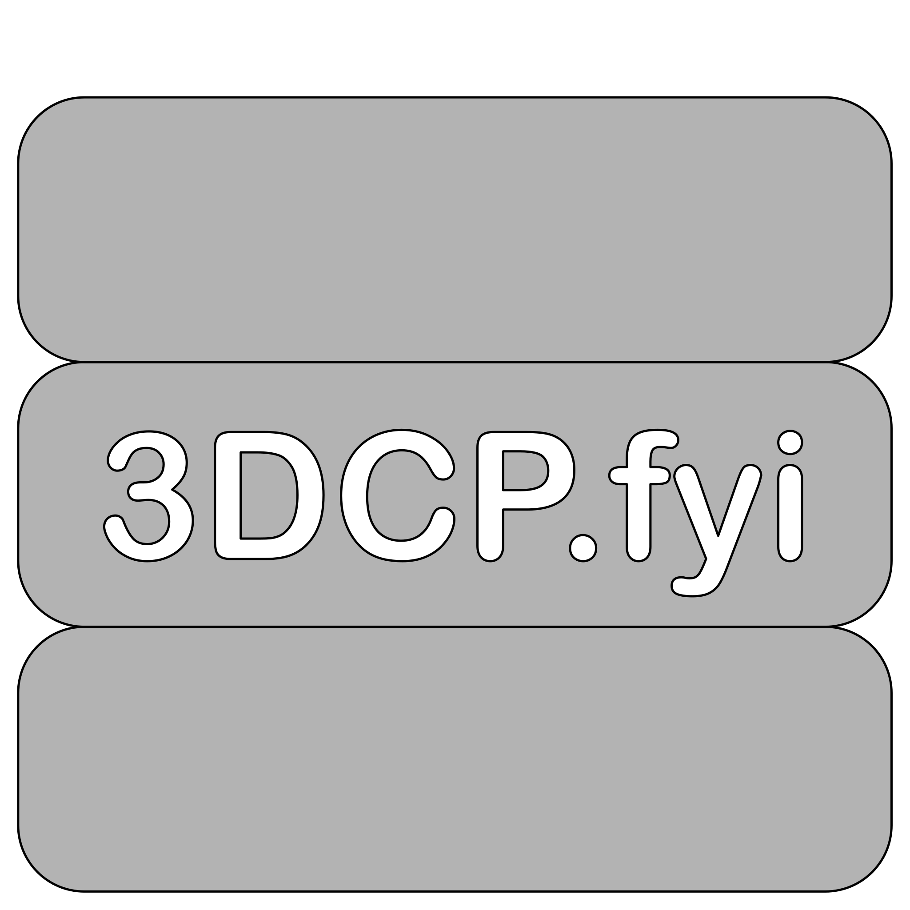

<a href="https://www.3dcp.fyi/">
    <picture>
      <source media="(prefers-color-scheme: dark)" srcset="dat/3dcpfyix.svg">
      
    </picture>
</a>

# 3DCP.fyi

<h5 align="center">
<a href="https://www.3dcp.fyi" title="Publication"></a>
<a href="https://www.3dcp.fyi" title="Contribution"></a>
<a href="http://creativecommons.org/licenses/by-nc-sa/4.0/" title="Licence"></a>

<a href="https://www.3dcp.fyi" title="Entries in Database"></a>
<a href="https://www.3dcp.fyi" title="References in Database"></a>

<a href="https://www.3dcp.fyi" title="Last Update"></a>
<a href="https://raw.githubusercontent.com/dan-auer/3dcp.fyi/main/dat/3dcp.fyi.bib" title="Download Dataset ↓"></a>
</h5>

> Relax, this isn't another review paper on 3D concrete printing (**3DCP**)! Instead, we've curated an exhaustive 
database that offers a detailed look at the state-of-the-art in 3D-printing in the construction industry, mostly, 
but not exclusively, involving cementitious materials and extrusion-based manufacturing. To guarantee the dataset's 
quality and consistency, we've taken the extra step of manually curating each entry over the years, which means

- [x] authors are identified through their **ORCiD** profiles
- [ ] universities are tagged with their respective **ROR**s (upcoming feature)
- [ ] citations have a semantic weight (upcoming feature)
- [x] open accessible papers are tagged and can be downloaded directly
- [x] year of publication is enhanced by the month
- [x] publications are evaluated by several of their centralities in the citation network over multiple [topological 
generations](https://en.wikipedia.org/wiki/Topological_sorting)
- [x] links to third party services are provided

> [!CAUTION]
> The graphs of the last publication are knowingly missing, as the project has now reached a size where Github is no longer a suitable solution. We are currently looking for better approaches to display the temporal and spatial data of the graph network and the articles better, faster and more interactively. Stay tuned!

## Publication

If our database has been helpful to you, please consider citing our work!
```
@inproceedings{auer_bos_fisc.2024.3f,
  title               = {3DCP.fyi - A Comprehensive Citation Network Graph on the State of the Artin 3D Concrete Printing},
  author              = {Auer, Daniel and Bos, Freek Paul and Fischer, Oliver},
  year                = {2024},
  booktitle           = {Proceedings of the Fourth RILEM International Conference on Concrete and Digital Fabrication},
  publisher           = {Springer Nature Switzerland},
  address             = {Cham},
  volume              = {53},
  pages               = {533--538},
  doi                 = {10.1007/978-3-031-70031-6_62},
  editor              = {Lowke, Dirk and Freund, Niklas and Böhler, David and Herding, Friedrich}
}
```

